# DOKS CI/CD using Tekton, Argo CD and Knative Serverless Applications

## Introduction

This blueprint will show you how to implement a CI/CD solution using free and popular open source implementations that run on Kubernetes clusters natively.

DigitalOcean Marketplace provides pre-configured 1-Click apps that you can quickly deploy to your DigitalOcean Kubernetes (DOKS) cluster. You will be using 1-Click apps to provision each software component for your cluster.

You will learn how to use Tekton to build a CI/CD pipeline that continuously fetches code changes from a Git repository, and builds a Docker image for your custom application. Then, Tekton will push the Docker image to a remote registry and notify Argo CD to deploy it to your Kubernetes cluster. This guide will also teach you how to use Knative Eventing to automatically trigger the CI/CD pipeline each time code is pushed to your application GitHub repository. All these steps run automatically.

This tutorial uses the following tools:

1. [Kaniko](https://github.com/GoogleContainerTools/kaniko) for building container images directly in a Kubernetes cluster.
2. [Tekton](https://tekton.dev) pipelines and [Argo CD](https://argoproj.github.io/cd) for implementing the CI process.
3. [Knative](https://knative.dev) for running and exposing applications functionality on Kubernetes.
4. [Cert-Manager](https://cert-manager.io) for managing TLS termination of Knative Services.

After completing this blueprint, you will have a fully functional CI/CD pipeline that continuously builds and deploys code changes for your custom applications using Kubernetes.

Following diagram shows the complete setup:

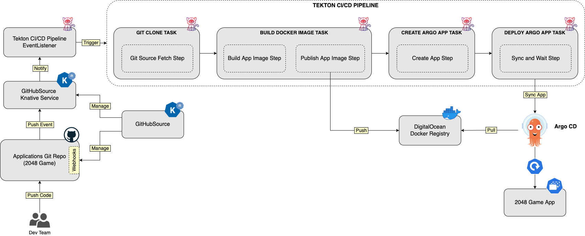

In the tutorial, you will learn:

1. About components such as Kaniko, Tekton, Argo CD, and Knative.
2. How to install each component using the DigitalOcean 1-Click apps.
3. How to configure the required components, such as Knative Serving, Eventing, etc. to react on GitHub events and trigger the CI/CD pipeline.
4. How to implement and test the CI/CD flow, and deploy a sample Knative application ([2048 game](https://en.wikipedia.org/wiki/2048_(video_game))).

## Table of Contents

- [Introduction](#introduction)
- [Prerequisites](#prerequisites)
- [About the Blueprint Software Components](#about-the-blueprint-software-components)
  - [Getting to Know Kaniko](#getting-to-know-kaniko)
  - [Getting to Know Tekton](#getting-to-know-tekton)
    - [Tasks](#tasks)
    - [Pipelines](#pipelines)
    - [Event Listeners and Triggers](#event-listeners-and-triggers)
    - [Tekton Catalog](#tekton-catalog)
    - [Tekton Dashboard](#tekton-dashboard)
  - [Getting to Know Argo CD](#getting-to-know-argo-cd)
    - [Applications](#applications)
    - [Projects](#projects)
  - [Getting to Know Knative](#getting-to-know-knative)
    - [Serving Component](#serving-component)
    - [Eventing Component](#eventing-component)
  - [Getting to Know Cert-Manager](#getting-to-know-cert-manager)
- [Step 1: Prepare the Sample Application Requirements](#step-1-prepare-the-sample-application-requirements)
  - [Forking the Sample Application Repo](#fork-the-sample-application-repo)
  - [Create a Dedicated Docker Registry](#create-a-digitalocean-container-registry)
  - [Create a Dedicated Namespace for Kubernetes Resources](#create-a-dedicated-namespace-for-kubernetes-resources)
- [Step 2: Install Cert-Manager](#step-2-install-cert-manager)
- [Step 3: Install Tekton](#step-3-install-tekton)
  - [Provision Tekton Pipelines](#provision-tekton-pipelines)
  - [Provision Tekton Triggers](#provision-tekton-triggers)
  - [Provision Tekton Dashboard](#provision-tekton-dashboard)
- [Step 4: Install Argo CD](#step-4-install-argo-cd)
- [Step 5: Install Knative](#step-5-install-knative)
- [Step 6: Configure Knative Serving](#step-6-configure-knative-serving)
  - [Configure DigitalOcean Domain Records for Knative Services](#configure-digitalocean-domain-records-for-knative-services)
  - [Configure a Custom Domain and Auto TLS Feature for Knative Services](#configure-a-custom-domain-and-auto-tls-feature-for-knative-services)
  - [Knative Private Services](#knative-private-services)
- [Step 7: Configure Knative Eventing](#step-7-configure-knative-eventing)
- [Step 8: Set Up Your First CI/CD Pipeline Using Tekton and Argo CD](#step-8-set-up-your-first-cicd-pipeline-using-tekton-and-argo-cd)
- [Step 9: Test the CI/CD Setup](#step-9-test-the-cicd-setup)
- [Summary](#summary)
- [Next Steps](next-steps)
- [Additional Resources](#additional-resources)

## Prerequisites

To complete this tutorial, you will need:

1. A working domain that you own. This is required for exposing public services, such as GitHub webhooks, used in this guide. Make sure to also read the DigitalOcean [DNS Quickstart Guide](https://docs.digitalocean.com/products/networking/dns/quickstart).
2. A working DOKS cluster running Kubernetes version greater than 1.21. The DOKS cluster must have at least 2 nodes, each with 2 CPUs, 4 GB of memory, and 20 GB of disk storage. For additional instructions on configuring a DOKS cluster, see [How to Set Up a DigitalOcean Managed Kubernetes Cluster (DOKS)](https://github.com/digitalocean/Kubernetes-Starter-Kit-Developers/tree/main/01-setup-DOKS#how-to-set-up-a-digitalocean-managed-kubernetes-cluster-doks).
3. A [git](https://git-scm.com/downloads) client to interact with GitHub repositories.
4. [doctl](https://docs.digitalocean.com/reference/doctl/how-to/install) for interacting with DigitalOcean API.
5. [kubectl](https://kubernetes.io/docs/tasks/tools) for interacting with Kubernetes. Follow these [instructions](https://www.digitalocean.com/docs/kubernetes/how-to/connect-to-cluster/) to connect to your cluster with `kubectl` and `doctl`.
6. [Helm](https://www.helm.sh) for interacting with Helm releases created by the DigitalOcean 1-Click apps used in this tutorial.
7. [Argo CLI](https://argo-cd.readthedocs.io/en/stable/cli_installation) to interact with Argo CD using the command line interface.
8. [Tekton CLI](https://tekton.dev/docs/cli/#installation) to interact with Tekton Pipelines using the command line interface.
9. [Knative CLI](https://knative.dev/docs/client/install-kn/) for interacting with Knative using the command line interface.
10. [Kustomize](https://kustomize.io) is extensively used in this guide, and some basic knowledge is required. You can follow our [community tutorial](https://www.digitalocean.com/community/tutorials/how-to-manage-your-kubernetes-configurations-with-kustomize) as a starting point.

Next, this tutorial provides a quick introduction for each software component. The main purpose is to give you a basic understanding for each component, and how it's being used.

## About the Blueprint Software Components

### Getting to Know Kaniko

[Kaniko](https://github.com/GoogleContainerTools/kaniko) is nothing more than a tool to build container images directly from a Dockerfile, inside a container or Kubernetes cluster. It means, you can build and push docker images to a remote registry directly from your Kubernetes cluster. What is nice about this setup is you can have a full CI system running completely in your Kubernetes cluster.

Under the hood, Kaniko doesn't depend on a Docker daemon and executes each command within a Dockerfile completely in userspace. This enables building container images in environments that can't easily or securely run a Docker daemon, such as a standard Kubernetes cluster. Kaniko is meant to be run as an image: `gcr.io/kaniko-project/executor`.

Please visit the [official project page](https://github.com/GoogleContainerTools/kaniko) for more information and details about Kaniko.

In this blueprint, you will use Kaniko to build Docker images for your custom applications from Kubernetes cluster itself.

### Getting to Know Tekton

Continuous integration (or CI) is the process of automating the integration of small code changes from multiple contributors into a single software project. To achieve CI a central repository is used (e.g. Git), where each developer (or contributor) pushes code changes. Then, a CI tool (e.g. Tekton) detects changes and starts the CI automation.

In general, each CI automation consists of several steps:

1. Fetching application code from a remote SCM (Source Control Management) repository, such as Git.
2. Building application code via specific compilers, depending on the used programming language.
3. Testing application code changes (via unit testing, integration testing, etc).
4. Creating the final artifact (binary file, zip file, Docker image, etc) for application delivery.
5. Pushing the application artifact to a remote repository for later use by a continuous delivery system.

[Tekton](https://tekton.dev) is a cloud native solution for building CI/CD systems on top of Kubernetes clusters. It is specifically engineered to run on Kubernetes, and empowers developers to create CI pipelines using reusable blocks called Tasks. Other important components are Tekton CLI and Catalog (collection of reusable Tasks), that make Tekton a complete ecosystem.

In this guide, Tekton is used to implement the CI part via the `Pipeline` resource (and associated components, such as: `Tasks`, `Triggers`, etc).

Tekton is modular in nature and very well organized. This tutorial relies on the following Tekton components to implement the CI part:

- [Tasks](https://tekton.dev/docs/pipelines/tasks) - used to organize the steps performing each action, such as build and test your application code.
- [Pipelines](https://tekton.dev/docs/pipelines/pipelines) - used to organize tasks and define your custom CI/CD flow.
- [Triggers and EventListeners](https://tekton.dev/docs/triggers) - used to capture and trigger on Git events (e.g. git push events).

#### Tasks

A Tekton `Task` is a collection of `Steps` that you define and arrange in a specific order of execution as part of your continuous integration flow. Steps are the basic unit of execution in Tekton which perform real actions such as build code, create a Docker image, push to Docker registry, etc. To add steps to a Task you define a `steps` field containing a list of desired Steps. The order in which the Steps appear in this list is the order in which they will execute.

For each task, Tekton creates a Kubernetes Pod in your cluster to run the steps. Then, each step runs in a docker container, thus it must reference a docker image. The container you choose depends on what your step does. For example:

- Execute shell scripts: use an `Alpine Linux` image.
- Build a Dockerfile: use `Google’s Kaniko` image.
- Run kubectl: use the `bitnami/kubectl` image.
- An image of your own to perform custom actions.

Task definitions are composed of (most important are highlighted):

- [Parameters](https://tekton.dev/docs/pipelines/tasks/#specifying-parameters) - used to specify input parameters for a task such as compilation flags, artifacts name, etc.
- [Workspaces](https://tekton.dev/docs/pipelines/tasks/#specifying-workspaces) - used to share data (artifacts) between steps defined in a task.
- [Results](https://tekton.dev/docs/pipelines/tasks/#emitting-results) - represent a string value emitted by a Task. Results can be passed between Tasks inside a pipeline. Results are also visible to users, and represent important information such as SHA id for a cloned repository (emitted by the [git-clone](https://hub.tekton.dev/tekton/task/git-clone) Task).

Typical `Tekton Task` definition looks like below:

```yaml
apiVersion: tekton.dev/v1beta1
kind: Task
metadata:
  name: kaniko-example
spec:
  params:
    - name: IMAGE
      description: Name (reference) of the image to build.
    - name: DOCKERFILE
      description: Path to the Dockerfile to build.
      default: ./Dockerfile
  results:
    - name: IMAGE_DIGEST
      description: Digest of the image just built.
    - name: IMAGE_URL
      description: URL of the image just built.
  steps:
    - name: build-and-push
      workingDir: $(workspaces.source.path)
      image: $(params.BUILDER_IMAGE)
...
```

Explanation for the above configuration:

- `spec.params`: defines the list of input parameters for a Task.
- `spec.results`: defines a list of string values that this Task emits. Emitting results allows passing values between tasks. In other words, a result is an output value created by one Task, and can be used as an input value for the second Tasks (and so on).
- `spec.steps`: defines the list of steps to execute. Steps represent the basic unit of execution, and define the logic of Tasks.

**Important Note:**

Task resources are [deprecated](https://tekton.dev/docs/pipelines/migrating-v1alpha1-to-v1beta1/#replacing-pipelineresources-with-tasks) starting with `v1beta1` version of Tekton APIs. Users are encouraged to use the new features as explained in the deprecation note.

By design, Tekton will not run your Tasks when created. To launch a Task into execution, you need to create a separate [TaskRun](https://tekton.dev/docs/pipelines/taskruns) resource. A TaskRun is what instantiates your Task and begin execution of steps. A TaskRun executes the Steps in the Task in the order they are specified until all Steps have executed successfully or a failure occurs. Also, a TaskRun allows to pass input parameters, as well as specifying resources and workspaces for your custom Task.

What's important to remember is that tasks are reusable building blocks that can be shared and referenced across pipelines. This design aspect makes Tekton unique. To help users even more, Tekton project offers a collection of reusable tasks via the [Tekton Catalog](https://hub.tekton.dev) project.

Below picture illustrates the `Task` and `TaskRun` concepts:

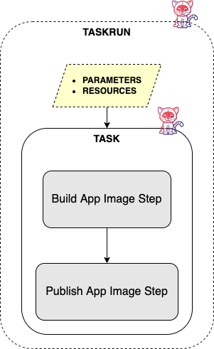

Please visit the [official documentation page](https://tekton.dev/docs/pipelines/tasks) for more information and details about Tekton Tasks.

#### Pipelines

A Tekton Pipeline is used to organize your Tekton tasks and orchestrate the CI flow. A Pipeline specifies one or more Tasks in the desired order of execution. You can embed tasks in a pipeline directly, or reference them from external manifest files. By using references, you create task definitions in separate manifest files, and have them reused across different pipelines. This method is encouraged because it avoids code or configuration duplication, and promotes `code reuse` (or configuration reuse). Thus, tasks act as objects (with inputs and outputs) that can be reused (and instantiated) across your pipelines. You can create dedicated pipelines to test, or build and deploy your applications code.

Pipeline definitions are composed of (most important are highlighted):

- [Parameters](https://tekton.dev/docs/pipelines/pipelines/#specifying-parameters) - used to specify input parameters (at a global level) for all tasks within a Pipeline.
- [Workspaces](https://tekton.dev/docs/pipelines/pipelines/#specifying-workspaces) - used to specify a workspace for shared artifacts between Tasks within a Pipeline.
- [Tasks](https://tekton.dev/docs/pipelines/tasks) - used to specify the list of Tasks to execute as part of the Pipeline.

Typical `Tekton Pipeline` definition looks like below:

```yaml
apiVersion: tekton.dev/v1beta1
kind: Pipeline
metadata:
  name: kaniko-pipeline
spec:
  params:
    - name: git-url
    - name: git-revision
    - name: image-name
    - name: path-to-image-context
    - name: path-to-dockerfile
  workspaces:
    - name: git-source
  tasks:
    - name: fetch-from-git
      taskRef:
        name: git-clone
      params:
        - name: url
          value: $(params.git-url)
        - name: revision
          value: $(params.git-revision)
      workspaces:
        - name: output
          workspace: git-source
    - name: build-image
      taskRef:
        name: kaniko
      params:
        - name: IMAGE
          value: $(params.image-name)
        - name: CONTEXT
          value: $(params.path-to-image-context)
        - name: DOCKERFILE
          value: $(params.path-to-dockerfile)
      workspaces:
        - name: source
          workspace: git-source
```

Explanation for the above configuration:

- `spec.params`: defines the list of input parameters for the Pipeline.
- `spec.workspaces`: defines a list of workspaces to be used by each Task inside the Pipeline. Workspaces are used to share data (or artifacts) between tasks.
- `spec.tasks`: defines the list of tasks to be executed in order as part of the Pipeline. Tasks can be embedded in the Pipeline YAML definition, or referenced using the `taskRef` field.

**Tip:**

The [Tekton Catalog](https://hub.tekton.dev) (or Hub) provides a ready to use collection of task definitions for common use scenarios, such as cloning a git repository, building a docker image via kaniko, etc. You can install them in your Kubernetes cluster either via `tkn` CLI, or `kubectl`. Then, you can reference each task in your custom pipeline using the `taskRef` field (you can see such an example in the example pipeline definition to follow).

By design, Tekton will not run your Pipelines when created. To launch a Pipeline into execution, you need to create a [PipelineRun](https://tekton.dev/docs/pipelines/pipelineruns) resource. A PipelineRun allows you to instantiate and execute a Tekton Pipeline in your Kubernetes cluster. A PipelineRun executes the Tasks in the Pipeline in the order they are specified until all Tasks have executed successfully or a failure occurs.

**Important Notes:**

- Pipeline resources are [deprecated](https://tekton.dev/docs/pipelines/migrating-v1alpha1-to-v1beta1/#replacing-pipelineresources-with-tasks) starting with `v1beta1` version of Tekton APIs (hence, not used in this tutorial as well). Users are encouraged to use the new features as explained in the deprecation note.
- Tasks referenced within a Pipeline will get the corresponding TaskRun objects created automatically (no need to create them separately).

Below picture illustrates Pipelines and Tasks composition:

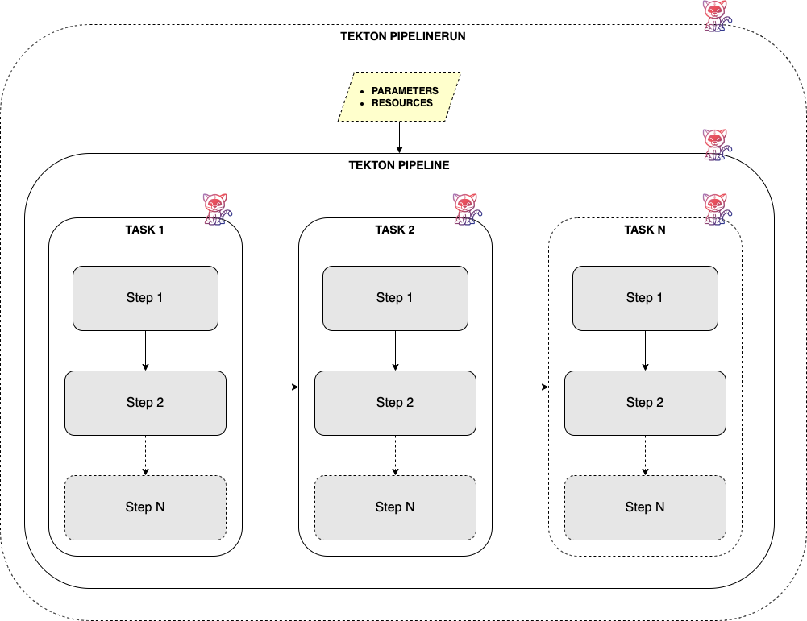

Please visit the [official documentation page](https://tekton.dev/docs/pipelines/pipelines) for more information and details about Tekton Pipelines.

#### Event Listeners and Triggers

You need a mechanism to tell Tekton how to react and trigger your CI pipeline in response to external events emitted by various sources, such as GitHub. This is accomplished via another Tekton component called [Triggers](https://github.com/tektoncd/triggers) (needs to be installed separately). Tekton triggers allows you to detect and extract information from events from a variety of sources, and execute TaskRuns and PipelineRuns based on that information. It can also pass information extracted from events directly to TaskRuns and PipelineRuns.

Following resources are required to automatically trigger a Tekton pipeline using GitHub webhooks:

1. An [EventListener](https://github.com/tektoncd/triggers/blob/main/docs/eventlisteners.md) - listens for events, and specifies one or more `Triggers`.
2. A [Trigger](https://github.com/tektoncd/triggers/blob/main/docs/triggers.md) - specifies what happens when the `EventListener` detects an event. A `Trigger` specifies a `TriggerTemplate` and a `TriggerBinding`.
3. A [TriggerTemplate](https://github.com/tektoncd/triggers/blob/main/docs/triggertemplates.md) - specifies what `TaskRun` or `PipelineRun` to execute when your `EventListener` detects an event.
4. A [TriggerBinding](https://github.com/tektoncd/triggers/blob/main/docs/triggerbindings.md) - specifies what data to extract from the event payload, and how to pass that data to the `TriggerTemplate`.

Optionally, you can also create an [Interceptor](https://github.com/tektoncd/triggers/blob/main/docs/interceptors.md) to filter events, perform webhook verification (using secrets), or other processing before the Trigger actions are executed.

Following diagram illustrates how Tekton EventListeners and Triggers work:


In this blueprint, you will use Tekton EventListeners and Triggers to respond to GitHub push events, and trigger the CI/CD pipeline used to build and deploy your custom application.

Please visit the [official project page](https://tekton.dev/docs/triggers) for more information and details about Tekton EventListener and Triggers.

#### Tekton Catalog

[Tekton Catalog](https://hub.tekton.dev) is a collection of reusable tasks that you can use in your pipelines. The main idea is to promote the modular design of Tekton and abstract implementation details for common situations. For example, in most of the pipelines you will want to use git clone tasks, application image build tasks, push to remote registry tasks, etc.

Following listing contains a few interesting tasks to start with:

- [Git Clone Task](https://hub.tekton.dev/tekton/task/git-clone) - clone a Git repository URL to a workspace.
- [Kaniko Task](https://hub.tekton.dev/tekton/task/kaniko) - builds a simple Dockerfile with Kaniko and pushes to a registry.
- [ArgoCD Sync and Wait Task](https://hub.tekton.dev/tekton/task/argocd-task-sync-and-wait) - deploys an Argo CD application and waits for it to be healthy.

In this blueprint you will use Tekton catalog to install commonly used tasks, such as [git-clone](https://hub.tekton.dev/tekton/task/git-clone), [kaniko](https://hub.tekton.dev/tekton/task/kaniko) and [argocd-sync-and-wait](https://hub.tekton.dev/tekton/task/argocd-task-sync-and-wait).

Please visit the [Tekton Catalog](https://github.com/tektoncd/catalog) GitHub project page to learn more.

#### Tekton Dashboard

[Tekton Dashboard](https://github.com/tektoncd/dashboard) is a web-based interface for Tekton Pipelines and Tekton triggers resources. It allows you to manage and view Tekton resource creation, execution, and completion.

Tekton Dashboard supports:

- Filtering resources by label.
- Realtime view of PipelineRun and TaskRun logs.
- View resource details and YAML.
- Show resources for the whole cluster or limit visibility to a particular namespace.
- Import resources directly from a git repository.
- Adding functionality through extensions.

In this blueprint you will use Tekton dashboard to interact with pipeline runs, and visualize results (such as logs) for each task from the CI/CD flow.

Please visit the [Tekton Dashboard](https://github.com/tektoncd/dashboard) GitHub project page to learn more.

### Getting to Know Argo CD

[Argo CD](https://argoproj.github.io/cd) is a popular open source implementation for doing GitOps continuous delivery (CD) on top of Kubernetes. Your applications, definitions, configurations, and environments should be declarative and version controlled. Also application deployment and lifecycle management should be automated, auditable, and easy to understand. All this can be done using Argo.

Argo CD adheres to the same GitOps patterns and principles, thus maintaining your cluster state using a declarative approach. Synchronization happens via a Git repository, where your Kubernetes manifests are being stored. Kubernetes manifests can be specified in several ways:

- [Kustomize](https://kustomize.io) applications.
- [Helm](https://helm.sh) charts.
- [Ksonnet](https://ksonnet.io) applications.
- [Jsonnet](https://jsonnet.org) files.
- Plain directory of YAML/json manifests.
- Any custom config management tool configured as a config management plugin.

Why Argo and not Tekton for the CD part ?

While you can accomplish the CD part using Tekton as well, Argo is more specialized for this task. It's true that every CI systems can be used to perform deployments as well, but it implies more steps and logic to accomplish the same thing. Traditionally, you would use all kind of scripts and glue logic to create the CD part inside a CI system (take Jenkins as an example). Soon, you will notice that it's unnatural, hence a dedicated CD solution is more appropriate.

Other important aspects to consider:

1. How do I implement GitOps?
2. How easy can I deploy to multiple environments and Kubernetes clusters?
3. What happens if my CI/CD system goes down?

Argo CD helps you implement GitOps, and keep your Kubernetes manifests (even those used in this guide) synced with a Git repository. No need to go back and apply everything by hand on every change. GitOps also allows you to easily keep track of changes, and most important forbid manual intervention in your cluster (via other members in the team using `kubectl`, for example).

Next, the most important aspect is to have a setup where a specialized system takes care of the CD part, and doesn't interfere or it's not dependent on the CI part. If the CI system goes down for some reason, it shouldn't affect the CD part and vice-versa. On the other hand, a system or a component that does multiple things at once can be prone to failure in accomplishing both. So, it's best to follow the single responsibility principle in general, and let Tekton take care of the CI part, and Argo to handle CD (as well as GitOps).

#### Applications

Argo CD is using the [Application](https://argo-cd.readthedocs.io/en/stable/operator-manual/declarative-setup/#applications) core concept to manage applications deployment and lifecycle. Inside an Argo CD application manifest you define the Git repository hosting your application definitions, as well as the corresponding Kubernetes cluster used to deploy your applications. In other words, an Argo CD application defines the relationship between a source repository and a Kubernetes cluster. It's a very concise and scalable design, where you can associate multiple sources (Git repositories) and corresponding Kubernetes clusters.

A major benefit of using applications is that you don't need to deploy Argo to each cluster individually. You can use a dedicated cluster for Argo, and deploy applications to all clusters at once from a single place. This way, you avoid Argo CD downtime or loss, in case other environments have issues or get decommissioned.

#### Projects

You can group similar applications into a [Project](https://argo-cd.readthedocs.io/en/stable/user-guide/projects). Projects permit logical grouping of applications and associated roles/permissions, when working with multiple teams. When not specified, each new application belongs to the `default` project. The `default` project is created automatically, and it doesn't have any restrictions. The default project can be modified, but not deleted.

**Note:**

All examples used in this tutorial use the `default` Argo CD project.

Please visit the official documentation website to read more about [Argo CD core concepts](https://argo-cd.readthedocs.io/en/stable/core_concepts).

In this blueprint, you will learn how to use Argo CD to continuously deploy code changes for your custom applications.

### Getting to Know Knative

[Knative](https://knative.dev) is an open-source solution to build and deploy serverless applications using Kubernetes as the underlying platform. In addition to application development, developers may also have infrastructure tasks such as maintaining Kubernetes manifests for application deployment, rolling back to a previous revision, traffic routing, scaling up or down workloads to meet load demand, etc.

Knative reduces the boilerplate needed for spinning up workloads in Kubernetes, such as creating deployments, services, ingress objects, etc. Knative also helps you implement best practices in production systems (e.g. blue-green, canary deployments), application observability (logs and metrics), and support for event-driven applications.

Knative has two main components:

- [Serving](https://knative.dev/docs/serving) - abstracts all required parts needed for your application to run and be accessible to the outside world.
- [Eventing](https://knative.dev/docs/eventing) - adds support for event driven programming, thus making it easy to create event driven architectures.

#### Serving Component

In this blueprint you will learn how to use the [Knative Serving](https://knative.dev/docs/serving) component to deploy and publicly expose serverless web application - the [2048 game](https://en.wikipedia.org/wiki/2048_(video_game)), via [Services](https://knative.dev/docs/serving/services) (not to be confused with Kubernetes Services).

For each application you want to run and expose publicly via Knative, you need to create a Knative Service CRD. A Knative Service represents the basic unit of execution for the Knative Serving component. Going further, a Knative Service resource takes care of abstracting all the details needed to run and expose your application, such as: creating Kubernetes deployments (including autoscaling), services, ingress configurations, etc.

Knative can automatically scale down your applications to zero when not in use or idle (for example, when no HTTP traffic is present), which make your applications serverless.

Knative Serving features include:

- Deploy serverless applications quickly.
- Autoscaling for application pods (down scaling to zero is supported).
- Point-in-time snapshots for application code and configurations (via revisions).
- Routing and network programming. Supports multiple networking layers, like: Kourier, Contour, Istio.

Other important Knative Serving resources worth mentioning are:

- [Revisions](https://github.com/knative/specs/blob/main/specs/serving/knative-api-specification-1.0.md#revision) - represent a point-in-time snapshot of the code and configuration for each modification made to the workload.
- [Routes](https://github.com/knative/specs/blob/main/specs/serving/knative-api-specification-1.0.md#route) - maps a network endpoint to one or more revisions.

You can read more about the available Knative Serving resources on the [official documentation page](https://knative.dev/docs/serving/#serving-resources).

#### Eventing Component

The [Knative Eventing](https://knative.dev/docs/eventing) component is used in this blueprint to connect GitHub events with Tekton Pipelines for automatic triggering of the CI flow. The Tekton CI pipeline rebuilds the application image whenever a git push event is triggered by the GitHub repository hosting the application source code.

Knative Eventing helps address common tasks for cloud native development such as:

- Enabling late-binding for event sources and consumers.
- Loose coupling between services, thus making easy to deploy individual application components.
- Various services can be connected without modifying consumers or producers, thus facilitating building new applications.

Event-driven architectures allow loose coupling between components in the system. This has a tremendous advantage, meaning that new functionality can be added easily without interfering or breaking other components. Event-based architectures use a message broker such as [Apache Kafka](https://kafka.apache.org) or [RabbitMQ](https://www.rabbitmq.com) (or an `in-memory` one - not recommended for production systems). Using brokers abstracts the details of event routing from the event producer and event consumer. In other words, applications need not to worry how a message (or event) travels from point A to B. The broker takes care of all the details, and routes each message (or event) correctly from the source to the destination (or multiple destinations). Brokers also offer support for complex deliveries such as responding to events, message filtering, delivery guarantees, etc.

Knative eventing provides support for the following delivery mechanisms:

- [Simple Delivery](https://knative.tips/eventing/delivery-methods/simple-delivery) - used in `1:1` scenarios, where an event source sends messages to a single subscriber (such as a Knative Service, or a Kubernetes Service).
- [Complex Delivery](https://knative.tips/eventing/delivery-methods/complex-delivery) via [Channels](https://knative.dev/docs/eventing/channels) and [Subscriptions](https://knative.dev/docs/eventing/channels/subscriptions) - used in `1:n` fanout scenarios, where an event source can send messages to 1 or more subscribers via channels. Channels can be in-memory (volatile), or persistent if using Kafka.
- [Complex Delivery with Reply](https://knative.tips/eventing/delivery-methods/complex-delivery-reply) - same as above, but supports replying to events. Harder to maintain when working with multiple channels, and multiple subscribers replying to events.
- [Complex Delivery via Brokers and Triggers](https://knative.tips/eventing/delivery-methods/broker-trigger-delivery) - a Broker combines Channel, reply, and filter functionality into a single resource. Trigger provides declarative filtering of all events. This is the preferred method when developing applications using Knative Eventing.

In this blueprint, you will learn how to use Knative Eventing to listen for GitHub events, and trigger the Tekton CI/CD pipeline that builds and deploys your custom application.

For more information about Knative and other features, please visit the [official documentation website](https://knative.dev/docs). [Knative Tips](https://knative.tips) is also a very good source of documentation and practical examples for Knative in general.

### Getting to Know Cert-Manager

[Cert-Manager](https://cert-manager.io) is an open-source certificate management tool designed to work with Kubernetes. It supports all the required operations for obtaining, renewing, and using SSL/TLS certificates. Cert-Manager can talk with various certificate authorities (CAs), like [Let's Encrypt](https://letsencrypt.org), [HashiCorp Vault](https://www.vaultproject.io), and [Venafi](https://www.venafi.com). It can also automatically issue valid certificates for you and renew them before they expire.

SSL/TLS certificates secure your connections and data by verifying the identity of hosts/sites and encrypting your data. Cert-Manager manages them by integrating with your Kubernetes cluster's Ingress Controller, which is the main entry point for your backend services. Then, you can provide identity information to users by presenting them a valid SSL/TLS certificate whenever they visit your website(s).

This blueprint configures Knative Serving to work with Cert-Manager and enables automatic creation and renewal of TLS certificates for each Knative Service. The Knative component providing the auto TLS integration is called [net-certmanager](https://github.com/knative-sandbox/net-certmanager), and it's a separate project developed by Knative.

Cert-Manager relies on several CRDs to fetch TLS certificates for your domain, such as:

- [Issuer](https://cert-manager.io/docs/concepts/issuer): Defines a `namespaced` certificate issuer, allowing you to use `different CAs` in each `namespace`.
- [ClusterIssuer](https://cert-manager.io/docs/concepts/issuer): Similar to `Issuer`, but it doesn't belong to a namespace, hence can be used to `issue` certificates in `any namespace`.
- [Certificate](https://cert-manager.io/docs/concepts/certificate): Defines a `namespaced` resource that references an `Issuer` or `ClusterIssuer` for issuing certificates.

In this blueprint, you will a cluster based issuer (`ClusterIssuer`) resource to enable TLS termination for your Knative services. Next, `net-certmanager` takes care of managing TLS certificates automatically for you, via the `ClusterIssuer` resource.

For more information about Cert-Manager and its features, please visit the [official documentation website](https://cert-manager.io/docs).

Next, you will prepare the sample application repository used in this tutorial, as well as the [DigitalOcean Docker Registry](https://www.digitalocean.com/products/container-registry) used for storing application images. You will also create a dedicated Kubernetes namespace, to keep everything clean and well organized.

## Step 1: Prepare the Sample Application Requirements

Before continuing with the tutorial, perform the following steps:

1. [Fork the sample application repository](#fork-the-sample-application-repo) used in this guide.
2. [Provision a DigitalOcean Container Registry](create-a-digitalocean-container-registry) to store the sample application images.
3. [Create a dedicated Kubernetes namespace](#create-a-dedicated-namespace-for-kubernetes-resources) to store all custom resources used in this tutorial.

### Fork the Sample Application Repo

To test the Tekton CI/CD flow presented in this blueprint, you need to fork the [kubernetes-sample-apps](https://github.com/digitalocean/kubernetes-sample-apps) repository first. Also, create a GitHub Personal Access Token (PAT) with the appropriate permissions, as explained [here](https://github.com/knative/docs/tree/main/code-samples/eventing/github-source#create-github-tokens). The PAT is needed to allow the GitHubSource CRD to manage webhooks for you automatically. Make sure to store the PAT credentials somewhere safe because you will need them later.

### Create a DigitalOcean Container Registry

You need a [DigitalOcean Container Registry](https://docs.digitalocean.com/products/container-registry) to store the sample application images. For detailed steps on how to create one, follow the [quickstart guide](https://docs.digitalocean.com/products/container-registry/quickstart). A free plan is adequate to complete this guide.

Alternatively, you can run the following command to provision a new registry:

```shell
doctl registry create <YOUR_DOCKER_REGISTRY_NAME_HERE> \
  --region <YOUR_DOCKER_REGISTRY_REGION_HERE> \
  --subscription-tier starter
```

The command includes the following flags:

- `--region`: Specifies the region name to provision the registry in. You can list all the available regions via the `doctl registry options available-regions` command.
- `--subscription-tier`: Specifies the subscription tier to use. You can list all the available tiers via the `doctl registry options subscription-tiers` command. The example above uses the `starter` tier, which is free to use.

Then, run the following command to verify that the registry was created successfully. Make sure to replace the `<>` placeholders accordingly in the following command:

```shell
doctl registry get <YOUR_DOCKER_REGISTRY_NAME_HERE>
```

The output looks similar to the following:

```text
Name         Endpoint                               Region slug
tekton-ci    registry.digitalocean.com/tekton-ci    nyc3
```

In this guide, the registry is named `tekton-ci` and provisioned in the `nyc3` region.

Finally, you need to configure your DOKS cluster to be able to pull images from your private registry. DigitalOcean provides an easy way of accomplishing this task using the control panel. First, navigate to the **Settings** tab of your container registry. Then, click on the **Edit** button from the **DigitalOcean Kubernetes Integration** section. Finally, select the appropriate checkbox, and press the **Save** button.

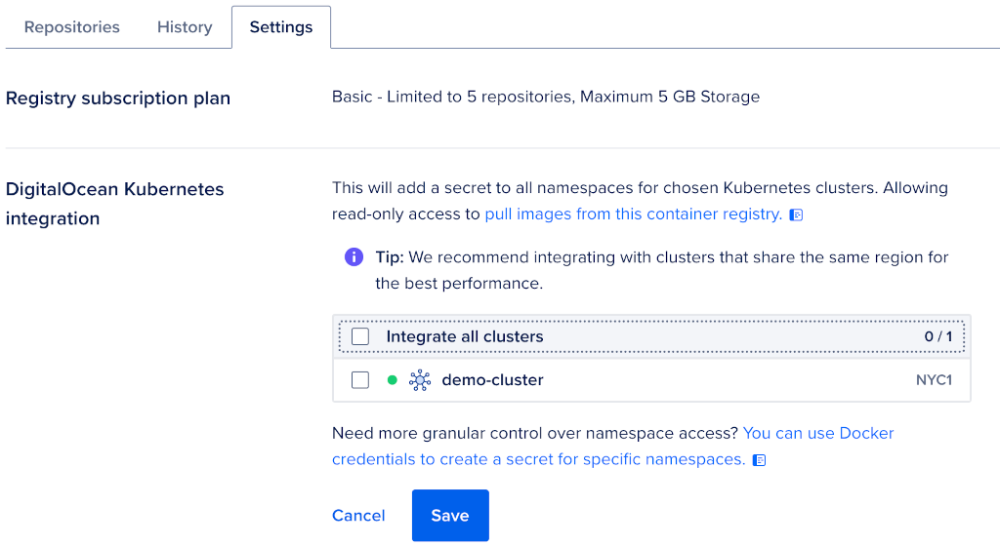

### Create a Dedicated Namespace for Kubernetes Resources

It's generally a best practice to have a dedicated namespace when provisioning new resources in your Kubernetes cluster to keep everything organized. A dedicated namespace also lets you easily clean up everything later on.

This tutorial uses the `doks-ci-cd` namespace. Run the following command to create it:

```shell
kubectl create ns doks-ci-cd
```

Then, check if the namespace is successfully created:

```shell
kubectl get ns doks-ci-cd
```

The output looks similar to:

```text
NAME         STATUS   AGE
doks-ci-cd   Active   13m
```

### Clone the Sample Repository

Clone the `container-blueprints` repo using the following command:

```shell
git clone https://github.com/digitalocean/container-blueprints.git
```

Then, change the directory to your local copy using the following command:

```shell
cd container-blueprints
```

Next, you will install each software component required by this guide using the [DigitalOcean Marketplace](https://marketplace.digitalocean.com) collection of 1-click apps for Kubernetes.

## Step 2: Install Cert-Manager

[Cert-Manager](https://cert-manager.io) is available as a [1-Click Kubernetes application](https://marketplace.digitalocean.com/apps/cert-manager) from the DigitalOcean Marketplace. To install Cert-Manager, navigate to the **Marketplace** tab of your cluster and search for the app. Then, click on the **Install App** button and follow the instructions.

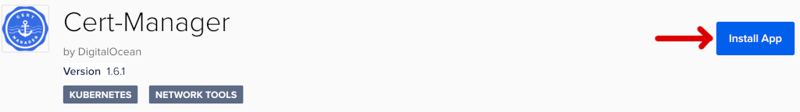

After the installation finishes, you should see the new application listed in the **Marketplace** tab of your Kubernetes cluster. The output looks similar to:

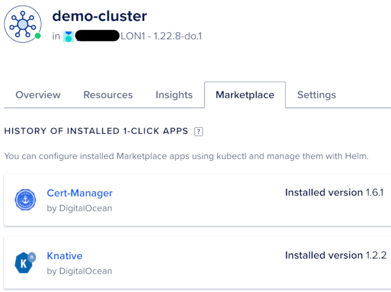

Finally, check if the installation was successful by following the [Getting started after deploying Cert-Manager](https://marketplace.digitalocean.com/apps/cert-manager) section from the Cert-Manager 1-Click app documentation page.

Next, you will provision Tekton Pipelines on your Kubernetes cluster from [DigitalOcean Marketplace](https://marketplace.digitalocean.com).

## Step 3: Install Tekton

Tekton installation is divided in two parts:

1. [Tekton Pipelines](https://github.com/tektoncd/pipeline) represents the main component of Tekton and provides pipelines support (as well as other core components, such as Tasks).
2. [Tekton Triggers](https://github.com/tektoncd/triggers) provides an additional component to support triggering pipelines whenever events emitted by various sources (such as GitHub) are detected.

Tekton Pipelines is available as a [1-Click Kubernetes application](https://marketplace.digitalocean.com/apps/tekton-pipelines) from the DigitalOcean Marketplace. On the other hand, you will install Tekton Triggers using `kubectl`.

### Provision Tekton Pipelines

To install Tekton Pipelines, navigate to the **Marketplace** tab of your cluster and search for the app. Then, click on the **Install App** button from the right side, and follow the instructions:

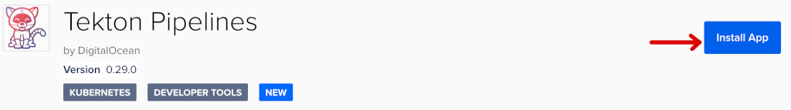

After the installation completes, you should see the new application listed in the **Marketplace** tab of your Kubernetes cluster. The output looks similar to:

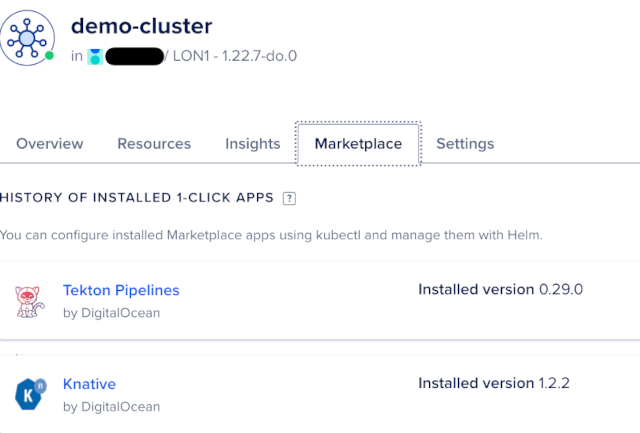

Finally, check if the installation was successful by following the [Getting started after deploying Tekton Pipelines](https://marketplace.digitalocean.com/apps/tekton-pipelines) section from the Tekton Pipelines 1-Click app documentation page.

Next, you will provision Tekton Triggers on your Kubernetes cluster.

### Provision Tekton Triggers

[Tekton Triggers](https://github.com/tektoncd/triggers) is not available as a 1-Click application, so you will install it using `kubectl` as recommended in the [official installation page](https://tekton.dev/docs/triggers/install/#installing-tekton-triggers-on-your-cluster). Run the following commands to install Tekton Triggers and dependencies. The latest stable version available at this time of writing is [v0.20.1](https://github.com/tektoncd/triggers/releases/tag/v0.20.1):

```shell
kubectl apply -f https://storage.googleapis.com/tekton-releases/triggers/previous/v0.20.1/release.yaml
kubectl apply -f https://storage.googleapis.com/tekton-releases/triggers/previous/v0.20.1/interceptors.yaml
```

**Note:** Tekton Triggers requires Tekton Pipelines to be installed first as a dependency, as described in the [Provision Tekton Pipelines](#provision-tekton-pipelines) section. By default, it uses the `tekton-pipelines` namespace to create the required resources.

Next, check if Tekton Triggers was installed successfully:

```shell
kubectl get pods --namespace tekton-pipelines -l app.kubernetes.io/part-of=tekton-triggers
```

The output looks similar to:

```text
NAME                                                 READY   STATUS    RESTARTS   AGE
tekton-triggers-controller-75b9b7b77d-5nk76          1/1     Running   0          2m
tekton-triggers-core-interceptors-7769dc7cbc-8hjkn   1/1     Running   0          2m
tekton-triggers-webhook-79c866dc85-xz64m             1/1     Running   0          2m
```

All `tekton-triggers` pods should be running and healthy. You can also list the installed Tekton components and corresponding version using the Tekton CLI:

```shell
tkn version
```

The output looks similar to:

```text
Client version: 0.24.0
Pipeline version: v0.29.0
Triggers version: v0.19.1
```

Next, you will provision the Tekton Dashboard on your Kubernetes cluster using `kubectl`.

### Provision Tekton Dashboard

[Tekton Dashboard](https://github.com/tektoncd/dashboard) is not available as a 1-Click application yet, so you will install it using `kubectl` as recommended in the [official installation page](https://github.com/tektoncd/dashboard/blob/main/docs/install.md). Run the following commands to install Tekton Dahsboard and dependencies. The latest stable version available at this time of writing is [v0.28.0](https://github.com/tektoncd/dashboard/releases/tag/v0.28.0):

```shell
kubectl apply -f https://storage.googleapis.com/tekton-releases/dashboard/previous/v0.28.0/tekton-dashboard-release.yaml
```

**Note:** Tekton Dashboard requires Tekton Pipelines to be installed first as a dependency, as described in the [Provision Tekton Pipelines](#provision-tekton-pipelines) section. By default, it uses the `tekton-pipelines` namespace to create required resources.

Next, check if the Tekton Dashboard installation was successful:

```shell
kubectl get pods --namespace tekton-pipelines -l app.kubernetes.io/part-of=tekton-dashboard
```

The output looks similar to:

```text
NAME                                READY   STATUS    RESTARTS   AGE
tekton-dashboard-56fcdc6756-p848r   1/1     Running   0          5m
```

All `tekton-dashboard` pods should be running and healthy. You can also list installed Tekton components and corresponding version using Tekton CLI:

```shell
tkn version
```

The output looks similar to:

```text
Client version: 0.24.0
Pipeline version: v0.29.0
Triggers version: v0.20.1
Dashboard version: v0.28.0
```

The Tekton Dashboard can be accessed by port-forwarding the associated Kubernetes service. First, check the associated service:

```shell
kubectl get svc --namespace tekton-pipelines -l app.kubernetes.io/part-of=tekton-dashboard
```

The output looks similar to the following:

```text
NAME               TYPE        CLUSTER-IP       EXTERNAL-IP   PORT(S)    AGE
tekton-dashboard   ClusterIP   10.245.127.170   <none>        9097/TCP   23s
```

Notice that the Kubernetes service is named `tekton-dashboard` and listening on port `9097`.

Now, port-forward the `tekton-dashboard` service:

```shell
kubectl port-forward svc/tekton-dashboard -n tekton-pipelines 9097:9097
```

Finally, open a web browser and navigate to `localhost:9097`. You should see the welcome page:

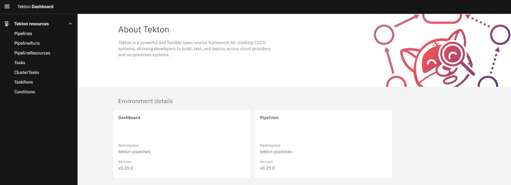

You can explore each section from the left menu, and see what options are available. Next, you will install the Argo CD 1-Click app from DigitalOcean marketplace.

## Step 4: Install Argo CD

[Argo CD](https://argoproj.github.io/cd) is available as a [1-Click Kubernetes application](https://marketplace.digitalocean.com/apps/argocd) from the DigitalOcean Marketplace. To install Argo CD, navigate to the **Marketplace** tab of your cluster and search for the app. Then, click on the **Install App** button, and follow the instructions:

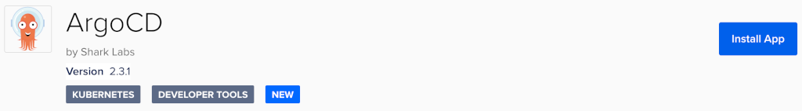

After the installation finishes, you should see the new application listed in the **Marketplace** tab of your Kubernetes cluster. The output looks similar to:

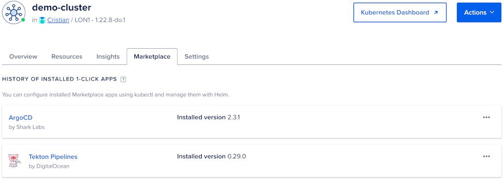

Finally, check if the installation was successful by following the [Getting started after deploying Argo CD](https://marketplace.digitalocean.com/apps/argocd) section from the Argo CD 1-click app documentation page.

Next, you will install the Knative 1-Click app from the DigitalOcean Marketplace.

## Step 5: Install Knative

[Knative](https://knative.dev) is available to install as a [1-Click Kubernetes application](https://marketplace.digitalocean.com/apps/knative) from the DigitalOcean Marketplace. To install Knative, navigate to the **Marketplace** tab of your cluster and search for the app. Then, click on the **Install App** button, and follow the instructions:

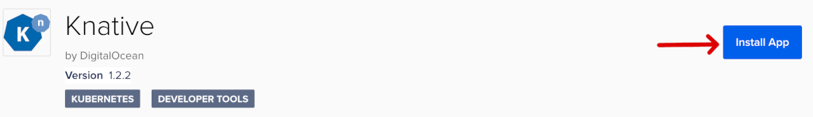

After the installation finishes, you should see the new application listed in the **Marketplace** tab of your Kubernetes cluster. The output looks similar to:


Finally, check if the installation was successful by following the [Getting started after deploying Knative](https://marketplace.digitalocean.com/apps/knative) section from the Knative 1-click app documentation page.

**Note:** The Knative 1-Click app installs both the Knative Serving and Eventing components in your DOKS cluster, via the [Knative Operator](https://knative.dev/docs/install/operator/knative-with-operators).

Next, you will configure each component of Knative to work in conjunction with Tekton Pipelines and trigger the CI automation on GitHub events such as `push`. You will also publicly expose and enable TLS termination for your Knative services.

## Step 6: Configure Knative Serving

In this step, you will learn how to prepare a domain you own to work with Knative Services. Then, you will learn how to configure Knative Serving to use your custom domain, and enable automatic TLS termination for all Knative services. It's a best practice in general to enable TLS termination for all application endpoints exposed publicly.

### Configure DigitalOcean Domain Records for Knative Services

In this section, you will configure DNS within your DigitalOcean account, using a domain that you own. Then, you will create a wildcard record to match a specific subdomain under your root domain and map it to your Knative load balancer. DigitalOcean is not a domain name registrar. You need to buy a domain name first from providers such as [Google](https://domains.google) or [GoDaddy](https://uk.godaddy.com).

First, run the following command to register your domain with DigitalOcean, replacing the `<>` placeholders:

```shell
doctl compute domain create "<YOUR_DOMAIN_NAME_HERE>"
```

The output looks similar to the following:

```text
Domain                TTL
starter-kit.online    0
```

 In this example, we use the domain `starter-kit.online`.

**Note:** Ensure that your domain registrar is configured to point to DigitalOcean name servers. For more information, see [here](https://www.digitalocean.com/community/tutorials/how-to-point-to-digitalocean-nameservers-from-common-domain-registrars).

Next, you will add a wildcard record [of type `A`](https://docs.digitalocean.com/products/networking/dns/how-to/manage-records/#supported-record-types) for the Kubernetes namespace `doks-ci-cd`. First, you need to identify the load balancer external IP created by Knative:

```shell
kubectl get svc -n knative-serving
```

The output looks similar to the following:

```text
NAME                         TYPE           CLUSTER-IP       EXTERNAL-IP     PORT(S)                           AGE
activator-service            ClusterIP      10.245.219.95    <none>          9090/TCP,8008/TCP,80/TCP,81/TCP   4h30m
autoscaler                   ClusterIP      10.245.42.109    <none>          9090/TCP,8008/TCP,8080/TCP        4h30m
autoscaler-bucket-00-of-01   ClusterIP      10.245.236.8     <none>          8080/TCP                          4h30m
autoscaler-hpa               ClusterIP      10.245.230.149   <none>          9090/TCP,8008/TCP                 4h30m
controller                   ClusterIP      10.245.13.134    <none>          9090/TCP,8008/TCP                 4h30m
domainmapping-webhook        ClusterIP      10.245.113.122   <none>          9090/TCP,8008/TCP,443/TCP         4h30m
kourier                      LoadBalancer   10.245.23.78     159.65.208.64   80:31060/TCP,443:31014/TCP        4h30m
...
```

Then, add the wildcard record which maps your subdomain to the Knative load balancer. Knative Services are namespace scoped, and use the following pattern: `*.<k8s_namespace>.<your_root_domain>`. The `doks-ci-cd` Kubernetes namespace and the `EXTERNAL-IP` column value for the `kourier` service are used for this blueprint. You can also change the `TTL` value as per your requirement, making sure to replace the `<>` placeholders accordingly:

```shell
doctl compute domain records create "<YOUR_DOMAIN_NAME_HERE>" \
  --record-name "*.doks-ci-cd" \
  --record-data "<YOUR_KOURIER_LOAD_BALANCER_EXTERNAL_IP_ADDRESS_HERE>" \
  --record-type "A" \
  --record-ttl "30"
```

**Note:** The DNS record must not contain the root domain value - it will be appended automatically by DigitalOcean. For example, if the root domain name is `starter-kit.online`, and the `Kourier LoadBalancer` has an `external IP` value of `143.198.242.190`, then the above command becomes:

```shell
doctl compute domain records create "starter-kit.online" \
  --record-name "*.doks-ci-cd" \
  --record-data "143.198.242.190" \
  --record-type "A" \
  --record-ttl "30"
```

Finally, you can check the records created for the `starter-kit.online` domain:

```shell
doctl compute domain records list starter-kit.online
```

The output looks similar to:

```text
ID           Type    Name           Data                    Priority    Port    TTL     Weight
274640149    SOA     @              1800                    0           0       1800    0
274640150    NS      @              ns1.digitalocean.com    0           0       1800    0
274640151    NS      @              ns2.digitalocean.com    0           0       1800    0
274640152    NS      @              ns3.digitalocean.com    0           0       1800    0
309782452    A       *.doks-ci-cd   143.198.242.190         0           0       3600    0
```

### Configure a Custom Domain and Auto TLS Feature for Knative Services

Knative enables TLS termination automatically for your existing or new services, and automatically fetches or renewes TLS certificates from [Let's Encrypt](https://letsencrypt.org). This feature is provided via [Cert-Manager](https://cert-manager.io) and a special component (or adapter) named [net-certmanager](https://github.com/knative-sandbox/net-certmanager). You can also configure Knative to use a custom domain you own and let users access your services via your domain.

The following steps configure Knative Serving with your domain and enable the auto-TLS feature:

1. Create a `ClusterIssuer` resource to issue certificates from [Let's Encrypt](https://letsencrypt.org).
2. Install the `net-certmanager` controller to act as a bridge (or adapter) between Cert-Manager and Knative Serving, for automatic issuing of certificates.
3. Configure [Knative Serving](https://knative.dev/docs/install/operator/configuring-serving-cr) component via the `Knative Operator` to:
    - Use a dedicated domain that is registered with DigitalOcean, as explained in [Configure DigitalOcean Domain Records for Knative Services](#configure-digitalocean-domain-records-for-knative-services) section.
    - Use the `ClusterIssuer` resource to automatically issue/renew certificates for each service.
    - Enable the `auto TLS` feature, via a special flag called `auto-tls`.

First, you need to create a [ClusterIssuer](https://cert-manager.io/docs/concepts/issuer) CRD for Cert-Manager. This blueprint provides a ready-to-use manifest which you can install using `kubectl`:

```yaml
apiVersion: cert-manager.io/v1
kind: ClusterIssuer
metadata:
  name: kn-letsencrypt-http01-issuer
spec:
  acme:
    privateKeySecretRef:
      name: kn-letsencrypt
    server: https://acme-v02.api.letsencrypt.org/directory
    solvers:
      - http01:
          ingress:
            class: kourier
```

The manifest has the following keys:

- `spec.acme.privateKeySecretRef.name` - Specifies the unique name given to the private key of the TLS certificate.
- `spec.acme.server` - Specifies the Let's Encrypt server endpoint used to issue certificates.
- `spec.acme.solvers` - Specifies the ACME client challenge type and what ingress class to use. The above configuration uses the HTTP-01 challenge, and Knative Kourier ingress controller.

Apply the Knative ClusterIssuer manifest using `kubectl`:

```shell
kubectl apply -f DOKS-CI-CD/assets/manifests/knative-serving/resources/kn-cluster-issuer.yaml
```

Check the ClusterIssuer state:

```shell
kubectl get clusterissuer kn-letsencrypt-http01-issuer
```

The output looks similar to:

```text
NAME                           READY   AGE
kn-letsencrypt-http01-issuer   True    22h
```

The `READY` column should show `True`. Now, that the ClusterIssuer resource is functional, you need to tell Knative Serving how to use it and issue certificates automatically for your Knative Services. This feature is called auto TLS. To use this feature, you need to install an additional component called [net-certmanager]((https://github.com/knative-sandbox/net-certmanager)).

You can install `net-certmanager` using `kubectl`:

```shell
kubectl apply -f https://github.com/knative/net-certmanager/releases/download/knative-v1.4.0/release.yaml
```

Alternatively, you can use the [Knative Operator](https://knative.dev/docs/install/operator/configuring-with-operator). The Knative Operator is already installed in your DOKS cluster via the [DigitalOcean Knative 1-Click app](https://marketplace.digitalocean.com/apps/knative), which you deployed previously. The following YAML manifest shows you how to instruct Knative Operator to install the additional `net-certmanager` component, as part of the `KnativeServing` component configuration:

```yaml
apiVersion: operator.knative.dev/v1alpha1
kind: KnativeServing
metadata:
  name: knative-serving
  namespace: knative-serving
spec:
  additionalManifests:
    - URL: https://github.com/knative/net-certmanager/releases/download/knative-v1.4.0/release.yaml
```

You don't have to apply the above manifest by hand, because everything is handled via [Kustomize](https://kustomize.io) in this repository, including enabling the auto TLS feature for Knative Services.

Kustomize uses the [kustomization](https://github.com/digitalocean/container-blueprints/blob/main/DOKS-CI-CD/assets/manifests/knative-serving/kustomization.yaml) manifest to take the original [KnativeServing configuration](https://github.com/digitalocean/marketplace-kubernetes/blob/master/stacks/knative/assets/manifests/knative-serving.yaml) from the DigitalOcean Marketplace GitHub repository, and apply a set of patches for each needed feature. This way, you don't have to modify the original file or keep a modified copy of it somewhere. Kustomize lets you use the original file as a base, and apply a set of patches on the fly.

The patch files are listed below:

- [net-certmanager-install](assets/manifests/knative-serving/patches/net-certmanager-install.yaml): Installs `net-certmananger` component via Knative Operator.
- [certmanager-config](assets/manifests/knative-serving/patches/certmanager-config.yaml): Configures Knative Serving to use the `ClusterIssuer` resource created earlier to automatically issue TLS certificates from [Let's Encrypt](https://letsencrypt.org).
- [domain-config](assets/manifests/knative-serving/patches/domain-config.yaml): Configures Knative Serving to use your custom domain when exposing services.
- [network-config](assets/manifests/knative-serving/patches/network-config.yaml): Configures Knative Serving to enable the `auto TLS` feature for Knative Services, via the `auto-tls` flag.

Follow the steps to apply all required changes for the Knative Serving component, via Kustomize:

1. Edit [domain-config](assets/manifests/knative-serving/patches/domain-config.yaml) to point to your own domain name (replace the `starter-kit.online` key with your domain), using a text editor of your choice (preferably with `YAML` linting support). For example, you can use [Visual Studio Code](https://code.visualstudio.com):

    ```shell
    code DOKS-CI-CD/assets/manifests/knative-serving/patches/domain-config.yaml
    ```

2. Apply `kustomizations` using `kubectl`:

    ```shell
    kubectl apply -k DOKS-CI-CD/assets/manifests/knative-serving
    ```

Finally, you can test your whole setup by deploying the sample `hello-world` Knative Service provided in the DigitalOcean Marketplace repo to test the whole setup:

```shell
kubectl apply \
  -n doks-ci-cd \
  -f https://raw.githubusercontent.com/digitalocean/marketplace-kubernetes/master/stacks/knative/assets/manifests/serving-example.yaml
```

After a few moments, a new service should show up. List all Knative Services using the Knative CLI (`kn`):

```shell
kn service list -n doks-ci-cd
```

The output looks similar to:

```text
NAME     URL                                          LATEST          AGE   CONDITIONS   READY
hello    https://hello.doks-ci-cd.starter-kit.online  hello-world     31m   3 OK / 3     True    
```

The `hello-world` service endpoint should be in a healthy state with the `READY` column set to `True`. Also, the service endpoint should be HTTPS enabled as shown in the `URL` column value, and use your custom domain name. You can also open a web browser, and navigate to the service endpoint - a `Hello World!` message should be displayed.

**Note:**

- It may take up to 1 minute or so until HTTPS is enabled for your service(s) endpoint. This is because it takes a while until the ACME client used by the ClusterIssuer finishes the HTTP-01 challenge, and obtains the final TLS certificate(s).
- For testing purposes, it's recommended to set the `spec.acme.server` field to point to Let's Encrypt staging server by editing the [kn-cluster-issuer](assets/manifests/knative-serving/kn-cluster-issuer.yaml) file and then run `kubectl apply -f`. This is because the Let's Encrypt production server has a quota limit set which can be very easily reached, and you will not be able to issue certificates for the whole day.
- GitHub webhooks require production-ready TLS certificates, so switch to the Let's Encrypt production server afterwards.

### Knative Private Services

By default, Knative will configure all services with a public endpoint, if a valid domain is configured. If you do not want to publicly expose a Knative service because of some security implications, or if it's not ready yet to be consumed by users, you can use the [Knative Private Services](https://knative.dev/docs/serving/services/private-services) feature.

To make a Knative service private, you need to add a special label named `networking.knative.dev/visibility: cluster-local` to any Knative service manifest. For example:

```yaml
apiVersion: serving.knative.dev/v1
kind: Service
metadata:
  name: hello
  labels:
    networking.knative.dev/visibility: cluster-local
spec:
  template:
    metadata:
      # Revision name
      # Must follow the convention {service-name}-{revision-name}
      name: hello-world
    spec:
      containers:
        - image: gcr.io/knative-samples/helloworld-go
          ports:
            - containerPort: 8080
          env:
            - name: TARGET
              value: "World"
```

After applying the above manifest in the `doks-ci-cd` namespace, Knative will create a private service:

```shell
kn service list -n doks-ci-cd
```

The output looks similar to:

```text
NAME                    URL                                           LATEST           AGE   CONDITIONS   READY
hello                   http://hello.doks-ci-cd.svc.cluster.local     hello-world      17m   3 OK / 3     True     
```

In the output above, you will notice that the `hello-world` service endpoint is using the internal domain of the cluster - `svc.cluster.local`. Also, only HTTP is enabled for the service in question.

Next, you will configure Knative Eventing to listen for GitHub events, and trigger the sample Tekton CI/CD pipeline used in this tutorial.

## Step 7: Configure Knative Eventing

Knative has a very powerful eventing system built in. Tekton also has some primitives built in to react on external events, such as the [EventListener](https://tekton.dev/docs/triggers/eventlisteners).
Tekton EventListeners know how to filter events as well, via [Interceptors](https://tekton.dev/vault/triggers-main/interceptors). This tutorial shows you another way of processing events and triggering Tekton pipelines by using Knative Eventing.

Before continuing, it's important to understand some Knative Eventing concepts used in this guide:

- [Sources](https://knative.dev/docs/eventing/sources): The main purpose is to define or create event producers. In this tutorial, the [GitHubSource](https://github.com/knative-sandbox/eventing-github) type is used as a producer of GitHub events. When working with `GitHubSources`, you can also filter and react on specific events such as `push` events. It can also manage webhooks for you automatically via the [GitHub API](https://docs.github.com/en/rest) using the PAT you created previously.
- Event delivery mechanisms, such as [Simple Delivery](https://knative.tips/eventing/delivery-methods/simple-delivery/) and [Complex Delivery](https://knative.tips/eventing/delivery-methods/complex-delivery/).

This guide uses a _simple delivery mechanism_, where a GitHubSource filters and fires the Tekton CI/CD pipeline EventListener on push events. The GitHubSource component is available via the [eventing-github](https://github.com/knative-sandbox/eventing-github) Knative project. The official version doesn't support Kubernetes v1.22 and up at this time of writing (there is a [open PR](https://github.com/knative-sandbox/eventing-github/pull/229) to address this issue). This repository provides a functional [github-eventing-v1.4.0](assets/manifests/knative-eventing/github-eventing-v1.4.0.yaml) manifest that you can use.

Install `github-eventing` in your cluster by apply the `github-eventing-v1.4.0` manifest using `kubectl`:

```shell
kubectl apply -f DOKS-CI-CD/assets/manifests/knative-eventing/github-eventing-v1.4.0.yaml
```

The command also creates a dedicated `knative-sources` namespaces for `github-eventing`.

Now, check if all `github-eventing` pods are up and running:

```shell
kubectl get pods -n knative-sources
```

The output looks similar to:

```text
NAME                              READY   STATUS    RESTARTS   AGE
github-controller-manager-0       1/1     Running   0          21h
github-webhook-6cdcfc69ff-2q4sn   1/1     Running   0          21h
```

The `github-controller` and `github-webhook` pods should be in a `Running` state. The `github-controller` pod is responsible with reconciling your `GitHubSource` CRDs. The `github-webhook` pod manages webhooks for your GitHub repository, as defined by the GitHubSource CRD.

Each time you create a GitHubSource resource, a corresponding Knative Service is created as well. The Knative Service exposes a public endpoint and gets registered as a webhook in your GitHub repository by the `github-eventing` component. Then, each time a GitHub event is fired, the Knative Service created by your GitHubSource resource is triggered, and notifies the Tekton EventListener. This approach has other benefits, such as letting Knative Serving to take care of creating endpoints for your webhooks, and automatically provide TLS support.

The following diagram illustrates the setup used in this guide and all involved components.

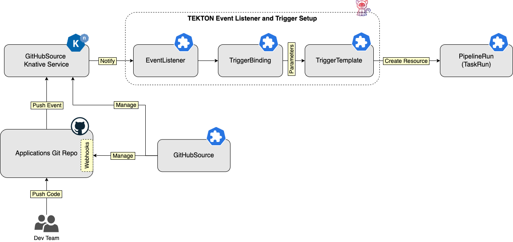

You can also replace the simple delivery mechanism with a complex delivery that uses channels or brokers. Then, you can have multiple subscribers responding to all kind of events. For example, you can have a dedicated setup where, based on the type of event that gets fired, a different Tekton Pipeline is triggered. For example:

- When a PR is opened, a specific subscriber gets notified, and triggers a dedicated pipeline which runs only application tests and thus validates PRs.
- When code is merged in the `main` (or `development`) branch, another subscriber gets notified, and triggers a dedicated CI/CD pipeline.

A typical GitHubSource CRD definition looks like the following:

```yaml
apiVersion: sources.knative.dev/v1alpha1
kind: GitHubSource
metadata:
  name: sample-app-github-source
spec:
  eventTypes:
    - push
  ownerAndRepository: github-repo-owner/sample-app-repo
  accessToken:
    secretKeyRef:
      name: github-pat
      key: accessToken
  secretToken:
    secretKeyRef:
      name: github-pat
      key: secretToken
  sink:
    uri: http://el-tekton-event-listener.doks-ci-cd.svc.cluster.local:8080
```

The manifest has the following keys:

- `spec.eventTypes`: Specifies what type of events you're interested in, for example `push`.
- `spec.ownerAndRepository`: Specifies the GitHub repository (and owner) for the application source code.
- `spec.accessToken` (`spec.secretToken`): Specifies the GitHub personal access token name and value.
- `spec.sink`: Specifies a destination for events, such as a Kubernetes service URI, or a Knative Service.

Next, you will configure and test the Tekton CI/CD pipeline for the sample application ([2048 game](https://en.wikipedia.org/wiki/2048_(video_game))). You will also learn how to automatically trigger the pipeline on GitHub events when pushing commits, using Knative GitHubSource and Tekton EventListeners.

## Step 8: Set Up Your First CI/CD Pipeline Using Tekton and Argo CD

In this part of the tutorial, you will set up a Tekton CI/CD Pipeline that builds a Docker image for your custom application using Kaniko and publishes it to a remote Docker registry. Then, the Tekton pipeline will trigger Argo CD to create and deploy the application to your Kubernetes cluster.

At a high-level overview, you use the following steps:

1. Implement the CI/CD Pipeline workflow using Tekton and Argo CD.
2. Configure Tekton EventListeners and Triggers for automatic triggering of the CI/CD Pipeline using Git events such as pushing commits.
3. Configure the Knative Eventing GitHubSource to trigger your Tekton CI/CD pipeline.

Next, to set up the CI/CD Pipeline workflow:

1. Fetch sample application source code from Git.
2. Build and pushing the application image to the DigitalOcean Container Registry.
3. Trigger Argo CD to deploy (sync) the sample application to your Kubernetes cluster.

Finally, to configure the CI/CD pipeline to trigger on Git events:

1. Set up the `GitHubSource` resource that triggers your Tekton pipeline, by registering the required webhook with your GitHub application repository.
2. Set up an `EventListener` that triggers and processes incoming events from the `GitHubSource`.
3. Set up a `TriggerTemplate` that instantiates a `Pipeline` resource (and associated `Tasks`) each time the `EventListener` is triggered.
4. Set up a `TriggerBinding` resource to populate the `TriggerTemplate` input parameters with data extracted from the GitHub event.

The following diagram below illustrates the CI/CD process implemented using Tekton and Argo:

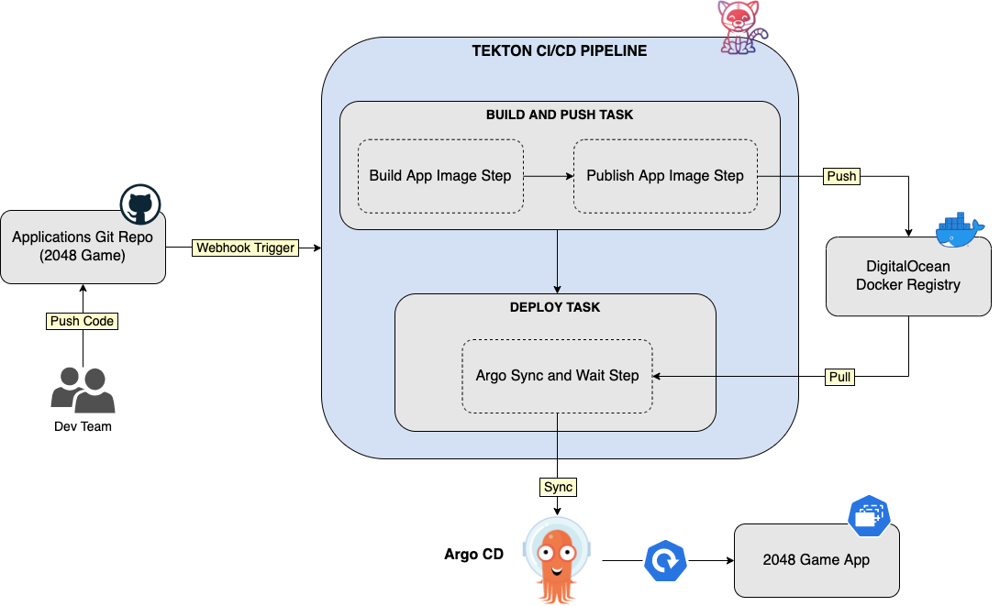

This blueprint provides all the necessary manifests to create resources such as Tekton CRDs, and Knative CRDs, in your Kubernetes cluster, via Kustomize. You will find everything inside the [tekton](assets/manifests/tekton/) folder, including the [kustomization](assets/manifests/tekton/kustomization.yaml) manifest. You can take a look at each, and see how it's being used.

The following shows how the `tekton` kustomization folder is structured:

```text
DOKS-CI-CD/assets/manifests/tekton/
├── configs
│   ├── argocd
│   │   ├── auth.env
│   │   └── server.env
│   ├── docker
│   │   ├── config.json
│   │   └── registry.yaml
│   └── github
│       ├── githubsource.yaml
│       └── pat.env
├── eventing
│   ├── tekton-ci-cd-channel-subscribers.yaml
│   ├── tekton-ci-cd-channel.yaml
│   └── tekton-ci-cd-github-source.yaml
├── pipelines
│   └── tekton-argocd-build-deploy.yaml
├── tasks
│   └── argocd-task-create-app.yaml
├── triggers
│   ├── rbac.yaml
│   ├── tekton-argocd-build-deploy-event-listener.yaml
│   ├── tekton-argocd-build-deploy-trigger-binding.yaml
│   └── tekton-argocd-build-deploy-trigger-template.yaml
└── kustomization.yaml
```

The `DOKS-CI-CD/assets/manifests/tekton/` folder structure is explained below:

- `configs`: Contains configuration files for the secret and configmap generators used in the kustomization file. This folder is further broken into:
  - `argocd`: Contains ArgoCD configurations and secrets.
  - `docker` - contains the registry configuration file used to push images to the DigitalOcean Docker registry.
  - `github`: Contains your PAT (Personal Access Token) credentials.
- `eventing`: Contains all manifest files required to configure Knative Eventing to trigger the Tekton CI/CD pipeline. Following manifests are present here:
  - `tekton-ci-cd-github-source.yaml`: Configures the `GitHubSource` CRD used in this tutorial (in-depth explanations can be found inside).
  - `tekton-ci-cd-channel-subscribers.yaml`: This is optional and not being used by the kustomization from this tutorial. Provided as an example for how to use Knative Eventing subscriptions feature.
  - `tekton-ci-cd-channel.yaml` - This is optional and not being used by the kustomization from this tutorial. Provided as an example for how to use Knative Eventing channels feature.
- `pipelines`: Contains configuration files for the Tekton CI/CD Pipeline used in this tutorial. Following manifests are present here:
  - `tekton-argocd-build-deploy.yaml`: Contains the definition for the CI/CD pipeline (in-depth explanations can be found inside).
- `tasks`: Contains configuration files for custom Tekton Tasks used in this tutorial. Following manifests are present here:
  - `argocd-task-create-app.yaml`: Defines the Argo CD task for creating new applications.
- `triggers`: Contains configuration files for the Tekton Triggers used in this tutorial. Following manifests are present here:
  - `rbac.yaml` - defines the service account and required role bindings used by the Tekton EventListener from this tutorial. This is required by the EventListener to instantiate resources, such as the Tekton CI/CD pipeline.
  - `tekton-argocd-build-deploy-event-listener.yaml` - contains the definition for the Tekton EventListener used this tutorial (in-depth explanations can be found inside).
  - `tekton-argocd-build-deploy-trigger-binding.yaml`: Contains the definition for the Tekton TriggerBinding used this tutorial (in-depth explanations can be found inside).
  - `tekton-argocd-build-deploy-trigger-template.yaml`: Contains the definition for the Tekton TriggerTemplate used this tutorial (in-depth explanations can be found inside).
- `kustomization.yaml`: This is the main kustomization file (in-depth explanations can be found inside).

**Note:** The `configs` folder used by Kustomize contains sensitive data. Use a `.gitignore` file to exclude committing those files in your Git repository.

Steps to follow to create all required resources in your Kubernetes cluster, via Kustomize:

1. Edit and save each property file from the `DOKS-CI-CD/assets/manifests/tekton/configs` subfolder, making sure to replace the `<>` placeholders accordingly. For example, you can use [VS Code](https://code.visualstudio.com):

   ```shell
   code DOKS-CI-CD/assets/manifests/tekton/configs/argocd/auth.env

   code DOKS-CI-CD/assets/manifests/tekton/configs/docker/config.json

   code DOKS-CI-CD/assets/manifests/tekton/configs/github/pat.env
   ```

   **Tips:**

   - To obtain Argo CD admin password, use the following command:

       ```shell
       kubectl -n argocd get secret argocd-initial-admin-secret -o jsonpath="{.data.password}" | base64 -d; echo
       ```

   - To obtain your DigitalOcean Container Registry `read/write` credentials, you can use the following command and write results directly in the `config.json` file:

       ```shell
           doctl registry docker-config --read-write <YOUR_DOCKER_REGISTRY_NAME_HERE> > DOKS-CI-CD/assets/manifests/tekton/configs/docker/config.json
          ```

2. Edit the `configs/github/githubsource.yaml` file and replace the `<>` placeholders accordingly, then save changes. For example, you can use [VS Code](https://code.visualstudio.com):

    ```shell
    code DOKS-CI-CD/assets/manifests/tekton/configs/github/githubsource.yaml
    ```

3. Edit the `configs/docker/registry.yaml` file and replace the `<>` placeholders accordingly, then save changes. For example, you can use [VS Code](https://code.visualstudio.com):

    ```shell
    code DOKS-CI-CD/assets/manifests/tekton/configs/docker/registry.yaml
    ```

4. Finally, apply all changes via Kustomize (`-k` flag):

    ```shell
    kubectl apply -k DOKS-CI-CD/assets/manifests/tekton
    ```

After Kustomize finishes, you should have all required resources created in your cluster, in the `doks-ci-cd` namespace.

First, check the [eventing](assets/manifests/tekton/eventing/) resources state (the GitHubSource):

```shell
kubectl get githubsources -n doks-ci-cd
```

The output looks similar to (`READY` column should display `True`, and `SINK` should point to the `EventListener` service `URI`):

```text
NAME                         READY   REASON   SINK                                                                                    AGE
tekton-ci-cd-github-source   True             http://el-tekton-argocd-build-deploy-event-listener.doks-ci-cd.svc.cluster.local:8080   36s
```

The above output shows you that the EventListener of your Tekton CI/CD pipeline is connected (via the SINK column value) to the GitHubSource CRD to receive GitHub events.

Next, check associated Knative Services:

```shell
kn services list -n doks-ci-cd
```

The output looks similar to:

```text
NAME                               URL                                                                      LATEST                                  READY
hello                              https://hello.doks-ci-cd.starter-kit.online                              hello-world                             True
tekton-ci-cd-github-source-7cgcw   https://tekton-ci-cd-github-source-7cgcw.doks-ci-cd.starter-kit.online   tekton-ci-cd-github-source-7cgcw-00001  True
```

You should see a `tekton-ci-cd-github-source-xxxx` service running, and in the `READY` state. This service is responsible for receiving events from GitHub. The `tekton-ci-cd-github-source-xxxx` service URL should be also registered as a webhook in your forked repo. Navigate to the **Settings** of your forked GitHub repository and check the **Webhooks** section. A new webhook should be listed with a green check mark:

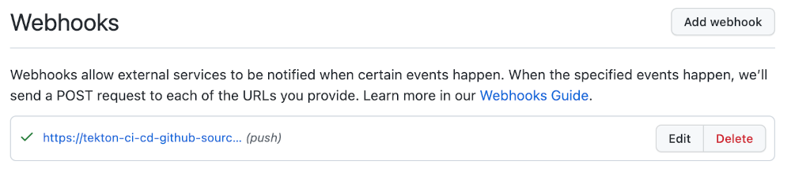

It points to the same URL as displayed in the Knative services listing. On the other hand, you can also inspect the events being sent by GitHub (including response status).

Finally, check important Tekton resources status, such as pipelines, triggers, eventlisteners:

```shell
tkn pipeline list -n doks-ci-cd

tkn pipelinerun list -n doks-ci-cd

tkn triggertemplate list -n doks-ci-cd

tkn eventlistener list -n doks-ci-cd
```

**Tip:** For troubleshooting, you can inspect each resource events and logs, via the corresponding subcommand as shown below:

- Describing Tekton pipeline resources using the `describe` subcommand:

    ```shell
    tkn pipeline describe tekton-argocd-build-deploy-pipeline -n doks-ci-cd

    tkn pipelinerun describe <tekton-argocd-build-deploy-pipeline-run-zt6pt-r-r7wgw> -n doks-ci-cd
    ```

- Inspecting Tekton pipeline resources logs using the `logs` subcommand:

    ```shell
    tkn pipeline logs tekton-argocd-build-deploy-pipeline -n doks-ci-cd

    tkn pipelinerun logs tekton-argocd-build-deploy-pipeline-run-zt6pt-r-r7wgw  -n doks-ci-cd
    ```

Next, you will test the CI/CD pipeline flow by pushing some changes to the `tekton-sample-app` repository prepared in the [Forking the Sample Application Repo](#fork-the-sample-application-repo) step. Then, you will access the Tekton dashboard and watch a live demonstration of how the pipeline triggers automatically, and execution of steps.

## Step 9: Test the CI/CD Setup

You will begin testing the CI/CD flow by changing the `knative-service` resource from the application repo to point to your container registry.

First, clone the git repository prepared in the [Fork the Sample Application Repo](#fork-the-sample-application-repo) step (make sure to replace the `<>` placeholders accordingly):

```shell
git clone git@github.com:<YOUR_GITHUB_USER_NAME_HERE>/kubernetes-sample-apps.git
```

Then, change the directory to your local clone:

```shell
cd kubernetes-sample-apps
```

Next, edit the [game-2048-example/knative-service.yaml](https://github.com/digitalocean/kubernetes-sample-apps/blob/master/game-2048-example/knative-service.yaml) manifest file to point to your Docker registry. For example you can use [VS Code](https://code.visualstudio.com) (make sure to replace the `<>` placeholders accordingly):

```shell
code game-2048-example/knative-service.yaml
```

Save and commit `knative-service.yaml` file changes to your GitHub repository. Next, port-forward the `tekton dashboard` service:

```shell
kubectl port-forward svc/tekton-dashboard -n tekton-pipelines 9097:9097
```

Now, launch your Web browser and access [localhost:9097](http://localhost:9097). Then, navigate to **PipelineRuns** - you should see your Tekton CI/CD pipeline running:

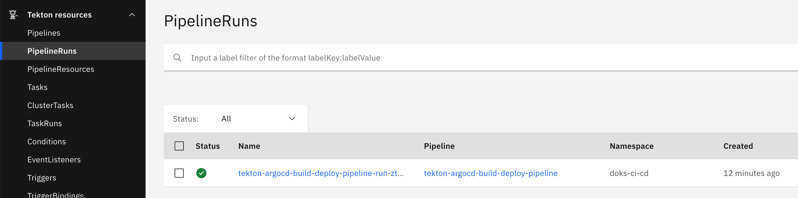

If you click on it, you should see each Task execution status, and logs:

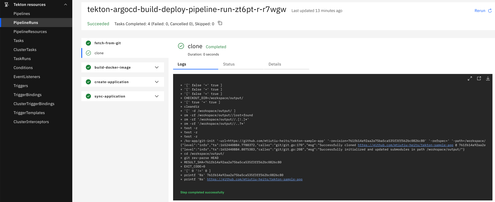

**Note:**

Initially, you may get a failed pipeline run as well. When the webhook is created for the first time, GitHub sends a specific payload to test your GitHubSource endpoint to check if it's alive. The payload content is not valid for the Tekton pipeline and causes the pipeline to fail.

You can access your application endpoint and play the game. First, list all Knative routes from the `doks-ci-cd` namespace:

```shell
kn route list -n doks-ci-cd
```

The output looks similar to:

```text
NAME                               URL                                                                      READY
game-2048                          https://game-2048.doks-ci-cd.starter-kit.online                          True
hello                              https://hello.doks-ci-cd.starter-kit.online                              True
tekton-ci-cd-github-source-7cgcw   https://tekton-ci-cd-github-source-7cgcw.doks-ci-cd.starter-kit.online   True  
```

A new entry should be present named `game-2048`, and in a `READY` state with HTTPS enabled in the URI field. Open a Web browser and paste the link shown in the `URL` column. The 2048 game should start successfully:


If everything looks like above, then you created and tested your first Tekton CI/CD pipeline successfully.

## Summary

In this guide, you learned how to combine different software components (such as Knative, Tekton and Argo) to create a simple CI/CD pipeline running entirely on Kubernetes. You also learned how to configure and use both Knative Serving and Eventing to do useful work for you, as well as ease application development on Kubernetes. Then, by using Knative Eventing and Tekton EventListeners, you enabled automatic triggering of the CI/CD flow each time a change is pushed to the application GitHub repository. Finally, Argo CD closes the loop and deploys your custom application on Kubernetes as a Knative service.

## Next Steps

Argo CD is a GitOps tool and can be used to keep both application and Kubernetes-specific configuration in sync with dedicated GitHub repositories. You can use a dedicated repository for automatically configuring your DOKS cluster with all steps used in this guide. From a practical point of view, you can fork the [container-blueprints](https://github.com/digitalocean/container-blueprints) repository, and tell Argo CD to sync all Kubernetes configuration manifests with your cluster. This way, you don't need to redo all steps by hand again, and let Argo take handle it automatically as well as future upgrades for all software components used in this guide.

You can also let Argo CD manage [Helm releases](https://argo-cd.readthedocs.io/en/stable/user-guide/helm) as well majority of DigitalOcean Marketplace 1-Click apps use Helm to deploy software components.

## Additional Resources

You can browse following resources to learn more:

- [Manage Helm Releases via Argo CD](https://argo-cd.readthedocs.io/en/stable/user-guide/helm)
- [ArgoCD User Guide for Kustomizations](https://argo-cd.readthedocs.io/en/stable/user-guide/kustomize)
- [Kustomizations Best Practices](https://www.r-bloggers.com/2021/02/kustomize-best-practices)
- [Knative Developer Topics](https://knative.dev/docs/serving/services/#:~:text=Autoscaling-,Developer,-Topics)
- [Knative Observability](https://knative.dev/docs/serving/services/#:~:text=Serving%20configuration-,Observability,-Collecting%20logs)
- [Converting a Kubernetes Service to a Knative Service](https://knative.dev/docs/serving/convert-deployment-to-knative-service)
- [Knative Serving Code Samples](https://knative.dev/docs/samples/serving)
- [Knative Eventing Code Samples](https://knative.dev/docs/samples/eventing)
- [Knative GitHub Source Component Documentation and Examples](https://github.com/knative/docs/tree/main/code-samples/eventing/github-source)
- [Tekton Catalog](https://hub.tekton.dev)
