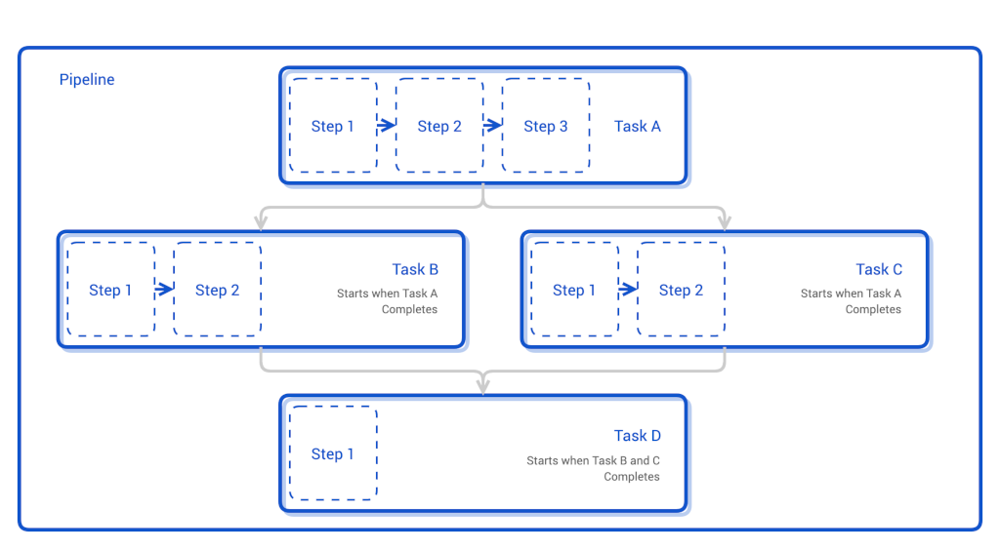
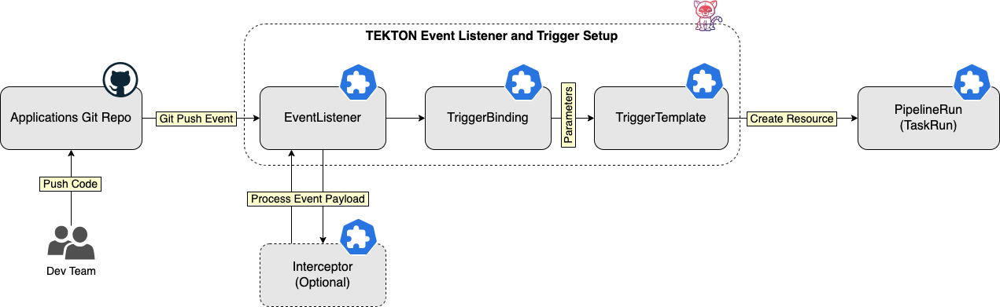
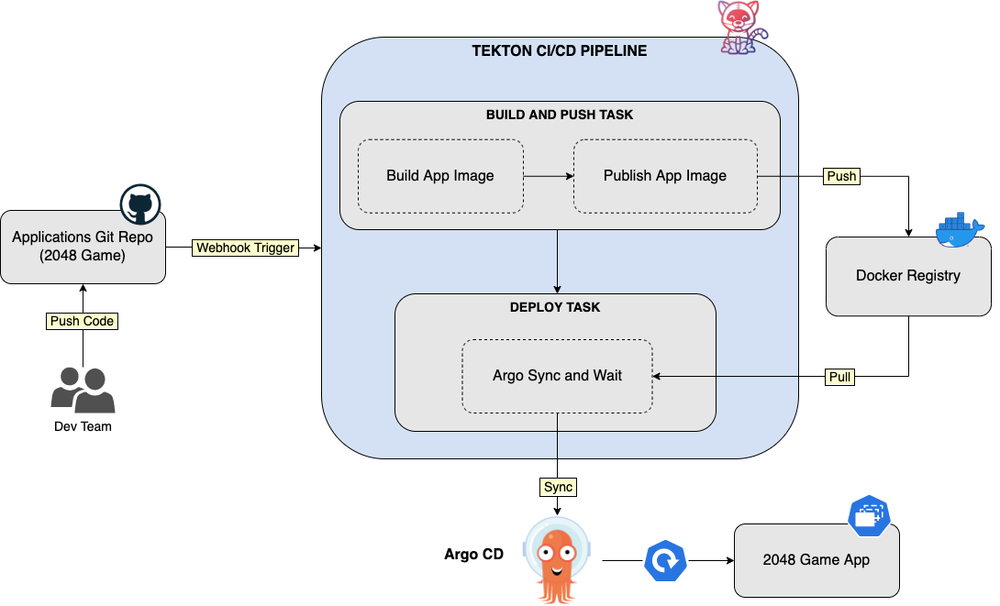

# DOKS CI/CD using Tekton, Argo CD and Knative Serverless Applications

## Introduction

This blueprint will show you how to implement a CI/CD solution using free and popular open source implementations that run on Kubernetes clusters natively. You will be using the DigitalOcean marketplace to provision each system application to your Kubernetes cluster, such as Tekton, Argo CD and Knative. The DigitalOcean marketplace is a collection of 1-click apps that you can quickly deploy to your Kubernetes cluster (DOKS).

You will learn how to use Tekton to build a CI pipeline that continuously fetches code changes from a Git repository, and builds a Docker image for your custom application. Then, Tekton will push the docker image to a remote registry and notifies Argo CD to deploy it in your Kubernetes cluster.

The important building blocks are as follows:

1. [Kaniko](https://github.com/GoogleContainerTools/kaniko), for building container images in a Kubernetes cluster directly.
2. [Tekton](https://tekton.dev) pipelines, for implementing the CI process.
3. [Argo CD](https://argoproj.github.io/cd), for implementing the CD process.
4. [Knative](https://knative.dev), for running and exposing applications functionality on Kubernetes with ease.

On each code change Tekton CI kicks in, builds a container image for your custom application, and uploads it to a Docker registry. Then, Argo CD pulls the Docker image, and deploys it to your DOKS cluster as a Knative application. All described steps run automatically.

After completing this blueprint, you should have a fully functional CI/CD pipeline that continuously builds and deploys code changes for your custom applications.

Following diagram shows the complete setup:

**TODO**

How this blueprint is structured:

1. First, a short introduction is given for each component (such as Kaniko, Tekton, Argo CD, Knative). You can skip this part, if you're already familiar with each component and concepts.
2. Then, you will be guided through the installation steps for each component, using the DigitalOcean 1-click apps marketplace.
3. Next, you will prepare a Knative sample application for testing the CI/CD setup.
4. Final steps would be to implement and test the CI/CD setup (using Tekton and Argo CD), and deploy Knative serverless applications.

## Table of Contents

- [Introduction](#introduction)
- [Prerequisites](#prerequisites)
- [Getting to Know Kaniko](#getting-to-know-kaniko)
- [Getting to Know Tekton](#getting-to-know-tekton)
  - [Pipelines](#pipelines)
  - [Event Listeners and Triggers](#event-listeners-and-triggers)
  - [Tekton Catalog](#tekton-catalog)
  - [Tekton Dashboard](#tekton-dashboard)
- [Getting to Know Argo CD](#getting-to-know-argo-cd)
  - [Applications](#applications)
  - [Projects](#projects)
- [Getting to Know Knative](#getting-to-know-knative)
  - [Serving Component](#serving-component)
  - [Eventing Component](#eventing-component)
- [Step 1 - Installing Tekton](#step-1---installing-tekton)
  - [Provisioning Tekton Pipelines](#provisioning-tekton-pipelines)
  - [Provisioning Tekton Triggers](#provisioning-tekton-triggers)
- [Step 2 - Installing Argo CD](#step-2---installing-argo-cd)
- [Step 3 - Installing Knative](#step-3---installing-knative)
- [Step 4 - Setting Up the CI/CD Pipeline using Tekton and Argo](#step-4---setting-up-the-cicd-pipeline-using-tekton-and-argo)
- [Step 5 - Testing the CI/CD Setup](#step-5---testing-the-cicd-setup)
- [Conclusion](#conclusion)
- [Additional Resources](#additional-resources)

## Prerequisites

## Getting to Know Kaniko

[Kaniko](https://github.com/GoogleContainerTools/kaniko) is nothing more than a tool to build container images directly from a Dockerfile, inside a container or Kubernetes cluster. It means, you can build and push docker images to a remote registry directly from your Kubernetes cluster. What is nice about this setup is you can have a full CI system running completely in your Kubernetes cluster.

Under the hood, Kaniko doesn't depend on a Docker daemon and executes each command within a Dockerfile completely in userspace. This enables building container images in environments that can't easily or securely run a Docker daemon, such as a standard Kubernetes cluster. Kaniko is meant to be run as an image: `gcr.io/kaniko-project/executor`.

Please visit the [official project page](https://github.com/GoogleContainerTools/kaniko) for more information and details about Kaniko.

In this blueprint, you will use Kaniko to build Docker images for your custom applications from Kubernetes cluster itself.

## Getting to Know Tekton

[Tekton](https://tekton.dev) is a cloud native solution for building CI/CD systems. It is specifically engineered to run on Kubernetes, and empowers developers to create CI pipelines using reusable blocks. Other important components are Tekton CLI and Catalog, that make Tekton a complete ecosystem.

This tutorial relies on two important Tekton components to implement the CI part:

- [Pipelines](https://tekton.dev/docs/pipelines/pipelines): used to create the actual CI/CD flow.
- [Triggers and EventListeners](https://tekton.dev/docs/triggers): used to capture and trigger on Git events (e.g. git push events).

Continuous integration (or CI) is the process of automating the integration of small code changes from multiple contributors into a single software project. To achieve CI a central repository is used (e.g. Git), where each developer (or contributor) pushes code changes. Then, a CI tool (e.g. Tekton) detects changes and starts the CI automation.

In general, each CI automation consists of several steps:

1. Fetching application code from a remote SCM (Source Control Management) repository, such as Git.
2. Building the application (specific compilers are invoked, depending on the programming language).
3. Testing application code changes (via unit tests, usually).
4. Creating the final artifact (a binary or a zip file, a Docker file, etc) for application delivery.
5. Pushing the application artifact to a remote repository for later use by a continuous delivery system.

### Pipelines

In Tekton CI automation is implemented using pipelines. A Tekton pipeline consists of tasks used to perform a series of steps in order. Steps are the basic unit of execution in Tekton which perform actions such as build code, create image, push to Docker registry, etc. In other words, a pipeline is used for orchestrating tasks and steps in a CI setup (such as specifying which tasks need to be run in sequence or in parallel).

For each task, Tekton creates a Kubernetes Pod in your cluster to run the steps. Then, each step runs in a docker container, thus it must reference a docker image. The container you choose depends on what your step does. For example:

- Execute shell scripts: use an `Alpine Linux` image.
- Build a Dockerfile: use `Google’s Kaniko` image.
- Run kubectl: use the `bitnami/kubectl` image.
- An image of your own to perform custom actions.

Each task and pipeline may have its own inputs and outputs, known as input and output resources in Tekton. A compilation task, for example, may have a git repository as input and a container image as output: the task clones the source code from the repository, runs some tests, and at last builds the source code into an executable container image.

What's important to remember is that tasks are reusable building blocks that can be shared and referenced across pipelines. This design aspect makes Tekton unique. To help users even more, Tekton project offers a collection of reusable tasks via the [Tekton Catalog](https://hub.tekton.dev) project.

By design, Tekton will not run your Tasks or Pipelines when created. To launch a Task/Pipeline into execution, you need to create a corresponding TaskRun/PipelineRun resource. Tasks referenced within a Pipeline will get the corresponding TaskRun objects created automatically (no need to create them separately).

It is not necessarily a requirement to create a Tekton Pipeline to run a Task. In a simple scenario, you can just go ahead and create a TaskRun to execute a Task (and the corresponding steps). Pipelines can be used in more complex scenarios where multiple Tasks can be leveraged to create more complex logic and solve a bigger problem. In practice is best to design simple Tasks definitions focused on a single thing. You can also think of a Task as a black box with specific inputs and outputs (just like a class is in object oriented programming). To continue the idea, Tasks should respect the single responsibility principle (or SRP).

You can embed tasks in a pipeline directly, or use a reference to each. By using a reference, you create task definitions in separate manifest files, and have them reused across different pipelines. This is encouraged because it avoids code or configuration duplication, and promotes `code reuse` (or configuration reuse).

Below picture illustrates pipelines composition and relationship between tasks:

Please visit the [official project page](https://tekton.dev/docs/pipelines/pipelines) for more information and details about Tekton pipelines.

### Event Listeners and Triggers

You need a mechanism to tell Tekton how to react and trigger your CI pipeline in response to GitHub events. This is accomplished via another Tekton component called Triggers (needs to be installed separately). Tekton triggers allows you to detect and extract information from events from a variety of sources and execute TaskRuns and PipelineRuns based on that information. It can also pass information extracted from events directly to TaskRuns and PipelineRuns.

Following resources are required to automatically trigger a CI pipeline using GitHub webhooks:

1. An [EventListener](https://github.com/tektoncd/triggers/blob/main/docs/eventlisteners.md) - listens for events and specifies one or more `Triggers`.
2. A [Trigger](https://github.com/tektoncd/triggers/blob/main/docs/triggers.md) - specifies what happens when the `EventListener` detects an event. A `Trigger` specifies a `TriggerTemplate` and a `TriggerBinding`.
3. A [TriggerTemplate](https://github.com/tektoncd/triggers/blob/main/docs/triggertemplates.md) - specifies what `TaskRun` or `PipelineRun` to execute when your `EventListener` detects an event.
4. A [TriggerBinding](https://github.com/tektoncd/triggers/blob/main/docs/triggerbindings.md) - specifies what data to extract from the event payload, and how to pass that data to the `TriggerTemplate`.

Optionally, you can also create an [Interceptor](https://github.com/tektoncd/triggers/blob/main/docs/interceptors.md) to filter events, perform webhook verification (using secrets), or other processing before the Trigger actions are executed.

The EventListener logic is implemented via a dedicated controller, running as a Pod in your Kubernetes cluster. Following diagram shows how the event listener works:

In this blueprint you will use Tekton event listeners and triggers to respond to GitHub push events, and run the CI pipeline used to build and publish your custom application image to a remote Docker registry.

Please visit the [official project page](https://tekton.dev/docs/triggers) for more information and details about Tekton event listeners and triggers.

### Tekton Catalog

[Tekton Catalog](https://hub.tekton.dev) is a collection of reusable tasks that you can use in your pipelines. The main idea is to promote the modular design of Tekton and abstract implementation details for common situations. For example, in most of the pipelines you will want to use git clone tasks, application image build tasks, push to remote registry tasks, etc.

Following listing contains a few interesting tasks to start with:

- [Git clone](https://hub.tekton.dev/tekton/task/git-clone) - clone a Git repository URL to a workspace.
- [Buildpacks](https://hub.tekton.dev/tekton/pipeline/buildpacks) - builds source into a container image using [Cloud Native Buildpacks](https://buildpacks.io).
- [ArgoCD](https://hub.tekton.dev/tekton/task/argocd-task-sync-and-wait) - deploys an Argo CD application and waits for it to be healthy.

Please visit the [Tekton Catalog](https://github.com/tektoncd/catalog) GitHub project page to learn more.

### Tekton Dashboard

Tekton Dashboard is a web-based interface for Tekton Pipelines and Tekton triggers resources. It allows you to manage and view Tekton resource creation, execution, and completion.

Tekton Dashboard supports:

- Filtering resources by label.
- Realtime view of PipelineRun and TaskRun logs.
- View resource details and YAML.
- Show resources for the whole cluster or limit visibility to a particular namespace.
- Import resources directly from a git repository.
- Adding functionality through extensions.

Please visit the [Tekton Dashboard](https://github.com/tektoncd/dashboard) GitHub project page to learn more.

## Getting to Know Argo CD

[Argo CD](https://argoproj.github.io/cd) is a popular open source implementation for doing GitOps continuous delivery (CD) on top of Kubernetes. Your applications, definitions, configurations, and environments should be declarative and version controlled. Also application deployment and lifecycle management should be automated, auditable, and easy to understand. All this can be done using Argo.

Argo CD adheres to the same GitOps patterns and principles, thus maintaining your cluster state using a declarative approach. Synchronization happens via a Git repository, where your Kubernetes manifests are being stored. Kubernetes manifests can be specified in several ways:

- [Kustomize](https://kustomize.io) applications.
- [Helm](https://helm.sh) charts.
- [Ksonnet](https://ksonnet.io) applications.
- [Jsonnet](https://jsonnet.org) files.
- Plain directory of YAML/json manifests.
- Any custom config management tool configured as a config management plugin.

Why Argo and not Tekton for the CD part ?

While you can accomplish CD using Tekton as well, Argo is more specialized for this task. It's true that every CI systems can be used to perform deployments as well, but it implies more steps and logic to accomplish the same thing. Traditionally, you would use all kind of scripts and glue logic to create the CD part inside a CI system (take Jenkins as an example). Soon you will notice that it's unnatural, hence a dedicated CD solution is more appropriate.

Other important aspects to consider:

1. How do I implement GitOps?
2. How easy can I deploy to multiple environments and Kubernetes clusters?
3. What happens if my CI/CD system goes down?

First, the most important aspect is to have a setup where a specialized system takes care of the CD part, and doesn't interfere or it's not dependent on the CI part. If the CI system goes down for some reason, it shouldn't affect the CD part and vice-versa. On the other hand, a system or a component that does multiple things at once can be prone to failure in accomplishing both. So, it's best to follow the single responsibility principle in general, and let Tekton take care of the CI part, and Argo to handle CD. On top of that, you can use Argo to deploy and maintain configuration for system applications used in this blueprint as well, such as Tekton and Knative.

### Applications

Argo CD is using the [Application](https://argo-cd.readthedocs.io/en/stable/operator-manual/declarative-setup/#applications) core concept to manage applications deployment and lifecycle. Inside an Argo CD application manifest you define the Git repository hosting your application definitions, as well as the corresponding Kubernetes cluster to deploy applications. In other words, an Argo CD application defines the relationship between a source repository and a Kubernetes cluster. It's a very concise and scalable design, where you can associate multiple sources (Git repositories) and corresponding Kubernetes clusters.

A major benefit of using applications is that you don't need to deploy Argo to each cluster individually. You can use a dedicated cluster for Argo, and deploy applications to all clusters at once from a single place. This way, you avoid Argo CD downtime or loss, in case other environments have issues or get decommissioned.

### Projects

You can group similar applications into a [Project](https://argo-cd.readthedocs.io/en/stable/user-guide/projects). Projects permit logical grouping of applications and associated roles/permissions, when working with multiple teams. When not specified, each new application belongs to the `default` project. The `default` project is created automatically, and it doesn't have any restrictions. The default project can be modified, but not deleted.

This tutorial is using the `default` project in all examples.

Please visit the official documentation website to read more about Argo CD [core concepts](https://argo-cd.readthedocs.io/en/stable/core_concepts).

In this blueprint you will learn how to use Argo CD to continuously deploy code changes for your custom applications.

## Getting to Know Knative

[Knative](https://knative.dev) is an open-source solution to build and deploy serverless applications using Kubernetes as the underlying platform. In addition to application development, developers may also have infrastructure tasks such as maintaining Kubernetes manifests for application deployment, rolling back to a previous revision, traffic routing, scaling up or down workloads to meet load demand, etc.

Knative reduces the boilerplate needed for spinning up workloads in Kubernetes, such as creating deployments, services, ingress objects, etc. Knative also helps you implement best practices in production systems (e.g. blue-green, canary deployments), application observability (logs and metrics), and support for event-driven applications.

Knative has two main components:

- [Serving](https://knative.dev/docs/serving): Abstracts all required parts needed for your application to run and be accessible to the outside world.
- [Eventing](https://knative.dev/docs/eventing): Adds support for event based programming, thus making it easy to create event driven architectures.

### Serving Component

Knative Serving features include:

- Deploy serverless applications quickly.
- Autoscaling for application pods (down scaling to zero is supported).
- Point-in-time snapshots for application code and configurations (via revisions).
- Routing and network programming. Supports multiple networking layers, like: Kourier, Contour, Istio.

### Eventing Component

Knative Eventing helps address common tasks for cloud native development such as:

- Enabling late-binding for event sources and consumers.
- Loose coupling between services, thus making easy to deploy individual application components.
- Various services can be connected without modifying consumers or producers, thus facilitating building new applications.

For every serverless application you create, you must define a Knative Service CRD (not to be confused with the Kubernetes Service resource). Each Knative Service is handled by the Knative Serving component described previously. A Knative Service abstracts all the required implementation details for your application to run (e.g. Kubernetes deployments, exposing the application via Ingress objects, autoscaling, etc). In the end, you will be presented with a HTTP URL resource to access your custom application.

Knative can automatically scale down your applications to zero when not in use or idle (for example, when no HTTP traffic is present), which make your applications serverless.

In this blueprint you will use the Knative Serving component to deploy and expose a web application ([2048 game](https://en.wikipedia.org/wiki/2048_(video_game))).

## Step 1 - Installing Tekton

### Provisioning Tekton Pipelines

### Provisioning Tekton Triggers

## Step 2 - Installing Argo CD

## Step 3 - Installing Knative

## Step 4 - Setting Up the CI/CD Pipeline using Tekton and Argo

In this part, you will set up a CI/CD Pipeline that builds a Docker image for your custom application using Kaniko, and publishes it to a remote Docker registry. Then, the Tekton pipeline will trigger Argo CD to deploy the application to your Kubernetes cluster. The web application used in this tutorial is a implementation for the [2048 game](https://en.wikipedia.org/wiki/2048_(video_game)).

At a high level overview, following major parts are involved:

1. The CI/CD Pipeline workflow.
2. CI/CD Pipeline triggering by Git events (e.g. pushing commits).

The CI/CD Pipeline workflow is divided into:

1. Retrieve the source code.
2. Build and push the source code into a Docker image.
3. Push the image to the specified Docker registry.
4. Trigger Argo CD to deploy application in your Kubernetes cluster.

Configuring the CI/CD pipeline to respond to Git events is divided into:

1. Set up an `EventListener` that accepts and processes GitHub push events.
2. Set up a `TriggerTemplate` that instantiates a `PipelineResource` and executes a `PipelineRun` and its associated `TaskRuns` when the EventListener detects the push event from a GitHub repository.
3. Set up a `TriggerBinding` to populate the `TriggerTemplate` input parameters with data extracted from the GitHub event.

Below diagram illustrates the CI/CD process:

## Step 5 - Testing the CI/CD Setup

## Conclusion

## Additional Resources
