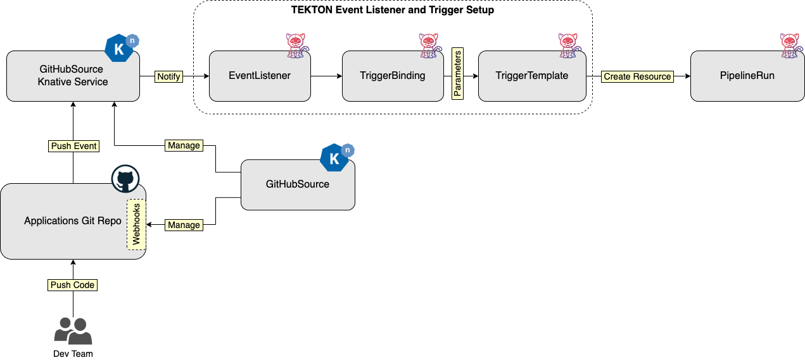
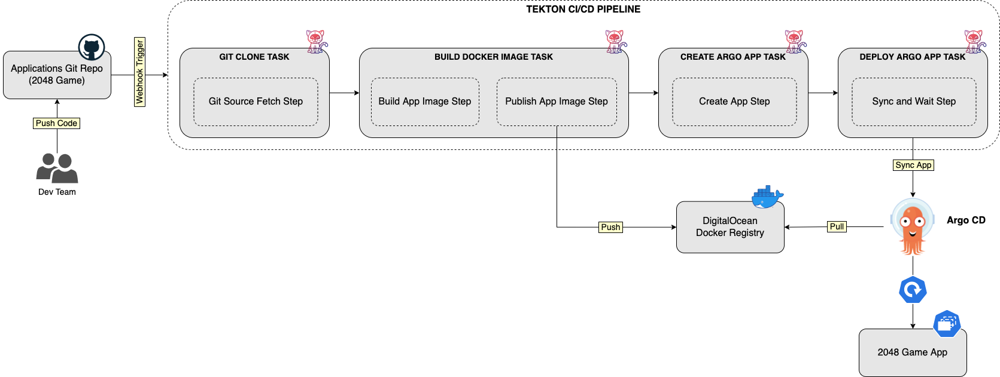
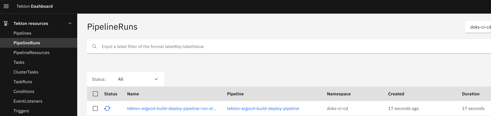

# DOKS CI/CD using Tekton, Argo CD and Knative Serverless Applications

## Introduction

This blueprint will show you how to implement a CI/CD solution using free and popular open source implementations that run on Kubernetes clusters natively. You will be using the DigitalOcean marketplace to provision each software component to your Kubernetes cluster, such as Tekton, Argo CD, Knative, Cert-Manager. The DigitalOcean marketplace is a collection of pre-configured 1-click apps that you can quickly deploy to your Kubernetes cluster (DOKS).

You will learn how to use Tekton to build a CI/CD pipeline that continuously fetches code changes from a Git repository, and builds a Docker image for your custom application. Then, Tekton will push the docker image to a remote registry and notifies Argo CD to deploy it to your Kubernetes cluster.

The important building blocks are as follows:

1. [Kaniko](https://github.com/GoogleContainerTools/kaniko), for building container images directly in a Kubernetes cluster.
2. [Tekton](https://tekton.dev) pipelines, for implementing the CI process.
3. [Argo CD](https://argoproj.github.io/cd), for implementing the CD process.
4. [Knative](https://knative.dev), for running and exposing applications functionality on Kubernetes with ease. Also enables Tekton Pipelines triggering whenever a push happens on your GitHub repository via the Knative Eventing component.
5. [Cert-Manager](https://cert-manager.io), for managing TLS termination of Knative Services.

On each code change a Tekton CI pipeline kicks in, builds a container image for your custom application, and uploads it to a Docker registry. Then, Argo CD pulls the Docker image, and deploys it to your DOKS cluster as a Knative application (or service). All described steps run automatically.

After completing this blueprint, you should have a fully functional CI/CD pipeline that continuously builds and deploys code changes for your custom applications.

Following diagram shows the complete setup:


How this blueprint is structured:

1. First, a short introduction is given for each component (such as Kaniko, Tekton, Argo CD, Knative, etc). Each introductory section also tries to explain the role of each component in this guide.
2. Then, you will be guided through the installation steps for each component, using the DigitalOcean 1-click apps marketplace.
3. Next, you will configure Knative Eventing to react on GitHub events and trigger the CI/CD pipeline.
4. Final steps would be to implement and test the CI/CD setup (using Knative, Tekton and Argo CD), and deploy a sample Knative application.

## Table of Contents

- [Introduction](#introduction)
- [Prerequisites](#prerequisites)
- [Getting to Know Kaniko](#getting-to-know-kaniko)
- [Getting to Know Tekton](#getting-to-know-tekton)
  - [Tasks](#tasks)
  - [Pipelines](#pipelines)
  - [Event Listeners and Triggers](#event-listeners-and-triggers)
  - [Tekton Catalog](#tekton-catalog)
  - [Tekton Dashboard](#tekton-dashboard)
- [Getting to Know Argo CD](#getting-to-know-argo-cd)
  - [Applications](#applications)
  - [Projects](#projects)
- [Getting to Know Knative](#getting-to-know-knative)
  - [Serving Component](#serving-component)
  - [Eventing Component](#eventing-component)
- [Getting to Know Cert-Manager](#getting-to-know-cert-manager)
- [Step 1 - Installing Cert-Manager](#step-1---installing-cert-manager)
- [Step 2 - Installing Tekton](#step-2---installing-tekton)
  - [Provisioning Tekton Pipelines](#provisioning-tekton-pipelines)
  - [Provisioning Tekton Triggers](#provisioning-tekton-triggers)
  - [Provisioning Tekton Dashboard](#provisioning-tekton-dashboard)
- [Step 3 - Installing Argo CD](#step-3---installing-argo-cd)
- [Step 4 - Installing Knative](#step-4---installing-knative)
- [Step 5 - Configuring Knative Serving](#step-5---configuring-knative-serving)
  - [Configuring DigitalOcean Domain Records for Knative Services](#configuring-digitalocean-domain-records-for-knative-services)
  - [Configuring a Custom Domain and Auto TLS Feature for Knative Services](#configuring-a-custom-domain-and-auto-tls-feature-for-knative-services)
  - [Knative Private Services](#knative-private-services)
- [Step 6 - Configuring Knative Eventing](#step-6---configuring-knative-eventing)
- [Step 7 - Preparing the Sample Application Requirements](#step-7---preparing-the-sample-application-requirements)
  - [Forking the Sample Application Repo](#forking-the-sample-application-repo)
  - [Creating a DigitalOcean Docker Registry](#creating-a-digitalocean-docker-registry)
  - [Creating a Dedicated Namespaces for Kubernetes Resources](#creating-a-dedicated-namespaces-for-kubernetes-resources)
- [Step 8 - Setting Up Your First CI/CD Pipeline Using Tekton and Argo CD](#step-8---setting-up-your-first-cicd-pipeline-using-tekton-and-argo-cd)
- [Step 9 - Testing the CI/CD Setup](#step-9---testing-the-cicd-setup)
- [Conclusion](#conclusion)
- [Additional Resources](#additional-resources)

## Prerequisites

To complete this tutorial, you will need:

1. A working domain that you own. This is required for exposing public services used in this guide (including GitHub webhooks). Make sure to also read the DigitalOcean [DNS Quickstart Guide](https://docs.digitalocean.com/products/networking/dns/quickstart), as well as the additional how to's on this topic.
2. A working `DOKS` cluster running `Kubernetes version >=1.21` that you have access to. The DOKS cluster must have at least `2 nodes`, each with `2 CPUs`, `4 GB` of memory, and `20 GB` of disk storage. For additional instructions on configuring a DigitalOcean Kubernetes cluster, see: [How to Set Up a DigitalOcean Managed Kubernetes Cluster (DOKS)](https://github.com/digitalocean/Kubernetes-Starter-Kit-Developers/tree/main/01-setup-DOKS#how-to-set-up-a-digitalocean-managed-kubernetes-cluster-doks).
3. A [Git](https://git-scm.com/downloads) client, to interact with GitHub repositories.
4. [Doctl](https://docs.digitalocean.com/reference/doctl/how-to/install), for interacting with DigitalOcean API.
5. [Kubectl](https://kubernetes.io/docs/tasks/tools) CLI, for `Kubernetes` interaction. Follow these [instructions](https://www.digitalocean.com/docs/kubernetes/how-to/connect-to-cluster/) to connect to your cluster with `kubectl` and `doctl`.
6. [Helm](https://www.helm.sh), for interacting with Helm releases created by the DigitalOcean 1-click apps used in this tutorial.
7. [Argo CLI](https://argo-cd.readthedocs.io/en/stable/cli_installation), to interact with `Argo CD` using the command line interface.
8. [Tekton CLI](https://tekton.dev/docs/cli/#installation), to interact with `Tekton Pipelines` using the command line interface.
9. [Knative CLI](https://knative.dev/docs/install/client/install-kn), to interact with `Knative` using the command line interface.
10. [Kustomize](https://kustomize.io) is extensively used in this guide, and at least some basic knowledge is required. You can follow the [official DigitalOcean tutorial](https://www.digitalocean.com/community/tutorials/how-to-manage-your-kubernetes-configurations-with-kustomize) as a starting point, as well as some real world examples.

## Getting to Know Kaniko

[Kaniko](https://github.com/GoogleContainerTools/kaniko) is nothing more than a tool to build container images directly from a Dockerfile, inside a container or Kubernetes cluster. It means, you can build and push docker images to a remote registry directly from your Kubernetes cluster. What is nice about this setup is you can have a full CI system running completely in your Kubernetes cluster.

Under the hood, Kaniko doesn't depend on a Docker daemon and executes each command within a Dockerfile completely in userspace. This enables building container images in environments that can't easily or securely run a Docker daemon, such as a standard Kubernetes cluster. Kaniko is meant to be run as an image: `gcr.io/kaniko-project/executor`.

Please visit the [official project page](https://github.com/GoogleContainerTools/kaniko) for more information and details about Kaniko.

In this blueprint, you will use Kaniko to build Docker images for your custom applications from Kubernetes cluster itself.

## Getting to Know Tekton

Continuous integration (or CI) is the process of automating the integration of small code changes from multiple contributors into a single software project. To achieve CI a central repository is used (e.g. Git), where each developer (or contributor) pushes code changes. Then, a CI tool (e.g. Tekton) detects changes and starts the CI automation.

In general, each CI automation consists of several steps:

1. Fetching application code from a remote SCM (Source Control Management) repository, such as Git.
2. Building application code via specific compilers, depending on the used programming language.
3. Testing application code changes (via unit testing, integration testing, etc).
4. Creating the final artifact (binary file, zip file, Docker image, etc) for application delivery.
5. Pushing the application artifact to a remote repository for later use by a continuous delivery system.

[Tekton](https://tekton.dev) is a cloud native solution for building CI/CD systems on top of Kubernetes clusters. It is specifically engineered to run on Kubernetes, and empowers developers to create CI pipelines using reusable blocks called Tasks. Other important components are Tekton CLI and Catalog (collection of reusable Tasks), that make Tekton a complete ecosystem.

In this guide, Tekton is used to implement the CI part via the `Pipeline` resource (and associated components, such as: `Tasks`, `Triggers`, etc).

Tekton is modular in nature and very well organized. This tutorial relies on the following Tekton components to implement the CI part:

- [Tasks](https://tekton.dev/docs/pipelines/tasks) - used to organize the steps performing each action, such as build and test your application code.
- [Pipelines](https://tekton.dev/docs/pipelines/pipelines) - used to organize tasks and define your custom CI/CD flow.
- [Triggers and EventListeners](https://tekton.dev/docs/triggers) - used to capture and trigger on Git events (e.g. git push events).

### Tasks

A Tekton `Task` is a collection of `Steps` that you define and arrange in a specific order of execution as part of your continuous integration flow. Steps are the basic unit of execution in Tekton which perform real actions such as build code, create a Docker image, push to Docker registry, etc. To add steps to a Task you define a `steps` field containing a list of desired Steps. The order in which the Steps appear in this list is the order in which they will execute.

For each task, Tekton creates a Kubernetes Pod in your cluster to run the steps. Then, each step runs in a docker container, thus it must reference a docker image. The container you choose depends on what your step does. For example:

- Execute shell scripts: use an `Alpine Linux` image.
- Build a Dockerfile: use `Google’s Kaniko` image.
- Run kubectl: use the `bitnami/kubectl` image.
- An image of your own to perform custom actions.

Task definitions are composed of (most important are highlighted):

- [Parameters](https://tekton.dev/docs/pipelines/tasks/#specifying-parameters) - used to specify input parameters for a task such as compilation flags, artifacts name, etc.
- [Workspaces](https://tekton.dev/docs/pipelines/tasks/#specifying-workspaces) - used to share data (artifacts) between steps defined in a task.
- [Results](https://tekton.dev/docs/pipelines/tasks/#emitting-results) - represent a string value emitted by a Task. Results can be passed between Tasks inside a pipeline. Results are also visible to users, and represent important information such as SHA id for a cloned repository (emitted by the [git-clone](https://hub.tekton.dev/tekton/task/git-clone) Task).

Typical `Tekton Task` definition looks like below:

```yaml
apiVersion: tekton.dev/v1beta1
kind: Task
metadata:
  name: kaniko-example
spec:
  params:
    - name: IMAGE
      description: Name (reference) of the image to build.
    - name: DOCKERFILE
      description: Path to the Dockerfile to build.
      default: ./Dockerfile
  results:
    - name: IMAGE_DIGEST
      description: Digest of the image just built.
    - name: IMAGE_URL
      description: URL of the image just built.
  steps:
    - name: build-and-push
      workingDir: $(workspaces.source.path)
      image: $(params.BUILDER_IMAGE)
...
```

Explanation for the above configuration:

- `spec.params`: defines the list of input parameters for a Task.
- `spec.results`: defines a list of string values that this Task emits. Emitting results allows passing values between tasks. In other words, a result is an output value created by one Task, and can be used as an input value for the second Tasks (and so on).
- `spec.steps`: defines the list of steps to execute. Steps represent the basic unit of execution, and define the logic of Tasks.

**Important Note:**

Task resources are [deprecated](https://tekton.dev/docs/pipelines/migrating-v1alpha1-to-v1beta1/#replacing-pipelineresources-with-tasks) starting with `v1beta1` version of Tekton APIs. Users are encouraged to use the new features as explained in the deprecation note.

By design, Tekton will not run your Tasks when created. To launch a Task into execution, you need to create a separate [TaskRun](https://tekton.dev/docs/pipelines/taskruns) resource. A TaskRun is what instantiates your Task and begin execution of steps. A TaskRun executes the Steps in the Task in the order they are specified until all Steps have executed successfully or a failure occurs. Also, a TaskRun allows to pass input parameters, as well as specifying resources and workspaces for your custom Task.

What's important to remember is that tasks are reusable building blocks that can be shared and referenced across pipelines. This design aspect makes Tekton unique. To help users even more, Tekton project offers a collection of reusable tasks via the [Tekton Catalog](https://hub.tekton.dev) project.

Below picture illustrates the `Task` and `TaskRun` concepts:


Please visit the [official documentation page](https://tekton.dev/docs/pipelines/tasks) for more information and details about Tekton Tasks.

### Pipelines

A Tekton Pipeline is used to organize your Tekton tasks and orchestrate the CI flow. A Pipeline specifies one or more Tasks in the desired order of execution. You can embed tasks in a pipeline directly, or reference them from external manifest files. By using references, you create task definitions in separate manifest files, and have them reused across different pipelines. This method is encouraged because it avoids code or configuration duplication, and promotes `code reuse` (or configuration reuse). Thus, tasks act as objects (with inputs and outputs) that can be reused (and instantiated) across your pipelines. You can create dedicated pipelines to test, or build and deploy your applications code.

Pipeline definitions are composed of (most important are highlighted):

- [Parameters](https://tekton.dev/docs/pipelines/pipelines/#specifying-parameters) - used to specify input parameters (at a global level) for all tasks within a Pipeline.
- [Workspaces](https://tekton.dev/docs/pipelines/pipelines/#specifying-workspaces) - used to specify a workspace for shared artifacts between Tasks within a Pipeline.
- [Tasks](https://tekton.dev/docs/pipelines/tasks) - used to specify the list of Tasks to execute as part of the Pipeline.

Typical `Tekton Pipeline` definition looks like below:

```yaml
apiVersion: tekton.dev/v1beta1
kind: Pipeline
metadata:
  name: kaniko-pipeline
spec:
  params:
    - name: git-url
    - name: git-revision
    - name: image-name
    - name: path-to-image-context
    - name: path-to-dockerfile
  workspaces:
    - name: git-source
  tasks:
    - name: fetch-from-git
      taskRef:
        name: git-clone
      params:
        - name: url
          value: $(params.git-url)
        - name: revision
          value: $(params.git-revision)
      workspaces:
        - name: output
          workspace: git-source
    - name: build-image
      taskRef:
        name: kaniko
      params:
        - name: IMAGE
          value: $(params.image-name)
        - name: CONTEXT
          value: $(params.path-to-image-context)
        - name: DOCKERFILE
          value: $(params.path-to-dockerfile)
      workspaces:
        - name: source
          workspace: git-source
```

Explanation for the above configuration:

- `spec.params`: defines the list of input parameters for the Pipeline.
- `spec.workspaces`: defines a list of workspaces to be used by each Task inside the Pipeline. Workspaces are used to share data (or artifacts) between tasks.
- `spec.tasks`: defines the list of tasks to be executed in order as part of the Pipeline. Tasks can be embedded in the Pipeline YAML definition, or referenced using the `taskRef` field.

**Hint:**

The [Tekton Catalog](https://hub.tekton.dev) (or Hub) provides a ready to use collection of task definitions for common use scenarios, such as cloning a git repository, building a docker image via kaniko, etc. You can install them in your Kubernetes cluster either via `tkn` CLI, or `kubectl`. Then, you can reference each task in your custom pipeline using the `taskRef` field (you can see such an example in the example pipeline definition to follow).

By design, Tekton will not run your Pipelines when created. To launch a Pipeline into execution, you need to create a [PipelineRun](https://tekton.dev/docs/pipelines/pipelineruns) resource. A PipelineRun allows you to instantiate and execute a Tekton Pipeline in your Kubernetes cluster. A PipelineRun executes the Tasks in the Pipeline in the order they are specified until all Tasks have executed successfully or a failure occurs.

**Important Notes:**

- Pipeline resources are [deprecated](https://tekton.dev/docs/pipelines/migrating-v1alpha1-to-v1beta1/#replacing-pipelineresources-with-tasks) starting with `v1beta1` version of Tekton APIs (hence, not used in this tutorial as well). Users are encouraged to use the new features as explained in the deprecation note.
- Tasks referenced within a Pipeline will get the corresponding TaskRun objects created automatically (no need to create them separately).

Below picture illustrates Pipelines and Tasks composition:


Please visit the [official documentation page](https://tekton.dev/docs/pipelines/pipelines) for more information and details about Tekton Pipelines.

### Event Listeners and Triggers

You need a mechanism to tell Tekton how to react and trigger your CI pipeline in response to external events emitted by various sources, such as GitHub. This is accomplished via another Tekton component called [Triggers](https://github.com/tektoncd/triggers) (needs to be installed separately). Tekton triggers allows you to detect and extract information from events from a variety of sources, and execute TaskRuns and PipelineRuns based on that information. It can also pass information extracted from events directly to TaskRuns and PipelineRuns.

Following resources are required to automatically trigger a Tekton pipeline using GitHub webhooks:

1. An [EventListener](https://github.com/tektoncd/triggers/blob/main/docs/eventlisteners.md) - listens for events, and specifies one or more `Triggers`.
2. A [Trigger](https://github.com/tektoncd/triggers/blob/main/docs/triggers.md) - specifies what happens when the `EventListener` detects an event. A `Trigger` specifies a `TriggerTemplate` and a `TriggerBinding`.
3. A [TriggerTemplate](https://github.com/tektoncd/triggers/blob/main/docs/triggertemplates.md) - specifies what `TaskRun` or `PipelineRun` to execute when your `EventListener` detects an event.
4. A [TriggerBinding](https://github.com/tektoncd/triggers/blob/main/docs/triggerbindings.md) - specifies what data to extract from the event payload, and how to pass that data to the `TriggerTemplate`.

Optionally, you can also create an [Interceptor](https://github.com/tektoncd/triggers/blob/main/docs/interceptors.md) to filter events, perform webhook verification (using secrets), or other processing before the Trigger actions are executed.

Following diagram illustrates how Tekton EventListeners and Triggers work:


In this blueprint you will use Tekton EventListeners and Triggers to respond to GitHub push events, and trigger the CI/CD pipeline used to build and deploy your custom application.

Please visit the [official project page](https://tekton.dev/docs/triggers) for more information and details about Tekton EventListener and Triggers.

### Tekton Catalog

[Tekton Catalog](https://hub.tekton.dev) is a collection of reusable tasks that you can use in your pipelines. The main idea is to promote the modular design of Tekton and abstract implementation details for common situations. For example, in most of the pipelines you will want to use git clone tasks, application image build tasks, push to remote registry tasks, etc.

Following listing contains a few interesting tasks to start with:

- [Git Clone Task](https://hub.tekton.dev/tekton/task/git-clone) - clone a Git repository URL to a workspace.
- [Kaniko Task](https://hub.tekton.dev/tekton/task/kaniko) - builds source into a container image using [Cloud Native Buildpacks](https://buildpacks.io).
- [ArgoCD Sync and Wait Task](https://hub.tekton.dev/tekton/task/argocd-task-sync-and-wait) - deploys an Argo CD application and waits for it to be healthy.

In this blueprint you will use Tekton catalog to install commonly used tasks, such as [git-clone](https://hub.tekton.dev/tekton/task/git-clone), [kaniko](https://hub.tekton.dev/tekton/task/kaniko) and [argocd-sync-and-wait](https://hub.tekton.dev/tekton/task/argocd-task-sync-and-wait).

Please visit the [Tekton Catalog](https://github.com/tektoncd/catalog) GitHub project page to learn more.

### Tekton Dashboard

[Tekton Dashboard](https://github.com/tektoncd/dashboard) is a web-based interface for Tekton Pipelines and Tekton triggers resources. It allows you to manage and view Tekton resource creation, execution, and completion.

Tekton Dashboard supports:

- Filtering resources by label.
- Realtime view of PipelineRun and TaskRun logs.
- View resource details and YAML.
- Show resources for the whole cluster or limit visibility to a particular namespace.
- Import resources directly from a git repository.
- Adding functionality through extensions.

In this blueprint you will use Tekton dashboard to interact with pipeline runs, and visualize results (such as logs) for each task from the CI/CD flow.

Please visit the [Tekton Dashboard](https://github.com/tektoncd/dashboard) GitHub project page to learn more.

## Getting to Know Argo CD

[Argo CD](https://argoproj.github.io/cd) is a popular open source implementation for doing GitOps continuous delivery (CD) on top of Kubernetes. Your applications, definitions, configurations, and environments should be declarative and version controlled. Also application deployment and lifecycle management should be automated, auditable, and easy to understand. All this can be done using Argo.

Argo CD adheres to the same GitOps patterns and principles, thus maintaining your cluster state using a declarative approach. Synchronization happens via a Git repository, where your Kubernetes manifests are being stored. Kubernetes manifests can be specified in several ways:

- [Kustomize](https://kustomize.io) applications.
- [Helm](https://helm.sh) charts.
- [Ksonnet](https://ksonnet.io) applications.
- [Jsonnet](https://jsonnet.org) files.
- Plain directory of YAML/json manifests.
- Any custom config management tool configured as a config management plugin.

Why Argo and not Tekton for the CD part ?

While you can accomplish the CD part using Tekton as well, Argo is more specialized for this task. It's true that every CI systems can be used to perform deployments as well, but it implies more steps and logic to accomplish the same thing. Traditionally, you would use all kind of scripts and glue logic to create the CD part inside a CI system (take Jenkins as an example). Soon, you will notice that it's unnatural, hence a dedicated CD solution is more appropriate.

Other important aspects to consider:

1. How do I implement GitOps?
2. How easy can I deploy to multiple environments and Kubernetes clusters?
3. What happens if my CI/CD system goes down?

Argo CD helps you implement GitOps, and keep your Kubernetes manifests (even those used in this guide) synced with a Git repository. No need to go back and apply everything by hand on every change. GitOps also allows you to easily keep track of changes, and most important forbid manual intervention in your cluster (via other members in the team using `kubectl`, for example).

Next, the most important aspect is to have a setup where a specialized system takes care of the CD part, and doesn't interfere or it's not dependent on the CI part. If the CI system goes down for some reason, it shouldn't affect the CD part and vice-versa. On the other hand, a system or a component that does multiple things at once can be prone to failure in accomplishing both. So, it's best to follow the single responsibility principle in general, and let Tekton take care of the CI part, and Argo to handle CD (as well as GitOps).

### Applications

Argo CD is using the [Application](https://argo-cd.readthedocs.io/en/stable/operator-manual/declarative-setup/#applications) core concept to manage applications deployment and lifecycle. Inside an Argo CD application manifest you define the Git repository hosting your application definitions, as well as the corresponding Kubernetes cluster used to deploy your applications. In other words, an Argo CD application defines the relationship between a source repository and a Kubernetes cluster. It's a very concise and scalable design, where you can associate multiple sources (Git repositories) and corresponding Kubernetes clusters.

A major benefit of using applications is that you don't need to deploy Argo to each cluster individually. You can use a dedicated cluster for Argo, and deploy applications to all clusters at once from a single place. This way, you avoid Argo CD downtime or loss, in case other environments have issues or get decommissioned.

### Projects

You can group similar applications into a [Project](https://argo-cd.readthedocs.io/en/stable/user-guide/projects). Projects permit logical grouping of applications and associated roles/permissions, when working with multiple teams. When not specified, each new application belongs to the `default` project. The `default` project is created automatically, and it doesn't have any restrictions. The default project can be modified, but not deleted.

**Note:**

All examples used in this tutorial use the `default` Argo CD project.

Please visit the official documentation website to read more about [Argo CD core concepts](https://argo-cd.readthedocs.io/en/stable/core_concepts).

In this blueprint, you will learn how to use Argo CD to continuously deploy code changes for your custom applications.

## Getting to Know Knative

[Knative](https://knative.dev) is an open-source solution to build and deploy serverless applications using Kubernetes as the underlying platform. In addition to application development, developers may also have infrastructure tasks such as maintaining Kubernetes manifests for application deployment, rolling back to a previous revision, traffic routing, scaling up or down workloads to meet load demand, etc.

Knative reduces the boilerplate needed for spinning up workloads in Kubernetes, such as creating deployments, services, ingress objects, etc. Knative also helps you implement best practices in production systems (e.g. blue-green, canary deployments), application observability (logs and metrics), and support for event-driven applications.

Knative has two main components:

- [Serving](https://knative.dev/docs/serving) - abstracts all required parts needed for your application to run and be accessible to the outside world.
- [Eventing](https://knative.dev/docs/eventing) - adds support for event driven programming, thus making it easy to create event driven architectures.

### Serving Component

In this blueprint you will learn how to use the [Knative Serving](https://knative.dev/docs/serving) component to deploy and publicly expose serverless web application - the [2048 game](https://en.wikipedia.org/wiki/2048_(video_game)), via [Services](https://knative.dev/docs/serving/services) (not to be confused with Kubernetes Services).

For each application you want to run and expose publicly via Knative, you need to create a Knative Service CRD. A Knative Service represents the basic unit of execution for the Knative Serving component. Going further, a Knative Service resource takes care of abstracting all the details needed to run and expose your application, such as: creating Kubernetes deployments (including autoscaling), services, ingress configurations, etc.

Knative can automatically scale down your applications to zero when not in use or idle (for example, when no HTTP traffic is present), which make your applications serverless.

Knative Serving features include:

- Deploy serverless applications quickly.
- Autoscaling for application pods (down scaling to zero is supported).
- Point-in-time snapshots for application code and configurations (via revisions).
- Routing and network programming. Supports multiple networking layers, like: Kourier, Contour, Istio.

### Eventing Component

The [Knative Eventing](https://knative.dev/docs/eventing) component is used in this blueprint to connect GitHub events with Tekton Pipelines for automatic triggering of the CI flow. The Tekton CI pipeline rebuilds the application image whenever a git push event is triggered by the GitHub repository hosting the application source code.

Knative Eventing helps address common tasks for cloud native development such as:

- Enabling late-binding for event sources and consumers.
- Loose coupling between services, thus making easy to deploy individual application components.
- Various services can be connected without modifying consumers or producers, thus facilitating building new applications.

Event-driven architectures allow loose coupling between components in the system. This has a tremendous advantage, meaning that new functionality can be added easily without interfering or breaking other components. Event-based architectures use a message broker such as [Apache Kafka](https://kafka.apache.org) or [RabbitMQ](https://www.rabbitmq.com) (or an `in-memory` one - not recommended for production systems). Using brokers abstracts the details of event routing from the event producer and event consumer. In other words, applications need not to worry how a message (or event) travels from point A to B. The broker takes care of all the details, and routes each message (or event) correctly from the source to the destination (or multiple destinations). Brokers also offer support for complex deliveries such as responding to events, message filtering, delivery guarantees, etc.

Knative eventing provides support for the following delivery mechanisms:

- [Simple Delivery](https://knative.tips/eventing/delivery-methods/simple-delivery) - used in `1:1` scenarios, where an event source sends messages to a single subscriber (such as a Knative Service, or a Kubernetes Service).
- [Complex Delivery](https://knative.tips/eventing/delivery-methods/complex-delivery) via [Channels](https://knative.dev/docs/eventing/channels) and [Subscriptions](https://knative.dev/docs/eventing/channels/subscriptions) - used in `1:n` fanout scenarios, where an event source can send messages to 1 or more subscribers via channels. Channels can be in-memory (volatile), or persistent if using Kafka.
- [Complex Delivery with Reply](https://knative.tips/eventing/delivery-methods/complex-delivery-reply) - same as above, but supports replying to events. Harder to maintain when working with multiple channels, and multiple subscribers replying to events.
- [Complex Delivery via Brokers and Triggers](https://knative.tips/eventing/delivery-methods/broker-trigger-delivery) - a Broker combines Channel, reply, and filter functionality into a single resource. Trigger provides declarative filtering of all events. This is the preferred method when developing applications using Knative Eventing.

In this blueprint, you will learn how to use Knative Eventing to listen for GitHub events, and trigger the Tekton CI/CD pipeline that builds and deploys your custom application.

For more information about Knative and other features, please visit the [official documentation website](https://knative.dev/docs). [Knative Tips](https://knative.tips) is also a very good source of documentation and practical examples for Knative in general.

## Getting to Know Cert-Manager

[Cert-Manager](https://cert-manager.io) is an open-source certificate management tool designed to work with Kubernetes. It supports all the required operations for obtaining, renewing, and using SSL/TLS certificates. Cert-Manager can talk with various certificate authorities (CAs), like [Let's Encrypt](https://letsencrypt.org), [HashiCorp Vault](https://www.vaultproject.io), and [Venafi](https://www.venafi.com). It can also automatically issue valid certificates for you and renew them before they expire.

SSL/TLS certificates secure your connections and data by verifying the identity of hosts/sites and encrypting your data. Cert-Manager manages them by integrating with your Kubernetes cluster's Ingress Controller, which is the main entry point for your backend services. Then, you can provide identity information to users by presenting them a valid SSL/TLS certificate whenever they visit your website(s).

This blueprint configures Knative Serving to work with Cert-Manager and enables automatic creation and renewal of TLS certificates for each Knative Service. The Knative component providing the auto TLS integration is called [net-certmanager](https://github.com/knative-sandbox/net-certmanager), and it's a separate project developed by Knative.

Cert-Manager relies on several CRDs to fetch TLS certificates for your domain, such as:

- [Issuer](https://cert-manager.io/docs/concepts/issuer): Defines a `namespaced` certificate issuer, allowing you to use `different CAs` in each `namespace`.
- [ClusterIssuer](https://cert-manager.io/docs/concepts/issuer): Similar to `Issuer`, but it doesn't belong to a namespace, hence can be used to `issue` certificates in `any namespace`.
- [Certificate](https://cert-manager.io/docs/concepts/certificate): Defines a `namespaced` resource that references an `Issuer` or `ClusterIssuer` for issuing certificates.

In this blueprint, you will a cluster based issuer (`ClusterIssuer`) resource to enable TLS termination for your Knative services. Next, `net-certmanager` takes care of managing TLS certificates automatically for you, via the `ClusterIssuer` resource.

For more information about Cert-Manager and its features, please visit the [official documentation website](https://cert-manager.io/docs).

Next, you will install each software component required by this guide using the [DigitalOcean Marketplace](https://marketplace.digitalocean.com) collection of 1-click apps for Kubernetes.

## Step 1 - Installing Cert-Manager

Cert-Manager is available and ready to install as a [1-click Kubernetes application](https://marketplace.digitalocean.com/apps/cert-manager) from the DigitalOcean Marketplace. To install Cert-Manager please navigate to the [1-click application link](https://marketplace.digitalocean.com/apps/cert-manager) from the DigitalOcean marketplace. Then, click on the `Install App` button from the right side, and follow the instructions:


After finishing the UI wizard, you should see the new application listed in the `Marketplace` tab of your Kubernetes cluster. The output looks similar to:


Finally, check if the installation was successful by following the [Getting started after deploying Cert-Manager](https://marketplace.digitalocean.com/apps/cert-manager) section from the Cert-Manager 1-click app documentation page.

Next, you will start provisioning `Tekton Pipelines` on your Kubernetes cluster using the [DigitalOcean Marketplace](https://marketplace.digitalocean.com).

## Step 2 - Installing Tekton

Tekton installation is divided in two parts:

1. [Tekton Pipelines](https://github.com/tektoncd/pipeline) - represents the main component of Tekton and provides pipelines support (as well as other core components, such as Tasks).
2. [Tekton Triggers](https://github.com/tektoncd/triggers) - additional component providing support for triggering pipelines whenever events emitted by various sources (such as GitHub) are detected.

Tekton Pipelines is available and ready to install as a [1-click Kubernetes application](https://marketplace.digitalocean.com/apps/tekton-pipelines) from the DigitalOcean Marketplace. On the other hand, Tekton triggers is not at this time of writing, so it will be installed using `kubectl`.

### Provisioning Tekton Pipelines

To install Tekton Pipelines please navigate to the [1-click application link](https://marketplace.digitalocean.com/apps/tekton-pipelines) from the DigitalOcean marketplace. Then, click on the `Install App` button from the right side, and follow the instructions:


After finishing the UI wizard, you should see the new application listed in the `Marketplace` tab of your Kubernetes cluster. The output looks similar to:


Finally, check if the installation was successful by following the [Getting started after deploying Tekton Pipelines](https://marketplace.digitalocean.com/apps/tekton-pipelines) section from the Tekton Pipelines 1-click app documentation page.

Next, you will continue with provisioning `Tekton Triggers` on your Kubernetes cluster using `kubectl`.

### Provisioning Tekton Triggers

[Tekton Triggers](https://github.com/tektoncd/triggers) is not available as a 1-click application yet, so it will be installed using `kubectl` as recommended in the [official installation page](https://tekton.dev/docs/triggers/install/#installing-tekton-triggers-on-your-cluster). Please run below commands to install Tekton Triggers and dependencies using `kubectl` (latest stable version available at this time of writing is [v0.19.1](https://github.com/tektoncd/triggers/releases/tag/v0.19.1)):

```shell
kubectl apply -f https://storage.googleapis.com/tekton-releases/triggers/previous/v0.19.1/release.yaml
kubectl apply -f https://storage.googleapis.com/tekton-releases/triggers/previous/v0.19.1/interceptors.yaml
```

**Note:**

Tekton Triggers requires Tekton Pipelines to be installed first as a dependency (covered in the [Provisioning Tekton Pipelines](#provisioning-tekton-pipelines) section of this guide). By default it will use the same namespace to create required resources - `tekton-pipelines`.

Next, check if the Tekton Triggers installation was successful:

```shell
kubectl get pods --namespace tekton-pipelines -l app.kubernetes.io/part-of=tekton-triggers
```

The output looks similar to:

```text
NAME                                                 READY   STATUS    RESTARTS   AGE
tekton-triggers-controller-75b9b7b77d-5nk76          1/1     Running   0          2m
tekton-triggers-core-interceptors-7769dc7cbc-8hjkn   1/1     Running   0          2m
tekton-triggers-webhook-79c866dc85-xz64m             1/1     Running   0          2m
```

All `tekton-triggers` pods should be running and healthy. You can also list installed Tekton components and corresponding version using Tekton CLI:

```shell
tkn version
```

The output looks similar to:

```text
Client version: 0.23.1
Pipeline version: v0.29.0
Triggers version: v0.19.1
```

Next, you will continue with provisioning `Tekton Dashboard` on your Kubernetes cluster using `kubectl`.

### Provisioning Tekton Dashboard

[Tekton Dashboard](https://github.com/tektoncd/dashboard) is not available as a 1-click application yet, so it will be installed using `kubectl` as recommended in the [official installation page](https://github.com/tektoncd/dashboard/blob/main/docs/install.md). Please run below commands to install Tekton Dahsboard and dependencies using `kubectl` (latest stable version available at this time of writing is [v0.25.0](https://github.com/tektoncd/dashboard/releases/tag/v0.25.0)):

```shell
kubectl apply -f https://storage.googleapis.com/tekton-releases/dashboard/previous/v0.25.0/tekton-dashboard-release.yaml
```

**Note:**

Tekton Dashboard requires Tekton Pipelines to be installed first as a dependency (covered in the [Provisioning Tekton Pipelines](#provisioning-tekton-pipelines) section of this guide). By default it will use the same namespace to create required resources - `tekton-pipelines`.

Next, check if the Tekton Dashboard installation was successful:

```shell
kubectl get pods --namespace tekton-pipelines -l app.kubernetes.io/part-of=tekton-dashboard
```

The output looks similar to:

```text
NAME                                READY   STATUS    RESTARTS   AGE
tekton-dashboard-56fcdc6756-p848r   1/1     Running   0          5m
```

All `tekton-dashboard` pods should be running and healthy. You can also list installed Tekton components and corresponding version using Tekton CLI:

```shell
tkn version
```

The output looks similar to:

```text
Client version: 0.23.1
Pipeline version: v0.29.0
Triggers version: v0.19.1
Dashboard version: v0.25.0
```

The Tekton dashboard can be accessed by port-forwarding the associated Kubernetes service. First, check what service is associated via:

```shell
kubectl get svc --namespace tekton-pipelines -l app.kubernetes.io/part-of=tekton-dashboard
```

The output looks similar to (notice that it's named `tekton-dashboard` and listening on port `9097`):

```text
NAME               TYPE        CLUSTER-IP       EXTERNAL-IP   PORT(S)    AGE
tekton-dashboard   ClusterIP   10.245.127.170   <none>        9097/TCP   23s
```

Now, port-forward the `tekton-dashboard` Kubernetes service:

```shell
kubectl port-forward svc/tekton-dashboard -n tekton-pipelines 9097:9097
```

Finally, open a web browser and navigate to [localhost:9097](http://localhost:9097). You should see the welcome page:


You can go ahead and explore each section from the left menu, and see what options are available. Next, you will install the Argo CD 1-click app using the DigitalOcean marketplace.

## Step 3 - Installing Argo CD

[Argo CD](https://argoproj.github.io/cd) is available and ready to install as a [1-click Kubernetes application](https://marketplace.digitalocean.com/apps/argocd) from the DigitalOcean Marketplace. To install Argo CD please navigate to the [1-click application link](https://marketplace.digitalocean.com/apps/argocd) from the DigitalOcean marketplace. Then, click on the `Install App` button from the right side, and follow the instructions:


After finishing the UI wizard, you should see the new application listed in the `Marketplace` tab of your Kubernetes cluster. The output looks similar to:


Finally, check if the installation was successful by following the [Getting started after deploying Argo CD](https://marketplace.digitalocean.com/apps/argocd) section from the Argo CD 1-click app documentation page.

Next, you will install the `Knative` 1-click app using the DigitalOcean marketplace.

## Step 4 - Installing Knative

[Knative](https://knative.dev) is available and ready to install as a [1-click Kubernetes application](https://marketplace.digitalocean.com/apps/knative) from the DigitalOcean Marketplace. To install Knative please navigate to the [1-click application link](https://marketplace.digitalocean.com/apps/knative) from the DigitalOcean marketplace. Then, click on the `Install App` button from the right side, and follow the instructions:


After finishing the UI wizard, you should see the new application listed in the `Marketplace` tab of your Kubernetes cluster. The output looks similar to:


Finally, check if the installation was successful by following the [Getting started after deploying Knative](https://marketplace.digitalocean.com/apps/knative) section from the Knative 1-click app documentation page.

**Important note:**

The Knative 1-click app installs both `Knative Serving` and `Eventing` components in your DOKS cluster, via the [Knative Operator](https://knative.dev/docs/install/operator/knative-with-operators).

Next, you will prepare the sample application repository used in this tutorial, as well as the [DigitalOcean Docker Registry](https://www.digitalocean.com/products/container-registry) used for storing application images. You will also create a dedicated Kubernetes namespace, to keep everything clean and well organized.

## Step 5 - Configuring Knative Serving

In this step, you will learn how to prepare a domain you own to work with Knative Services. Then, you will learn how to configure Knative Serving to use your custom domain, and enable automatic TLS termination for all Knative services. It's best practice in general, to enable TLS termination for all application endpoints exposed publicly.

### Configuring DigitalOcean Domain Records for Knative Services

In this section, you will configure DNS within your DigitalOcean account, using a domain that you own. Then, you will create a wildcard record to match a specific subdomain under your root domain, and map it to your Knative load balancer. The process is straightforward because Knative Services follow a specific pattern, such as: `*.<k8s_namespace>.<your_root_domain>`. Please bear in mind that DigitalOcean is not a domain name registrar. You need to buy a domain name first from [Google](https://domains.google), [GoDaddy](https://uk.godaddy.com), etc.

First, you need to issue below command to register your domain with DigitalOcean (make sure to replace the `<>` placeholders correctly):

```shell
doctl compute domain create "<YOUR_DOMAIN_NAME_HERE>"
```

The output looks similar to the following (`starter-kit.online` domain is used as an example here):

```text
Domain                TTL
starter-kit.online    0
```

**Note:**

**YOU NEED TO ENSURE THAT YOUR DOMAIN REGISTRAR IS CONFIGURED TO POINT TO DIGITALOCEAN NAME SERVERS**. More information on how to do that is available [here](https://www.digitalocean.com/community/tutorials/how-to-point-to-digitalocean-nameservers-from-common-domain-registrars).

Next, you will add a wildcard record (of type `A`) for the Kubernetes namespace used in this guide (`doks-ci-cd` in this case, but can be any of your choice). First, you need to identify the load balancer external IP created by Knative:

```shell
kubectl get svc -n knative-serving
```

The output looks similar to (notice the `EXTERNAL-IP` column value for the `kourier` service):

```text
NAME                         TYPE           CLUSTER-IP       EXTERNAL-IP     PORT(S)                           AGE
activator-service            ClusterIP      10.245.219.95    <none>          9090/TCP,8008/TCP,80/TCP,81/TCP   4h30m
autoscaler                   ClusterIP      10.245.42.109    <none>          9090/TCP,8008/TCP,8080/TCP        4h30m
autoscaler-bucket-00-of-01   ClusterIP      10.245.236.8     <none>          8080/TCP                          4h30m
autoscaler-hpa               ClusterIP      10.245.230.149   <none>          9090/TCP,8008/TCP                 4h30m
controller                   ClusterIP      10.245.13.134    <none>          9090/TCP,8008/TCP                 4h30m
domainmapping-webhook        ClusterIP      10.245.113.122   <none>          9090/TCP,8008/TCP,443/TCP         4h30m
kourier                      LoadBalancer   10.245.23.78     159.65.208.64   80:31060/TCP,443:31014/TCP        4h30m
...
```

Then, add the wildcard record which maps your subdomain to the Knative load balancer. Knative Services are namespace scoped, and the following pattern is used: `*.<k8s_namespace>.<your_root_domain>`. The `doks-ci-cd` Kubernetes namespace is assumed for this blueprint. You can also change the `TTL` value as per your requirement (make sure to replace the `<>` placeholders accordingly):

```shell
doctl compute domain records create "<YOUR_DOMAIN_NAME_HERE>" \
  --record-name "*.doks-ci-cd" \
  --record-data "<YOUR_KOURIER_LOAD_BALANCER_EXTERNAL_IP_ADDRESS_HERE>" \
  --record-type "A" \
  --record-ttl "30"
```

**Important Note:**

The DNS record must not contain the root domain value - it will be appended automatically by DigitalOcean.

For example, if the root domain name is `starter-kit.online`, and the `Kourier LoadBalancer` has an `external IP` value of `143.198.242.190`, then the above command becomes:

```shell
doctl compute domain records create "starter-kit.online" \
  --record-name "*.doks-ci-cd" \
  --record-data "143.198.242.190" \
  --record-type "A" \
  --record-ttl "30"
```

Finally, you can check the records created for the `starter-kit.online` domain:

```shell
doctl compute domain records list starter-kit.online
```

The output looks similar to:

```text
ID           Type    Name           Data                    Priority    Port    TTL     Weight
274640149    SOA     @              1800                    0           0       1800    0
274640150    NS      @              ns1.digitalocean.com    0           0       1800    0
274640151    NS      @              ns2.digitalocean.com    0           0       1800    0
274640152    NS      @              ns3.digitalocean.com    0           0       1800    0
309782452    A       *.doks-ci-cd   143.198.242.190         0           0       3600    0
```

### Configuring a Custom Domain and Auto TLS Feature for Knative Services

Knative is able to enable TLS termination automatically for all your services (existing or new ones), and automatically fetch or renew TLS certificates from [Let's Encrypt](https://letsencrypt.org). This feature is provided via [cert-manager](https://cert-manager.io) and a special component (or adapter) named [net-certmanager](https://github.com/knative-sandbox/net-certmanager). You can also configure Knative to use a custom domain you own, and let users access your services via your domain.

To summarize, the following steps are required to configure Knative Serving to use your domain, and enable the auto TLS feature:

1. Create a `ClusterIssuer` resource - main role is to issue certificates from [Let's Encrypt](https://letsencrypt.org).
2. Install the `net-certmanager` controller - main role is to act as a bridge (or adapter) between Cert-Manager and Knative Serving, for automatic issuing of certificates.
3. Configure [Knative Serving](https://knative.dev/docs/install/operator/configuring-serving-cr) component via the `Knative Operator` to:
    - Use a dedicated domain that you own (this step assumes that you already have a valid domain and it's registered with DigitalOcean, as explained in [Configuring DigitalOcean Domain Records for Knative Services](#configuring-digitalocean-domain-records-for-knative-services) section from this blueprint).
    - Use the `ClusterIssuer` resource to automatically issue/renew certificates for each service.
    - Enable the `auto TLS` feature, via a special flag called `auto-tls`.

First, you need to create a [ClusterIssuer](https://cert-manager.io/docs/concepts/issuer) CRD for cert-manager. This blueprint provides a ready to use manifest which can be installed using `kubectl`:

```yaml
apiVersion: cert-manager.io/v1
kind: ClusterIssuer
metadata:
  name: kn-letsencrypt-http01-issuer
spec:
  acme:
    privateKeySecretRef:
      name: kn-letsencrypt
    server: https://acme-v02.api.letsencrypt.org/directory
    solvers:
      - http01:
          ingress:
            class: kourier
```

Explanations for the above configuration:

- `spec.acme.privateKeySecretRef.name` - defines what name should be given to the private key of the TLS certificate (must be unique).
- `spec.acme.server` - this is the Let's Encrypt server endpoint used to issue certificates.
- `spec.acme.solvers` - defines acme client challenge type and what ingress class to use (above configuration is using the HTTP-01 challenge, and Knative Kourier ingress controller).

Next, clone the `container-blueprints` repo:

```shell
git clone https://github.com/digitalocean/container-blueprints.git
```

Now, change directory to your local copy, and apply the Knative ClusterIssuer manifest using `kubectl`:

```shell
kubectl apply -f DOKS-CI-CD/assets/manifests/knative-serving/resources/kn-cluster-issuer.yaml
```

Check the `ClusterIssuer` state:

```shell
kubectl get clusterissuer kn-letsencrypt-http01-issuer
```

The output looks similar to:

```text
NAME                           READY   AGE
kn-letsencrypt-http01-issuer   True    22h
```

The ClusterIssuer `READY` column should print `True`. Now, that the ClusterIssuer resource is in place and functional, you need to tell the Knative Serving component how to use it, and issue certificates automatically for your Knative Services. This feature is called Knative Services auto TLS. To use this feature, you need to install an additional component called [net-certmanager]((https://github.com/knative-sandbox/net-certmanager)) (Knative is designed with modularity in mind).

You can install `net-certmanager` the classic way via `kubectl`:

```shell
kubectl apply -f https://github.com/knative/net-certmanager/releases/download/knative-v1.4.0/release.yaml
```

Or, you can let [Knative Operator](https://knative.dev/docs/install/operator/configuring-with-operator) do it for you automatically. The Knative Operator is already installed in your DOKS cluster via the [DigitalOcean Knative 1-Click App](https://marketplace.digitalocean.com/apps/knative), which you deployed in an earlier step from this blueprint. Below YAML manifest shows you how to instruct Knative Operator to install the additional `net-certmanager` component, as part of the `KnativeServing` component configuration:

```yaml
apiVersion: operator.knative.dev/v1alpha1
kind: KnativeServing
metadata:
  name: knative-serving
  namespace: knative-serving
spec:
  additionalManifests:
    - URL: https://github.com/knative/net-certmanager/releases/download/knative-v1.4.0/release.yaml
```

You don't have to apply the above manifest by hand, because everything is handled via [Kustomize](https://kustomize.io) in this repository (including enabling the auto TLS feature for Knative Services).

What Kustomize does in this blueprint (via the [kustomization](assets/manifests/knative-serving/kustomization.yaml) manifest), is to take the original [KnativeServing configuration](https://github.com/digitalocean/marketplace-kubernetes/blob/master/stacks/knative/assets/manifests/knative-serving.yaml) from the DigitalOcean marketplace GitHub repository, and apply a set of patches for each feature that is needed. This way, you don't have to touch the original file, or keep a copy of it somewhere with your own changes. Kustomize empowers you to use the original file as a base, and apply a set of patches on the fly (very powerful).

Each patch file and purpose is listed below:

- [net-certmanager-install](assets/manifests/knative-serving/patches/net-certmanager-install.yaml) - installs `net-certmananger` component via the Knative Operator.
- [certmanager-config](assets/manifests/knative-serving/patches/certmanager-config.yaml) - configures `Knative Serving` to use the `ClusterIssuer` created earlier to automatically issue TLS certificates from [Let's Encrypt](https://letsencrypt.org).
- [domain-config](assets/manifests/knative-serving/patches/domain-config.yaml) - configures `Knative Serving` to use your custom `domain` when exposing services.
- [network-config](assets/manifests/knative-serving/patches/network-config.yaml) - configures `Knative Serving` to enable the `auto TLS` feature for `Knative Services`, via the `auto-tls` flag.

Follow below steps to apply all required changes for the Knative Serving component, via Kustomize:

1. Clone the `container-blueprints` repo (if not already):

    ```shell
    git clone https://github.com/digitalocean/container-blueprints.git
    ```

2. Change directory to your local copy:

    ```shell
    cd container-blueprints
    ```

3. Edit [domain-config](assets/manifests/knative-serving/patches/domain-config.yaml) to point to your own domain name (replace the `starter-kit.online` key), using a text editor of your choice (preferably with `YAML` linting support). For example you can use [Visual Studio Code](https://code.visualstudio.com):

    ```shell
    code DOKS-CI-CD/assets/manifests/knative-serving/patches/domain-config.yaml
    ```

4. Apply `kustomizations` using kubectl (since `1.14`, kubectl also supports the management of Kubernetes objects using a kustomization file, via the `-k` flag):

    ```shell
    kubectl apply -k DOKS-CI-CD/assets/manifests/knative-serving
    ```

Finally, you can deploy the sample `hello-world` knative service provided in the DigitalOcean marketplace repo to test the whole setup:

```shell
kubectl apply \
  -n doks-ci-cd \
  -f https://raw.githubusercontent.com/digitalocean/marketplace-kubernetes/master/stacks/knative/assets/manifests/serving-example.yaml
```

After a few moments a new service should show up. List all Knative Services using the `kn` CLI:

```shell
kn service list -n doks-ci-cd
```

The output looks similar to:

```text
NAME     URL                                          LATEST          AGE   CONDITIONS   READY
hello    https://hello.doks-ci-cd.starter-kit.online  hello-world     31m   3 OK / 3     True    
```

The hello world service endpoint should be in a healthy state (`READY` column set to `True`). Also, the service endpoint should be HTTPS enabled (`URL` column value), and use your custom domain name. You can also open a web browser, and navigate to the service endpoint - a `Hello World!` message should be displayed.

**Important Notes:**

- Please bear in mind that it may take up to `1 minute` or so until HTTPS is enabled for your service(s) endpoint. This is due to the fact that it takes a while until the ACME client used by the ClusterIssuer finishes the HTTP-01 challenge, and obtains the final TLS certificate(s).
- For testing purposes, it's recommended to set the `spec.acme.server` field to point to Let's Encrypt staging server by editing the [kn-cluster-issuer](assets/manifests/knative-serving/kn-cluster-issuer.yaml) file (don't forget to run `kubectl apply -f` after finishing). This is due to the fact that the Let's Encrypt production server has a quota limit set which can be very easily reached, and you will not be able to issue certificates for the whole day !!!
- GitHub webhooks require production ready TLS certificates, so please make sure to switch to the Let's Encrypt production server afterwards.

### Knative Private Services

What if you don't want to publicly expose a Knative service ? Maybe it has some security implications, or it's not ready yet to be consumed by users.

By default, Knative will configure all services with a public endpoint, if a valid domain is configured. You can use the [Knative Private Services](https://knative.dev/docs/serving/services/private-services) feature for services that you don't want to make public. To make a Knative service private, you need to add a special label in the manifest, named `networking.knative.dev/visibility: cluster-local`.

Below YAML snippet shows a complete example:

```yaml
apiVersion: serving.knative.dev/v1
kind: Service
metadata:
  name: github-message-dumper
  labels:
    networking.knative.dev/visibility: cluster-local
spec:
  template:
    spec:
      containers:
        - image: gcr.io/knative-releases/knative.dev/eventing/cmd/event_display
```

After applying the above manifest, Knative will create a private service:

```shell
kn service list
```

The output looks similar to:

```text
NAME                    URL                                                         LATEST                       AGE   CONDITIONS   READY
github-message-dumper   http://github-message-dumper.doks-ci-cd.svc.cluster.local   github-message-dumper-00001  26m   3 OK / 3     True    
hello                   https://hello.doks-ci-cd.starter-kit.online                 hello-world                  17m   3 OK / 3     True     
```

Looking at the above output, you will notice that the `github-message-dumper` service endpoint is using the internal domain of the cluster - `svc.cluster.local`. Also, only HTTP is enabled for the service in question.

Next, you will configure Knative Eventing to respond to GitHub events, and finally trigger the Tekton CI/CD pipeline.

## Step 6 - Configuring Knative Eventing

Knative has a very powerful eventing system builtin. Tekton has some primitives builtin to react on external events, such as the [EventListener](https://tekton.dev/docs/triggers/eventlisteners). But, because Knative Eventing is already installed, why not benefit from it? It is far more advanced and flexible than what Tekton has to offer. On the other hand, it's also a very good exercise to discover and test the Knative Eventing component.

Before continuing, it's important to understand some important Knative Eventing concepts used in this guide:

1. [Sources](https://knative.dev/docs/eventing/sources) - main purpose is to define (create) event producers. In this tutorial the [GitHubSource](https://github.com/knative-sandbox/eventing-github) type is used as a producer of GitHub events. When working with `GitHubSources`, you can also filter and react on specific events (such as `push` events, for example). It can also manage webhooks for you automatically via the [GitHub API](https://docs.github.com/en/rest) (a personal access token must be provided with the appropriate permissions).
2. Event delivery mechanisms, such as [Simple Delivery](https://knative.tips/eventing/delivery-methods/simple-delivery/), [Complex Delivery](https://knative.tips/eventing/delivery-methods/complex-delivery/).

This guide is using a `simple delivery mechanism`, where a GitHubSource filters and fires the Tekton CI/CD pipeline EventListener on push events. The GitHubSource component is available via the [eventing-github](https://github.com/knative-sandbox/eventing-github) Knative project. The official version doesn't support Kubernetes v1.22 and up at this time of writing (there is a [open PR](https://github.com/knative-sandbox/eventing-github/pull/229) to address this issue). This repository provides a functional [github-eventing-v1.4.0](assets/manifests/knative-eventing/github-eventing-v1.4.0.yaml) manifest that you can use (based on the fixes from the original PR).

Please follow below steps to install `github-eventing` in your cluster:

1. Clone the `container-blueprints` repo (if not already):

    ```shell
    git clone https://github.com/digitalocean/container-blueprints.git
    ```

2. Change directory to your local copy:

    ```shell
    cd container-blueprints
    ```

3. Apply the `github-eventing-v1.4.0` manifest using `kubectl` (below command will also create a dedicated `knative-sources` namespaces for github-eventing):

    ```shell
    kubectl apply -f DOKS-CI-CD/assets/manifests/knative-eventing/github-eventing-v1.4.0.yaml
    ```

Now, check if all `github-eventing` pods are up and running:

```shell
kubectl get pods -n knative-sources
```

The output looks similar to:

```text
NAME                              READY   STATUS    RESTARTS   AGE
github-controller-manager-0       1/1     Running   0          21h
github-webhook-6cdcfc69ff-2q4sn   1/1     Running   0          21h
```

The `github-controller` and `github-webhook` pods should be in a `Running` state. The `github-controller` pod is responsible with reconciling your `GitHubSource` CRDs. The `github-webhook` pod manages webhooks for your GitHub repository, as defined by the GitHubSource CRD.

Each time you create a GitHubSource resource, a corresponding Knative Service is created as well. The Knative Service exposes a public endpoint, and gets registered as a webhook in your GitHub repository by the github-eventing component. Then, each time a GitHub event is fired, the Knative Service created by your GitHubSource resource is triggered, and notifies the Tekton EventListener. This approach has other benefits, such as letting Knative Serving to take care of creating endpoints for your webhooks, and automatically provide TLS support.

Following diagram illustrates the setup used in this guide, and all involved components:



Possibilities are limitless when using Knative Eventing. For example, you can replace the simple delivery mechanism with a complex delivery one that uses channels or brokers. Then, you can have multiple subscribers responding to all kind of events. For example, you can have a dedicated setup where based on the type of event that gets fired, a different Tekton Pipeline is triggered, such as:

1. When a PR is opened, a specific subscriber gets notified, and triggers a dedicated pipeline which runs only application tests (thus validating PRs).
2. When code is merged in the main (or development) branch, another subscriber gets notified, and triggers a dedicated CI/CD pipeline.

**Note:**

Tekton EventListeners know how to filter events as well, via [Interceptors](https://tekton.dev/vault/triggers-main/interceptors). The main idea used in this tutorial is to show you another way of processing events, and triggering Tekton pipelines by using Knative Eventing.

Typical GitHubSource CRD definition looks like below:

```yaml
apiVersion: sources.knative.dev/v1alpha1
kind: GitHubSource
metadata:
  name: sample-app-github-source
spec:
  eventTypes:
    - push
  ownerAndRepository: github-repo-owner/sample-app-repo
  accessToken:
    secretKeyRef:
      name: github-pat
      key: accessToken
  secretToken:
    secretKeyRef:
      name: github-pat
      key: secretToken
  sink:
    uri: http://el-tekton-event-listener.doks-ci-cd.svc.cluster.local:8080
```

Explanations for the above configuration:

- `spec.eventTypes` - specifies what type of events you're interested in (e.g. `push`).
- `spec.ownerAndRepository` - specifies the GitHub repository (and owner) for the application source code.
- `spec.accessToken` (`spec.secretToken`) - specifies the GitHub personal access token name and value.
- `spec.sink` - specifies a destination for events, such as a Kubernetes service URI, or a Knative Service.

Next, you will configure and test the CI/CD pipeline for a sample application (the [2048 game](https://en.wikipedia.org/wiki/2048_(video_game))), using Tekton Pipelines and Argo CD. You will also learn how to automatically trigger the pipeline on GitHub events (e.g. when pushing commits), using Knative GitHubSource and Tekton EventListeners.

## Step 7 - Preparing the Sample Application Requirements

Before continuing with the main tutorial, a few preparation steps are required such as:

1. Forking the sample application repository used in this guide.
2. Provisioning a DigitalOcean docker registry to store the sample application images.
3. Creating a dedicated Kubernetes namespace to store all custom resources used in this tutorial.

### Forking the Sample Application Repo

To test the Tekton CI/CD flow presented in this blueprint, you need to fork the [tekton-sample-app](https://github.com/v-ctiutiu/tekton-sample-app) repository first. Also a GitHub personal access token (or PAT) must be created with the appropriate permissions, as explained [here](https://github.com/knative/docs/tree/main/code-samples/eventing/github-source#create-github-tokens). The PAT is needed to allow the GitHubSource CRD to manage webhooks for you automatically. Make sure to store the PAT credentials somewhere safe, because you will need them later.

### Creating a DigitalOcean Docker Registry

A DigitalOcean [Docker Registry](https://docs.digitalocean.com/products/container-registry) repository is required for storing the sample application images. Please follow the DigitalOcean [quickstart guide](https://docs.digitalocean.com/products/container-registry/quickstart) to create one. A free plan is enough to complete this guide.

You can also run below command to provision a new registry, via `doctl`:

```shell
doctl registry create tekton-ci \
  --region nyc3 \
  --subscription-tier starter
```

Explanations for the above command:

- `--region` - region name where the registry is going to be provisioned (you can list all the available regions via the `doctl registry options available-regions` command).
- `--subscription-tier` - subscription tier to use (you can list all the available tiers via the `doctl registry options subscription-tiers` command).

After completion, you should have a new private docker registry created. Verify that the docker registry was created successfully:

```shell
doctl registry get tekton-ci
```

The output looks similar to:

```text
Name         Endpoint                               Region slug
tekton-ci    registry.digitalocean.com/tekton-ci    nyc3
```

As a final step, you also need to configure your DOKS cluster to be able to pull images from your private registry. DigitalOcean provides an easy way of accomplishing this task, via the UI. First, please navigate to your Docker registry `Settings` tab from your DigitalOcean account. Then, click on the `Edit` button from the `DigitalOcean Kubernetes Integration` section. Finally, tick the appropriate checkbox, and press the `Save` button:


### Creating a Dedicated Namespaces for Kubernetes Resources

It's best practice in general to have a dedicated namespace when provisioning new stuff in your Kubernetes cluster. This approach helps you keep everything organized. On the other hand, you can easily clean up everything later on, if desired.

This tutorial is using the `doks-ci-cd` namespace as a reference, so please run below command to create it:

```shell
kubectl create ns doks-ci-cd
```

Check if the namespace is successfully created:

```shell
kubectl get ns doks-ci-cd
```

The output looks similar to:

```text
NAME         STATUS   AGE
doks-ci-cd   Active   13m
```

Next, you will prepare each component of Knative (Serving and Eventing) to work in conjunction with Tekton Pipelines, and trigger the CI automation on GitHub events (e.g. push). The preparation steps will also teach you how to expose and enable TLS termination for all your Knative services.

## Step 8 - Setting Up Your First CI/CD Pipeline Using Tekton and Argo CD

In this part, you will set up a Tekton CI/CD Pipeline that builds a Docker image for your custom application using Kaniko, and publishes it to a remote Docker registry. Then, the Tekton pipeline will trigger Argo CD to deploy the application to your Kubernetes cluster. The web application used in this tutorial is a implementation of the [2048 game](https://en.wikipedia.org/wiki/2048_(video_game)).

At a high level overview, the following steps are involved:

1. Implementing the CI/CD Pipeline workflow using Tekton and Argo CD.
2. Configuring Tekton EventListeners and Triggers for automatic triggering of the CI/CD Pipeline by Git events (e.g. pushing commits).
3. Configuring the Knative Eventing GitHubSource to trigger your Tekton CI/CD pipeline.

Next, the CI/CD Pipeline workflow is comprised of:

1. Fetching sample application source code from Git.
2. Build and push the application image to the DigitalOcean Docker registry.
3. Trigger Argo CD to deploy (sync) the sample application to your Kubernetes cluster.

Finally, configuring the CI/CD pipeline to trigger on Git events is comprised of:

1. Setting up the `GitHubSource` resource which triggers your Tekton pipeline, by registering the required webhook with your GitHub application repository.
2. Setting up an `EventListener` that triggers and processes incoming events from the `GitHubSource`.
3. Setting up a `TriggerTemplate` that instantiates a `Pipeline` resource (and associated `Tasks`), each time the `EventListener` is triggered.
4. Setting up a `TriggerBinding` resource to populate the `TriggerTemplate` input parameters with data extracted from the GitHub event.

Below diagram illustrates the CI/CD process implemented using Tekton and Argo (the Knative eventing part is omitted for simplicity):



This blueprint provides all the necessary manifests to create all resources (Tekton CRDs, Knative CRDs, etc) in your Kubernetes cluster, via Kustomize. You will find everything inside the [tekton](assets/manifests/tekton/) folder, including the [kustomization](assets/manifests/tekton/kustomization.yaml) manifest. You can take a look at each, and see how it's being used (explanations are provided inline, where necessary).

Below listing shows how the `tekton` kustomization folder is structured:

```text
DOKS-CI-CD/assets/manifests/tekton/
├── configs
│   ├── argocd
│   │   ├── auth.env
│   │   └── server.env
│   ├── docker
│   │   └── config.json
│   └── github
│       ├── githubsource_patch.yaml
│       └── pat.env
├── eventing
│   ├── tekton-ci-cd-github-source.yaml
│   ├── tekton-ci-channel-subscribers.yaml
│   └── tekton-ci-channel.yaml
├── pipelines
│   └── tekton-argocd-build-deploy.yaml
├── tasks
│   └── argocd-task-create-app.yaml
├── triggers
│   ├── rbac.yaml
│   ├── tekton-argocd-build-deploy-event-listener.yaml
│   ├── tekton-argocd-build-deploy-trigger-binding.yaml
│   └── tekton-argocd-build-deploy-trigger-template.yaml
└── kustomization.yaml
```

Explanations for the `DOKS-CI-CD/assets/manifests/tekton/` folder structure:

- `configs` - contains configuration files for the secret and configmap generators used in the kustomization file. This folder is further broken into:
  - `argocd` - contains ArgoCD configurations and secrets.
  - `docker` - contains the Docker `config.json` file used by Kaniko to push images to the DigitalOcean registry.
  - `github` - contains your PAT (Personal Access Token) credentials.
- `eventing` - contains all manifest files required to configure Knative Eventing to trigger the Tekton CI/CD pipeline. Following manifests are present here:
  - `tekton-ci-cd-github-source.yaml` - configures the `GitHubSource` CRD used in this tutorial (in-depth explanations can be found inside).
  - `tekton-ci-channel-subscribers.yaml` - this is optional and not being used by the kustomization from this tutorial. Provided as an example for how to use Knative Eventing subscriptions feature.
  - `tekton-ci-channel.yaml` - this is optional and not being used by the kustomization from this tutorial. Provided as an example for how to use Knative Eventing channels feature.
- `pipelines` - contains configuration files for the Tekton CI/CD Pipeline used in this tutorial. Following manifests are present here:
  - `tekton-argocd-build-deploy.yaml` - contains the definition for the CI/CD pipeline (in-depth explanations can be found inside).
- `tasks` - contains configuration files for custom Tekton Tasks used in this tutorial. Following manifests are present here:
  - `argocd-task-create-app.yaml` - defines the Argo CD task for creating new applications.
- `triggers` - contains configuration files for the Tekton Triggers used in this tutorial. Following manifests are present here:
  - `rbac.yaml` - defines the service account and required role bindings used by the Tekton EventListener from this tutorial. This is required by the EventListener to instantiate resources, such as the Tekton CI/CD pipeline.
  - `tekton-argocd-build-deploy-event-listener.yaml` - contains the definition for the Tekton EventListener used this tutorial (in-depth explanations can be found inside).
  - `tekton-argocd-build-deploy-trigger-binding.yaml` - contains the definition for the Tekton TriggerBinding used this tutorial (in-depth explanations can be found inside).
  - `tekton-argocd-build-deploy-trigger-template.yaml` - contains the definition for the Tekton TriggerTemplate used this tutorial (in-depth explanations can be found inside).
- `kustomization.yaml` - this is the main kustomization file (in-depth explanations can be found inside).

**Important Note:**

- Please bear in mind that the `configs` folder used by Kustomize contains **sensitive data**. So, make sure to not commit those files in your Git repository (you can use a `.gitignore` file for this purpose).

Please follow below steps to create all required resources (Tekton CRDs, Knative CRDs, etc) in your Kubernetes cluster, via Kustomize:

1. Clone the `container-blueprints` repo (if not already):

    ```shell
    git clone https://github.com/digitalocean/container-blueprints.git
    ```

2. Change directory to your local copy:

    ```shell
    cd container-blueprints
    ```

3. Edit and save each property file from the `DOKS-CI-CD/assets/manifests/tekton/configs` subfolder, making sure to replace the `<>` placeholders accordingly. For example you can use [VS Code](https://code.visualstudio.com):

    ```shell
    code DOKS-CI-CD/assets/manifests/tekton/configs/argocd/auth.env

    code DOKS-CI-CD/assets/manifests/tekton/configs/docker/config.json

    code DOKS-CI-CD/assets/manifests/tekton/configs/github/pat.env
    ```

    **Hints:**
      - To obtain Argo CD admin password, you can use below command:

        ```shell
        kubectl -n argocd get secret argocd-initial-admin-secret -o jsonpath="{.data.password}" | base64 -d
        ```

      - To obtain your DigitalOcean docker registry `read/write` credentials, you can use below command and write results directly in the `config.json` file:

        ```shell
        doctl registry docker-config --read-write tekton-ci > DOKS-CI-CD/assets/manifests/tekton/configs/docker/config.json
        ```

4. Edit the `githubsource_patch.yaml` file and replace the `<>` placeholders accordingly, then save changes. For example you can use [VS Code](https://code.visualstudio.com):

    ```shell
    code DOKS-CI-CD/assets/manifests/tekton/configs/github/githubsource_patch.yaml
    ```

5. Finally, apply all changes via kustomize (`-k` flag):

    ```shell
    kubectl apply -k DOKS-CI-CD/assets/manifests/tekton
    ```

After kustomize finishes you should have all required resources created in your cluster, in the `doks-ci-cd` namespace.

First, check the [eventing](assets/manifests/tekton/eventing/) resources state (the GitHubSource):

```shell
kubectl get githubsources -n doks-ci-cd
```

The output looks similar to (`READY` column should display `True`, and `SINK` should point to the `EventListener` service `URI`):

```text
NAME                         READY   REASON   SINK                                                                                    AGE
tekton-ci-cd-github-source   True             http://el-tekton-argocd-build-deploy-event-listener.doks-ci-cd.svc.cluster.local:8080   36s
```

The above output shows you that the EventListener of your Tekton CI/CD pipeline is connected (via the SINK column value) to the GitHubSource CRD to receive GitHub events.

Next, check associated Knative Services:

```shell
kn services list -n doks-ci-cd
```

The output looks similar to:

```text
NAME                               URL                                                                      LATEST                                  READY 
hello                              https://hello.doks-ci-cd.starter-kit.online                              hello-world                             True
tekton-ci-cd-github-source-7cgcw   https://tekton-ci-cd-github-source-7cgcw.doks-ci-cd.starter-kit.online   tekton-ci-cd-github-source-7cgcw-00001  True
```

You should see a `tekton-ci-cd-github-source-xxxx` service running, and in the ready state. This service is responsible with receiving events from GitHub. The `tekton-ci-cd-github-source-xxxx` service URL should be also registered as a webhook in your forked repo. Please navigate to your forked GitHub repository settings, and check the Webhooks section. A new webhook should be listed with a green check mark:


You can also click on it and see if it points to the same URL as shown in the Knative services listing. On the other hand, you can also observe the events being sent by GitHub and their status.

Finally, check important Tekton resources, such as pipelines, triggers, eventlisteners:

```shell
tkn pipeline list -n doks-ci-cd

tkn triggertemplate list -n doks-ci-cd

tkn eventlistener list -n doks-ci-cd
```

## Step 9 - Testing the CI/CD Setup

To test the whole CI/CD setup, you need to push some changes to the `tekton-sample-app` repository prepared in the [Forking the Sample Application Repo](#forking-the-sample-application-repo) step.

First, port-forward the tekton dashboard service:

```shell
kubectl port-forward svc/tekton-dashboard -n tekton-pipelines 9097:9097
```

Now, launch your web browser and access [localhost:9097](http://localhost:9097). Then, navigate to PipelineRuns - you should see your CI/CD pipeline status:



If you click on it, you should see each Task execution status, and logs:


**Note:**

Initially, you may get a failed pipeline run present as well. When the webhook is created for the first time, GitHub sends a specific payload to test your GitHubSource endpoint and see if it responds to requests. The test payload content is not valid for the Tekton pipeline, hence the issue.

## Conclusion

## Additional Resources
