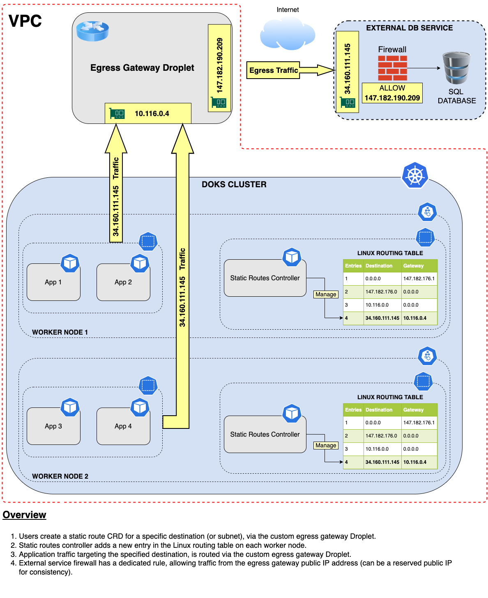
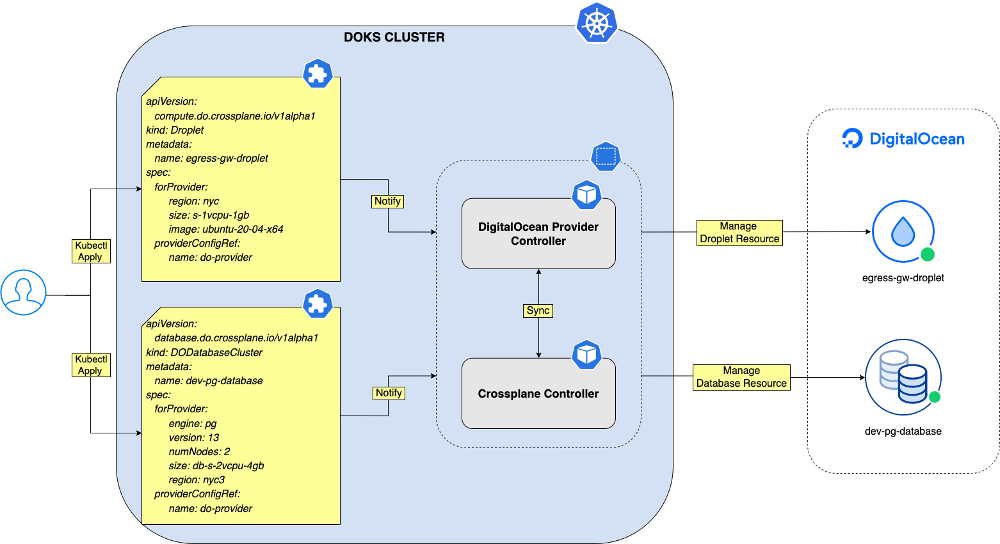
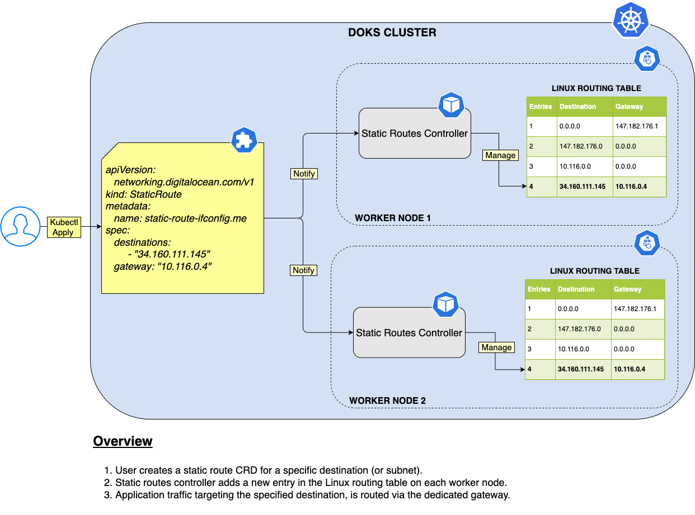

# Setting up a DOKS Egress Gateway using Crossplane and Static Routes Operator

## Overview

This blueprint will teach you to:

- Deploy and configure a DigitalOcean Droplet to act as an Egress gateway for your DOKS cluster, via [Crossplane](https://crossplane.io/).
- Deploy the [Static Routes Operator](https://github.com/digitalocean/k8s-staticroute-operator/), and configure static routes on your DOKS cluster worker nodes to egress workloads traffic to all public IP ranges (some restrictions apply), or to specific destinations only.

What is an Egress gateway and why is it important?

No matter where you have your resources (DOKS, Droplets, etc) deployed and running, they live in a private network, or VPC. The private network can be at home behind your ISP router, a private data center (on-premise), or in a cloud based environment. Main role of a VPC is to isolate different networks across different regions. Different VPCs can talk to each other via gateways (which is a router in essence).

Next, you need to get familiar with some terminology associated with inbound and outbound traffic, explained below:

- `Ingress` deals with `inbound` traffic, entering your VPC.
- `Egress` deals with `outbound` traffic, exiting your VPC.

When using Kubernetes, you manage incoming traffic via an [Ingress](https://kubernetes.io/docs/concepts/services-networking/ingress/) resource. But, for outgoing traffic there is no Egress resource in the Kubernetes spec. It can be implemented in the [CNI](https://github.com/containernetworking/cni) layer. For example Cilium, which is used by DOKS, has an [Egress Gateway](https://docs.cilium.io/en/v1.12/gettingstarted/egress-gateway/) spec. But, in case of DigitalOcean Kubernetes it's not quite stable or production ready yet.

There are three key aspects related to egress functionality:

1. Restricting egress traffic (not covered in this guide).
2. NAT outgoing.
3. Egress gateways.

Restricting egress (or outgoing) traffic is not covered in this blueprint, but in essence is a way of restricting outbound traffic for cluster Pods. Itt can be achieved via network policies, or firewalls. Firewall is the most common use case, where you allow connections only to a particular external IP address range, or to external services. Firewalls cannot distinguish between individual Pods, so the rules apply equally to all.

To build an egress gateway you need NAT functionality, implemented using a NAT gateway In essence, a NAT gateway sits at the edge of your private network (or VPC), through which outbound (or egress) traffic flows to the public internet. The main role of NAT, which stands for Network Address Translation, is to make network packets routable outside your private network (or VPC). The process needs to work in reverse order as well, meaning incoming response packets, need to be routed back to the originating private IP inside your VPC.

Your VPC uses a specific IP range (e.g. `10.116.0.0/20`), which needs to be translated to a public IP address so that packets can flow to a specific destination outside your private network (i.e. Internet). When a response packet comes in, the NAT layer must translate the public IP address from the packet header to the private network address of the host where traffic originated. This is what NAT is for.

A dedicated machine configured for this purpose is called a NAT gateway. When attached to a DOKS cluster, it can route all (or specific destinations only) traffic via a single routable public IP. Hence, we can call it an **Egress Gateway** in this context.

Moving further with a practical example, suppose that you need to use an external service such as a database. The database is usually located in another data center outside your private network (or VPC). The database administrator configured the database firewall so that only specific public IPs are allowed to connect. You already egress from your DOKS cluster nodes because they are connected directly to the Internet, but it's not practical because nodes are volatile, hence the public IPs will change.

As a consequence, on the other end (i.e. database service), you need to change network ACLs again to allow the new public IPs - not good. An egress gateway makes it so that all traffic coming from your application Pods inside the Kubernetes cluster, is seen as coming from a single public IP. That is, the public IP of the egress gateway. You can go even further and use a reserved IP for the egress gateway, so that it will never change.

Below is a diagram, showing the main setup for egressing DOKS cluster traffic to an external service (i.e. database):



## Table of Contents

- [Overview](#overview)
- [Prerequisites](#prerequisites)
- [Step 1 - Introducing Crossplane](#step-1---introducing-crossplane)
- [Step 2 - Installing Crossplane](#step-2---installing-crossplane)
- [Step 3 - Introducing Static Routes Operator](#step-3---introducing-static-routes-operator)
- [Step 4 - Installing Static Routes Operator](#step-4---installing-static-routes-operator)
- [Step 5 - Creating an Egress Gateway using Crossplane](#step-5---creating-an-egress-gateway-using-crossplane)
  - [Installing the DigitalOcean Provider Package](#installing-the-digitalocean-provider-package)
  - [Configuring the DigitalOcean Provider](#configuring-the-digitalocean-provider)
  - [Provisioning the Egress Gateway Droplet Resource](#provisioning-the-egress-gateway-droplet-resource)
- [Step 6 - Configuring Static Routes for your Egress Gateway](#step-6---configuring-static-routes-for-your-egress-gateway)
- [Step 7 - Testing the DOKS Cluster Egress Setup](#step-7---testing-the-doks-cluster-egress-setup)
- [Step 8 - Configuring the Static Routes Controller to Egress All Cluster Traffic](#step-8---configuring-the-static-routes-controller-to-egress-all-cluster-traffic)
- [Cleaning Up](#cleaning-up)
  - [Uninstalling the Static Routes Operator](#uninstalling-the-static-routes-operator)
  - [Deleting the Egress Gateway Droplet Resource](#deleting-the-egress-gateway-droplet-resource)
- [FAQ](#faq)
- [Troubleshooting](#troubleshooting)
- [Summary](#summary)

## Prerequisites

To complete this tutorial, you will need:

1. Basic knowledge on how to run and operate `DOKS` clusters. You can learn more [here](https://docs.digitalocean.com/products/kubernetes).
2. Basic knowledge on how to create and manage `Droplets`. You can learn more [here](https://docs.digitalocean.com/products/droplets).
3. Basic knowledge and experience with shell commands (e.g. `bash`).
4. [Kubectl](https://kubernetes.io/docs/tasks/tools) CLI, to interact with Kubernetes clusters. Make sure it is configured to point to your DOKS cluster, as explained [here](https://docs.digitalocean.com/products/kubernetes/how-to/connect-to-cluster/).
5. [Helm](https://www.helm.sh) (version 3.x is required), to install [Crossplane](https://crossplane.io/).
6. [Doctl](https://docs.digitalocean.com/reference/doctl/how-to/install) for interacting with DigitalOcean API.

## Step 1 - Introducing Crossplane

The main idea behind [Crossplane](https://crossplane.io/) is infrastructure management the Kubernetes way. It means, you can define and create CRDs using a declarative approach, and let Crossplane deal with the inner details. With Crossplane it's possible to create [Droplets](https://www.digitalocean.com/products/droplets), [Managed Databases](https://www.digitalocean.com/products/managed-databases), [Load Balancers](https://www.digitalocean.com/products/load-balancer), even [Kubernetes clusters (DOKS)](https://docs.digitalocean.com/products/kubernetes/), via the [DigitalOcean provider](https://github.com/crossplane-contrib/provider-digitalocean). Crossplane was designed with flexibility in mind, and it can be extended via [providers](https://crossplane.github.io/docs/v1.9/concepts/providers.html).

Next, it's important to understand some important concepts behind Crossplace to create DigitalOcean resources (e.g. Droplets). There are four main concepts to know about:

1. [Packages](https://crossplane.io/docs/v1.9/concepts/packages.html) allow Crossplane to be extended to include new functionality. You can think of packages the same way as Linux distributions pack and distribute applications. So, Crossplane packages distribute a set of CRDs and associated controllers to provision infrastructure resources.
2. [Providers](https://crossplane.github.io/docs/v1.9/concepts/providers.html) represent packages that enable Crossplane to provision infrastructure (e.g. [DigitalOcean Provider](https://github.com/crossplane-contrib/provider-digitalocean)).
3. [Managed Resources](https://crossplane.io/docs/v1.9/concepts/managed-resources.html) are Kubernetes custom resources (CRDs) that represent infrastructure primitives. For example, to provision a Droplet, you would use a [Droplet CRD](https://github.com/crossplane-contrib/provider-digitalocean/blob/main/examples/compute/droplet-user-data.yaml).
4. [Composite Resources](https://crossplane.io/docs/v1.9/concepts/composition.html) represents a special kind of custom resource. Main purpose is to compose together more managed resources into a higher level infrastructure unit which can be reused. For example, you can create a composite resource which consists of a managed database (e.g. [DigitalOcean PostgreSQL](https://docs.digitalocean.com/products/databases/postgresql/)) and a firewall resource, acting as a single deployable unit.

Below picture shows a simplified operational overview for Crossplane:



A typical Droplet CRD consumed by Crossplane looks like below:

```yaml
apiVersion: compute.do.crossplane.io/v1alpha1
kind: Droplet
metadata:
  name: egress-gw-nyc1
spec:
  forProvider:
    region: nyc1
    size: s-1vcpu-1gb
    image: ubuntu-20-04-x64
    sshKeys:
      - "7e:9c:b7:ee:74:16:a5:f7:62:12:b1:72:dc:51:71:85"
  providerConfigRef:
    name: do-provider-config
```

Explanations for the above configuration:

- `spec.forProvider` - defines all metadata required by the DigitalOcean provider to provision a new Droplet, such as: `region`, `size`, `image`, etc. Fields value map directly to the DigitalOcean Droplet specification. Also, if you have SSH keys deployed to your DigitalOcean account, you can specify the fingerprint in the `sshKeys` field from the spec.
- `spec.providerConfigRef` - specifies a reference to a provider configuration CRD (explained in [Step 3 - Creating an Egress Gateway using Crossplane](#step-3---creating-an-egress-gateway-using-crossplane)). The provider configuration instructs the Droplet CRD how to connect to the [DigitalOcean REST API](https://docs.digitalocean.com/reference/api/api-reference/), and what credentials to use (e.g. DO API token).

**Hint:**

You can also check this nice [CRD viewer](https://doc.crds.dev/github.com/crossplane-contrib/provider-digitalocean/compute.do.crossplane.io/Droplet/v1alpha1@v0.1.0) to see all the fields available for the Droplet kind, in a human readable format (available only for latest released version, which is [0.1.0](https://github.com/crossplane-contrib/provider-digitalocean/releases/tag/v0.1.0) at this time of writing).

Under the hood, Crossplane is delegating the real work to the DigitalOcean provider, which in turn will use the provider [REST API](https://docs.digitalocean.com/reference/api/api-reference/) to create a new droplet based on the requirements from the Droplet CRD spec field.

With all features presented above at hand, you are able to build your own cloud platform using one or multiple providers. The possibilities are almost limitless.

Please visit the [official documentation page](https://crossplane.io/docs/) for more information about the product and available features. The DigitalOcean provider home page for Crossplane is available [here](https://github.com/crossplane-contrib/provider-digitalocean).

In the next step, you will learn how to install and configure Crossplane for your DOKS cluster using Helm.

## Step 2 - Installing Crossplane

Crossplane is available as a Helm chart for easy installation, as well as for future upgrades. Follow below steps to install Crossplane, via Helm (version 3.x is required):

1. Add and update the Crossplane Helm repository:

    ```shell
    helm repo add crossplane-stable https://charts.crossplane.io/stable
    helm repo update 
    ```

2. Search the `crossplane-stable` Helm repository for available charts to install:

    ```shell
    helm search repo crossplane-stable
    ```

    The output looks similar to:

    ```text
    NAME                            CHART VERSION   APP VERSION     DESCRIPTION                                       
    crossplane-stable/crossplane    1.9.0           1.9.0           Crossplane is an open source Kubernetes add-on ...
    ```

3. Deploy Crossplane to your DOKS cluster:

    ```shell
    HELM_CHART_VERSION="1.9.0"

    helm install crossplane crossplane-stable/crossplane \
      --version "${HELM_CHART_VERSION}" \
      --namespace crossplane-system \
      --create-namespace
    ```

    **Note:**

    A specific version for the Crossplane Helm chart is used. In this case `1.9.0` is picked, which maps to the `1.9.0` version of the application. It’s good practice in general, to lock on a specific version. This helps to have predictable results, and allows versioning control via `Git`.

Now, check if the Crossplane Helm chart was deployed to your cluster:

```shell
helm ls -n crossplane-system
```

The output looks similar to (`STATUS` column value should be set to `deployed`):

```text
NAME        NAMESPACE          REVISION   UPDATED                                 STATUS     CHART               APP VERSION
crossplane  crossplane-system  1          2022-09-10 20:40:20.903871 +0300 EEST   deployed   crossplane-1.9.0    1.9.0 
```

Finally, verify Crossplane deployment status:

```shell
kubectl get deployments -n crossplane-system
```

The output looks similar to:

```text
NAME                       READY   UP-TO-DATE   AVAILABLE   AGE
crossplane                 1/1     1            1           3d19h
crossplane-rbac-manager    1/1     1            1           3d19h
provider-do-cad6fc11e8d5   1/1     1            1           3d19h
```

All pods must be up and running (check the `READY` column). In the next step, a short introduction is given about the static routes operator used in this guide.

## Step 3 - Introducing Static Routes Operator

The main role of the [Static Routes Operator](https://github.com/digitalocean/k8s-staticroute-operator) is to manage entries in the Linux routing table of each worker node, based on CRD spec. It is deployed as a `DaemonSet`, hence it will run on each node of your DOKS cluster.

Below diagram illustrates the operational concept:



Configuring static routes is done via `StaticRoute` CRDs. A typical example is shown below:

```yaml
apiVersion: networking.digitalocean.com/v1
kind: StaticRoute
metadata:
  name: static-route-ifconfig.me
spec:
  destinations: 
    - "34.160.111.145"
  gateway: "10.116.0.5"
```

Explanations for the above configuration:

- `spec.destinations` - A list of host IPs (or subnet CIDRs) to route through the gateway.
- `spec.gateway` - Gateway IP address used for routing the host(s)/subnet(s), specified in the `destinations` field.

Because the operator has access to the Linux routing table, special care must be taken and policies set so that only administrators have access. It's very easy to misconfigure the routing table, rendering the DOKS cluster unstable or unusable.

**VERY IMPORTANT TO REMEMBER:**

**You need to make sure to NOT ADD static routes containing CIDRs which overlap with DigitalOcean REST API endpoints (including DOKS) ! Doing so, will affect DOKS cluster functionality (Kubelets), and/or other internal services (e.g. Crossplane).**

In the next step, you will learn how to install and configure the static routes operator.

## Step 4 - Installing Static Routes Operator

Static routes operator is available as a single manifest file, and it is installed via `kubectl`. A dedicated namespace, named `static-routes`, is created as well. Please follow below steps to install the static routes controller:

1. Deploy the latest version release using kubectl. Below example is using the `1.0.0` version:

    ```shell
    kubectl apply -f https://raw.githubusercontent.com/digitalocean/k8s-staticroute-operator/main/releases/v1/k8s-staticroute-operator-v1.0.0.yaml
    ```

    **Hint:**

    You can check the latest version in the [releases](https://github.com/digitalocean/k8s-staticroute-operator/tree/main/releases/) path from the [k8s-staticroute-operator](https://github.com/digitalocean/k8s-staticroute-operator/) GitHub repo.

2. Check if operator Pods are up and running:

    ```shell
    kubectl get pods -l name=k8s-staticroute-operator -n static-routes
    ```

    Output looks similar to:

    ```text
    NAME                             READY   STATUS    RESTARTS   AGE
    k8s-staticroute-operator-9vp7g   1/1     Running   0          22m
    k8s-staticroute-operator-mlfff   1/1     Running   0          22m
    ```

3. Check operator logs - no exceptions should be reported:

    ```shell
    kubectl logs -f ds/k8s-staticroute-operator -n static-routes
    ```

    Output looks similar to:

    ```text
    [2022-08-24 14:42:13,625] kopf._core.reactor.r [DEBUG   ] Starting Kopf 1.35.6.
    [2022-08-24 14:42:13,625] kopf._core.engines.a [INFO    ] Initial authentication has been initiated.
    [2022-08-24 14:42:13,626] kopf.activities.auth [DEBUG   ] Activity 'login_via_pykube' is invoked.
    [2022-08-24 14:42:13,628] kopf.activities.auth [DEBUG   ] Pykube is configured in cluster with service account.
    [2022-08-24 14:42:13,629] kopf.activities.auth [INFO    ] Activity 'login_via_pykube' succeeded.
    [2022-08-24 14:42:13,629] kopf.activities.auth [DEBUG   ] Activity 'login_via_client' is invoked.
    [2022-08-24 14:42:13,631] kopf.activities.auth [DEBUG   ] Client is configured in cluster with service account.
    [2022-08-24 14:42:13,632] kopf.activities.auth [INFO    ] Activity 'login_via_client' succeeded.
    [2022-08-24 14:42:13,632] kopf._core.engines.a [INFO    ] Initial authentication has finished.
    [2022-08-24 14:42:13,789] kopf._cogs.clients.w [DEBUG   ] Starting the watch-stream for customresourcedefinitions.v1.apiextensions.k8s.io cluster-wide.
    [2022-08-24 14:42:13,791] kopf._cogs.clients.w [DEBUG   ] Starting the watch-stream for staticroutes.v1.networking.digitalocean.com cluster-wide.
    ...

If the output looks like above, you installed the static routes operator successfully. In the next step, you will learn how to provision your first egress gateway Droplet using Crossplane.

## Step 5 - Creating an Egress Gateway using Crossplane

To provision an Egress gateway Droplet on the DigitalOcean platform using Kubernetes and Crossplane, you need to follow a few steps:

1. Install the DigitalOcean provider package.
2. Configure the DigitalOcean provider so that it can talk with the provider REST API, and manage resources on your behalf.
3. Provision infrastructure using the designated CRDs, such as [Droplet](https://github.com/crossplane-contrib/provider-digitalocean/blob/main/package/crds/compute.do.crossplane.io_droplets.yaml) kind, [DODatabaseCluster](https://github.com/crossplane-contrib/provider-digitalocean/blob/main/package/crds/database.do.crossplane.io_dodatabaseclusters.yaml) kind, etc.

Next, you will learn how to accomplish each of the above steps, to better understand the concepts and separation of concerns.

**Important note:**

For each step, you will be using the `default` namespace in order to simplify testing. In practice, is recommended to create the resources in a dedicated namespace, with proper RBAC policies set.

### Installing the DigitalOcean Provider Package

In Crossplane terms, a provider package is a bundle of assets required by Crossplane to provide additional functionality, such as CRD manifests and associated controller(s). Under the hood everything is packed in a Docker image, and distributed as such.

Typical Crossplane provider package CRD looks like below:

```yaml
apiVersion: pkg.crossplane.io/v1
kind: Provider
metadata:
  name: provider-do
spec:
  package: "crossplane/provider-digitalocean:v0.1.0"
```

Explanations for the above configuration:

- `spec.package` - defines the provider package to download, which in essence is a Docker image, so it follows the standard naming convention.

To install the DigitalOcean provider used in this guide, please follow below steps:

1. Fetch the provider manifest from the `container-blueprints` repository, using `curl`:

    ```shell
    curl -O https://raw.githubusercontent.com/digitalocean/container-blueprints/main/DOKS-Egress-Gateway/assets/manifests/crossplane/do-provider-install.yaml
    ```

2. Open and inspect the manifest file, using a text editor of your choice (the default values are usually fine, unless you require a specific provider package version). For example, you can use [Visual Studio Code](https://code.visualstudio.com/), with YAML linting support:

    ```shell
    code do-provider-install.yaml
    ```

3. Apply the manifest using `kubectl`:

    ```shell
    kubectl apply -f do-provider-install.yaml
    ```

    Or, directly from the `container-blueprints` repo (if you're OK with the default values):

    ```shell
    kubectl apply -f https://raw.githubusercontent.com/digitalocean/container-blueprints/main/DOKS-Egress-Gateway/assets/manifests/crossplane/do-provider-install.yaml
    ```

Finally, check if the provider was installed successfully in your DOKS cluster:

```shell
kubectl get providers
```

The output looks similar to:

```text
NAME          INSTALLED   HEALTHY   PACKAGE                                                         AGE
provider-do   True        True      crossplane/provider-digitalocean:v0.2.0-rc.0.42.g0932045-main   4d17h
```

The `INSTALLED` and `HEALTHY` columns should both report `True`. Also, the `PACKAGE` should list the specific version used by the container-blueprints repo - `crossplane/provider-digitalocean:v0.2.0-rc.0.42.g0932045-main`.

**Important note:**

The provider package CRD used in the `containe-blueprints` repository is using a specific release from the main branch of the [crossplane-contrib/provider-digitalocean](https://github.com/crossplane-contrib/provider-digitalocean) repository. This is due to the fact that it contains some important fixes merged from the following PRs - [#60](https://github.com/crossplane-contrib/provider-digitalocean/pull/60), and [#61](https://github.com/crossplane-contrib/provider-digitalocean/pull/61).

Next, you will learn how to configure the DigitalOcean provider to have access to the DigitalOcean REST API, and manage resources on your behalf.

### Configuring the DigitalOcean Provider

The DigitalOcean provider package installed previously needs a `ProviderConfig` CRD to operate properly. In order to perform REST operations, it needs to authenticate against the DigitalOcean REST API endpoint. For that, a valid [DO API token](https://docs.digitalocean.com/reference/api/create-personal-access-token/) is required, stored in a Kubernetes secret (as a base64 encoded value).

Typical ProviderConfig CRD looks like below:

```yaml
apiVersion: do.crossplane.io/v1alpha1
kind: ProviderConfig
metadata:
  name: do-provider-config
spec:
  credentials:
    source: Secret
    secretRef:
      namespace: crossplane-system
      name: do-api-token
      key: token
```

Explanations for the above configuration:

- `spec.credentials.source` - defines a source where credentials are stored (e.g. Kubernetes Secret).
- `spec.credentials.secretRef` - tells the provider how to access the secret, such as what `namespace` it was created, its `name`, and what `key` contains the DO API token value as a base64 encoded string.

To install the DigitalOcean provider configuration used in this guide, please follow below steps:

1. Fetch the provider configuration manifest from the `container-blueprints` repository, using `curl`:

    ```shell
    curl -O https://raw.githubusercontent.com/digitalocean/container-blueprints/main/DOKS-Egress-Gateway/assets/manifests/crossplane/do-provider-config.yaml
    ```

2. Open and inspect the manifest file, using a text editor of your choice. For example, you can use [Visual Studio Code](https://code.visualstudio.com/), with YAML linting support:

    ```shell
    code do-provider-config.yaml
    ```

3. Replace the `<>` placeholders in the `do-api-token` Kubernetes Secret CRD. Please run below command, to generate the base64 encoded string from your DO API token:

    ```shell
    echo "<YOUR_DO_API_TOKEN_HERE>" | base64
    ```

4. Save the provider configuration file, and apply using `kubectl`:

    ```shell
    kubectl apply -f do-provider-config.yaml
    ```

Finally, check if the provider configuration resource was created successfully:

```shell
kubectl get providerconfigs -o wide
```

The output looks similar to:

```text
NAME                 AGE     SECRET-NAME
do-provider-config   4d18h   do-api-token
```

If the output looks like above, then you configured the DigitalOcean provider successfully. Notice the `SECRET-NAME` column value - it references the secret storing your DO API token.

Please note that all of the steps taken so far need to be performed only once. Once a provider is installed and configured, you can reference it in any resource you want to create, such as Droplets, managed databases, etc. The only intervention required over time, is when you need to upgrade a provider package to get new functionality, or if you need to update your DO API token.

Next, you will take the final step and provision the egress gateway droplet for your egress setup.

### Provisioning the Egress Gateway Droplet Resource

**IMPORTANT:**

**The egress gateway Droplet and DOKS cluster must be in the same VPC (or on the same network) for the whole setup to work !!!**

Once the DigitalOcean Crossplane provider supports specifying the VPC our Droplet is deployed to we can include this in our manifest. Until this time you must [set your default VPC](https://docs.digitalocean.com/products/networking/vpc/how-to/set-default-vpc/), this will ensure the Egress Gateway Droplet is deployed to the same VPC as your Kubernetes worker nodes.

Now that the DigitalOcean provider is installed and properly configured, you can proceed and create the actual Droplet resource to act as an egress gateway for the demo used this blueprint.

The Crossplane Droplet CRD used in this blueprint looks like below:

```yaml
apiVersion: compute.do.crossplane.io/v1alpha1
kind: Droplet
metadata:
  name: egress-gw-nyc1
spec:
  forProvider:
    region: nyc1
    size: s-1vcpu-1gb
    image: ubuntu-20-04-x64
    sshKeys:
      - "7e:9c:b7:ee:74:16:a5:f7:62:12:b1:72:dc:51:71:85"
    userData: |
      #!/usr/bin/env bash
      # Install dependencies
      echo iptables-persistent iptables-persistent/autosave_v4 boolean true | debconf-set-selections
      echo iptables-persistent iptables-persistent/autosave_v6 boolean true | debconf-set-selections
      apt-get update
      apt-get -y install iptables iptables-persistent curl

      # Enable IP forwarding
      echo "net.ipv4.ip_forward=1" >> /etc/sysctl.conf
      sysctl -p /etc/sysctl.conf

      # Configure iptables for NAT
      PRIVATE_NETWORK_INTERFACE_IP="$(curl -s http://169.254.169.254/metadata/v1/interfaces/private/0/ipv4/address)"
      PRIVATE_NETWORK_CIDR="$(ip route show src $PRIVATE_NETWORK_INTERFACE_IP | awk '{print $1}')"
      PUBLIC_INTERFACE_NAME="$(ip route show default | awk '{print $5}')"
      iptables -t nat -A POSTROUTING -s "$PRIVATE_NETWORK_CIDR" -o "$PUBLIC_INTERFACE_NAME" -j MASQUERADE
      iptables-save > /etc/iptables/rules.v4
  providerConfigRef:
    name: do-provider-config
```

The fields meaning is the same as explained at the beginning of this blueprint guide, when Crossplane was [introduced](#step-1---introducing-crossplane)). The only exception is the `spec.forProvider.userData` field. What this field does is, it allows you to specify custom cloud init scripts for the Droplet (e.g. `Bash` scripts, denoted by the first line value - `#!/usr/bin/env bash`).

In the above example, the cloud init script main role is to initialize the Droplet to act as a NAT gateway. The example is heavily based on this [guide](https://docs.digitalocean.com/products/networking/vpc/how-to/configure-droplet-as-gateway/) provided by DigitalOcean.

1. The first line denotes the fact that the cloud init script needs to be interpreted as a Bash script -  `#!/usr/bin/env bash`.
2. Next, the required packages are installed, such as: `iptables`, `iptables-persistent` (persists iptables rules on reboot), etc. Please bear in mind that the installation commands are Linux distribution specific (above example is Ubuntu specific, which in turn is based on Debian).
3. Then, IP forwarding is enabled for the Linux Kernel via the `net.ipv4.ip_forward` sysctl setting. Configuration is persisted in the `/etc/sysctl.conf` file to survive machine reboots.
4. Next, iptables is configured with required NAT rules, to provide egress functionality in combination with IP forwarding.
5. Finally, NAT rules are saved using the `iptables-save` command, to persist on reboots.

To create the egress gateway Droplet via Kubernetes, please follow below steps:

1. Fetch the Droplet CRD manifest from the `container-blueprints` repository, using `curl`:

    ```shell
    curl -O https://raw.githubusercontent.com/digitalocean/container-blueprints/main/DOKS-Egress-Gateway/assets/manifests/crossplane/egress-gw-droplet.yaml
    ```

2. Open and inspect the manifest file, using a text editor of your choice (the default values are usually fine, unless you require something specific). For example, you can use [Visual Studio Code](https://code.visualstudio.com/), with YAML linting support:

    ```shell
    code egress-gw-droplet.yaml
    ```

    **Hint:**

    If you have specific SSH keys you want to add at Droplet creation time, you can do so by uncommenting the `sshKeys` field from the spec. Then, replace the `<>` placeholders with your SSH key fingerprint. To list the available SSH keys associated with your account and their fingerprint, you can do so by issuing the following command - `doctl compute ssh-key list`.

3. Save and apply the manifest using `kubectl`:

    ```shell
    kubectl apply -f egress-gw-droplet.yaml
    ```

    Or, directly from the `container-blueprints` repo (if you're OK with the default values):

    ```shell
    kubectl apply -f https://raw.githubusercontent.com/digitalocean/container-blueprints/main/DOKS-Egress-Gateway/assets/manifests/crossplane/egress-gw-droplet.yaml
    ```

Finally, check if the Droplet Kubernetes resource was created successfully:

```shell
kubectl get droplets -o wide
```

The output looks similar to:

```text
NAME          PRIVATE IPV4   PUBLIC IPV4      READY   REGION   SIZE          SYNCED
egress-gw-nyc1   10.116.0.4     192.81.213.125   True    nyc1     s-1vcpu-1gb   True
```

**Important notes:**

- Please bear in mind that it takes some time for the Droplet to be provisioned, so please be patient.
- The `PRIVATE IPV4` and `PUBLIC IPV4` columns will receive values only after the Droplet is successfully provisioned.
- You can always check how the Droplet resource is progressing, or if something goes wrong by inspecting the `Events` output from below command:

    ```shell
    kubectl describe droplet egress-gw-nyc1
    ```

The `READY` and `SYNCED` columns should print `True`. If the output looks like above, you configured the Droplet CRD successfully. Also, if you navigate to the Droplets web panel from your DigitalOcean account, you should see the new resource created. You should receive an email as well, with additional details about your newly created Droplet.

Finally, you can check if the cloud init script ran successfully, and did the required changes to enable IP forwarding and NAT functionality. Please follow below steps (all commands must be run as root, or via sudo):

1. Check if IP forwarding is set:

    ```shell
    cat /proc/sys/net/ipv4/ip_forward

    # Should output: 1, meaning it's enabled
    ```

2. Check if NAT is set via iptables:

    ```shell
    iptables -L -t nat
    ```

    The output looks similar to (the `POSTROUTING` chain should print the `MASQUERADE` target for your **VPC subnet**):

    ```text
    ...
    Chain POSTROUTING (policy ACCEPT)
    target     prot opt source               destination         
    MASQUERADE  all  --  10.116.0.0/20        anywhere
    ```

If all checks pass, you configured the egress gateway Droplet successfully. Next, you will learn how to define and create static routes for single as well as multiple destinations, using the egress gateway created earlier via Crossplane.

## Step 6 - Configuring Static Routes for your Egress Gateway

The [sample CRDs](assets/manifests/static-routes/) provided in this blueprint create a static route to two different websites which report back your public IP - [ifconfig.me/ip](http://ifconfig.me/ip), and [ipinfo.io/ip](http://ipinfo.io/ip).

To test the setup, download each sample manifest:

```shell
# Example for ifconfig.me
curl -O https://raw.githubusercontent.com/digitalocean/container-blueprints/main/DOKS-Egress-Gateway/assets/manifests/static-routes/ifconfig-me-example.yaml

# Example for ipinfo.io
curl -O https://raw.githubusercontent.com/digitalocean/container-blueprints/main/DOKS-Egress-Gateway/assets/manifests/static-routes/ipinfo-io-example.yaml
```

After downloading the manifests, make sure to replace the `<>` placeholders in each manifest file. To find out the private IPv4 address of your egress gateway droplet, please run below command (assuming the Droplet name is `egress-gw-nyc1`):

```shell
kubectl get droplet egress-gw-nyc1 -o jsonpath="{.status.atProvider.privateIPv4}"
```

Next, save changes, and apply each manifest using `kubectl`:

```shell
# Example for ifconfig.me
kubectl apply -f ifconfig-me-example.yaml

# Example for ipinfo.io
kubectl apply -f ipinfo-io-example.yaml
```

**Hint:**

Above command will create the static route custom resources in the `default` namespace. In production environments (and not only), it's best to have a dedicated namespace with RBAC policies set.

Next, check if the static route resources were created:

```shell
kubectl get staticroutes -o wide
```

The output looks similar to (egress gateway has private IP `10.116.0.5` in below example):

```text
NAME                       DESTINATIONS         GATEWAY      AGE
static-route-ifconfig.me   ["34.160.111.145"]   10.116.0.5   7m2s
static-route-ipinfo.io     ["34.117.59.81"]     10.116.0.5   4s
```

Next, check if the static route resources were created:

```shell
kubectl get staticroutes -o wide
```

The output looks similar to:

```text
NAME                       DESTINATIONS         GATEWAY      AGE
static-route-ifconfig.me   ["34.160.111.145"]   10.116.0.5   7m2s
static-route-ipinfo.io     ["34.117.59.81"]     10.116.0.5   4s
```

Finally, check if the custom static routes were created on each worker node, after SSH-ing:

```shell
route -n
```

The output looks similar to (the irrelevant lines were omitted from the output for better visibility):

```text
Kernel IP routing table
Destination     Gateway         Genmask         Flags Metric Ref    Use Iface
0.0.0.0         206.81.0.1      0.0.0.0         UG    0      0        0 eth0
...
34.117.59.81    10.116.0.5      255.255.255.255 UGH   0      0        0 eth1
34.160.111.145  10.116.0.5      255.255.255.255 UGH   0      0        0 eth1
...
```

**Hints:**

1. You can check each static route status by describing the resource. Taking `static-route-ifconfig.me` as an example:

    ```shell
    kubectl describe staticroute static-route-ifconfig.me
    ```

    The output looks similar to (only last relevant lines are shown for simplicity):

    ```text
    ...
    Spec:
      Destinations:
        34.160.111.145
      Gateway:  10.116.0.4
    Status:
      create_fn:
        Destination:  34.160.111.145
        Gateway:      10.116.0.4
        Status:       Ready
    Events:           <none>
    ```

    Looking at the above output, you can see each route details including status (`Ready` or `NotReady`), in the `Status` field.

2. To see all events emitted by the static routes controller, you can use below command:

    ```shell
    kubectl get events -n static-routes
    ```

3. For further troubleshooting, you can check the static routes controller logs:

    ```shell
    # Fetch all logs from the static routes controller and redirect to a file
    kubectl logs -n static-routes ds/k8s-staticroute-operator > k8s-staticroute-operator.log

    # Use vistual studio code, or your favourite text editor to inspect the logs
    code k8s-staticroute-operator.log
    ```

## Step 7 - Testing the DOKS Cluster Egress Setup

To test your egress setup, you need to check if all the `requests` originating from your `DOKS` cluster travel via a single node - the `Egress Gateway`. The simplest way to test, is by making a `curl` request to [ifconfig.me/ip](https://ifconfig.me/ip), and see if the response contains your `Egress Gateway public IP` address.

First, you need to create the `curl-test` pod in your `DOKS` cluster (the `default` namespace is used):

```shell
kubectl apply -f https://raw.githubusercontent.com/digitalocean/container-blueprints/main/DOKS-Egress-Gateway/assets/manifests/curl-test.yaml
```

Verify that the pod is up and running (in the `default` namespace):

```shell
kubectl get pods
```

The output looks similar to (`curl-test` pod `Status` should be `Running`):

```text
NAME       READY   STATUS    RESTARTS   AGE
curl-test   1/1     Running   0          7s
```

Then, perform a `HTTP` request to [ifconfig.me](https://ifconfig.me), from the `curl-test` pod:

```shell
kubectl exec -it curl-test -- curl ifconfig.me
```

The output looks similar to:

```text
192.81.213.125
```

The resulting IP address that gets printed should be the `public IP` address that was assigned to your egress gateway droplet. You can check your NAt gateway Droplet public IPv4 address via `kubectl`:

```shell
kubectl get droplet egress-gw-nyc1 -o jsonpath="{.status.atProvider.publicIPv4}"
```

## Step 8 - Configuring the Static Routes Controller to Egress All Cluster Traffic

**VERY IMPORTANT TO REMEMBER:**

**You need to make sure to NOT ADD static routes containing CIDRs which overlap with DigitalOcean REST API endpoints (including DOKS) ! Doing so, will affect DOKS cluster functionality (Kubelets), and/or other internal services (e.g. Crossplane).**

So far you configured the static routes controller to egress cluster traffic for specific destinations only. But, you can also use the static routes controller to egress cluster traffic for multiple destinations (or public CIDRs) as well (some limitations apply though, and explained below).

If changing the default gateway in the Linux routing table on each node to point to the custom egress gateway private IP, then you can route all outbound traffic via the custom gateway. But, there's an issue with this approach - the internal services running in the cluster which need access to DigitalOcean public API will not work anymore, thus making it unstable. Also, resources provisioned via Crossplane won't work as well.

To solve the above issue, you can use another approach where you create static routes for all public CIDRs, except the ones which overlap with DigitalOcean API public endpoints. There is a ready to use sample provided in this tutorial which allows to achieve this goal, called [public-egress-example](assets/manifests/static-routes/public-egress-example.yaml).

Usually, you need to set this only once, but please be mindful of what IP ranges you use. The static routes controller cannot distinguish if some ranges overlap or not, or if some are overlapping with DigitalOcean REST API public endpoints. Just to be safe, you can have a small cluster somewhere, which is safe to discard if something goes bad. The overlapping CIDRs are already commented in the provided [example](assets/manifests/static-routes/public-egress-example.yaml). You can subdivide those CIDRs even further, and remove the exact ranges that overlap with DigitalOcean REST API endpoints.

Follow below steps to apply the public CIDRs example from this guide:

1. Download the [public-egress.yaml](assets/manifests/static-routes/public-egress-example.yaml) file to your local machine:

    ```shell
    curl -O https://raw.githubusercontent.com/digitalocean/container-blueprints/main/DOKS-Egress-Gateway/assets/manifests/static-routes/public-egress-example.yaml
    ```

2. Open and inspect the manifest file, using a text editor of your choice (the default values are usually fine, unless you require something specific). For example, you can use [Visual Studio Code](https://code.visualstudio.com/), with YAML linting support:

    ```shell
    code public-egress-example.yaml
    ```

3. Replace the `<>` placeholders for the `gateway` spec field, then save and apply the manifest using `kubectl`:

    ```shell
    kubectl apply -f public-egress-example.yaml
    ```

Now, check if all routes were created by SSH-ing to each node, and run `route -n`. All entries from the [public-egress.yaml](assets/manifests/static-routes/public-egress-example.yaml) manifest should be present. Also, you can use `kubectl describe` on the resource, and check its status.

**Hint:**

How to check all public IP address ranges used by DigitalOcean? There are two options available:

1. The [ipinfo.io database](https://ipinfo.io/AS14061) of known public IP address ranges for DigitalOcean.
2. The [SecOps-Institute](https://github.com/SecOps-Institute/Digitalocean-ASN-and-IPs-List) GitHub page (stores a list of all Digitalocean Servers using the ASN Numbers from RADB Lookups).

## Cleaning Up

If you want to clean up all the resources associated with this guide, you can do so for each major component, as follows.

### Uninstalling the Static Routes Operator

To clean up the operator and associated resources, please run the following `kubectl` command (make sure you're using the same release version as in the install step):

```shell
kubectl delete -f https://raw.githubusercontent.com/digitalocean/k8s-staticroute-operator/main/releases/v1/k8s-staticroute-operator-v1.0.0.yaml
```

**Note:**
Above command will delete the associated namespace as well (`static-routes`). Make sure to backup your CRDs first, if needed later.

The output looks similar to:

```text
customresourcedefinition.apiextensions.k8s.io "staticroutes.networking.digitalocean.com" deleted
serviceaccount "k8s-staticroute-operator" deleted
clusterrole.rbac.authorization.k8s.io "k8s-staticroute-operator" deleted
clusterrolebinding.rbac.authorization.k8s.io "k8s-staticroute-operator" deleted
daemonset.apps "k8s-staticroute-operator" deleted
```

Check the routes on each worker node, after SSH-ing:

```shell
route -n
```

The custom static routes should not be present in the routing table output.

Finally, the `curl-test` pod should report back the public IP of the worker node where it runs:

```shell
# Inspect the node where the curl-test Pod runs:
kubectl get pod curl-test -o wide
```

The output looks similar to (write down the node name from the `NODE` column):

```shell
NAME        READY   STATUS    RESTARTS      AGE    IP             NODE            NOMINATED NODE   READINESS GATES
curl-test   1/1     Running   2 (45m ago)   165m   10.244.0.140   basicnp-7micg   <none>           <none>
```

Above example reports - `basicnp-7micg`.

Check the worker node public IP:

```shell
kubectl get nodes -o wide
```

The output looks similar to (note the public IP of the associated node where the `curl-test` Pod runs):

```text
NAME            STATUS   ROLES    AGE     VERSION   INTERNAL-IP   EXTERNAL-IP      OS-IMAGE                       KERNEL-VERSION          CONTAINER-RUNTIME
basicnp-7micg   Ready    <none>   3h20m   v1.23.9   10.116.0.2    206.189.231.90   Debian GNU/Linux 10 (buster)   5.10.0-0.bpo.15-amd64   containerd://1.4.13
basicnp-7micw   Ready    <none>   3h20m   v1.23.9   10.116.0.3    206.81.2.154     Debian GNU/Linux 10 (buster)   5.10.0-0.bpo.15-amd64   containerd://1.4.13
```

Above example reports - `206.189.231.90`.

Exec the `ifconfig.me/ip` curl:

```shell
kubectl exec -it curl-test -- curl ifconfig.me/ip
```

The output looks similar to:

```text
206.189.231.90
```

The response should include the **original public IP of the worker node** where the `curl-test` Pod runs.

### Deleting the Egress Gateway Droplet Resource

Removing the egress gateway droplet is just a matter of deleting the associated CRD (**please bear in mind that this process is destructive, and you cannot revert back**):

```shell
kubectl delete -f https://raw.githubusercontent.com/digitalocean/container-blueprints/main/DOKS-Egress-Gateway/assets/manifests/crossplane/egress-gw-droplet.yaml
```

After running above command, the associated Droplet resource should be destroyed and removed from your DigitalOcean account.

## FAQ

1. **Q:** What Linux table ID does the static routes operator use?

   **A:** The static routes operator acts on the main table (ID 254).
2. **Q:** What happens if I define same routes or overlapping subnets via separate StaticRoute CRDs?

   **A:** The static routes operator doesn't perform checks across CRDs (tracked via [#13](https://github.com/digitalocean/k8s-staticroute-operator/issues/13) on operator's GitHub repo). So, it is possible to override static routes via different CRDs.
3. **Q:** Is it possible to override routes created by the system (e.g. Cilium)?

   **A:** Yes, it is if updating existing CRDs. This doesn't happen when the CRD is created for the first time though. In the end, it's more safe to have a list of protected IPs/subnets defined in a ConfigMap. The operator will read the list at startup (or whenever it changes), and will not let users apply those routes (tracked via [#11](https://github.com/digitalocean/k8s-staticroute-operator/issues/11) on operator's GitHub repo).
4. **Q:** Am I allowed to change the default gateway?

   **A:** No. It is considered an unsafe operation which can cause trouble (tracked via [#6](https://github.com/digitalocean/k8s-staticroute-operator/issues/6) on operator's GitHub repo).

## Troubleshooting

### Kubectl Freezes on Object Deletion

Whenever you delete a resource in Kubernetes, the associated controller puts a **finalizer** on the respective object in the metadata field. Bellow snippet shows the `Finalizers` field in the Static Route CRD:

```yaml
Name:         staticroutes.networking.digitalocean.com
Namespace:    
Labels:       <none>
Annotations:  provider: digitalocean
API Version:  apiextensions.k8s.io/v1
Kind:         CustomResourceDefinition
Metadata:
  Creation Timestamp:  2022-09-19T15:05:34Z
  Deletion Timestamp:  2022-09-27T14:51:10Z
  Finalizers:
    customresourcecleanup.apiextensions.k8s.io
...
```

Kubernetes checks for the finalizer field first and if found, it will not delete the resource from the cluster until the associated controller finishes its job internally. If everything goes as planned, the controller removes the finalizer field from the object, and then and only then, Kubernetes moves forward with the actual deletion of the resource.

**The main role of a finalizer is to allow the associated controller finish its job internally before actual object deletion.**

If for some reason controller logic is unable to process the request and remove the finalizer field, the resource hangs in a `Terminating` state. Then, `kubectl` freezes because the Kubernetes API is not able to process the request.

As a side effect, this warning is reported in the static routes controller logs:

```text
...
[2022-09-27 14:58:11,405] kopf._core.reactor.o [WARNING ] Non-patchable resources will not be served: {staticroutes.v1.networking.digitalocean.com}
...
```

**Why this happens and how do I recover?**

It can happen for various reasons - one such example is when the controller is down because of a upgrade, hence it is unable to process requests. In this case the CRD remains in an inconsistent state, and the only way to recover is via:

```shell
kubectl patch staticroute <YOUR_STATIC_ROUTE_RESOURCE_NAME_HERE> -p '{"metadata": {"finalizers": []}}' --type merge
```

Above command removes the finalizer field from the resource, thus allowing Kubernetes proceed with actual object deletion. As a consequence, the Linux routing table still holds the old route entries. You have several options here:

1. Manually delete the old entries. This can be a daunting task if many routes and nodes are implied.
2. Restart the operator, and allow it to remove the finalizers. Issue the following command to perform a rollout for the static routes operator DaemonSet - `kubectl rollout restart -n static-routes ds/k8s-staticroute-operator`.
3. As a last resort, re-deploy the static routes controller, and re-apply the original static route CRDs. Then, delete the CRDs. If everything goes as planned, the static routes controller takes care of the rest.

## Summary

In this tutorial you learned how to use Crossplane to create and manage an egress Gateway resource for your DOKS cluster. This way, external services (e.g. database), will see a single source IP in the packets coming from your DOKS cluster, thus making firewall rules management easier on the other end. Also, you learned how to use the static routes operator, to manage specific routes for the egress functionality.

Additional resources:

- [Static Routes Operator](https://github.com/digitalocean/k8s-staticroute-operator) project page.
- [Crossplane Guides](https://crossplane.io/docs/v1.9/guides/guides.html) page.
- [DigitalOcean Droplets as NAT Gateways](https://docs.digitalocean.com/products/networking/vpc/how-to/configure-droplet-as-gateway/) tutorial.
