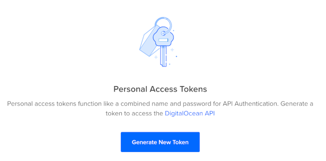
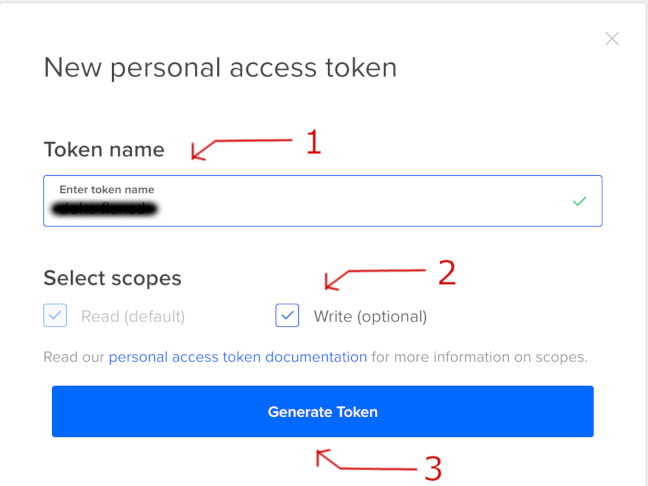
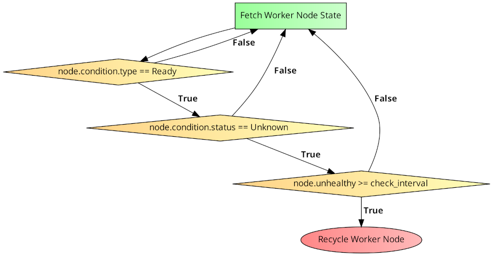

# DigitalOcean Kubernetes Automatic Node Repair

## Problem Description

`DigitalOcean Kubernetes` (DOKS) cluster pool nodes can transition to an unhealthy state (`NotReady` or `Unknown`) by user will or by accident (overloading, deleting `kube-system` stuff, `kubelet` issues).

## Solution:

An auto-repair mechanism is needed in place so that the affected nodes from the cluster pool will be replaced automatically without user intervention.

Possible ways of achieving this:
 - [Digital Mobius](https://github.com/Qovery/digital-mobius)
 - [Draino](https://github.com/planetlabs/draino) and [Kubernetes Cluster Autoscaler](https://github.com/kubernetes/autoscaler/tree/master/cluster-autoscaler)

[Digital Mobius](https://github.com/Qovery/digital-mobius) project was chosen because it's specifically designed for the usecase described in this tutorial (more details below).

Main reasons to consider `Digital Mobius`:
 - Specifically built for `DOKS` cluster nodes recycling.
 - Open source (written in [Go](https://golang.org)).
 - Simplicity and ease of configuration.
 - [Helm chart](https://github.com/Qovery/digital-mobius/tree/main/charts/Digital-Mobius) ready available for easy `K8S` deployment (or [artifacthub.io](https://artifacthub.io/packages/helm/digital-mobius/digital-mobius))

A simplified diagram of the internal flow (logic) is provided as well. Finally, we will have it deployed to a running `DOKS` cluster and observe how well it handles cluster nodes recycling.

## DOKS Cluster Setup

**Note:**

Steps **1** to **5** can be skipped if you already have a cluster running in place and the `kubectl context` configured.

1. A `DigitalOcean` [account](https://cloud.digitalocean.com) is required to create the access keys and provision the `DOKS` cluster.
2. An `API access token` for managing the `DOKS` cluster has to be created next. From your `DigitalOcean` account, go to the [API](https://cloud.digitalocean.com/account/api) section to generate the token:

    

    Give it a name and ensure that the `Write` scope is checked:

    

    In the end, we should have something like this:

    

    Copy the token value and save it in a local environment variable as we will need it later on (make sure to replace the `<>` placeholder):

    ```bash
    export DIGITAL_OCEAN_TOKEN="<your_do_personal_access_token>"
    ```
3. In order to interact with the cluster from the CLI `doctl` has to be installed. For example, use the following commands on MacOS:
    
    ```bash
    brew info doctl
    brew install doctl
    ```
4. If `doctl` authentication hasn't been set up yet please do it now via:
   
    ```bash
    doctl auth init --access-token "$DIGITAL_OCEAN_TOKEN"
    ```
    The output looks similar to the following (token value is masked):
    ```
    Using token [*****************************************]

    Validating token... OK
    ```
5. Spin up the cluster and wait for it to be provisioned:

    ```bash
    export CLUSTER_NAME="mobius-testing-cluster"
    export CLUSTER_REGION="lon1"                  # grab a region that's more close to you from: doctl k8s options regions
    export CLUSTER_NODE_SIZE="s-2vcpu-4gb"
    export CLUSTER_NODE_COUNT=2                   # need 2 nodes at least to test the real world scenario
    export CLUSTER_NODE_POOL_NAME="mbt-np"
    export CLUSTER_NODE_POOL_TAG="mbt-cluster"
    export CLUSTER_NODE_POOL_LABEL="type=basic"

    doctl k8s cluster create "$CLUSTER_NAME" \
      --auto-upgrade=false \
      --node-pool "name=${CLUSTER_NODE_POOL_NAME};size=${CLUSTER_NODE_SIZE};count=${CLUSTER_NODE_COUNT};tag=${CLUSTER_NODE_POOL_TAG};label=${CLUSTER_NODE_POOL_LABEL}" \
      --region "$CLUSTER_REGION"
    ```

    The output looks similar to the following:
    ```
    Notice: Cluster is provisioning, waiting for cluster to be running
    ......................................................................
    Notice: Cluster created, fetching credentials
    Notice: Adding cluster credentials to kubeconfig file found in "~/.kube/config"
    Notice: Setting current-context to do-lon1-mobius-testing-cluster
    ID                                      Name                       Region    Version        Auto Upgrade    Status     Node Pools
    11bdd0f1-8bd0-42dc-a3af-7a83bc319295    mobius-testing-cluster     lon1      1.21.2-do.2    false           running    basicnp
    ```

6. Get worker nodes status:

    ```bash
    kubectl get nodes
    ```

    The output looks similar to the following:
    ```
    NAME            STATUS   ROLES    AGE     VERSION
    basicnp-8k4ep   Ready    <none>   2m52s   v1.21.2
    basicnp-8k4es   Ready    <none>   2m16s   v1.21.2
    ```
    ### Note:

      If for some reason the `kubectl` context was not set properly we can always fix it via:
      
      ```bash
      doctl k8s cluster kubeconfig save "$CLUSTER_NAME"
      ```

## Digital Mobius

### Overview

[Digital Mobius](https://github.com/Qovery/digital-mobius) is an open source project written in the `Go` language which can automatically recycle unhealthy nodes from a `DigitalOcean Kubernetes` cluster (aka `DOKS`).

### How it Works

The logic inside the application is watching for `DOKS` cluster nodes that are in an unhealthy state at a regular interval specified by the user. As described in the official `Kubernetes` documentation, a `node` is considered to be `unhealthy` if the [Node Condition](https://kubernetes.io/docs/concepts/architecture/nodes/#condition) is set to `Ready` and the status to `False` or `Unknown`. `Digital Mobius` looks for the `Unknown` status which is a result of the `master node` not being able to communicate with the worker node via the `kubelet`. It also provides a user configurable flag that specifies how much time has to pass before an unhealthy node needs to be recycled. If all the conditions enumerated earlier are met then the affected node(s) will be re-created. It does so via a call to the [Delete Kubernetes Node](https://docs.digitalocean.com/reference/api/api-reference/#operation/delete_kubernetes_node) `REST API` provided by `DigitalOcean`.

Below is a simplified diagram showing how `Digital Mobius` checks the worker node(s) state:



### Configuration Overview

In order for the application to work it needs a set of `environment variables` to be configured and available as seen in the [Helm Chart](https://github.com/Qovery/digital-mobius/blob/main/charts/Digital-Mobius/values.yaml) values file (explanations inline):

```
LOG_LEVEL: "info"
DELAY_NODE_CREATION: "10m"                                  # A worker node gets recycled after being unhealthy for this period of time
DIGITAL_OCEAN_TOKEN: "<your_digital_ocean_api_token>"       # Personal DO API token value
DIGITAL_OCEAN_CLUSTER_ID: "<your_digital_ocean_cluster_id>" # DOKS cluster ID that needs to be monitored
```

The most important values that we need to provide here is the DigitalOcean `API token`, the `Cluster ID` and the `Node Creation Delay` time interval which can be expressed in seconds or minutes using the appropriate suffix - e.g.: `10s`, `10m`, etc.

**Note:**

Having a value that's too low for the `DELAY_NODE_CREATION` option will interfere with the time interval needed for a node to become ready and available after it gets recycled. From real world tests it can take several minutes to complete or even more, so please choose a value that's appropriate. A good starting point is `10m` - hence the value used in this tutorial.

### Deployment Steps

We're going to use `Helm` to perform the deployment in a few very easy steps as follows:

1. Add the required `Helm` repository first:

    ```bash
    helm repo add digital-mobius https://qovery.github.io/digital-mobius
    ```
2. Fetch the cluster `ID` that you want to monitor for node failures:

    ```bash
    doctl k8s cluster list
    export DIGITAL_OCEAN_CLUSTER_ID="<your_cluster_id_here>"
    ```

    **Hint:**

    If you have only one cluster then it's just a matter of (`jq` is needed first - e.g.: on MacOS `brew install jq`):
    ```bash
    export DIGITAL_OCEAN_CLUSTER_ID="$(doctl k8s cluster list -o json | jq -r '.[].id')"
    echo "$DIGITAL_OCEAN_CLUSTER_ID"
    ```
3. Make sure that the `DigitalOcean` token is set if not already:

    ```bash
    export DIGITAL_OCEAN_TOKEN="<your_do_personal_access_token>"
    echo "$DIGITAL_OCEAN_TOKEN"
    ```
4. Start the actual deployment in a dedicated namespace (in this example `maintenance` is used):

    ```bash
    helm install digital-mobius digital-mobius/digital-mobius --version 0.1.4 \
      --set environmentVariables.DIGITAL_OCEAN_TOKEN="$DIGITAL_OCEAN_TOKEN" \
      --set environmentVariables.DIGITAL_OCEAN_CLUSTER_ID="$DIGITAL_OCEAN_CLUSTER_ID" \
      --set enabledFeatures.disableDryRun=true \
      --namespace maintenance --create-namespace
    ```
    **Note:**

    The `enabledFeatures.disableDryRun` option is meant to enable or disable the `DRY RUN` mode of the tool (in the above example is disabled, meaning it will recycle the cluster nodes and not just pretend). This is helpful if you want to test it first without performing any changes to the real cluster nodes.

    Accepted values: `true | false` (`true` means `DRY_RUN` mode is `disabled`). Please note the `inversed logic`.

5. Check the application:

    List deployments:

    ```bash
    helm ls -n maintenance
    ```
    The output looks similar to the following:
    ```
    NAME            NAMESPACE       REVISION        UPDATED                                 STATUS          CHART                   APP VERSION
    digital-mobius  maintenance     1               2021-08-06 11:24:10.131055 +0300 EEST   deployed        digital-mobius-0.1.4    0.1.4 
    ```

    Verify running Pod(s):

    ```bash
    kubectl get pods -n maintenance
    ```
    The output looks similar to the following:
    ```
    NAME                             READY   STATUS    RESTARTS   AGE
    digital-mobius-55fbc9fdd-dzxbh   1/1     Running   0          8s
    ```

    Inspect the logs:

    ```bash
    kubectl logs -l app.kubernetes.io/name=digital-mobius -n maintenance
    ```
    The output looks similar to the following:
    ```
        _ _       _ _        _                      _     _           
     __| (_) __ _(_) |_ __ _| |     _ __ ___   ___ | |__ (_)_   _ ___ 
    / _` | |/ _` | | __/ _` | |    | '_ ` _ \ / _ \| '_ \| | | | / __|
    | (_|| | (_| | | || (_| | |    | | | | | | (_) | |_) | | |_| \__ \
    \__,_|_|\__, |_|\__\__,_|_|    |_| |_| |_|\___/|_.__/|_|\__,_|___/
            |___/                                                     
    time="2021-08-06T08:29:52Z" level=info msg="Starting Digital Mobius 0.1.4
    ```

    Great! This means we're all set. Let's create some chaos in the cluster!

## Testing the Digital Mobius Setup

We want to disconnect one or more of the cluster nodes in order to test the `Digital Mobius` setup. In order to achieve this we must kill the `kubelet` service from the corresponding worker node(s). There's a pretty easy way of doing it via [doks-debug](https://github.com/digitalocean/doks-debug). Essentially what it does is to create some `debug` Pods which run containers in `privileged` mode. Then you can `exec` into one of the running containers and get access to the worker node system services. More details on how it does its magic can be found on the [doks-debug](https://github.com/digitalocean/doks-debug) project page.

`Digital Mobius` was already deployed in the previous section so we must take care of the `doks-debug` deployment now.

### DOKS Debug Deployment

1. Create the `DaemonSet` first. This will spin up the `doks-debug` Pods in the `kube-system` namespace:
   
   ```bash
   kubectl apply -f https://raw.githubusercontent.com/digitalocean/doks-debug/master/k8s/daemonset.yaml
   ```

2. Verify the `DaemonSet`:

   ```bash
   kubectl get ds -n kube-system
   ```

   The output looks similar to the following (notice the `doks-debug` entry):

   ```
   NAME            DESIRED   CURRENT   READY   UP-TO-DATE   AVAILABLE   NODE SELECTOR                 AGE
   cilium          2         2         2       2            2           <none>                        22h
   csi-do-node     2         2         2       2            2           <none>                        2d21h
   do-node-agent   2         2         2       2            2           beta.kubernetes.io/os=linux   2d21h
   doks-debug      2         2         2       2            2           <none>                        112m
   kube-proxy      2         2         2       2            2           <none>                        44h
   ```

3. Verify the `doks-debug` Pods:

   ```bash
   kubectl get pods -l name=doks-debug -n kube-system
   ```

   The output looks similar to the following:

   ```
   NAME               READY   STATUS    RESTARTS   AGE
   doks-debug-m6xlj   1/1     Running   0          105m
   doks-debug-qgw2m   1/1     Running   0          115m
   ```

If everything looks good then we're all set and we can proceed with the next steps.

### Killing the Kubelet

For this to happen we have to `exec` into one of the `doks-debug` Pods and get access to worker node `system services`. Once there, we can simply stop the `kubelet` service and watch how the node goes away from the `kubectl get nodes` command output.

The experiment steps:

1. Open a new terminal window and issue a `watch` for the worker nodes:

    ```bash
    watch "kubectl get nodes"
    ```

    **Note:**

    If the `watch` command is not available it can be installed very easy - for example on MacOS, `Homebrew` can be used:

    ```bash
    brew install watch
    ```
2. Pick the first `doks-debug` Pod and `exec` into it (you can choose any other as well):

    ```bash
    DOKS_DEBUG_POD_NAME=$(kubectl get pods -l name=doks-debug -ojsonpath='{.items[0].metadata.name}' -n kube-system)
    kubectl exec -it "$DOKS_DEBUG_POD_NAME" -n kube-system -- bash
    ```
    If everything is ok we should be presented with a prompt that looks similar to:

    ```
    root@basicnp-8hx1a:~#
    ```
3. Let's `chroot` and inspect the `kubectl` system service:

    ```bash
    chroot /host /bin/bash
    systemctl status kubelet
    ```

    The output should look similar to the following:

    ```
    ● kubelet.service - Kubernetes Kubelet Server
   Loaded: loaded (/etc/systemd/system/kubelet.service; enabled; vendor preset: enabled)
   Active: active (running) since Fri 2021-08-06 08:48:42 UTC; 2h 18min ago
    Docs: https://kubernetes.io/docs/concepts/overview/components/#kubelet
    Main PID: 1053 (kubelet)
        Tasks: 17 (limit: 4701)
    Memory: 69.3M
    CGroup: /system.slice/kubelet.service
            └─1053 /usr/bin/kubelet --config=/etc/kubernetes/kubelet.conf --logtostderr=true --image-pull-progress-deadline=5m
    ...
    ```
4. Let's stop the `kubelet`:

    ```bash
    systemctl stop kubelet
    ```

**Tip:**

We can kill the `kubelet` using the `kubectl one line` example provided below:

```bash
DOKS_DEBUG_POD_NAME=$(kubectl get pods -l name=doks-debug -ojsonpath='{.items[0].metadata.name}' -n kube-system)
kubectl exec -it "$DOKS_DEBUG_POD_NAME" -n kube-system -- chroot /host systemctl stop kubelet
```

## Observation and Results

After the `kubelet` stop command is issued you'll be kicked out of the `kubectl exec` session which is a good sign because this means that the `Node Controller` lost its connection with the affected node where the `kubelet` was killed.
 
The results can be seen in the other terminal window where the `watch` was set (notice the `NotReady` state of the affected node):

```
NAME            STATUS     ROLES    AGE    VERSION
basicnp-8hc5d   Ready      <none>   28h    v1.21.2
basicnp-8hx1a   NotReady   <none>   144m   v1.21.2
```

After the `DELAY_NODE_CREATION` time interval expired, the node should vanish which is the expected behavior:

```
NAME            STATUS   ROLES    AGE   VERSION
basicnp-8hc5d   Ready    <none>   28h   v1.21.2
```

Let's see what `Digital Mobius` has to say about this situation: will it notice and take the appropriate action? Open a terminal window and inspect the logs first:

```bash
kubectl logs -l app.kubernetes.io/name=digital-mobius -n maintenance
```

The output should look like below (watch for the `Recycling node {...}` lines):

```
     _ _       _ _        _                      _     _           
  __| (_) __ _(_) |_ __ _| |     _ __ ___   ___ | |__ (_)_   _ ___ 
 / _` | |/ _` | | __/ _` | |    | '_ ` _ \ / _ \| '_ \| | | | / __|
| (_| | | (_| | | || (_| | |    | | | | | | (_) | |_) | | |_| \__ \
 \__,_|_|\__, |_|\__\__,_|_|    |_| |_| |_|\___/|_.__/|_|\__,_|___/
         |___/                                                     
time="2021-08-06T08:29:52Z" level=info msg="Starting Digital Mobius 0.1.4 \n"
time="2021-08-06T11:13:09Z" level=info msg="Recyling node {11bdd0f1-8bd0-42dc-a3af-7a83bc319295 f8d76723-2b0e-474d-9465-d9da7817a639 379826e4-8d1b-4ba4-97dd-739bbfa69023}"
...
```
In the terminal window where the `watch` was set for `kubectl get nodes` a new node should appear after a minute or so, replacing the old one (notice that it has a different `ID` and a new `AGE` value):

```
NAME            STATUS   ROLES    AGE   VERSION
basicnp-8hc5d   Ready    <none>   28h   v1.21.2
basicnp-8hoav   Ready    <none>   22s   v1.21.2
```

**The experiment was a success! The node was recycled.**

## Final Notes

In the end we can see that it's very easy to handle and overcome some special situations if having the right tools at hand. In this tutorial we talked about a simple solution that can automatically recover cluster nodes in case the `kubelet` dies or becomes unresponsive. This can happen when the worker node is overloaded  or due to some unexpected networking issues. High load can be caused by not following good practices when it comes to `Pod resources limits`, like not setting them at all or using inadequate values.

## Contributing

If you have suggestions or other ideas please feel free to open a PR or CC the maintainer. We value your feedback!

## Credits

Credits go to [Qovery](https://github.com/Qovery) and contributors for providing the original software used in this tutorial.