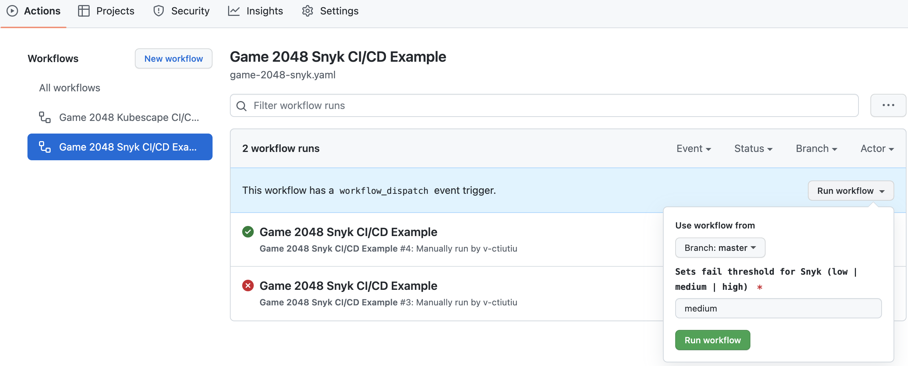
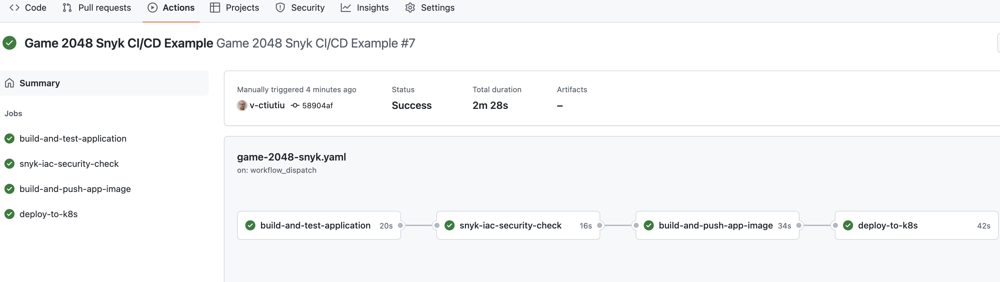

# Using the Snyk Vulnerability Scanning Tool

## Introduction

[Snyk](https://snyk.io) is defined as a developer security platform and its main goal is to help you detect and fix vulnerabilities in your application source code, third party dependencies, container images, and infrastructure configuration files (e.g. Kubernetes, Terraform, etc).

Snyk is divided into four components:

1. [Snyk Code](https://docs.snyk.io/products/snyk-code) - helps you find and fix vulnerabilities in your application source code.
2. [Snyk Open Source](https://docs.snyk.io/products/snyk-open-source) - helps you find and fix vulnerabilities for any 3rd party libraries or dependencies your application relies on.
3. [Snyk Container](https://docs.snyk.io/products/snyk-container) - helps you find and fix vulnerabilities in container images or Kubernetes workloads used in your cluster.
4. [Snyk Infrastructure as Code](https://docs.snyk.io/products/snyk-infrastructure-as-code) - helps you find and fix misconfigurations in your Kubernetes manifests (Terraform, CloudFormation and Azure are supported as well).

Snyk can be run in different ways:

- Via the command line interface using [Snyk CLI](https://docs.snyk.io/snyk-cli). This the preferred way to run inside scripts and various automations, including CI/CD pipelines.
- In the browser as [Snyk Web UI](https://docs.snyk.io/snyk-web-ui). Snyk offers a cloud based platform as well which you can use to investigate scan reports, receive hints and take required actions to fix reported issues, etc. You can also connect GitHub repositories and perform scans/audits from the web interface.
- Via [IDE plugins](https://docs.snyk.io/ide-tools). This way you can spot issues early as you're developing using your favorite IDE (e.g. Visual Studio Code).
- Programmatically, via the [Snyk API](https://support.snyk.io/hc/en-us/categories/360000665657-Snyk-API). Snyk API is available to customers on [paid plans](https://snyk.io/plans) and allows you to programmatically integrate with Snyk.

Is Snyk free ?

Yes, the tooling is free, except [Snyk API](https://support.snyk.io/hc/en-us/categories/360000665657-Snyk-API) and some advanced features from the cloud portal (such as advanced reporting). There is also a limitation on the number of tests you can perform per month.

See [pricing plans](https://snyk.io/plans/) for more information.

Is Snyk open source ?

Yes, the tooling and Snyk CLI for sure is. You can visit the [Snyk GitHub home page](https://github.com/snyk) to find more details about each component implementation. The cloud portal and all paid features such as the rest API implementation is not open source.

In this guide you will use [Snyk CLI](https://docs.snyk.io/snyk-cli) to perform risk analysis for your Kubernetes applications supply chain (container images, Kubernetes YAML manifests). Then, you will learn how to take the appropriate action to remediate the situation. Finally, you will learn how to integrate Snyk in a CI/CD pipeline to scan for vulnerabilities in the early stages of development.

## Table of Contents

- [Introduction](#introduction)
- [Requirements](#requirements)
- [Step 1 - Getting to Know the Snyk CLI](#step-1---getting-to-know-the-snyk-cli)
- [Step 2 - Getting to Know the Snyk Cloud Portal](#step-2---getting-to-know-the-snyk-cloud-portal)
- [Step 4 - Using Snyk to Scan for Kubernetes Configuration Vulnerabilities in a CI/CD Pipeline](#step-4---using-snyk-to-scan-for-kubernetes-configuration-vulnerabilities-in-a-cicd-pipeline)
  - [GitHub Actions CI/CD Pipeline Example](#github-actions-cicd-pipeline-example)
  - [Investigating Snyk Scan Results and Fixing Reported Issues](#investigating-snyk-scan-results-and-fixing-reported-issues)
  - [Triggering the Snyk CI/CD Workflow Automatically](#triggering-the-snyk-cicd-workflow-automatically)
  - [Treating Exceptions](#treating-exceptions)
- [Conclusion](#conclusion)
- [Additional Resources](#additional-resources)

## Requirements

To complete all steps from this guide, you will need:

1. A working `DOKS` cluster running `Kubernetes version >=1.21` that you have access to. For additional instructions on configuring a DigitalOcean Kubernetes cluster, see: [How to Set Up a DigitalOcean Managed Kubernetes Cluster (DOKS)](https://github.com/digitalocean/Kubernetes-Starter-Kit-Developers/tree/main/01-setup-DOKS#how-to-set-up-a-digitalocean-managed-kubernetes-cluster-doks).
2. A [DigitalOcean Docker Registry](https://docs.digitalocean.com/products/container-registry/). A free plan is enough to complete this tutorial. Also, make sure it is integrated with your DOKS cluster as explained [here](https://docs.digitalocean.com/products/container-registry/how-to/use-registry-docker-kubernetes/#kubernetes-integration).
3. [Kubectl](https://kubernetes.io/docs/tasks/tools) CLI for `Kubernetes` interaction. Follow these [instructions](https://www.digitalocean.com/docs/kubernetes/how-to/connect-to-cluster/) to connect to your cluster with `kubectl` and `doctl`.
4. [Snyk CLI](https://docs.snyk.io/snyk-cli/install-the-snyk-cli) to interact with [Snyk](https://snyk.io) vulnerabilities scanner.
5. A free [Snyk cloud account](https://app.snyk.io) account used to periodically publish scan results for your Kubernetes cluster to a nice dashboard. Also, the Snyk web interface helps you with investigations and risk analysis. Please follow [How to Create a Snyk Account](https://docs.snyk.io/tutorials/getting-started/snyk-integrations/snyk-account) documentation page.

## Step 1 - Getting to Know the Snyk CLI

You can manually scan for vulnerabilities via the `snyk` command line interface. The snyk CLI is designed to be used in various scripts and automations. A practical example is in a CI/CD pipeline implemented using various tools such as Tekton, Jenkins, GitHub Workflows, etc.

When the snyk CLI is invoked it will immediately start the scanning process and report back issues in a specific format. By default it will print a summary table using the standard output or the console. Snyk can generate reports in other formats as well, such as JSON, HTML, SARIF, etc.

You can opt to push the results to the [Snyk Cloud Portal](https://app.snyk.io) via the `--report` flag to store and visualize scan results later.

**Note:**

It's not mandatory to submit scan results to the Snyk cloud portal. The big advantage of using the Snyk portal is visibility because it gives you access to a nice dashboard where you can check all scan reports and see how much the Kubernetes supply chain is impacted. It also helps you on the long term with investigations and remediation hints.

Snyk CLI is divided into several subcommands. Each subcommand is dedicated to a specific feature, such as:

- [Open source scanning](https://docs.snyk.io/products/snyk-open-source/use-snyk-open-source-from-the-cli) - identifies current project dependencies and reports found security issues.
- [Code scanning](https://docs.snyk.io/products/snyk-code/cli-for-snyk-code) - reports security issues found in your application source code.
- [Image scanning](https://docs.snyk.io/products/snyk-container/snyk-cli-for-container-security) - reports security issues found in container images (e.g. Docker).
- [Infrastructure as code files scanning](https://docs.snyk.io/products/snyk-infrastructure-as-code/snyk-cli-for-infrastructure-as-code) - reports security issues found in configuration files used by Kubernetes, Terraform, etc.

**Note:**

Before moving on, please make sure to create a [free account](https://docs.snyk.io/tutorials/getting-started/snyk-integrations/snyk-account) using the Snyk cloud portal. Also, snyk CLI needs to be [authenticated](https://docs.snyk.io/snyk-cli/authenticate-the-cli-with-your-account) with your cloud account as well in order for some commands/subcommands to work (e.g. `snyk code test`).

A few examples to try with Snyk CLI:

1. Open source scanning:

    ```shell
    # Scans your project code from current directory
    snyk test

    # Scan a specific path from your project directory (make sure to replace the `<>` placeholders accordingly)
    snyk test <path/to/dir>
    ```

2. Code scanning:

    ```shell
    # Scan your project code from current directory
    snyk code test

    # Scan a specific path from your project directory (make sure to replace the `<>` placeholders accordingly)
    snyk code test <path/to/dir>
    ```

3. Image scanning:

    ```shell
    # Scans the debian docker image by pulling it first
    snyk container debian

    # Give more context to the scanner by providing a Dockerfile (make sure to replace the `<>` placeholders accordingly)
    snyk container debian --file=<path/to/dockerfile>
    ```

4. Infrastructure as code scanning:

    ```shell
    # Scan your project code from current directory
    snyk iac test

    # Scan a specific path from your project directory (make sure to replace the `<>` placeholders accordingly)
    snyk iac test <path/to/dir>

    # Scan Kustomize based projects (first you need to render the final template, then pass it to the scanner)
    kustomize build > kubernetes.yaml
    snyk iac test kubernetes.yaml
    ```

Snyk CLI provides help pages for all available options. Below command can be used to print the main help page:

```shell
snyk --help
```

The output looks similar to:

```text
CLI commands help
  Snyk CLI scans and monitors your projects for security vulnerabilities and license issues.

  For more information visit the Snyk website https://snyk.io

  For details see the CLI documentation https://docs.snyk.io/features/snyk-cli

How to get started
  1. Authenticate by running snyk auth
  2. Test your local project with snyk test
  3. Get alerted for new vulnerabilities with snyk monitor

Available commands
  To learn more about each Snyk CLI command, use the --help option, for example, snyk auth --help or 
  snyk container --help

  snyk auth
    Authenticate Snyk CLI with a Snyk account.

  snyk test
    Test a project for open source vulnerabilities and license issues.
...
```

Each snyk CLI command (or subcommand) has an associated help page as well which can be accessed via `snyk [command] --help`.

Please visit the official [snyk CLI documentation page](https://docs.snyk.io/snyk-cli) for more examples.

## Step 2 - Getting to Know the Snyk Cloud Portal

TBD.

## Step 4 - Using Snyk to Scan for Kubernetes Configuration Vulnerabilities in a CI/CD Pipeline

How do you benefit from embedding a security compliance scanning tool in your CI/CD pipeline and avoid unpleasant situations in a production environment?

It all starts at the foundation level where software development starts. In general, you will want to use a dedicated environment for each stage. So, in the early stages of development when application code changes very often, you should use a dedicated development environment (called the lower environment usually). Then, the application gets more and more refined in the QA environment where QA teams perform manual and/or automated testing. Next, if the application gets the QA team approval it is promoted to the upper environments such as staging, and finally into production. In this process, where the application is promoted from one environment to another, a dedicated pipeline runs which continuously scans application artifacts and checks the severity level. If the severity level doesn't meet a specific threshold, the pipeline fails immediately and application artifacts promotion to production is stopped in the early stages.

So, the security scanning tool (e.g. snyk) acts as a gatekeeper stopping unwanted artifacts getting in your production environment from the early stages of development. In the same manner, upper environments pipelines use snyk to allow or forbid application artifacts entering the final production stage.

### GitHub Actions CI/CD Pipeline Example

In this step you will learn how to create and test a simple CI/CD pipeline with integrated vulnerability scanning via GitHub workflows.  To learn the fundamentals of using Github Actions with DigitalOcean Kubernetes, refer to this [tutorial](https://docs.digitalocean.com/tutorials/enable-push-to-deploy/).

The pipeline provided in the following section builds and deploys the [game-2048-example](https://github.com/digitalocean/kubernetes-sample-apps/tree/master/game-2048-example) application from the DigitalOcean [kubernetes-sample-apps](https://github.com/digitalocean/kubernetes-sample-apps) repository.

At a high level overview, the [example CI/CD pipeline](https://github.com/digitalocean/kubernetes-sample-apps/blob/master/.github/workflows/game-2048-snyk.yml) provided in the kubernetes-sample-apps repo is comprised of the following stages:

1. Application build stage - builds main application artifacts and runs automated tests.
2. Snyk scan stage - scans for known vulnerabilities in the Kubernetes YAML manifests associated with the application. Application is kustomize based, so the final **kustomize.yaml** is rendered first, then sent for scanning to snyk CLI. Acts as a gate and the final pipeline state (pass/fail) is dependent on this step. In case of failure a Slack notification is sent as well.
3. Application image build stage - builds and tags the applicatin image using the latest git commit SHA. Then the image is pushed to DOCR.
4. Application deployment stage - deploys the application to Kubernetes (DOKS).

How do you fail the pipeline if a certain security compliance level is not met ?

Snyk CLI provides a flag named `--severity-threshold` for this purpose. This flag correlates with the overall severity level computed after each scan. In case of Snyk, the severity level takes one of the following values: **low**, **medium** or **high**. You can fail or pass the pipeline based on the severity level value and stop application deployment if conditions are not met.

Below picture illustrates the flow for the example CI/CD pipeline used in this guide:


Please follow below steps to create and test the snyk CI/CD GitHub workflow provided in the [kubernetes-sample-apps](https://github.com/digitalocean/kubernetes-sample-apps) GitHub repository:

1. Fork the [kubernetes-sample-apps](https://github.com/digitalocean/kubernetes-sample-apps) GitHub repository.
2. Create the following [GitHub encrypted secrets](https://docs.github.com/en/actions/security-guides/encrypted-secrets#creating-encrypted-secrets-for-a-repository) for your **kubernetes-sample-apps** copy (**Settings Tab** -> **Secrets** -> **Actions**):
   - `DIGITALOCEAN_ACCESS_TOKEN` - holds your DigitalOcean account token.
   - `DOCKER_REGISTRY` - holds your DigitalOcean docker registry name including the endpoint (e.g. `registry.digitalocean.com/sample-apps`).
   - `DOKS_CLUSTER` - holds your DOKS cluster name. You can run the following command to get your DOKS cluster name: `doctl k8s cluster list --no-header --format Name`.
   - `SNYK_TOKEN` - holds your Snyk user account ID - run: `snyk config get api` to get the ID. If that doesn't work, you can retrieve the token from your [user account settings](https://docs.snyk.io/snyk-web-ui/getting-started-with-the-snyk-web-ui#manage-account-preferences-and-settings) page.
   - `SLACK_WEBHOOK_URL` - holds your [Slack incoming webhook URL](https://api.slack.com/messaging/webhooks) used for snyk scan notifications.
3. Navigate to the **Actions** tab of your forked repo and select the **Game 2048 Snyk CI/CD Example** workflow:
   )
4. Click on the **Run Workflow** button and leave the default values:
   

A new entry should appear in below list after clicking the **Run Workflow** green button. You can click on it and observe the pipeline run progress:


The pipeline will fail and stop when the **snyk-iac-security-check** job runs. This is done on purpose because the default severity level value, which is **medium**, doesn't meet the expectations. You should also receive a Slack notifications with status details about the workflow run:


In the next step you will learn how to investigate the snyk scan report and fix the issues to lower the severity level.

### Investigating Snyk Scan Results and Fixing Reported Issues

Whenever the severity level threshold is not met, the [game-2048 GitHub workflow](https://github.com/digitalocean/kubernetes-sample-apps/blob/master/.github/workflows/game-2048-snyk.yml) will fail and a Slack notification is sent with additional details. To check the status report, you can click on the snyk scan results link from the received Slack notification. Then, you will be redirected to the Snyk portal dashboard where you can check the **game-2048-example** project.

First, click on the **game-2048-example:kustomize.yaml** entry from the projects list:


Next, tick the **Medium** checkbox in the **Severity** submenu from the left to display only **medium** level issues:


Then, you can inspect each reported issue card and check the details. Go ahead and click on the **Show more details** button - you will receive more details about the current issue, and important hints about how to fix it:


After collecting all information from each card, you can go ahead and edit the [deployment.yaml](https://github.com/digitalocean/kubernetes-sample-apps/blob/master/game-2048-example/kustomize/resources/deployment.yaml) file from your repo (located in the `game-2048-example/kustomize/resources` subfolder). The fixes are already in place, you just need to uncomment the last lines from the file. The final `deployment.yaml` file should look like below:

```yaml
---
apiVersion: apps/v1
kind: Deployment
metadata:
  name: game-2048
spec:
  replicas: 1
  selector:
    matchLabels:
      app: game-2048
  strategy:
    type: RollingUpdate
  template:
    metadata:
      labels:
        app: game-2048
    spec:
      containers:
        - name: backend
          # Replace the `<>` placeholders with your docker registry info
          image: registry.digitalocean.com/sample-apps/2048-game:latest
          ports:
            - name: http
              containerPort: 8080
          resources:
            requests:
              cpu: 100m
              memory: 50Mi
            limits:
              cpu: 200m
              memory: 100Mi
          securityContext:
            readOnlyRootFilesystem: true
            runAsNonRoot: true
            allowPrivilegeEscalation: false
            capabilities:
              drop:
                - all
```

What changed ? The following security fixes were applied:

- `readOnlyRootFilesystem` - runs container image in read only (cannot alter files by `kubectl exec` in the container).
- `runAsNonRoot` - runs as the non root user defined by the [USER](https://github.com/digitalocean/kubernetes-sample-apps/blob/master/game-2048-example/Dockerfile#L18) directive from the game-2048 project [Dockerfile](https://github.com/digitalocean/kubernetes-sample-apps/blob/master/game-2048-example/Dockerfile).
- `allowPrivilegeEscalation` - setting **allowPrivilegeEscalation** to **false** ensures that no child process of a container can gain more privileges than its parent.

Finally, commit the changes for the **deployment.yaml** file and push to main branch. After manually triggering the workflow it should complete successfully this time:



You should also receive a green Slack notification this time from the snyk scan job. Navigate to the Snyk portal link and check if the issues that you fixed recently are gone - there should be none reported.

A few final checks can be performed as well on the Kubernetes side to verify if the issues were fixed:

1. Check if the game-2048 deployment has a read-only (immutable) filesystem by writing the application **index.html** file:

   ```shell
   kubectl exec -it deployment/game-2048 -n game-2048 -- /bin/bash -c "echo > /public/index.html"
   ```

   The output looks similar to:

   ```text
   /bin/bash: /public/index.html: Read-only file system
   command terminated with exit code 1
   ```

2. Check if the container runs as non-root user (should print a integer number different than zero - e.g. `1000`):

   ```shell
   kubectl exec -it deployment/game-2048 -n game-2048 -- id -u
   ```

If all checks pass then you applied the required security recommendations successfully.

### Triggering the Snyk CI/CD Workflow Automatically

You can set the workflow to trigger automatically on each commit or PR against the main branch by uncommenting the following lines at the top of the [game-2048-snyk.yml](https://github.com/digitalocean/kubernetes-sample-apps/blob/master/.github/workflows/game-2048-snyk.yml) file:

```yaml
on:
  push:
    branches: [ master ]
  pull_request:
    branches: [ master ]
```

After editing the file, commit the changes to your main branch and you should be ready to go.

### Treating Exceptions

## Conclusion

## Additional Resources
