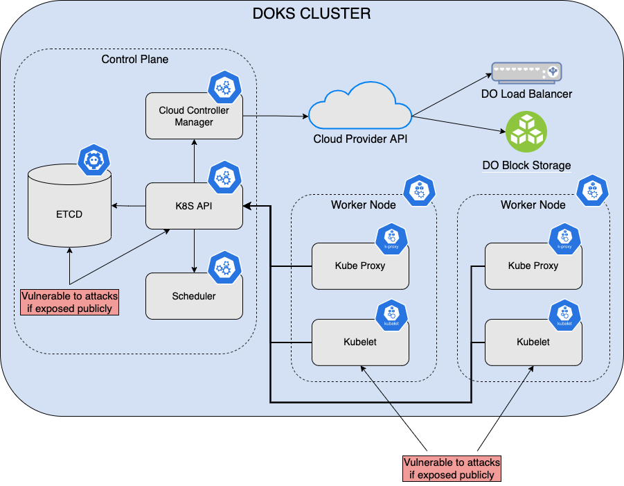
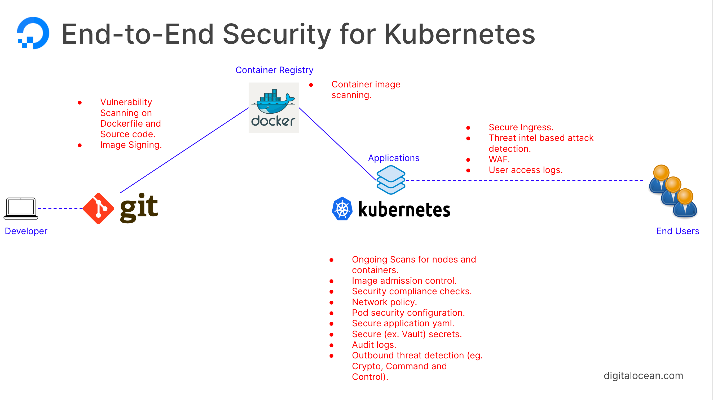
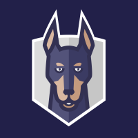
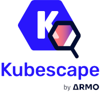

# DigitalOcean Kubernetes Supply Chain Security

## Introduction

This guide provides a short introduction about Kubernetes security best practices in general (applies to [DOKS](https://docs.digitalocean.com/products/kubernetes/) as well). Then, a practical example is given about how to integrate popular vulnerability scan tools (e.g. [Kubescape](https://github.com/armosec/kubescape/)) in a traditional CI/CD pipeline implemented using [GitHub Workflows](https://docs.github.com/en/actions/using-workflows).

[Kubernetes](https://kubernetes.io) gained a lot of popularity over time and for a good reason. It's widely being used today in every modern infrastructure based on microservices. Kubernetes takes away the burden of managing high availability (or HA) setups, such as scheduling and replicating workloads on different nodes, thus assuring resiliency. Then, at the networking layer it also takes care of load balancing and distributes traffic evenly to workloads. At its core, Kubernetes is a modern container scheduler offering additional features such as application configuration and secrets management, to mention a few. You can also set quotas and control applications access to various resources (such as CPU and memory) by fine tuning resource limits requests. In terms of security, you can restrict who has access to what resources via RBAC policies, which is an acronym standing for Resource Based Access Control.

Kubernetes has grown a lot in terms of stability and maturity in the past years. On the other hand, due to popularity it has become a potential target for malicious attacks. No matter where you run Kubernetes (cloud or on-premise), each cluster is divided into two major components:

1. [Control Plane](https://kubernetes.io/docs/concepts/overview/components/#control-plane-components) - takes care of scheduling your workloads (Pods) and responding to cluster events (such as starting up a new pod when a deployment's replicas field is unsatisfied).
2. [Worker Nodes](https://kubernetes.io/docs/concepts/overview/components/#node-components) - these are the actual machines running your Kubernetes workloads. Node components run on every node, maintaining running pods and providing the Kubernetes runtime environment.

Below picture shows the typical architecture of a Kubernetes cluster and possible weak points:

Cloud providers (including [DigitalOcean](https://www.digitalocean.com)) offer today ready to run [Kubernetes](https://docs.digitalocean.com/products/kubernetes/) services, thus taking away the burden of managing the cluster itself (or the control plane component). This way, you can focus more on application development rather than spending time to deal with infrastructure tasks, such as control plane management, worker nodes maintenance (e.g. performing regular OS updates and security patching), etc. DigitalOcean offers an easy to use Kubernetes platform called [DOKS](https://docs.digitalocean.com/products/kubernetes/), which stands for DigitalOcean Kubernetes. DOKS is a [managed Kubernetes](https://docs.digitalocean.com/products/kubernetes/resources/managed/) service that lets you deploy Kubernetes clusters without dealing with the complexities of installing and managing control plane components and containerized infrastructure.

Going further, a very important aspect which is often overlooked is **security**. Security is a broader term and covers many areas such as: software supply chain security, infrastructure security, networking security, etc. Because Kubernetes is so popular it has become a potential target fot attack so care must be taken. Another aspect to look at is the Kubernetes ecosystem complexity. In general, complex systems can have multiple weak points, thus opening multiple doors to external attacks and exploits. Most of the security flaws are caused by improperly configured Kubernetes clusters. A typical example is cluster administrators forgetting to set RBAC rules, or allowing applications to run as root in the Pod specification. Going further, Kubernetes offers a simple but very powerful isolation mechanism (both at the application level and networking layer) - [namespaces](https://kubernetes.io/docs/concepts/overview/working-with-objects/namespaces/). By using namespaces administrators can isolate application resources and configure access rules to various users and/or teams in a more controlled fashion.

Kubernetes hardening is a multi step process, and usually consists of:

1. Control plane hardening:
   - Reduce surface attacks by securing the public REST API of Kubernetes (authorization, authentication, TLS encryption).
   - Regularly update the operating system kernel via patches to include security fixes. Also, system libraries and binaries must be updated regularly.
   - Enforce network policies and configure network firewalls to allow minimum to zero access if possible from the outside. Start by denying everything, and then allow only required services.
   - **Do not expose the ETCD database publicly!** This is a very important step, because the Kubernetes ETCD database contains your resources configuration and state. It can also contain sensitive information such as Kubernetes secrets.
   - Restrict access to a very limited group of people (system administrators usually).
   - Perform system checks regularly by installing/configuring a security audit tool, and receive alerts in real time in case of a security breach.
2. Worker nodes hardening. Most of the control plane recommendations apply here as well, with a few notes such as:
   - Never expose [kubelets](https://kubernetes.io/docs/reference/command-line-tools-reference/kubelet/) or [kube-proxies](https://kubernetes.io/docs/reference/command-line-tools-reference/kube-proxy/) publicly.
   - Avoid exposing the SSH service to the public. This is recommended to reduce surface attacks. For system administration you can use a VPN setup.
3. Kubernetes applications environment hardening:
   - Kubernetes YAML manifests scanning for misconfigurations.
   - Strict permissions for Pods and containers (such as not allowing root user within Pod spec, immutable filesystems for containers, etc.)
   - Proper configuration of RBAC policies.
   - Container images signing, thus allowing only trusted images to run.
   - Setting up admission controllers to allow trusted (or signed) container images only.
   - Network policies and namespace isolation (restrict applications to dedicated namespaces, as well as controlling ingress/egress traffic between namespaces).
   - Periodic Kubernetes cluster scanning.
4. Hardening the software supply chain:
   - Application source code and 3rd party libraries scanning for known vulnerabilities.
   - Application container images scanning for known vulnerabilities.

Below picture illustrates what are the recommended steps to achieve end to end security for Kubernetes:

In case of DOKS, you don't have to worry about control plane and worker nodes security because this is already taken care by the cloud provider (DigitalOcean). This is one of the main benefits of using a managed Kubernetes service. Still, users have access to the underlying machines (Droplets) and firewall settings, so it all circles back to administrators diligence to pay attention and not expose services or ports that are not really required.

What's left is taking measures to harden the Kubernetes applications environment and software supply chain. This guide is mainly focused around the Kubernetes supply chain security, and it will teach you to:

1. Run vulnerability scans in the early stages, e.g. within your CI/CD pipelines (Tekton, Jenkins, GitHub workflows, etc).
2. Run periodic scans within your Kubernetes cluster, as well as for any new deployments.
3. Evaluate security risks and take the appropriate actions to reduce the risk factor to a minimum.
4. Get notified in real time (e.g. via Slack) about possible threats in your Kubernetes cluster.

## Kubernetes Environment and Software Supply Chain Security

To build an application and run it on Kubernetes, you need a list of ingredients which are part of the software supply chain. The software supply chain is usually composed of:

- A Git repository from where your application source code is retrieved.
- Third party libraries that your application may use (fetched via a project management tool, such as npm, maven, gradle, etc).
- Docker images hosting your application (including inherited base images).
- YAML manifests that tell Kubernetes to create required resources for your application to run, such as Pods, Deployments, Secrets, ConfigMaps, etc.

Hardening the Kubernetes applications environment and software supply chain can be accomplished in the early stages at the CI/CD pipeline level. Every modern infrastructure is using a CI/CD system nowadays to build and deploy applications, hence the reason.

The first step required to harden your Kubernetes environment is to use a dedicated tool that continuously scans for vulnerabilities both at the CI/CD pipeline level and the entire Kubernetes cluster.

There are many vulnerability scanning tools available but this guide focuses on two implementations - [Snyk](https://snyk.io) and [Armosec Kubescape](https://github.com/armosec/kubescape/).

Without further ado, please pick one to start with from the list below.

## Kubernetes Vulnerability Scanning Tools

| SNYK | KUBESCAPE |
|:-----------------------------------------------:|:--------------------------------------------------------------:|
|  |  |
