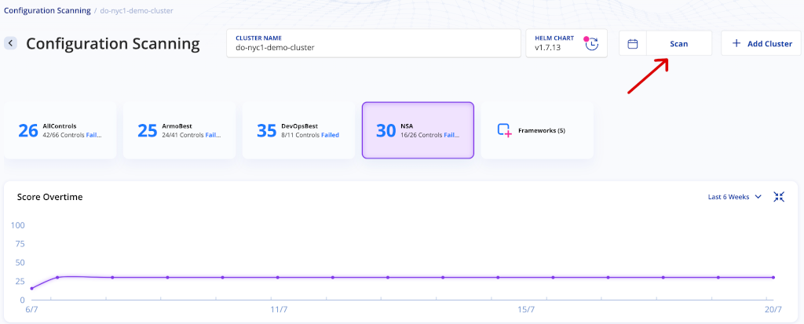
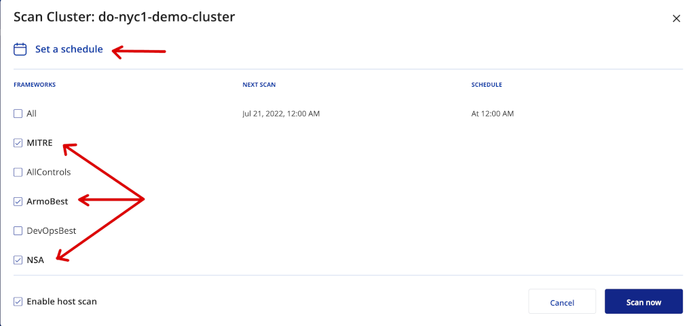
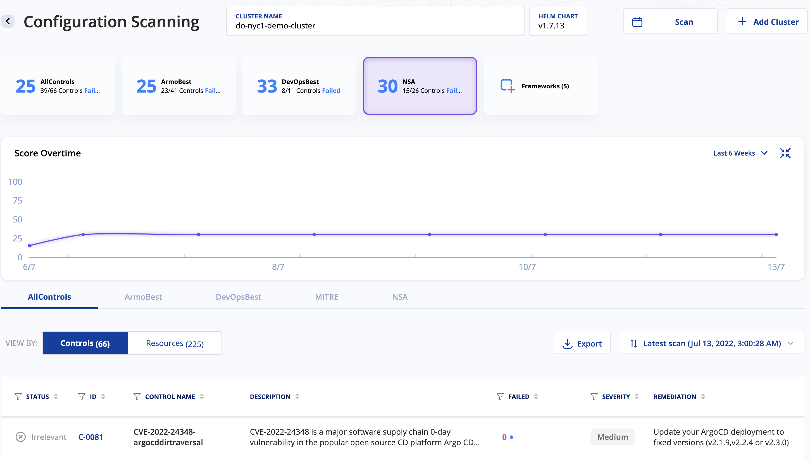
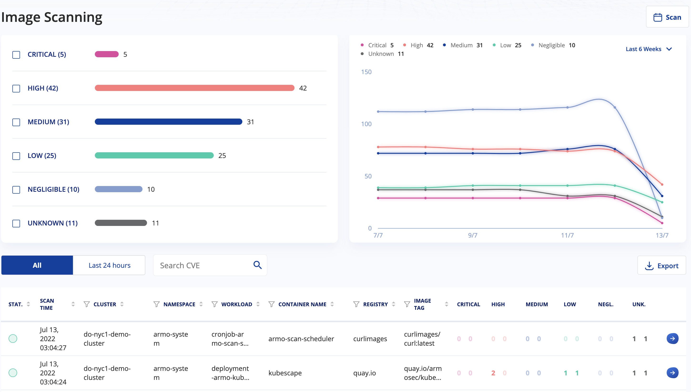
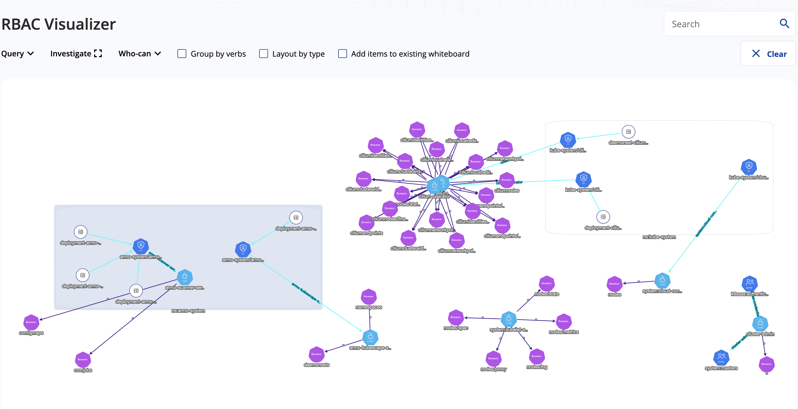
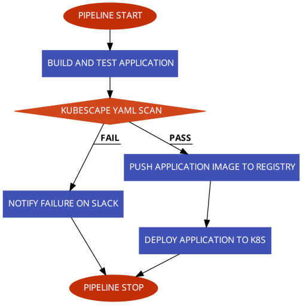
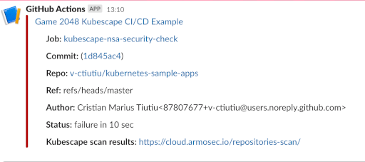
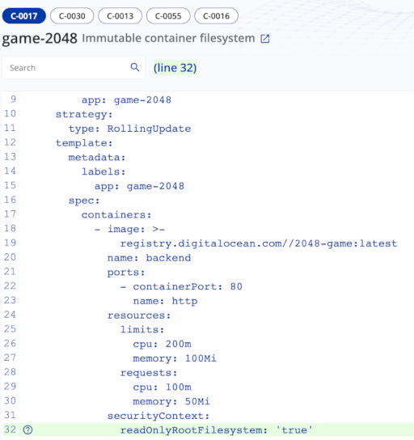

# Using the Kubescape Vulnerability Scan Tool

## Introduction

[Kubescape](https://github.com/armosec/kubescape/) is a Kubernetes open-source tool developed by [Armosec](https://www.armosec.io) used for risk analysis, security compliance, RBAC visualizer, and image vulnerabilities scanning. In addition, Kubescape is able to scan Kubernetes manifests to detect potential configuration issues that expose your deployments to the risk of attack. It can also scan Helm charts, detect RBAC (role-based-access-control) violations, performs risk score calculations and shows risk trends over time.

**Kubescape key features:**

- Detect Kubernetes misconfigurations and provide remediation assistance via the [Armosec Cloud Portal](https://cloud.armosec.io).
- Risk analysis and trending over time via the [Armosec Cloud Portal](https://cloud.armosec.io).
- Includes multiple security compliance frameworks, such as ArmoBest, NSA, MITRE and Devops Best Practices.
- Exceptions management support, allowing Kubernetes admins to mark acceptable risk levels.
- Integrates with various tools such as Jenkins, Github workflows, Prometheus, etc.
- Image scanning - scan images for vulnerabilities and easily see, sort and filter (which vulnerability to patch first).
- Simplifies RBAC complexity by providing an easy-to-understand visual graph which shows the RBAC configuration in your cluster.

**Kubescape can be run in different ways:**

- Via the command line interface (or CLI). This the preferred way to run inside scripts and various automations, including CI/CD pipelines. Results can be uploaded to the [Armosec Cloud Portal](https://cloud.armosec.io) for analysis.
- As a cronjob inside your Kubernetes cluster. In this mode, Kubescape is constantly watching your Kubernetes cluster for changes and uploads scan results to the [Armosec Cloud Portal](https://cloud.armosec.io). This feature works only if you deploy [Armo Cluster Components](https://hub.armosec.io/docs/installation-of-armo-in-cluster) in your DOKS cluster.
- Via the [Armosec Cloud Portal](https://cloud.armosec.io) web interface. You can trigger [configuration scanning](https://cloud.armosec.io/configuration-scanning), [Image Scanning](https://cloud.armosec.io/image-scanning), view and inspect [RBAC rules](https://cloud.armosec.io/rbac-visualizer), customize frameworks, etc. This feature works only if you deploy [Armo Cluster Components](https://hub.armosec.io/docs/installation-of-armo-in-cluster) in your DOKS cluster.
- Inside your [Visual Studio Code IDE](https://hub.armosec.io/docs/visual-studio-code). This way you can spot issues very quickly in the early stages of development.

**Kubescape is using different frameworks to detect misconfigurations such as:**

- [ArmoBest](https://www.armosec.io/blog/armobest-kubernetes-framework/)
- [NSA](https://www.nsa.gov/Press-Room/News-Highlights/Article/Article/2716980/nsa-cisa-release-kubernetes-hardening-guidance/)
- [MITRE ATT&CK](https://www.microsoft.com/security/blog/2021/03/23/secure-containerized-environments-with-updated-threat-matrix-for-kubernetes/)

**Is Kubescape free?**

Yes, the tooling and community edition is free forever, except the cloud portal backend implementation and maybe some other advanced features. There is also a limitation on the maximum number of worker nodes you can scan per cluster (up to 10). Your scan reports data retention is limited to one month in the Armo cloud portal.

See [pricing plans](https://www.armosec.io/pricing/) for more information.

**Is Kubescape open source?**

Yes, the tooling for sure is. You can visit the [Armo GitHub home page](https://github.com/armosec) to find more details about each component implementation. The cloud portal backend implementation is not open source.

In this guide you will use Kubescape to perform risk analysis for your Kubernetes applications supply chain (container images, Kubernetes YAML manifests). Then, you will learn how to take the appropriate action to remediate the situation. Finally, you will learn how to integrate Kubescape in a CI/CD pipeline to scan for vulnerabilities in the early stages of development.

## Table of Contents

- [Introduction](#introduction)
- [Requirements](#requirements)
- [Step 1 - Getting to Know the Kubescape CLI](#step-1---getting-to-know-the-kubescape-cli)
- [Step 2 - Getting to Know the Armosec Cloud Portal](#step-2---getting-to-know-the-armosec-cloud-portal)
  - [Risk Score Analysis and Trending](#risk-score-analysis-and-trending)
  - [Understanding Kubescape Risk Score Value](#understanding-kubescape-risk-score-value)
  - [Assisted Remediation for Reported Security Issues](#assisted-remediation-for-reported-security-issues)
  - [Triggering Cluster Scans from the Web UI](#triggering-cluster-scans-from-the-web-ui)
- [Step 3 - Configuring Kubescape Automatic Scans for DOKS](#step-3---configuring-kubescape-automatic-scans-for-doks)
  - [Provisioning Armo Cluster Components to DOKS](#provisioning-armo-cluster-components-to-doks)
  - [Tweaking Helm Values for the Armo Cluster Components Chart](#tweaking-helm-values-for-the-armo-cluster-components-chart)
- [Step 4 - Using Kubescape to Scan for Kubernetes Configuration Vulnerabilities in a CI/CD Pipeline](#step-4---using-kubescape-to-scan-for-kubernetes-configuration-vulnerabilities-in-a-cicd-pipeline)
  - [GitHub Actions CI/CD Workflow Implementation](#github-actions-cicd-workflow-implementation)
- [Step 5 - Investigating Kubescape Scan Results and Fixing Reported Issues](#step-5---investigating-kubescape-scan-results-and-fixing-reported-issues)
  - [Treating Exceptions](#treating-exceptions)
  - [Kubescape for IDEs](#kubescape-for-ides)
- [Step 6 - Triggering the Kubescape CI/CD Workflow Automatically](#step-6---triggering-the-kubescape-cicd-workflow-automatically)
- [Step 7 - Enabling Slack Notifications for Continuous Monitoring](#step-7---enabling-slack-notifications-for-continuous-monitoring)
- [Conclusion](#conclusion)
- [Additional Resources](#additional-resources)

## Requirements

To complete all steps from this guide, you will need:

1. A working `DOKS` cluster running `Kubernetes version >=1.21` that you have access to. For additional instructions on configuring a DigitalOcean Kubernetes cluster, see: [How to Set Up a DigitalOcean Managed Kubernetes Cluster (DOKS)](https://github.com/digitalocean/Kubernetes-Starter-Kit-Developers/tree/main/01-setup-DOKS#how-to-set-up-a-digitalocean-managed-kubernetes-cluster-doks).
2. A [DigitalOcean Docker Registry](https://docs.digitalocean.com/products/container-registry/). A free plan is enough to complete this tutorial. Also, make sure it is integrated with your DOKS cluster as explained [here](https://docs.digitalocean.com/products/container-registry/how-to/use-registry-docker-kubernetes/#kubernetes-integration).
3. [Kubectl](https://kubernetes.io/docs/tasks/tools) CLI for `Kubernetes` interaction. Follow these [instructions](https://www.digitalocean.com/docs/kubernetes/how-to/connect-to-cluster/) to connect to your cluster with `kubectl` and `doctl`.
4. [Helm](https://www.helm.sh), to install Kubescape in the Kubernetes cluster.
5. [Kubescape CLI](https://hub.armosec.io/docs/installing-kubescape/) to interact with [Kubescape](https://github.com/armosec/kubescape/) vulnerabilities scanner.
6. A free [Armosec Cloud Portal](https://cloud.armosec.io) account used to periodically publish scan results for your Kubernetes cluster to a nice dashboard. Also, the Armosec portal web interface helps you with investigations and risk analysis.
7. A Slack workspace you own, and a dedicated [Slack app](https://api.slack.com/authentication/basics) to get notified of vulnerability scan issues reported by Kubescape.

## Step 1 - Getting to Know the Kubescape CLI

You can manually scan for vulnerabilities via the `kubescape` command line interface. The kubescape CLI is designed to be used in various scripts and automations. A practical example is in a CI/CD pipeline implemented using various tools such as Tekton, Jenkins, GitHub Workflows, etc.

Kubescape is designed to scan a whole Kubernetes cluster from ground up (workloads, containers, etc). If desired, you can limit scans to a specific namespace as well. Other features include host scanning (worker nodes), local or remote repositories scanning (e.g. GitHub), detect misconfigurations in Kubernetes YAML manifests or Helm charts. Various frameworks can be selected via the `framework` command, such as ArmoBest, NSA, MITRE, etc.

When kubescape CLI is invoked, it will download (or update) the known vulnerabilities database on your local machine. Then, it will start the scanning process and report back issues in a specific format. By default it will print a summary table using the standard output or the console. Kubescape can generate reports in other formats as well, such as JSON, HTML, SARIF, etc.

You can opt to push the results to the [Armosec Cloud Portal](https://cloud.armosec.io) via the `--submit` flag to store and visualize scan results later.

**Note:**

It's not mandatory to submit scan results to the Armosec cloud portal. The big advantage of using the portal is visibility because it gives you access to a nice dashboard where you can check all scan reports and the overall risk score. It also helps you on the long term with investigations and remediation hints.

Some examples to try with Kubescape CLI:

- Scan a whole Kubernetes cluster and generate a summary report in the console (standard output):

   ```shell
   kubescape scan
   ```

- Use a specific namespace only for scanning:

   ```shell
   kubescape scan --include-namespaces microservices
   ```

- Exclude specific namespaces from scanning:

   ```shell
   kubescape scan --exclude-namespaces kube-system,kube-public
   ```

- Scan a specific namespace and submit results to the Armosec cloud portal:

   ```shell
   kubescape scan --include-namespaces default --submit
   ```

- Perform cluster scan using a specific framework (e.g. NSA):

   ```shell
   kubescape scan framework nsa --exclude-namespaces kube-system,kube-public
   ```

Kubescape is able to scan your Kubernetes cluster hosts (or worker nodes) for OS vulnerabilities as well. To enable this feature, you need to pass the `--enable-host-scan` flag to the kubescape CLI. When this flag is enabled, kubescape deploys `sensors` in your cluster. Sensors are created using Kubernetes DaemonSets which deploy Pods on each node of your cluster to scan for known vulnerabilities. After the scan process is completed, the sensors are removed from your cluster (including the associated Kubernetes resources).

Kubescape CLI provides help pages for all available options. Below command can be used to print the main help page:

```shell
kubescape --help
```

The output looks similar to:

```text
Kubescape is a tool for testing Kubernetes security posture. Docs: https://hub.armo.cloud/docs

Usage:
  kubescape [command]

Available Commands:
  completion  Generate autocompletion script
  config      Handle cached configurations
  delete      Delete configurations in Kubescape SaaS version
  download    Download controls-inputs,exceptions,control,framework,artifacts
  help        Help about any command
  list        List frameworks/controls will list the supported frameworks and controls
  scan        Scan the current running cluster or yaml files
  submit      Submit an object to the Kubescape SaaS version
  version     Get current version
...
```

Each kubescape CLI command (or subcommand) has an associated help page as well which can be accessed via `kubescape [command] --help`.

Please visit the official [kubescape CLI documentation page](https://hub.armosec.io/docs/examples/) for more examples.

## Step 2 - Getting to Know the Armosec Cloud Portal

Armosec provides a nice [cloud based portal](https://cloud.armosec.io) where you can upload your Kubescape scan results and perform risk analysis. This is pretty useful because you will want to visualize and inspect each scan report, take the appropriate action to remediate the situation, and then run the scan again to check results. By having a good visual representation for each report and the associated risk score helps you on the long term with the investigations and iterations required to fix the reported security issues.

You can create an account for free limited to **10 worker nodes** and **1 month of data retention** which should be sufficient in most cases (e.g. for testing or development needs). You can read more about how to create the kubescape cloud account on the [official documentation page](https://hub.armosec.io/docs/kubescape-cloud-account).

Once you have the account created, an unique user ID is generated which you can use to upload scan results for that specific account. For example, you may have a specific automation such as a CI/CD pipeline where you need to upload scan results, hence the associated user ID is required to distinguish between multiple tenants.

### Risk Score Analysis and Trending

For each scan report uploaded to your Armosec cloud account, a new history record is added containing the list of issues found and the associated risk score. This way you can get trends and the associated graphs showing risk score evolution over time. Also, a list with topmost security issues is generated as well in the main dashboard.

Below picture illustrates these features:


### Understanding Kubescape Risk Score Value

On each scan, kubescape verifies your resources for potential security risks using internal controls. A [Kubescape Control](https://hub.armosec.io/docs/controls) is a concept used by the kubescape tool to denote the tests used under the hood to check for a particular aspect of your cluster (or resources being scanned). Going further, a framework is a collection of controls or tests used internally to scan your particular resource(s) for issues. So, depending on what framework you use, a different suite of checks is performed (still, some tests share same things in common). Finally, depending on the risk factor associated with each test the final score is computed.

The final score is a positive number ranging from **0** to **100%**. A lower value indicates the best score, whereas a higher value indicates the worst. So, if you want to be on the safe side you should aim for the lowest value possible. In practice, a risk score equal to or lower than **30%** should be a good starting point.

### Assisted Remediation for Reported Security Issues

Another useful feature provided by the Armosec cloud portal is security issues remediation assistance. It means, you receive a recommendation about how to fix each security issue found by the kubescape scanner. This is very important because it simplifies the process and closes the loop for each iteration that you need to perform to fix each reported security issue.

Below picture illustrates this process better:


For each reported security issue there is a wrench tool icon displayed which you can click on and get remediation assistance:


Next, a new window opens giving you details about each affected Kubernetes object, highlighted in green color:


You can click on each control such as `C-0018`, `C-0030`, `C-0086`, etc. and investigate the highlighted issues. You will be presented with suggestions about how to fix each security issue. What's left is to follow the hints and fix each security issue.

### Triggering Cluster Scans from the Web UI

The Armo cloud portal offers the possibility to trigger cluster scans from web interface as well if the Armo cloud components Helm chart is deployed in your DOKS cluster (discussed in the next step). Both configuration and image scanning can be triggered via a one button click in the portal. In order for this feature to work, you need to wait for the Armo cloud components to finish scanning your cluster in the background, and upload the results.

Triggering a configuration scanning is done by navigating to the [configuration scanning](https://cloud.armosec.io/configuration-scanning) page, and click on the Scan button. Below picture shows how to accomplish this task:



You can also set or modify the current schedule for automatic scanning if desired by clicking on the Schedule button in the pop-up window that appears after clicking the Scan button. Using the same window, you can select which control frameworks to use for scanning. Below picture shows how to accomplish the tasks:



## Step 3 - Configuring Kubescape Automatic Scans for DOKS

Kubescape can be configured to automatically scan your entire Kubernetes cluster at a specific interval of time, or each time a new application image is deployed. You need to deploy [Armo Cluster Components](https://hub.armosec.io/docs/installation-of-armo-in-cluster) in your Kubernetes cluster using Helm to achieve this functionality. An [Armosec Cloud Portal](https://cloud.armosec.io) account is needed as well to upload and inspect the results.

The [Armo Helm chart](https://github.com/armosec/armo-helm) installs cron jobs that trigger a vulnerability scan both for the entire Kubernetes cluster and container images. Each cron job interval is configurable in the [Helm values file](assets/manifests/armo-values-v1.7.15.yaml).

### Provisioning Armo Cluster Components to DOKS

Steps to deploy kubescape in your Kubernetes cluster using Helm:

1. Add the `Helm` repo, and list the available `charts`:

   ```shell
   helm repo add armo https://armosec.github.io/armo-helm/

   helm repo update armo

   helm search repo armo
   ```

   The output looks similar to the following:

   ```text
   NAME                            CHART VERSION   APP VERSION     DESCRIPTION                
   armo/armo-cluster-components    1.7.15          v1.7.15         ARMO Vulnerability Scanning
   ```

   **Note:**

   The chart of interest is `armo/armo-cluster-components`, which will install Armo components in your Kubernetes cluster. Please visit the [armo-helm](https://github.com/armosec/armo-helm) repository page, for more details about this chart.

2. Fetch your Armo account user ID using kubescape CLI (needed in the next step):

   ```shell
   kubescape config view
   ```

   The output looks similar to:

   ```json
   {
      "accountID": "c952b81f-77d5-4afb-80cc-59b59ec2sdfr"
   }
   ```

   **Note:**

   If you never used kubescape CLI to submit scan results to the Armosec cloud portal, the above command won't work. In this case, you need to log in to the portal and get the account ID from there as explained [here](https://hub.armosec.io/docs/installation-of-armo-in-cluster#install-a-pre-registered-cluster).

3. Install the Armo Kubescape cluster components using `Helm` - a dedicated `armo-system` namespace will be created as well (make sure to replace the `<>` placeholders accordingly):

   ```shell
   ARMO_KUBESCAPE_CHART_VERSION="1.7.15"

   helm install armo armo/armo-cluster-components \
      --version "$ARMO_KUBESCAPE_CHART_VERSION" \
      --namespace armo-system \
      --create-namespace \
      --set clusterName="$(kubectl config current-context)" \
      --set accountGuid=<YOUR_ARMO_ACCOUNT_ID>
   ```

   **Note:**

   A specific version for the `armo-cluster-components` Helm chart is used. In this case `1.7.15` was picked, which maps to the `1.7.15` release of Armo cluster components (see the output from `Step 1.`). It’s good practice in general, to lock on a specific version. This helps to have predictable results, and allows versioning control via `Git`.

Now check if all the Armo cluster components deployments are up and running:

```shell
kubectl get deployments -n armo-system
```

The output looks similar to:

```text
NAME                        READY   UP-TO-DATE   AVAILABLE   AGE
armo-collector              1/1     1            1           5d6h
armo-kubescape              1/1     1            1           5d6h
armo-notification-service   1/1     1            1           5d6h
armo-vuln-scan              1/1     1            1           5d6h
armo-web-socket             1/1     1            1           5d6h
```

All Armo cluster components should be up and running.

Finally, after a few minutes you should be able to see your cluster scan reports available in the cloud portal, such as:

- Configuration scanning results:

   

- Image scanning results:

   

- RBAC visualizer results:

   

For more information please visit the [cluster vulnerability scanning](https://hub.armosec.io/docs/cluster-vulnerability-scanning) page from the official documentation.

### Tweaking Helm Values for the Armo Cluster Components Chart

You can change the behavior of the Armo cluster components chart by editing the [Helm values file](assets/manifests/armo-values-v1.7.15.yaml) provided in this guide.

The following settings can be changed:

- Scanning intervals via the `armoScanScheduler` and `armoKubescapeScanScheduler` values.
- New image scan trigger via the `triggerNewImageScan` value.

The full list of values that can be customized to your needs is available in the [official Helm chart values](https://github.com/armosec/armo-helm/blob/armo-cluster-components-1.7.15/charts/armo-components/values.yaml) file.

To apply changes, you need to upgrade the current Helm chart version via (make sure to replace the `<>` placeholders accordingly):

```shell
ARMO_KUBESCAPE_CHART_VERSION="1.7.15"

helm upgrade armo armo/armo-cluster-components \
  --version "$ARMO_KUBESCAPE_CHART_VERSION" \
  --namespace armo-system \
  --set clusterName="$(kubectl config current-context)" \
  --set accountGuid=<YOUR_ARMO_ACCOUNT_ID> \
  -f <YOUR_CUSTOM_HELM_VALUES_FILE_HERE>
```

## Step 4 - Using Kubescape to Scan for Kubernetes Configuration Vulnerabilities in a CI/CD Pipeline

How do you benefit from embedding a security compliance scanning tool in your CI/CD pipeline and avoid unpleasant situations in a production environment?

It all starts at the foundation level where software development starts. In general, you will want to use a dedicated environment for each stage. So, in the early stages of development when application code changes very often, you should use a dedicated development environment (called the lower environment usually). Then, the application gets more and more refined in the QA environment where QA teams perform manual and/or automated testing. Next, if the application gets the QA team approval it is promoted to the upper environments such as staging, and finally into production. In this process, where the application is promoted from one environment to another, a dedicated pipeline runs which continuously scans application artifacts and computes the security risk score. If the score doesn't meet a specific threshold, the pipeline fails immediately and application artifacts promotion to production is stopped in the early stages.

So, the security scanning tool (e.g. kubescape) acts as a gatekeeper stopping unwanted artifacts in your production environment from the early stages of development. In the same manner, upper environments pipelines use kubescape to allow or forbid application artifacts entering the final production stage.

### GitHub Actions CI/CD Workflow Implementation

In this step you will learn how to create and test a sample CI/CD pipeline with integrated vulnerability scanning via GitHub workflows. To learn the fundamentals of using Github Actions with DigitalOcean Kubernetes, refer to this [tutorial](https://docs.digitalocean.com/tutorials/enable-push-to-deploy/).

The pipeline provided in the following section builds and deploys the [game-2048-example](https://github.com/digitalocean/kubernetes-sample-apps/tree/master/game-2048-example) application from the DigitalOcean [kubernetes-sample-apps](https://github.com/digitalocean/kubernetes-sample-apps) repository.

At a high level overview, the [example CI/CD workflow](https://github.com/digitalocean/kubernetes-sample-apps/blob/master/.github/workflows/game-2048-kubescape.yaml) provided in the **kubernetes-sample-apps** repo is comprised of the following stages:

1. Application build and test stage - builds main application artifacts and runs automated tests.
2. Kubescape scan stage - scans for known vulnerabilities in the Kubernetes YAML manifests associated with the application. Acts as a gate and the final pipeline state (pass/fail) is dependent on this step. In case of failure a Slack notification is sent as well.
3. Application image build and push stage - builds and tags the application image using the latest git commit SHA. Then the image is pushed to DOCR.
4. Application deployment stage - deploys the application to Kubernetes (DOKS).

Below diagram illustrates each job from the pipeline and the associated steps with actions (only relevant configuration is shown):


**Notes:**

- In case of kustomize based projects it's best to render the final manifest via the `kubectl kustomize </path/to/kustomization_/file>` command in order to capture and scan everything (including remote resources). On the other hand, it can be hard to identify which Kubernetes resource needs to be patched. This is due to the fact that the resulting manifest file is comprised of all resources to be applied. This is how kustomize works - it gathers all configuration fragments from each overlay and applies them over a base to build the final compound.
- You can also tell Kubescape to scan the entire folder where you keep your kustomize configurations (current guide relies on this approach). This way, it's easier to identify what resource needs to be fixed in your repository. Remote resources used by kustomize need to be fixed upstream. Also, Kubernetes secrets and ConfigMaps generated via kustomize are not captured.

How do you fail the pipeline if a certain security compliance level is not met?

Kubescape CLI provides a flag named `--fail-threshold` for this purpose. This flag correlates with the overall risk score computed after each scan. You can fail or pass the pipeline based on the threshold value and stop application deployment if conditions are not met.

Below picture illustrates the flow for the example CI/CD pipeline used in this guide:



Please follow below steps to create and test the kubescape CI/CD GitHub workflow provided in the [kubernetes-sample-apps](https://github.com/digitalocean/kubernetes-sample-apps) GitHub repository:

1. Fork the [kubernetes-sample-apps](https://github.com/digitalocean/kubernetes-sample-apps) GitHub repository.
2. Create the following [GitHub encrypted secrets](https://docs.github.com/en/actions/security-guides/encrypted-secrets#creating-encrypted-secrets-for-a-repository) for your **kubernetes-sample-apps** copy (**Settings Tab** -> **Secrets** -> **Actions**):
   - `DIGITALOCEAN_ACCESS_TOKEN` - holds your DigitalOcean account token.
   - `DOCKER_REGISTRY` - holds your DigitalOcean docker registry name including the endpoint (e.g. `registry.digitalocean.com/sample-apps`).
   - `DOKS_CLUSTER` - holds your DOKS cluster name. You can run the following command to get your DOKS cluster name: `doctl k8s cluster list --no-header --format Name`.
   - `ARMOSEC_PORTAL_ACCOUNT_ID` - holds your Armo portal user account ID - run: `kubescape config view` to get the ID. If that doesn't work you can find more info [here](https://hub.armosec.io/docs/installation-of-armo-in-cluster#install-a-pre-registered-cluster).
   - `SLACK_WEBHOOK_URL` - holds your [Slack incoming webhook URL](https://api.slack.com/messaging/webhooks) used for kubescape scan notifications.
3. Navigate to the **Actions** tab of your forked repo and select the **Game 2048 Kubescape CI/CD Example** workflow:
   
4. Click on the **Run Workflow** button and leave the default values:
   

A new entry should appear in below list after clicking the **Run Workflow** green button. Select the running workflow to observe pipeline progress:


The pipeline will fail and stop when the **kubescape-nsa-security-check** job runs. This is expected because the default threshold value of `30` for the overall risk score is lower than the desired value. You should also receive a Slack notifications with details about the workflow run:



In the next step you will learn how to investigate the kubescape scan report to fix the issues, lower the risk score, and pass the pipeline.

## Step 5 - Investigating Kubescape Scan Results and Fixing Reported Issues

Whenever the risk score value threshold is not met, the [game-2048 GitHub workflow](https://github.com/digitalocean/kubernetes-sample-apps/blob/master/.github/workflows/game-2048-kubescape.yaml) will fail and a Slack notification is sent with additional details.

The **game-2048 workflow** runs one security check (local image scanning is not supported) - Kubernetes manifests misconfiguration checks. The **kubescape-nsa-security-check** job is used for this purpose. Equivalent kubescape command being used is - `kubescape scan framework nsa /path/to/project/kubernetes/manifests`.

Below snippet shows the main logic of the **kubescape-nsa-security-check** job:

```yaml
- name: Scan Kubernetes YAML files
  run: |
    kubescape scan framework nsa kustomize/ \
      -t ${{ github.event.inputs.kubescape_fail_threshold || env.KUBESCAPE_FAIL_THRESHOLD }} \
      --submit --account=${{ secrets.ARMOSEC_PORTAL_ACCOUNT_ID }}
  working-directory: ${{ env.PROJECT_DIR }}
```

Above configuration tells kubescape CLI to start a new scan for all Kubernetes manifests present in the `kustomize/` directory using the **NSA** framework. It also specifies what threshold level to use via the **-t** flag, and to submit final results to Armo cloud portal (the **--submit** flag in conjunction with **--acount**).

Thus, lowering the risk score value and passing the workflow consists of investigating and fixing issues reported by the **kubescape-nsa-security-check** job. Next, you will learn how to address security issues reported by this job.

To check the status report, you can click on the kubescape scan results link from the received Slack notification. Then, click on the **REPOSITORIES SCAN** scan button from the left menu in the Armo cloud portal. Now, click on the **kubernetes-sample-apps** entry from the list:


Next, click on the **deployment.yaml** entry, and then hit the wrench tool from the upper right part:


A new browser window opens showing in detail each control and description. You will also be presented with required actions to remediate the issue (highlighted in green color):



After collecting all the information from the scan report, you can go ahead and edit the [deployment.yaml](https://github.com/digitalocean/kubernetes-sample-apps/blob/master/game-2048-example/kustomize/resources/deployment.yaml) file from your repo (located in the `game-2048-example/kustomize/resources` subfolder). The fixes are already in place, you just need to uncomment the last lines from the file. The final `deployment.yaml` file should look like below:

```yaml
---
apiVersion: apps/v1
kind: Deployment
metadata:
  name: game-2048
spec:
  replicas: 1
  selector:
    matchLabels:
      app: game-2048
  strategy:
    type: RollingUpdate
  template:
    metadata:
      labels:
        app: game-2048
    spec:
      containers:
        - name: backend
          # Replace the `<>` placeholders with your docker registry info
          image: registry.digitalocean.com/sample-apps/2048-game:latest
          ports:
            - name: http
              containerPort: 8080
          resources:
            requests:
              cpu: 100m
              memory: 50Mi
            limits:
              cpu: 200m
              memory: 100Mi
          securityContext:
            readOnlyRootFilesystem: true
            runAsNonRoot: true
            allowPrivilegeEscalation: false
            capabilities:
              drop:
                - all
```

**Note:**

The [C-0055](https://hub.armosec.io/docs/c-0055) suggestions were omitted in this example for simplicity. You can read more about secure computing mode in Kubernetes [here](https://kubernetes.io/docs/tutorials/security/seccomp/).

What changed? The following security fixes were applied:

- `readOnlyRootFilesystem` - runs container image in read only (cannot alter files by `kubectl exec` in the container).
- `runAsNonRoot` - runs as the non root user defined by the [USER](https://github.com/digitalocean/kubernetes-sample-apps/blob/master/game-2048-example/Dockerfile#L18) directive from the game-2048 project [Dockerfile](https://github.com/digitalocean/kubernetes-sample-apps/blob/master/game-2048-example/Dockerfile).
- `allowPrivilegeEscalation` - setting **allowPrivilegeEscalation** to **false** ensures that no child process of a container can gain more privileges than its parent.
- `capabilities.drop` - To make containers more secure, you should provide containers with the least amount of privileges it needs to run. In practice, you drop everything by default, then add required capabilities step by step. You can read more about container security in this [article](https://www.armosec.io/blog/secure-kubernetes-deployment/) written by Armosec.

Finally, commit the changes for the **deployment.yaml** file and push to main branch. After manually triggering the workflow it should complete successfully this time:


You should also receive a green Slack notification from the kubescape scan job. Navigate to the Armo portal link, and check if the issues that you fixed recently are gone - there should be none reported.

A few final checks can be performed as well on the Kubernetes side to verify if the reported issues were fixed:

1. Check if the game-2048 deployment has a read-only (immutable) filesystem by writing the application **index.html** file:

   ```shell
   kubectl exec -it deployment/game-2048 -n game-2048 -- /bin/bash -c "echo > /public/index.html"
   ```

   The output looks similar to:

   ```text
   /bin/bash: /public/index.html: Read-only file system
   command terminated with exit code 1
   ```

2. Check if the container runs as non-root user (should print a integer number different than zero - e.g. `1000`):

   ```shell
   kubectl exec -it deployment/game-2048 -n game-2048 -- id -u
   ```

If all checks pass then you applied the required security recommendations successfully.

### Treating Exceptions

There are situations when you don't want the final risk score to be affected by some reported issues which your team consider is safe to ignore. Kubescape offers a builtin feature to manage exceptions and overcome this situation.

You can read more about this feature [here](https://hub.armosec.io/docs/exceptions).

### Kubescape for IDEs

A more efficient approach is where you integrate vulnerability scan tools directly in your favorite IDE (or Integrated Development Environment). This way you can detect and fix security issues ahead of time in the software development cycle.

Kubescape offers support for IDE integration via following extensions:

1. [Visual Studio Code extension](https://hub.armosec.io/docs/visual-studio-code).
2. [Kubernetes Lens extension](https://hub.armosec.io/docs/kubernetes-lens).

Above plugins will help you detect and fix issues in the early stages of development, thus eliminating frustration, costs, and security flaws in production systems. Also, it helps you to reduce the iterations end human effort on the long run. As an example, for each reported security issue by your CI/CD automation you need to go back and fix the issue in your code, commit changes, wait for the CI/CD automation again, then repeat in case of failure.

You can read more about these features by navigating to the [Kubescape documentation](https://hub.armosec.io/docs/) page, then search in the **INTEGRATIONS** section.

## Step 6 - Triggering the Kubescape CI/CD Workflow Automatically

You can set the workflow to trigger automatically on each commit or PR against the main branch by uncommenting the following lines at the top of the [game-2048-kubescape.yaml](https://github.com/digitalocean/kubernetes-sample-apps/blob/master/.github/workflows/game-2048-kubescape.yaml) file:

```yaml
on:
  push:
    branches: [ master ]
  pull_request:
    branches: [ master ]
```

After editing the file, commit the changes to your main branch and you should be ready to go.

## Step 7 - Enabling Slack Notifications for Continuous Monitoring

The vulnerability scan automation you implemented so far is a good starting point, but not perfect. Why?

One issue with the current approach is that you never know when new issues are reported for the assets you already deployed in your environments. In other words, you assessed the security risks and took the measures to fix the issues at one specific point in time - when your CI/CD automation was executed.

But, what if new issues are reported meanwhile and your application is vulnerable again?

The monitoring feature of Kubescape helps you address new vulnerabilities, which are constantly disclosed. When combined with the Slack integration, you can take immediate actions to fix new disclosed issues that may affect your application in a production environment.

The Armo cloud portal supports Slack integration for sending real time alerts after each cluster scan. This feature requires the Armo cloud components Helm chart to be installed in your DOKS cluster as explained in [Step 3 - Configuring Kubescape Automatic Scans for DOKS](#step-3---configuring-kubescape-automatic-scans-for-doks).

By enabling Slack alerts you will get important notifications about vulnerabilities detected in your DOKS cluster, such as:

1. Worker nodes vulnerabilities (OS level).
2. Container images vulnerabilities.
3. Kubernetes misconfigurations for various resources such as deployments, pods, etc.

First, you need to create a [Slack App](https://api.slack.com/apps/new). Then, you need to give the following permissions to your Slack Bot in the **OAuth & Permissions** page:

- `channels:join` - Join public channels in a workspace.
- `channels:read` - View basic information about public channels in a workspace.
- `groups:read` - View basic information about private channels your Slack App has been added to.
- `chat:write` - Send messages as @< Your Slack App Name >.
- `im:read` - View basic information about direct messages your Slack App has been added to.
- `mpim:read` - View basic information about group direct messages your Slack App has been added to.

Next, navigate to the [settings](https://cloud.armosec.io/settings/) page of your Armo cloud portal account (top right gear icon). From there, select [Integrations](https://cloud.armosec.io/settings/integrations/) page, then [Slack](https://cloud.armosec.io/settings/integrations/slack/).

Now, paste your Slack Bot OAuth token (can be found in the **OAuth & Permissions** page from your Slack App page) in the **Insert Token** input field. Finally, select how to get notified and the Slack channel where alerts should be sent. Click on **Set Notifications** button and you're set. Below picture illustrates the details:


After configuring the Slack integration you should receive periodic notifications after each cluster scan on the designated channel:


If you receive notifications similar to above, then you configured the Armosec Kubescape Slack integration successfully.

## Conclusion

In this guide you learned how to use one of the most popular Kubernetes vulnerability scanning tool - [Kubescape](https://github.com/armosec/kubescape). You also learned how to perform cluster and repository scanning (YAML manifests) using the kubescape CLI. Then, you learned how to integrate the vulnerability scanning tool in a traditional CI/CD pipeline implemented using GitHub workflows.

Finally, you learned how to investigate vulnerability scan reports, apply fixes to remediate the situation, and reduce the risk score to a minimum via a practical example - the [game-2048](https://github.com/digitalocean/kubernetes-sample-apps/tree/master/game-2048-example) application from the [kubernetes-sample-apps](https://github.com/digitalocean/kubernetes-sample-apps) repository.

## Additional Resources

You can learn more by reading the following additional resources:

- [Kubernetes Security Best Practices by Armo](https://www.armosec.io/blog/kubernetes-security-best-practices/)
- [Catch Security Issues Ahead of Time by Armosec](https://www.armosec.io/blog/find-kubernetes-security-issues-while-coding/)
- [Secure your Kubernetes Deployments by Armosec](https://www.armosec.io/blog/secure-kubernetes-deployment/)
- [Learn More about Armosec Host Scanners](https://hub.armosec.io/docs/host-sensor)
- [Kubescape Prometheus Exporter](https://hub.armosec.io/docs/prometheus-exporter)
- [Customizing Kubescape Scan Frameworks](https://hub.armosec.io/docs/customization)
