# Using the Snyk Vulnerability Scanning Tool

## Introduction

[Snyk](https://snyk.io) was designed to serve as a developer security platform and with flexibility in mind. Its main goal is to help you detect and fix vulnerabilities in your application source code, third party dependencies, container images, and infrastructure configuration files (e.g. Kubernetes, Terraform, etc).

**Snyk is divided into four components:**

1. [Snyk Code](https://docs.snyk.io/products/snyk-code) - helps you find and fix vulnerabilities in your application source code.
2. [Snyk Open Source](https://docs.snyk.io/products/snyk-open-source) - helps you find and fix vulnerabilities for any 3rd party libraries or dependencies your application relies on.
3. [Snyk Container](https://docs.snyk.io/products/snyk-container) - helps you find and fix vulnerabilities in container images or Kubernetes workloads used in your cluster.
4. [Snyk Infrastructure as Code](https://docs.snyk.io/products/snyk-infrastructure-as-code) - helps you find and fix misconfigurations in your Kubernetes manifests (Terraform, CloudFormation and Azure are supported as well).

**Snyk can be run in different ways:**

- Via the command line interface using [Snyk CLI](https://docs.snyk.io/snyk-cli). This the preferred way to run inside scripts and various automations, including CI/CD pipelines.
- In the browser as [Snyk Web UI](https://docs.snyk.io/snyk-web-ui). Snyk offers a cloud based platform as well which you can use to investigate scan reports, receive hints and take required actions to fix reported issues, etc. You can also connect GitHub repositories and perform scans/audits from the web interface.
- Via [IDE plugins](https://docs.snyk.io/ide-tools). This way you can spot issues early as you're developing using your favorite IDE (e.g. Visual Studio Code).
- Programmatically, via the [Snyk API](https://support.snyk.io/hc/en-us/categories/360000665657-Snyk-API). Snyk API is available to customers on [paid plans](https://snyk.io/plans) and allows you to programmatically integrate with Snyk.

**Is Snyk free?**

Yes, the tooling is free, except [Snyk API](https://support.snyk.io/hc/en-us/categories/360000665657-Snyk-API) and some advanced features from the web UI (such as advanced reporting). There is also a limitation on the number of tests you can perform per month.

See [pricing plans](https://snyk.io/plans/) for more information.

**Is Snyk open source?**

Yes, the tooling and Snyk CLI for sure is. You can visit the [Snyk GitHub home page](https://github.com/snyk) to find more details about each component implementation. The cloud portal and all paid features such as the rest API implementation is not open source.

Another important set of concepts that is Snyk is using are [Targets](https://docs.snyk.io/introducing-snyk/introduction-to-snyk-projects#targets) and [Projects](https://docs.snyk.io/introducing-snyk/introduction-to-snyk-projects#projects).

Targets represent an external resource Snyk has scanned through an integration, the CLI, UI or API. Example targets are a SCM repository, a Kubernetes workload, etc.

Projects on the other hand, define the items Snyk scans at a given Target. A project includes:

- A scannable item external to Snyk.
- Configuration to define how to run that scan.

You can read more about Snyk core concepts [here](https://docs.snyk.io/introducing-snyk/snyks-core-concepts).

In this guide you will use [Snyk CLI](https://docs.snyk.io/snyk-cli) to perform risk analysis for your Kubernetes applications supply chain (container images, Kubernetes YAML manifests). Then, you will learn how to take the appropriate action to remediate the situation. Finally, you will learn how to integrate Snyk in a CI/CD pipeline to scan for vulnerabilities in the early stages of development.

## Table of Contents

- [Introduction](#introduction)
- [Requirements](#requirements)
- [Step 1 - Getting to Know the Snyk CLI](#step-1---getting-to-know-the-snyk-cli)
- [Step 2 - Getting to Know the Snyk Web UI](#step-2---getting-to-know-the-snyk-web-ui)
  - [Understanding Snyk Severity Levels](#understanding-snyk-severity-levels)
  - [Assisted Remediation for Reported Security Issues](#assisted-remediation-for-reported-security-issues)
- [Step 3 - Using Snyk to Scan for Kubernetes Configuration Vulnerabilities in a CI/CD Pipeline](#step-3---using-snyk-to-scan-for-kubernetes-configuration-vulnerabilities-in-a-cicd-pipeline)
  - [GitHub Actions CI/CD Workflow Implementation](#github-actions-cicd-workflow-implementation)
- [Step 4 - Investigating Snyk Scan Results and Fixing Reported Issues](#step-4---investigating-snyk-scan-results-and-fixing-reported-issues)
  - [Investigating and Fixing Container Images Vulnerabilities](#investigating-and-fixing-container-images-vulnerabilities)
  - [Investigating and Fixing Kubernetes Manifests Vulnerabilities](#investigating-and-fixing-kubernetes-manifests-vulnerabilities)
  - [Monitor your Projects on a Regular Basis](#monitor-your-projects-on-a-regular-basis)
  - [Treating Exceptions](#treating-exceptions)
  - [Snyk for IDEs](#snyk-for-ides)
- [Step 5 - Triggering the Snyk CI/CD Workflow Automatically](#step-5---triggering-the-snyk-cicd-workflow-automatically)
- [Step 6 - Enabling Slack Notifications](#step-6---enabling-slack-notifications)
- [Conclusion](#conclusion)
- [Additional Resources](#additional-resources)

## Requirements

To complete all steps from this guide, you will need:

1. A working `DOKS` cluster running `Kubernetes version >=1.21` that you have access to. For additional instructions on configuring a DigitalOcean Kubernetes cluster, see: [How to Set Up a DigitalOcean Managed Kubernetes Cluster (DOKS)](https://github.com/digitalocean/Kubernetes-Starter-Kit-Developers/tree/main/01-setup-DOKS#how-to-set-up-a-digitalocean-managed-kubernetes-cluster-doks).
2. A [DigitalOcean Docker Registry](https://docs.digitalocean.com/products/container-registry/). A free plan is enough to complete this tutorial. Also, make sure it is integrated with your DOKS cluster as explained [here](https://docs.digitalocean.com/products/container-registry/how-to/use-registry-docker-kubernetes/#kubernetes-integration).
3. [Kubectl](https://kubernetes.io/docs/tasks/tools) CLI for `Kubernetes` interaction. Follow these [instructions](https://www.digitalocean.com/docs/kubernetes/how-to/connect-to-cluster/) to connect to your cluster with `kubectl` and `doctl`.
4. [Snyk CLI](https://docs.snyk.io/snyk-cli/install-the-snyk-cli) to interact with [Snyk](https://snyk.io) vulnerabilities scanner.
5. A free [Snyk cloud account](https://app.snyk.io) account used to periodically publish scan results for your Kubernetes cluster to a nice dashboard. Also, the Snyk web interface helps you with investigations and risk analysis. Please follow [How to Create a Snyk Account](https://docs.snyk.io/tutorials/getting-started/snyk-integrations/snyk-account) documentation page.
6. A Slack workspace you own, and a dedicated [Slack app](https://api.slack.com/authentication/basics) to get notified of vulnerability scan issues reported by Snyk.

## Step 1 - Getting to Know the Snyk CLI

You can manually scan for vulnerabilities via the `snyk` command line interface. The snyk CLI is designed to be used in various scripts and automations. A practical example is in a CI/CD pipeline implemented using various tools such as Tekton, Jenkins, GitHub Workflows, etc.

When the snyk CLI is invoked it will immediately start the scanning process and report back issues in a specific format. By default it will print a summary table using the standard output or the console. Snyk can generate reports in other formats as well, such as JSON, HTML, SARIF, etc.

You can opt to push the results to the [Snyk Cloud Portal](https://app.snyk.io) (or web UI) via the `--report` flag to store and visualize scan results later.

**Note:**

It's not mandatory to submit scan results to the Snyk cloud portal. The big advantage of using the Snyk portal is visibility because it gives you access to a nice dashboard where you can check all scan reports and see how much the Kubernetes supply chain is impacted. It also helps you on the long term with investigations and remediation hints.

Snyk CLI is divided into several subcommands. Each subcommand is dedicated to a specific feature, such as:

- [Open source scanning](https://docs.snyk.io/products/snyk-open-source/use-snyk-open-source-from-the-cli) - identifies current project dependencies and reports found security issues.
- [Code scanning](https://docs.snyk.io/products/snyk-code/cli-for-snyk-code) - reports security issues found in your application source code.
- [Image scanning](https://docs.snyk.io/products/snyk-container/snyk-cli-for-container-security) - reports security issues found in container images (e.g. Docker).
- [Infrastructure as code files scanning](https://docs.snyk.io/products/snyk-infrastructure-as-code/snyk-cli-for-infrastructure-as-code) - reports security issues found in configuration files used by Kubernetes, Terraform, etc.

**Note:**

Before moving on, please make sure to create a [free account](https://docs.snyk.io/tutorials/getting-started/snyk-integrations/snyk-account) using the Snyk web UI. Also, snyk CLI needs to be [authenticated](https://docs.snyk.io/snyk-cli/authenticate-the-cli-with-your-account) with your cloud account as well in order for some commands/subcommands to work (e.g. `snyk code test`).

A few examples to try with Snyk CLI:

1. Open source scanning:

    ```shell
    # Scans your project code from current directory
    snyk test

    # Scan a specific path from your project directory (make sure to replace the `<>` placeholders accordingly)
    snyk test <path/to/dir>
    ```

2. Code scanning:

    ```shell
    # Scan your project code from current directory
    snyk code test

    # Scan a specific path from your project directory (make sure to replace the `<>` placeholders accordingly)
    snyk code test <path/to/dir>
    ```

3. Image scanning:

    ```shell
    # Scans the debian docker image by pulling it first
    snyk container debian

    # Give more context to the scanner by providing a Dockerfile (make sure to replace the `<>` placeholders accordingly)
    snyk container debian --file=<path/to/dockerfile>
    ```

4. Infrastructure as code scanning:

    ```shell
    # Scan your project code from current directory
    snyk iac test

    # Scan a specific path from your project directory (make sure to replace the `<>` placeholders accordingly)
    snyk iac test <path/to/dir>

    # Scan Kustomize based projects (first you need to render the final template, then pass it to the scanner)
    kustomize build > kubernetes.yaml
    snyk iac test kubernetes.yaml
    ```

Snyk CLI provides help pages for all available options. Below command can be used to print the main help page:

```shell
snyk --help
```

The output looks similar to:

```text
CLI commands help
  Snyk CLI scans and monitors your projects for security vulnerabilities and license issues.

  For more information visit the Snyk website https://snyk.io

  For details see the CLI documentation https://docs.snyk.io/features/snyk-cli

How to get started
  1. Authenticate by running snyk auth
  2. Test your local project with snyk test
  3. Get alerted for new vulnerabilities with snyk monitor

Available commands
  To learn more about each Snyk CLI command, use the --help option, for example, snyk auth --help or 
  snyk container --help

  snyk auth
    Authenticate Snyk CLI with a Snyk account.

  snyk test
    Test a project for open source vulnerabilities and license issues.
...
```

Each snyk CLI command (or subcommand) has an associated help page as well which can be accessed via `snyk [command] --help`.

Please visit the official [snyk CLI documentation page](https://docs.snyk.io/snyk-cli) for more examples.

## Step 2 - Getting to Know the Snyk Web UI

After you [sign up for a Snyk account, authenticate and log in to Snyk](https://docs.snyk.io/getting-started), the Web UI opens to the Dashboard, with a wizard to guide you through setup steps:

- Identifying where the code you want to monitor in Snyk is located.
- Defining which projects within your code you want Snyk to scan.
- Connecting Snyk to the relevant projects to scan them.
- Reviewing the results of your Snyk scan.

The following features are available via the web UI:

- [Explore the dashboard](https://docs.snyk.io/snyk-web-ui/getting-started-with-the-snyk-web-ui#dashboard)
- [Investigate reports](https://docs.snyk.io/snyk-web-ui/getting-started-with-the-snyk-web-ui#reports)
- [Manage projects](https://docs.snyk.io/snyk-web-ui/getting-started-with-the-snyk-web-ui#manage-your-projects)
- [Manage integrations](https://docs.snyk.io/snyk-web-ui/getting-started-with-the-snyk-web-ui#manage-your-integrations)
- [Manage group or organization members](https://docs.snyk.io/snyk-web-ui/getting-started-with-the-snyk-web-ui#manage-organization-or-group-members)
- [View Snyk updates](https://docs.snyk.io/snyk-web-ui/getting-started-with-the-snyk-web-ui#view-product-updates)
- [Get help](https://docs.snyk.io/snyk-web-ui/getting-started-with-the-snyk-web-ui#view-helpful-resources)
- [Manage your user account](https://docs.snyk.io/snyk-web-ui/getting-started-with-the-snyk-web-ui#manage-account-preferences-and-settings)

Please visit the official documentation page to learn more about the [Snyk web UI](https://docs.snyk.io/snyk-web-ui).

### Understanding Snyk Severity Levels

On each scan, snyk verifies your resources for potential security risks and how each impacts your system. A severity level is applied to a vulnerability, to indicate the risk for that vulnerability in an application.

Severity levels can take one of below values:

- **Low**: the application may expose some data allowing vulnerability mapping, which can be used with other vulnerabilities to attack the application.
- **Medium**: may allow attackers under some conditions to access sensitive data on your application.
- **High**: may allow attackers to access sensitive data on your application.
- **Critical**: may allow attackers to access sensitive data and run code on your application.

The Common Vulnerability Scoring System (CVSS) determines the severity level of a vulnerability. Snyk uses [CVSS framework version 3.1](https://www.first.org/cvss/v3-1/) to communicate the characteristics and severity of vulnerabilities.

Below table shows each severity level mapping:

| **Severity level** | **CVSS score** |
|:------------------:|:--------------:|
| Low | 0.0 - 3.9 |
| Medium | 4.0 - 6.9 |
| High | 7.0 - 8.9 |
| Critical | 9.0 - 10.10 |

In this guide the **medium** level threshold is used as the default value in the example CI/CD pipeline being used. Usually you will want to asses high and critical issues first, but in some cased medium level needs some attention as well. In terms of security and as a general rule of thumb, you will usually want to be very strict.

Please visit the [official documentation](https://docs.snyk.io/introducing-snyk/snyks-core-concepts/severity-levels) page to learn more about severity levels.

### Assisted Remediation for Reported Security Issues

Another useful feature provided by the Snyk web UI is security issues remediation assistance. It means, you receive a recommendation about how to fix each security issue found by the snyk scanner. This is very important because it simplifies the process and closes the loop for each iteration that you need to perform to fix each reported security issue.

Below picture illustrates this process better:

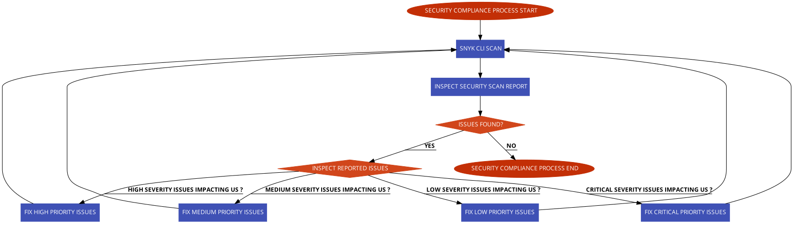

For each reported issue there is a button which you can click on and get remediation assistance:

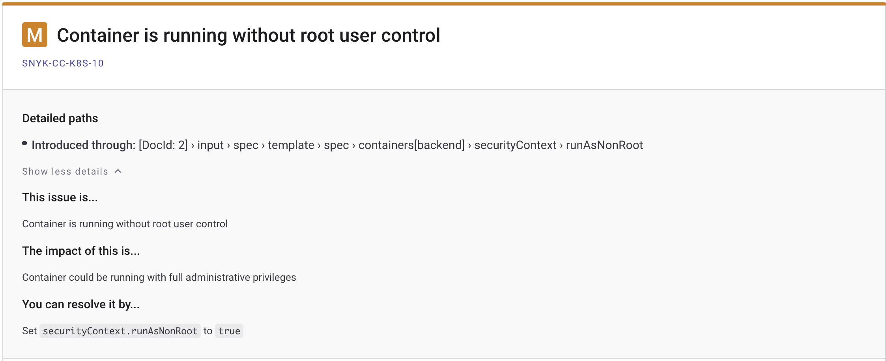

The main procedure is the same for each reported issue. It means, you click on the show details button, then take the suggested steps to apply the fix.

## Step 3 - Using Snyk to Scan for Kubernetes Configuration Vulnerabilities in a CI/CD Pipeline

How do you benefit from embedding a security compliance scanning tool in your CI/CD pipeline and avoid unpleasant situations in a production environment?

It all starts at the foundation level where software development starts. In general, you will want to use a dedicated environment for each stage. So, in the early stages of development when application code changes very often, you should use a dedicated development environment (called the lower environment usually). Then, the application gets more and more refined in the QA environment where QA teams perform manual and/or automated testing. Next, if the application gets the QA team approval it is promoted to the upper environments such as staging, and finally into production. In this process, where the application is promoted from one environment to another, a dedicated pipeline runs which continuously scans application artifacts and checks the severity level. If the severity level doesn't meet a specific threshold, the pipeline fails immediately and application artifacts promotion to production is stopped in the early stages.

So, the security scanning tool (e.g. snyk) acts as a gatekeeper stopping unwanted artifacts getting in your production environment from the early stages of development. In the same manner, upper environments pipelines use snyk to allow or forbid application artifacts entering the final production stage.

### GitHub Actions CI/CD Workflow Implementation

In this step you will learn how to create and test a sample CI/CD pipeline with integrated vulnerability scanning via GitHub workflows. To learn the fundamentals of using Github Actions with DigitalOcean Kubernetes, refer to this [tutorial](https://docs.digitalocean.com/tutorials/enable-push-to-deploy/).

The pipeline provided in the following section builds and deploys the [game-2048-example](https://github.com/digitalocean/kubernetes-sample-apps/tree/master/game-2048-example) application from the DigitalOcean [kubernetes-sample-apps](https://github.com/digitalocean/kubernetes-sample-apps) repository.

At a high level overview, the [game-2048 CI/CD workflow](https://github.com/digitalocean/kubernetes-sample-apps/blob/master/.github/workflows/game-2048-snyk.yaml) provided in the **kubernetes-sample-apps** repo is comprised of the following stages:

1. Application build and test stage - builds main application artifacts and runs automated tests.
2. Snyk application image scan stage - scans application docker image for known vulnerabilities. Acts as a gate and the final pipeline state (pass/fail) is dependent on this step. In case of failure a Slack notification is sent.
3. Application image build and push stage - builds and tags the application image using the latest git commit SHA. Then the image is pushed to DOCR.
4. Snyk infrastructure as code (IAC) scan stage - scans for known vulnerabilities in the Kubernetes YAML manifests associated with the application. Acts as a gate, and the final pipeline state (pass/fail) is dependent on this step. In case of failure a Slack notification is sent as well.
5. Application deployment stage - deploys the application to Kubernetes (DOKS).

Below diagram illustrates each job from the pipeline and the associated steps with actions (only relevant configuration is shown):

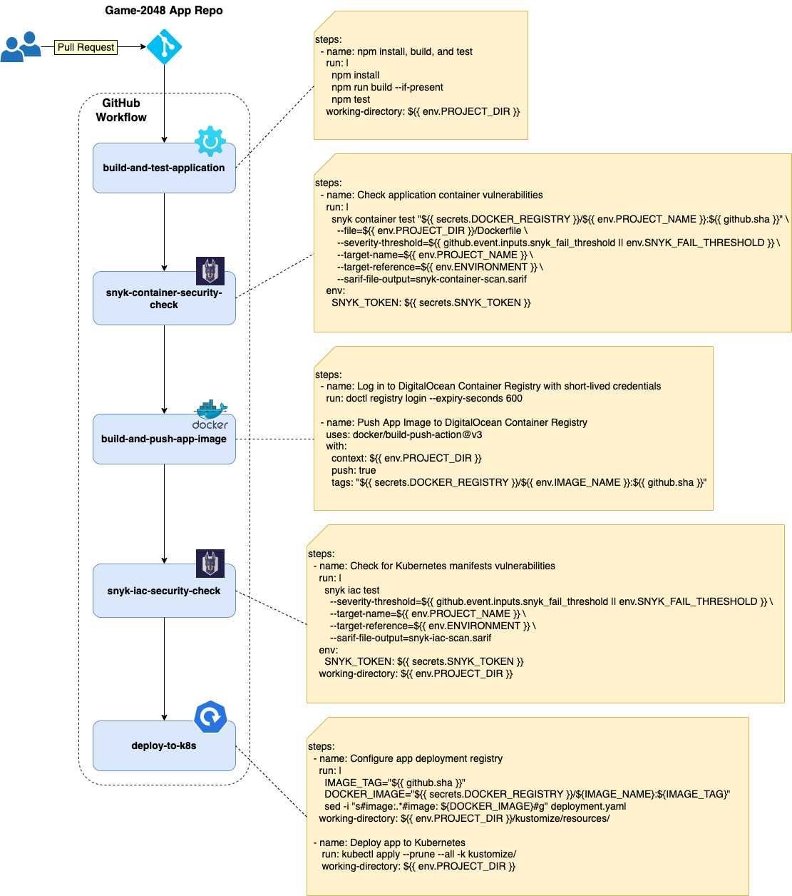

**Notes:**

- In case of kustomize based projects it's best to render the final manifest in order to capture and scan everything (including remote resources). On the other hand, it can be hard to identify which Kubernetes resource needs to be patched. This is due to the fact that the resulting manifest file is comprised of all resources to be applied. This is how kustomize works - it gathers all configuration fragments from each overlay and applies them over a base to build the final compound.
- You can also tell Snyk to scan the entire folder where you keep your kustomize configurations. This way, it's easier to identify what resource needs to be fixed in your repository. Remote resources used by kustomize need to be fixed upstream. Also, Kubernetes secrets and ConfigMaps generated via kustomize are not captured.

How do you fail the pipeline if a certain security compliance level is not met?

Snyk CLI provides a flag named `--severity-threshold` for this purpose. This flag correlates with the overall severity level computed after each scan. In case of Snyk, the severity level takes one of the following values: **low**, **medium**, **high**, or **critical** You can fail or pass the pipeline based on the severity level value and stop application deployment if conditions are not met.

Below picture illustrates the flow for the example CI/CD pipeline used in this guide:

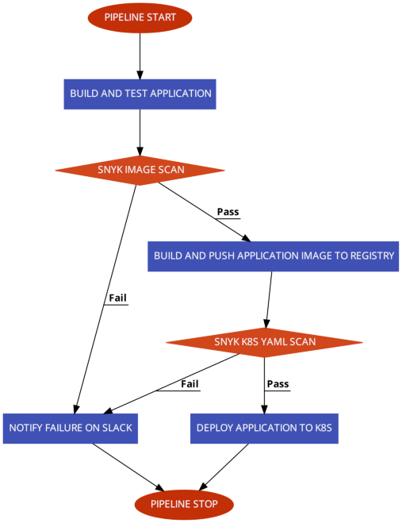

Please follow below steps to create and test the snyk CI/CD GitHub workflow provided in the [kubernetes-sample-apps](https://github.com/digitalocean/kubernetes-sample-apps) GitHub repository:

1. Fork the [kubernetes-sample-apps](https://github.com/digitalocean/kubernetes-sample-apps) GitHub repository.
2. Create the following [GitHub encrypted secrets](https://docs.github.com/en/actions/security-guides/encrypted-secrets#creating-encrypted-secrets-for-a-repository) for your **kubernetes-sample-apps** copy (**Settings Tab** -> **Secrets** -> **Actions**):
   - `DIGITALOCEAN_ACCESS_TOKEN` - holds your DigitalOcean account token.
   - `DOCKER_REGISTRY` - holds your DigitalOcean docker registry name including the endpoint (e.g. `registry.digitalocean.com/sample-apps`).
   - `DOKS_CLUSTER` - holds your DOKS cluster name. You can run the following command to get your DOKS cluster name: `doctl k8s cluster list --no-header --format Name`.
   - `SNYK_TOKEN` - holds your Snyk user account ID - run: `snyk config get api` to get the ID. If that doesn't work, you can retrieve the token from your [user account settings](https://docs.snyk.io/snyk-web-ui/getting-started-with-the-snyk-web-ui#manage-account-preferences-and-settings) page.
   - `SLACK_WEBHOOK_URL` - holds your [Slack incoming webhook URL](https://api.slack.com/messaging/webhooks) used for snyk scan notifications.
3. Navigate to the **Actions** tab of your forked repo and select the **Game 2048 Snyk CI/CD Example** workflow:
   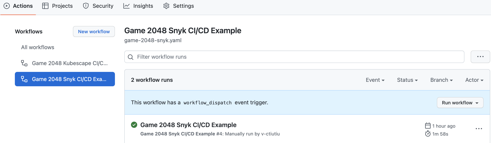
4. Click on the **Run Workflow** button and leave the default values:
   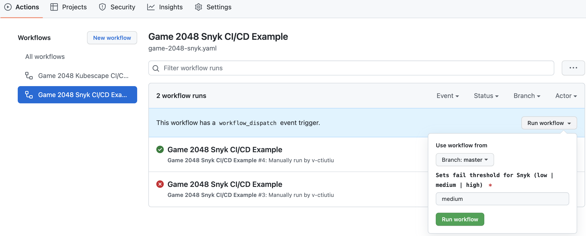

A new entry should appear in below list after clicking the **Run Workflow** green button. Select the running workflow to observe the pipeline progress:

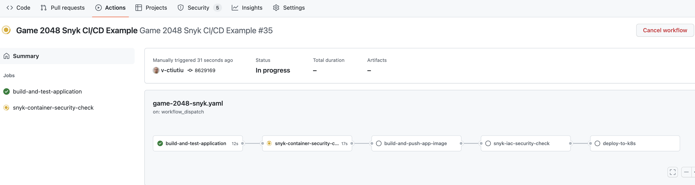

The pipeline will fail and stop when the **snyk-container-security-check** job runs. This is expected because the default severity level value used in the workflow input, which is **medium**, doesn't meet the expectations. You should also receive a Slack notifications with details about the workflow run:

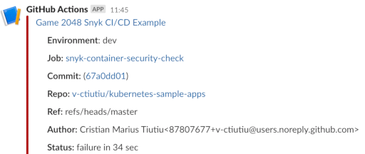

In the next steps, you will learn how to investigate the snyk scan report to fix the issues, lower the severity level, and pass the pipeline.

## Step 4 - Investigating Snyk Scan Results and Fixing Reported Issues

Whenever the severity level threshold is not met, the [game-2048 GitHub workflow](https://github.com/digitalocean/kubernetes-sample-apps/blob/master/.github/workflows/game-2048-snyk.yaml) will fail and a Slack notification is sent with additional details. You also get security reports published to GitHub and accessible in the **Security** tab of your project repository.

The **game-2048 workflow** runs two security checks:

1. Container image security checks - the **snyk-container-security-check** job is used for this purpose. Equivalent snyk command being used is - `snyk container test <GAME-2048-IMAGE>:<TAG> --file=/path/to/game-2048/Dockerfile`.
2. Kubernetes manifests misconfiguration checks - the **snyk-iac-security-check** job is used for this purpose. Equivalent snyk command being used is - `snyk iac test /path/to/project/kubernetes/manifests`.

Thus, lowering the severity level and passing the workflow consists of:

1. Investigating and fixing issues reported by the **snyk-container-security-check** job.
2. Investigating and fixing issues reported by the **snyk-iac-security-check** job.

Next, you will learn how to address each in turn.

### Investigating and Fixing Container Images Vulnerabilities

The sample pipeline used in this guide runs security checks for the **game-2048 container image** and the associated [Dockerfile](https://github.com/v-ctiutiu/kubernetes-sample-apps/blob/master/game-2048-example/Dockerfile) via the **snyk-container-security-check** job.

The **snyk-container-security-check** job runs the following steps:

1. Builds the game-2048 application Docker image locally. This step is implemented using the [docker-build-push](https://github.com/docker/build-push-action) GitHub action.
2. Runs Snyk security checks for the application container image and Dockerfile. This step is implemented using **snyk container test** command. Scan results are exported using the [GitHub SARIF](https://docs.github.com/en/code-security/code-scanning/integrating-with-code-scanning/sarif-support-for-code-scanning) format. Security level threshold is controlled via the **--severity-threshold** argument - it is either set to the `snyk_fail_threshold` input parameter if the workflow is manually triggered, or to `SNYK_FAIL_THRESHOLD` environment variable, if workflow runs automatically.
3. Scan results (SARIF format) are published in the security tab of your application repository. This step is implemented using [codeql](https://github.com/github/codeql-action) GitHub action.

Below snippet shows the main logic of the **snyk-container-security-check** job:

```yaml
- name: Build App Image for Snyk container scanning
  uses: docker/build-push-action@v3
  with:
    context: ${{ env.PROJECT_DIR }}
    push: false
    tags: "${{ secrets.DOCKER_REGISTRY }}/${{ env.PROJECT_NAME }}:${{ github.sha }}"

- name: Check application container vulnerabilities
  run: |
    snyk container test "${{ secrets.DOCKER_REGISTRY }}/${{ env.PROJECT_NAME }}:${{ github.sha }}" \
      --file=Dockerfile \
      --severity-threshold=${{ github.event.inputs.snyk_fail_threshold || env.SNYK_FAIL_THRESHOLD }} \
      --target-name=${{ env.PROJECT_NAME }} \
      --target-reference=${{ env.ENVIRONMENT }} \
      --sarif --sarif-file-output=snyk-container-scan.sarif
  env:
    SNYK_TOKEN: ${{ secrets.SNYK_TOKEN }}
  working-directory: ${{ env.PROJECT_DIR }}

- name: Upload Snyk report SARIF file
  if: ${{ always() }}
  uses: github/codeql-action/upload-sarif@v2
  with:
    sarif_file: ${{ env.PROJECT_DIR }}/snyk-container-scan.sarif
    category: snyk-container-scan
```

In order to fix the reported issues, you need to check first the security tab of your **kubernetes-sample-apps** repository fork:

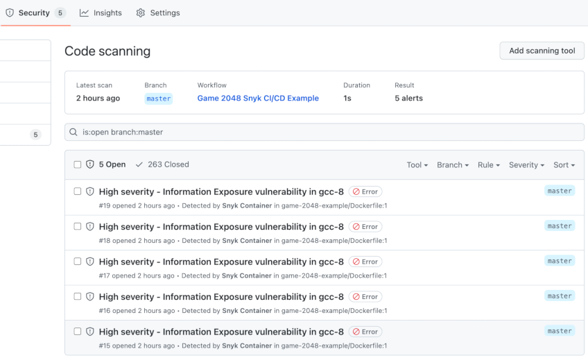

You will see a bunch of vulnerabilities for the base docker image in this case. Click on each to expand and see more details:

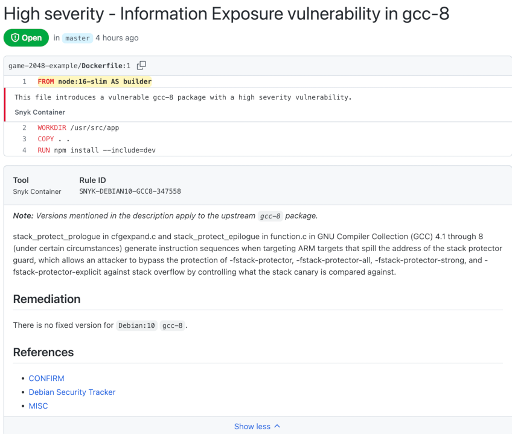

To finish investigations and see recommendations offered by Snyk, you need to inspect the **snyk-container-security-check** job output from the main workflow:

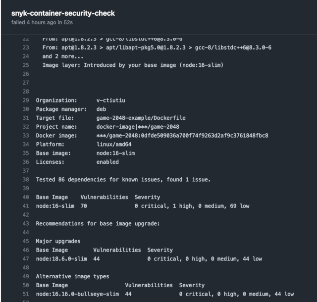

**Note:**

**Snyk container test** offers the possibility to export results in SARIF format, but it doesn't know how to upload reports to the Snyk cloud portal. On the other hand, **snyk container monitor** offers the possibility to upload results to the Snyk cloud portal, but it cannot export SARIF. So this guide is using snyk container test with SARIF exporting feature. Some recommendations are not available in the SARIF output unfortunately. So, you must also look in the job console output for recommendations.

The **snyk-container-security-check** job output shows that Snyk recommends to update the base image version from **node:16-slim** to **node:18.6.0-slim**. This change eliminates the high risk issue(s), and also lowers the number of other reported vulnerabilities from **70** to **44** - this is a substantial reduction of almost **50%** !!!

Now, open the game-2048 application **Dockerfile** from your fork, and change the **FROM** directives to point to the new version (**node:18.6.0-slim** at this time of writing):

```dockerfile
FROM node:18.6.0-slim AS builder
WORKDIR /usr/src/app
COPY . .
RUN npm install --include=dev
#
# Build mode can be set via NODE_ENV environment variable (development or production)
# See project package.json and webpack.config.js
#
ENV NODE_ENV=development
RUN npm run build

FROM node:18.6.0-slim
RUN npm install http-server -g
RUN mkdir /public
WORKDIR /public
COPY --from=builder /usr/src/app/dist/ ./
EXPOSE 8080
USER 1000
CMD ["http-server"]
```

Finally, commit changes to your GitHub repository and trigger the workflow again (leaving the default values on). This time the **snyk-container-security-check** job should pass:

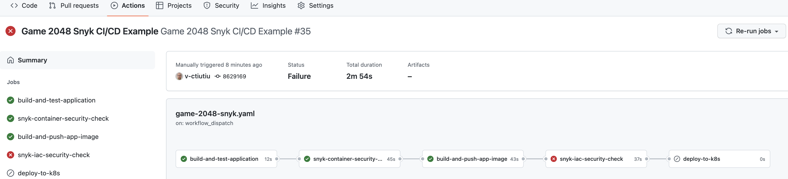

Going to the security tab of your project, there should be no issues reported.

How do you make sure to reduce base image vulnerabilities in the future?

The best approach is to use a base image with a minimal footprint - the lesser the binaries or dependencies in the base image, the better. Another good practice is to continuously monitor your projects, as explained in the [Monitor your Projects on a Regular Basis](#monitor-your-projects-on-a-regular-basis) section of this guide.

You will notice that the pipeline still fails, but this time at the **snyk-iac-security-check** phase. This is expected because there are security issues with the Kubernetes manifests used to deploy the application. In the next section, you will learn how to investigate this situation and apply Snyk security recommendations to fix the reported issues.

### Investigating and Fixing Kubernetes Manifests Vulnerabilities

The pipeline is still failing and stops at the **snyk-iac-security-check** job. This is expected because the default severity level value used in the workflow input, which is **medium**, doesn't meet the security requirements for the project.

The **snyk-iac-security-check** job checks for Kubernetes manifests vulnerabilities (or misconfigurations), and executes the following steps:

1. Snyk security checks for Kubernetes manifests from the **game-2048-example** project directory. This step is implemented using **snyk iac test** command. Scan results are exported using the [GitHub SARIF](https://docs.github.com/en/code-security/code-scanning/integrating-with-code-scanning/sarif-support-for-code-scanning) format. Security level threshold is controlled via the **--severity-threshold** argument - it is either set to the `snyk_fail_threshold` input parameter if the workflow is manually triggered, or to `SNYK_FAIL_THRESHOLD` environment variable, if workflow runs automatically. Finally, the **--report** argument is also used to send scan results to the Snyk cloud portal.
2. Scan results (SARIF format) are published to the security tab of your application repository. This step is implemented using the [codeql](https://github.com/github/codeql-action) GitHub action.

Below snippet shows the actual implementation of each step from the **snyk-iac-security-check** job:

```yaml
- name: Check for Kubernetes manifests vulnerabilities
  run: |
    snyk iac test \
      --severity-threshold=${{ github.event.inputs.snyk_fail_threshold || env.SNYK_FAIL_THRESHOLD }} \
      --target-name=${{ env.PROJECT_NAME }} \
      --target-reference=${{ env.ENVIRONMENT }} \
      --sarif --sarif-file-output=snyk-iac-scan.sarif \
      --report
  env:
    SNYK_TOKEN: ${{ secrets.SNYK_TOKEN }}
  working-directory: ${{ env.PROJECT_DIR }}

- name: Upload Snyk IAC SARIF file
  if: ${{ always() }}
  uses: github/codeql-action/upload-sarif@v2
  with:
    sarif_file: ${{ env.PROJECT_DIR }}/snyk-iac-scan.sarif
    category: snyk-iac-scan
```

In order to fix the reported issues you have two options:

1. Use the Snyk cloud portal and access the **game-2048** project to check for details:
  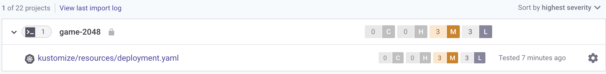
2. Use the security tab of your game-2048 app repository to check for details:
  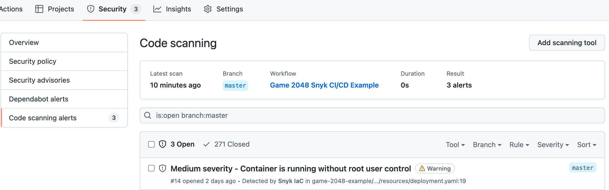

Either way, you will get recommendations about how to fix the reported issues.

For this guide you will be using the Snyk cloud portal to investigate the reported security issues. First, click on the **game-2048-example** entry from the projects list, then select the **kustomize/resources/deployment.yaml** file:

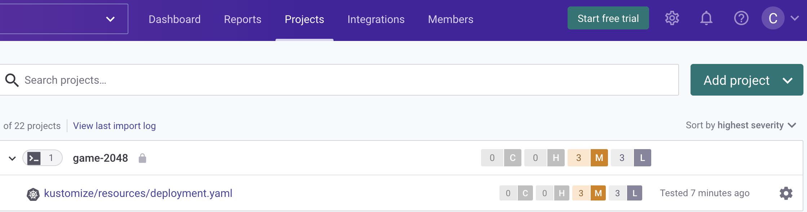

Next, tick the **Medium** checkbox in the **Severity** submenu from the left to display only **medium** level issues:

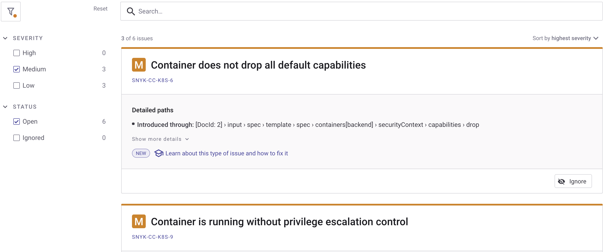

Then, you can inspect each reported issue card and check the details. Go ahead and click on the **Show more details** button from the **Container is running without root user control** card - you will receive more details about the current issue, and important hints about how to fix it:


After collecting all information from each card, you can go ahead and edit the [deployment.yaml](https://github.com/digitalocean/kubernetes-sample-apps/blob/master/game-2048-example/kustomize/resources/deployment.yaml) file from your repo (located in the `game-2048-example/kustomize/resources` subfolder). The fixes are already in place, you just need to uncomment the last lines from the file. The final `deployment.yaml` file should look like below:

```yaml
---
apiVersion: apps/v1
kind: Deployment
metadata:
  name: game-2048
spec:
  replicas: 1
  selector:
    matchLabels:
      app: game-2048
  strategy:
    type: RollingUpdate
  template:
    metadata:
      labels:
        app: game-2048
    spec:
      containers:
        - name: backend
          # Replace the `<>` placeholders with your docker registry info
          image: registry.digitalocean.com/sample-apps/2048-game:latest
          ports:
            - name: http
              containerPort: 8080
          resources:
            requests:
              cpu: 100m
              memory: 50Mi
            limits:
              cpu: 200m
              memory: 100Mi
          securityContext:
            readOnlyRootFilesystem: true
            runAsNonRoot: true
            allowPrivilegeEscalation: false
            capabilities:
              drop:
                - all
```

What changed? The following security fixes were applied:

- `readOnlyRootFilesystem` - runs container image in read only (cannot alter files by `kubectl exec` in the container).
- `runAsNonRoot` - runs as the non root user defined by the [USER](https://github.com/digitalocean/kubernetes-sample-apps/blob/master/game-2048-example/Dockerfile#L18) directive from the game-2048 project [Dockerfile](https://github.com/digitalocean/kubernetes-sample-apps/blob/master/game-2048-example/Dockerfile).
- `allowPrivilegeEscalation` - setting **allowPrivilegeEscalation** to **false** ensures that no child process of a container can gain more privileges than its parent.
- `capabilities.drop` - To make containers more secure, you should provide containers with the least amount of privileges it needs to run. In practice, you drop everything by default, then add required capabilities step by step. You can learn more about container capabilities [here](https://learn.snyk.io/lessons/container-does-not-drop-all-default-capabilities/kubernetes/).

Finally, commit the changes for the **deployment.yaml** file and push to main branch. After manually triggering the workflow it should complete successfully this time:

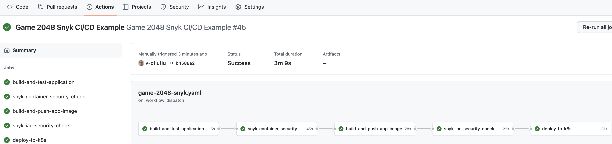

You should also receive a green Slack notification from the snyk scan job. Navigate to the Snyk portal link and check if the issues that you fixed recently are gone - there should be no **medium level** issues reported.

A few final checks can be performed as well on the Kubernetes side to verify if the reported issues were fixed:

1. Check if the game-2048 deployment has a read-only (immutable) filesystem by writing to the **index.html** file used by the game-2048 application:

   ```shell
   kubectl exec -it deployment/game-2048 -n game-2048 -- /bin/bash -c "echo > /public/index.html"
   ```

   The output looks similar to:

   ```text
   /bin/bash: /public/index.html: Read-only file system
   command terminated with exit code 1
   ```

2. Check if the container runs as non-root user (should print a integer number different than zero - e.g. **1000**):

   ```shell
   kubectl exec -it deployment/game-2048 -n game-2048 -- id -u
   ```

If all checks pass then you applied the required security recommendations successfully.

### Monitor your Projects on a Regular Basis

The vulnerability scan automation you implemented so far is a good starting point, but not perfect. Why?

One issue with the current approach is that you never know when new issues are reported for the assets you already deployed in your environments. In other words, you assessed the security risks and took the measures to fix the issues at one specific point in time - when your CI/CD automation was executed.

But, what if new issues are reported meanwhile and your application is vulnerable again? Snyk helps you overcome this situation via the [monitoring](https://docs.snyk.io/snyk-cli/test-for-vulnerabilities/monitor-your-projects-at-regular-intervals) feature. The monitoring feature of Snyk helps you address new vulnerabilities, which are constantly disclosed. When combined with the Snyk Slack integration (explained in [Step 6 - Enabling Slack Notifications](#step-6---enabling-slack-notifications)), you can take immediate actions to fix new disclosed issues that may affect your application in a production environment.

To benefit from this feature all you have to do is just use the **snyk monitor** command before any deploy steps in your CI/CD pipeline. The syntax is very similar to the **snyk test** commands (one of the cool things about snyk CLI is that it was designed with uniformity in mind). The snyk monitor command will send a snapshot to the Snyk cloud portal, and from there you will get notified about newly disclosed vulnerabilities for your project.

In terms of the GitHub workflow automation, you can snyk monitor your application container in the **snyk-container-security-check** job, after testing for vulnerabilities. Below snippet shows a practical implementation for the pipeline used in this guide (some steps were omitted for clarity):

```yaml
snyk-container-security-check:
    runs-on: ubuntu-latest
    needs: build-and-test-application

    steps:
      - name: Checkout
        uses: actions/checkout@v3

      ...

      - name: Check application container vulnerabilities
        run: |
          snyk container test "${{ secrets.DOCKER_REGISTRY }}/${{ env.PROJECT_NAME }}:${{ github.sha }}" \
            --file=${{ env.PROJECT_DIR }}/Dockerfile \
            --severity-threshold=${{ github.event.inputs.snyk_fail_threshold || env.SNYK_FAIL_THRESHOLD }} \
            --target-name=${{ env.PROJECT_NAME }} \
            --target-reference=${{ env.ENVIRONMENT }} \
            --sarif-file-output=snyk-container-scan.sarif
        env:
          SNYK_TOKEN: ${{ secrets.SNYK_TOKEN }}

      - name: Monitor the application container using Snyk
        run: |
          snyk container monitor "${{ secrets.DOCKER_REGISTRY }}/${{ env.PROJECT_NAME }}:${{ github.sha }}" \
            --file=${{ env.PROJECT_DIR }}/Dockerfile
        env:
          SNYK_TOKEN: ${{ secrets.SNYK_TOKEN }}
      
      ...
```

Above snippet shows an additional step called **Monitor the application container using Snyk** where the actual snyk container monitor runs.

After the snyk monitor command runs, you can log in to the Snyk Web UI to see the latest snapshot and history of your [project](https://app.snyk.io/monitor/):

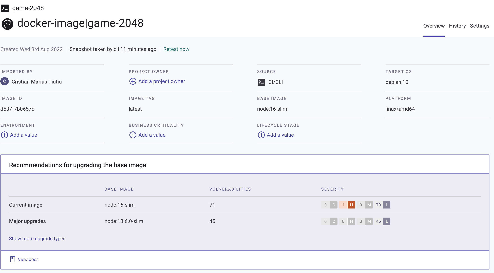

You can test and monitor your application source code as well in the **build-and-test-application** job. Below snippet shows an example implementation for the GitHub workflow used in this guide:

```yaml
build-and-test-application:
    runs-on: ubuntu-latest

    steps:
      - name: Checkout
        uses: actions/checkout@v3

      - name: npm install, build, and test
        run: |
          npm install
          npm run build --if-present
          npm test
        working-directory: ${{ env.PROJECT_DIR }}

      - name: Snyk code test and monitoring
        run: |
          snyk test ${{ env.PROJECT_DIR }}
          snyk monitor ${{ env.PROJECT_DIR }}
        env:
          SNYK_TOKEN: ${{ secrets.SNYK_TOKEN }}
```

Next, you will receive Slack notifications on a regular basis about newly disclosed vulnerabilities for your project.

### Treating Exceptions

There are situations when you don't want the final report to be affected by some issues which your team consider is safe to ignore. Snyk offers a builtin feature to manage exceptions and overcome this situation.

You can read more about this feature [here](https://docs.snyk.io/features/fixing-and-prioritizing-issues/issue-management/ignore-issues).

### Snyk for IDEs

A more efficient approach is where you integrate vulnerability scan tools directly in your favorite IDE (or Integrated Development Environment). This way you can detect and fix security issues ahead of time in the software development cycle.

Snyk offers support for a variety of IDEs, such as:

1. [Eclipse plugin](https://docs.snyk.io/ide-tools/eclipse-plugin).
2. [JetBrains plugin](https://docs.snyk.io/ide-tools/jetbrains-plugins).
3. [Visual Studio extension](https://docs.snyk.io/ide-tools/visual-studio-extension).
4. [Visual Studio Code extension](https://docs.snyk.io/ide-tools/visual-studio-code-extension-for-snyk-code).

Above plugins will help you detect and fix issues in the early stages of development, thus eliminating frustration, costs, and security flaws in production systems. Also, it helps you to reduce the iterations end human effort on the long run. As an example, for each reported security issue by your CI/CD automation you need to go back and fix the issue in your code, commit changes, wait for the CI/CD automation again, then repeat in case of failure.

You can read more about these features on the [Snyk for IDEs](https://docs.snyk.io/ide-tools) page from the official documentation.

## Step 5 - Triggering the Snyk CI/CD Workflow Automatically

You can set the workflow to trigger automatically on each commit or PR against the main branch by uncommenting the following lines at the top of the [game-2048-snyk.yaml](https://github.com/digitalocean/kubernetes-sample-apps/blob/master/.github/workflows/game-2048-snyk.yaml) file:

```yaml
on:
  push:
    branches: [ master ]
  pull_request:
    branches: [ master ]
```

After editing the file, commit the changes to your main branch and you should be ready to go.

## Step 6 - Enabling Slack Notifications

You can set up Snyk to send Slack alerts about new vulnerabilities discovered in your projects, and about new upgrades or patches that have become available.

To set it up, you will need to generate a Slack webhook. You can either do this via [Incoming WebHooks](https://api.slack.com/messaging/webhooks) or by creating your own [Slack App](https://api.slack.com/start/building). Once you have generated your Slack Webhook URL, go to your 'Manage organization’ settings, enter the URL, and click the **Connect** button:

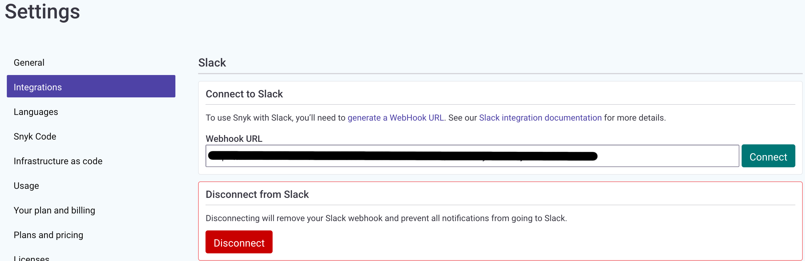

## Conclusion

In this guide you learned how to use a pretty flexible and powerful Kubernetes vulnerability scanning tool - [Snyk](https://snyk.io). Then, you learned how to integrate the Snyk vulnerability scanning tool in a traditional CI/CD pipeline implemented using GitHub workflows.

Finally, you learned how to investigate vulnerability scan reports, apply fixes to remediate the situation, and reduce security risks to a minimum via a practical example - the [game-2048](https://github.com/digitalocean/kubernetes-sample-apps/tree/master/game-2048-example) application from the [kubernetes-sample-apps](https://github.com/digitalocean/kubernetes-sample-apps) repository.

## Additional Resources

You can learn more by reading the following additional resources:

- [Kubernetes Security Best Practices Article from Snyk](https://snyk.io/learn/kubernetes-security/)
- [More about Snyk Security Levels](https://docs.snyk.io/introducing-snyk/snyks-core-concepts/severity-levels)
- [Vulnerability Assessment](https://snyk.io/learn/vulnerability-assessment/)
- [Snyk Targets and Projects](https://docs.snyk.io/introducing-snyk/introduction-to-snyk-projects)
- [Snyk for IDEs](https://docs.snyk.io/ide-tools)
- [Discover more Snyk Integrations](https://docs.snyk.io/integrations)
- [Snyk Web UI Users and Group Management](https://docs.snyk.io/features/user-and-group-management)
- [Fixing and Prioritizing Issues Reported by Snyk](https://docs.snyk.io/features/fixing-and-prioritizing-issues)
- [Snyk Github Action Used in this Guide](https://github.com/snyk/actions)
