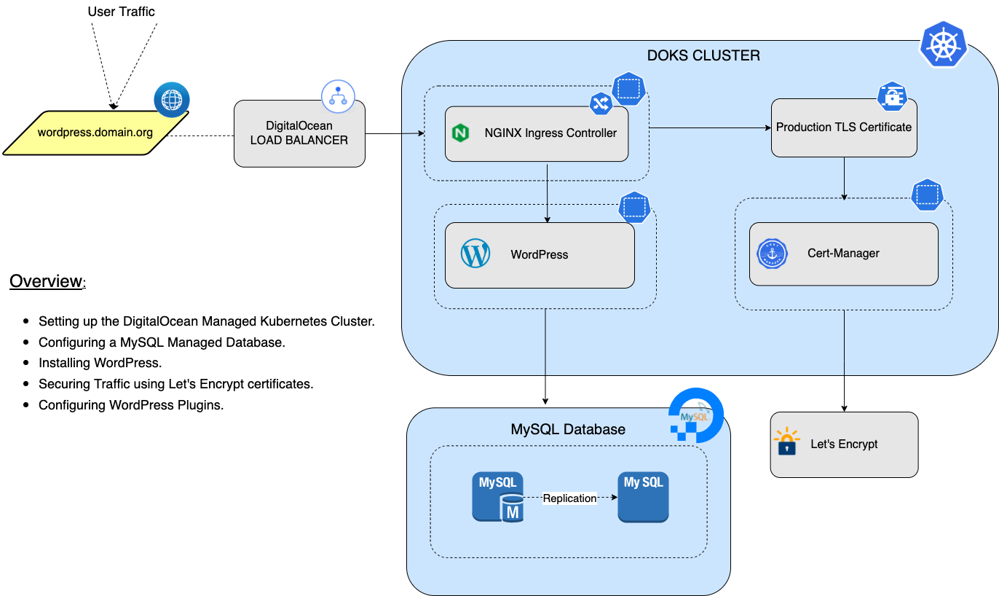

## Overview

[WordPress](https://wordpress.org/about/) is an open source software designed for everyone, emphasising accessibility, performance, security, and ease of use to create a website, blog, or app. [WordPress](https://en.wikipedia.org/wiki/WordPress) is a content managment system (CMS) built on PHP and using MySQL as a data store, powering over 30% of internet sites today.

In this tutorial, you will use Helm for setting up [WordPress](https://wordpress.com/) on top of a Kubernetes cluster, in order to create a highly-available website. In addition to leveraging the intrinsic scalability and high availability aspects of Kubernetes, this setup will help keeping WordPress secure by providing simplified upgrade and rollback workflows via Helm.

You will be configuring [NitroPack](https://wordpress.org/plugins/nitropack/), a plugin used for code minification, caching, CDN and lazy loading.

You will be using an external MySQL server in order to abstract the database component, since it can be part of a separate cluster or managed service for extended availability. After completing the steps described in this tutorial, you will have a fully functional WordPress installation within a containerized cluster environment managed by Kubernetes.

## WordPress Setup Diagram



## Table of Contents

- [Overview](#overview)
- [WordPress Setup Diagram](#wordpress-setup-diagram)
- [Prerequisites](#prerequisites)
- [Setting up a DigitalOcean Managed Kubernetes Cluster (DOKS)](#setting-up-a-digitalocean-managed-kubernetes-cluster-doks)
- [Configuring the WordPress MySQL DO Managed Database](#configuring-the-wordpress-mysql-do-managed-database)
- [Installing and configuring the OpenEBS Dynamic NFS Provisioner](#installing-and-configuring-the-openebs-dynamic-nfs-provisioner)
- [Installing WordPress](#installing-wordpress)
  - [Deploying the Helm Chart](#deploying-the-helm-chart)
  - [Securing Traffic using Let's Encrypt Certificates](#securing-traffic-using-lets-encrypt-certificates)
    - [Installing the Nginx Ingress Controller](#installing-the-nginx-ingress-controller)
    - [Configuring DNS for Nginx Ingress Controller](#configuring-dns-for-nginx-ingress-controller)
    - [Installing Cert-Manager](#installing-cert-manager)
    - [Configuring Production Ready TLS Certificates for WordPress](#configuring-production-ready-tls-certificates-for-wordpress)
  - [Enabling WordPress Monitoring Metrics](#enabling-wordpress-monitoring-metrics)
  - [Configuring the NitroPack Plugin](#configuring-the-nitropack-plugin)
  - [Upgrading WordPress](#upgrading-wordpress)
- [Conclusion](#conclusion)

## Prerequisites

To complete this tutorial, you will need:

1. [Helm](https://www.helm.sh/), for managing WordPress, Nginx Ingress Controller and Cert-Mananger releases and upgrades.
2. [Doctl](https://github.com/digitalocean/doctl/releases) CLI, for `DigitalOcean` API interaction.
3. [Kubectl](https://kubernetes.io/docs/tasks/tools) CLI, for `Kubernetes` interaction.
4. Basic knowledge on how to run and operate `DOKS` clusters. You can learn more [here](https://docs.digitalocean.com/products/kubernetes).
5. A domain name from [GoDaddy](https://uk.godaddy.com), [Cloudflare](https://uk.godaddy.com) etc, to configure `DNS` within your `DigitalOcean` account

## Setting up a DigitalOcean Managed Kubernetes Cluster (DOKS)

Before proceeding with tutorial steps, you need a DigitalOcean Managed Kubernetes Cluster (DOKS) available and ready to use. If you already have one configured, you can skip to the next section - [Configuring the WordPress MySQL DO Managed Database](#configuring-the-wordpress-mysql-do-managed-database).

You can use below command to create a new DOKS cluster:

```console
doctl k8s cluster create <YOUR_CLUSTER_NAME> \
  --auto-upgrade=false \
  --maintenance-window "saturday=21:00" \
  --node-pool "name=basicnp;size=s-4vcpu-8gb-amd;count=3;tag=cluster2;label=type=basic;auto-scale=true;min-nodes=2;max-nodes=4" \
  --region nyc1
```

**Notes:**

- We recommend using a DOKS cluster with a minimum of 2 worker nodes to reduce application impact in case of node failures. The example from this tutorial is using 3 worker nodes, 4cpu/8gb (`$48/month`) each, and the autoscaler configured between 2 and 4 nodes max. So, your cluster cost is between `$96-$192/month` with `hourly` billing. To choose a different node type, you can pick another slug from `doctl compute size list`.

- Please visit [How to Set Up a DigitalOcean Managed Kubernetes Cluster (DOKS)](https://github.com/digitalocean/Kubernetes-Starter-Kit-Developers/tree/main/01-setup-DOKS) for more details.

## Configuring the WordPress MySQL DO Managed Database

In this section, you will create a dedicated MySQL database such as [DigitalOcean’s Managed Databases](https://docs.digitalocean.com/products/databases/mysql/) for WordPress. This is necessary because your WordPress installation will live on a separate server inside the Kubernetes cluster.

**Notes:**

- By default, WordPress Helm chart installs MariaDB on a separate pod inside the cluster and configures it as the default database. Before deciding on using a managed database vs the default one (MariaDB), you should consider the following aspects::
  - With a managed database service you only need to decide on the initial size of the database server and you are good to go. Another appeal is the automation side. Performing updates, running migrations, and creating backups are done automatically. Please see this [article](https://www.digitalocean.com/community/tutorials/understanding-managed-databases) for more information on managed databases. Using a managed database comes at an extra cost.
  - With the MariaDB default Helm chart installation it is important to note that DB pods (the database application containers) are transient, so they can restart or fail more often. Specific administrative tasks like backups or scaling require more manual work and setup to achieve those goals. Using the MariaDB install will not create any additional costs.

If you don't want to use an external database, please skip to the next chapter - [Installing and configuring the OpenEBS Dynamic NFS Provisioner](#installing-and-configuring-the-openebs-dynamic-nfs-provisioner).

First, create the MySQL managed database:

```console
doctl databases create wordpress-mysql --engine mysql --region nyc1 --num-nodes 2 --size db-s-2vcpu-4gb
```

**Note:**

The example from this tutorial is using one master node and one slave node, 2cpu/4gb (`$100 monthly billing`). For a list of available sizes, visit: <https://docs.digitalocean.com/reference/api/api-reference/#tag/Databases>.

The output looks similar to the following (the `STATE` column should display `online`):

``` text
ID                                      Name                    Engine    Version    Number of Nodes    Region    Status      Size
2f0d0969-a8e1-4f94-8b73-2d43c68f8e72    wordpress-mysql-test    mysql     8          1                  nyc1      online    db-s-1vcpu-1gb
```

**Note:**

- To finish setting up MySQL, the database ID is required. You can run below command, to print your MySQL database ID:

  ```console
  doctl databases list
  ```

Next, create the WordPress database user:

```console
doctl databases user create 2f0d0969-a8e1-4f94-8b73-2d43c68f8e72 wordpress_user
```

The output looks similar to the following (the password will be generated automatically):

```text
Name              Role      Password
wordpress_user    normal    *******
```

**Note:**

By default, new users get full permissions for the entire database. In general, it's best security practice to restrict new user privileges to the wordpress database only. You can follow the [How to Modify User Privileges in MySQL Databases](https://docs.digitalocean.com/products/databases/mysql/how-to/modify-user-privileges/) guide provided by DigitalOcean to accomplish this task.

Next, create the main WordPress database:

```console
doctl databases db create 2f0d0969-a8e1-4f94-8b73-2d43c68f8e72 wordpress
```

The output looks similar to the following (the password will be generated automatically):

```text
Name
wordpress
```

Finally, you need to setup the trusted sources between your MySQL database and your Kubernetes Cluster (DOKS):

 1. First extract the Kubernetes Cluster ID:

    ```console
    doctl kubernetes cluster list
    ```

    The output looks similar to the following:

    ```text
    ID                                      Name                       Region    Version         Auto Upgrade    Status     Node Pools
    c278b4a3-19f0-4de6-b1b2-6d90d94faa3b    k8s-cluster   nyc1      1.21.10-do.0    false           running    basic
    ```

 2. Finally, restrict the incoming connections:

    ```console
    doctl databases firewalls append 2f0d0969-a8e1-4f94-8b73-2d43c68f8e72 --rule k8s:c278b4a3-19f0-4de6-b1b2-6d90d94faa3b
    ````

    **Note:**

    - 2f0d0969-a8e1-4f94-8b73-2d43c68f8e72: represents the database id
    - c278b4a3-19f0-4de6-b1b2-6d90d94faa3b: represents the kubernetes id

**Note:**

Please visit [How to Secure MySQL Managed Database Clusters](https://docs.digitalocean.com/products/databases/mysql/how-to/secure/) for more details.

## Installing and configuring the OpenEBS Dynamic NFS Provisioner

A new [DigitalOcean Block Storage](https://docs.digitalocean.com/products/volumes/) volume is provisioned each time you use a [PersistentVolume](https://kubernetes.io/docs/concepts/storage/persistent-volumes/) as part of your Kubernetes stateful application. The [StorageClass](https://kubernetes.io/docs/concepts/storage/storage-classes/) resource tells Kubernetes about the underlying storage type available. DigitalOcean is using [do-block-storage](https://github.com/digitalocean/csi-digitalocean) by default.

Below command lists the available storage classes for your Kubernetes cluster:

```console
kubectl get sc
```

The output looks similar to:

```text
NAME                         PROVISIONER                 RECLAIMPOLICY   VOLUMEBINDINGMODE   ALLOWVOLUMEEXPANSION   AGE
do-block-storage (default)   dobs.csi.digitalocean.com   Delete          Immediate           true                   24h
```

DigitalOcean Block Storage Volumes are mounted as read-write by a single node (RWO). Additional nodes cannot mount the same volume. The data content of a PersistentVolume can not be accessed by multiple Pods simultaneously.

Horizontal pod autoscaling (HPA) is used to scale the WordPress Pods in a dynamically StatefulSet, hence WordPress requires a [volume](https://kubernetes.io/docs/concepts/storage/volumes/) mounted as read-write by many nodes (RWX).

NFS (Network File System) is a commonly used solution to provide RWX volumes on block storage. This server offers a PersistentVolumeClaim (PVC) in RWX mode so that multiple web applications can access the data in a shared fashion.

OpenEBS Dynamic NFS Provisioner allows users to create a NFS PV that sets up a new Kernel NFS instance for each PV on top of the user's choice of backend storage.

**Note:**

Please visit [OpenEBS](https://openebs.io/) for more details.

Next, you will install the OpenEBS Dynamic NFS Provisioner on your Kubernetes cluster using the [OpenEBS Helm Chart](https://github.com/openebs/dynamic-nfs-provisioner). You will be installing and configuring only the dynamic nfs provisioner, since Wordpress requires it.

First, clone the `container-blueprints` repository. Then, change directory to your local copy and to the `DOKS-wordpress` subfolder:

```shell

git clone https://github.com/digitalocean/container-blueprints.git
cd container-blueprints/DOKS-wordpress

```

Next, add the `Helm` repository:

```console
helm repo add openebs-nfs https://openebs.github.io/dynamic-nfs-provisioner

helm repo update
```

Next, open and inspect the `assets/manifests/openEBS-nfs-provisioner.yaml` file provided in the repository:

```yaml
nfsStorageClass:
  backendStorageClass: "do-block-storage"
```

**Note:**

The override shown above changes the default value for the `backendStorageClass` to [do-block-storage](https://www.digitalocean.com/products/block-storage). Please visit [openebs nfs provisioner helm values](https://github.com/openebs/dynamic-nfs-provisioner/blob/develop/deploy/helm/charts/values.yaml) for the full values.yaml file and more details.

Finally, install the chart using Helm:

```console
helm install openebs-nfs openebs-nfs/nfs-provisioner --version 0.9.0 \
  --namespace openebs \
  --create-namespace \
  -f "assets/manifests/openEBS-nfs-provisioner.yaml"
```

**Note:**
A specific version for the Helm chart is used. In this case 0.9.0 was picked, which maps to the 0.9.0 version of the application. It’s good practice in general, to lock on a specific version. This helps to have predictable results, and allows versioning control via Git.

You can verify openEBS deployment status via:

```console
helm ls -n openebs
```

The output looks similar to (notice that the STATUS column value is deployed):

```text
NAME            NAMESPACE       REVISION        UPDATED                                 STATUS          CHART                   APP VERSION
openebs-nfs     openebs         1               2022-05-09 10:58:14.388721 +0300 EEST   deployed        nfs-provisioner-0.9.0   0.9.0  
```

NFS provisioner requires a block storage device to create the disk capacity required for the NFS server. Next, you will configure the default Kubernetes Storage Class (do-block-storage) provided by DigitalOcean as the backend storage for the NFS provisioner. In that case, whichever application uses the newly created following Storage Class, can consume shared storage (NFS) on a DigitalOcean volume using OpenEBS NFS provisioner.

Create a YAML file `sc-rwx.yaml`:

```yaml
---
apiVersion: storage.k8s.io/v1
kind: StorageClass
metadata:
  name: rwx-storage
  annotations: 
    openebs.io/cas-type: nsfrwx
    cas.openebs.io/config: |
      - name: NSFServerType
        value: "kernel"
      - name: BackendStorageClass
        value: "do-block-storage"
provisioner: openebs.io/nfsrwx
reclaimPolicy: Delete
```

Explanations for the above configuration:

- `provisioner` - defines what storage class is used for provisioning PVs (e.g. openebs.io/nfsrwx)
- `reclaimPolicy` - dynamically provisioned volumes are automatically deleted when a user deletes the corresponding PersistentVolumeClaim

For more information please about openEBS please visit the [OpenEBS Documentation](https://openebs.io/docs).

Apply via kubectl:

```console
kubectl apply -f assets/manifests/sc-rwx.yaml
```

Verify that the StorageClass was created by executing the command below:

```console
kubectl get sc
```

The ouput looks similar to:

```text
NAME                         PROVISIONER                 RECLAIMPOLICY   VOLUMEBINDINGMODE   ALLOWVOLUMEEXPANSION   AGE
do-block-storage (default)   dobs.csi.digitalocean.com   Delete          Immediate           true                   107m
openebs-kernel-nfs           openebs.io/nfsrwx           Delete          Immediate           false                  84m
rwx-storage                  openebs.io/nfsrwx           Delete          Immediate           false                  84m
```

Now, you have a new StorageClass named rwx-storage to dynamically provision shared volumes on top of DigitalOcean Block Storage.

## Installing WordPress

### Deploying the Helm Chart

In this section, you will install WordPress in your Kubernetes cluster using the [Bitnami WordPress Helm Chart](https://github.com/bitnami/charts/tree/master/bitnami/wordpress/).

Most important Helm chart values are:

- `externalDatabase`- configures WordPress to use an external database (such as a DO managed MySQL database).
- `mariadb.enabled` - configures WordPress to use an in-cluster database (e.g. MariaDB).

First, add the `Helm` repo, and list the available `charts`:

```console
helm repo add bitnami https://charts.bitnami.com/bitnami

helm repo update bitnami
```

Next, create a YAML file `(values.yaml)` to override the helm values:

```yaml
# WordPress service type
service:
  type: ClusterIP

# Enable persistence using Persistent Volume Claims
persistence:
  enabled: true
  storageClassName: rwx-storage
  accessModes: ["ReadWriteMany"]
  size: 5Gi

volumePermissions:
  enabled: true

# Prometheus Exporter / Metrics configuration
metrics:
  enabled: false

# Level of auto-updates to allow. Allowed values: major, minor or none.
wordpressAutoUpdateLevel: minor

# Scheme to use to generate WordPress URLs
wordpressScheme: https

# WordPress credentials
wordpressUsername: <YOUR_WORDPRESS_USER_NAME_HERE>
wordpressPassword: <YOUR_WORDPRESS_USER_PASSSWORD_HERE>

# External Database details
externalDatabase:
  host: <YOUR_WORDPRESS_MYSQL_DB_HOST_HERE>
  port: 25060
  user: <YOUR_WORDPRESS_MYSQL_DB_USER_NAME_HERE>
  password: <YOUR_WORDPRESS_MYSQL_DB_USER_PASSWORD_HERE>
  database: <YOUR_WORDPRESS_MYSQL_DB_NAME_HERE>

# Disabling MariaDB
mariadb:
  enabled: false

```

**Note:**

Most of the overrides are self-explanatory and can be customized. Please visit [wordpress helm values](https://github.com/bitnami/charts/blob/master/bitnami/wordpress/values.yaml) for more details.

Finally, install the chart using Helm:

```console
helm upgrade wordpress bitnami/wordpress \
    --atomic \
    --create-namespace \
    --install \
    --namespace wordpress \
    --version 13.1.4 \
    --values assets/manifests/values.yaml
```

**Note:**

A specific version for the wordpress `Helm` chart is used. In this case `13.1.4` was picked, which maps to the `5.9.2` release of WordPress. It’s good practice in general, to lock on a specific version. This helps to have predictable results, and allows versioning control via Git.

Check Helm release status:

```console
helm ls -n wordpress
```

The output looks similar to (notice the `STATUS` column which has the `deployed` value):

```text
NAME      NAMESPACE REVISION UPDATED                              STATUS   CHART            APP VERSION
wordpress wordpress 1        2022-03-22 14:22:18.146474 +0200 EET deployed wordpress-13.1.4 5.9.2
```

Verify if WordPress is up and running:

```console
kubectl get all -n wordpress
```

The output looks similar to (all `wordpress` pods should be UP and RUNNING):

```text
NAME                             READY   STATUS    RESTARTS   AGE
pod/wordpress-6f55c9ffbd-4frrh   1/1     Running   0          23h

NAME                TYPE        CLUSTER-IP      EXTERNAL-IP   PORT(S)          AGE
service/wordpress   ClusterIP   10.245.36.237   <none>        80/TCP,443/TCP   23h

NAME                        READY   UP-TO-DATE   AVAILABLE   AGE
deployment.apps/wordpress   1/1     1            1           23h

NAME                                   DESIRED   CURRENT   READY   AGE
replicaset.apps/wordpress-6f55c9ffbd   1         1         1       23h
```

Verify the PVCs created under the wordpress namespace, and associated OpenEBS volume under the openebs namespace:

```console
kubectl get pvc -A
```

The output looks similar to (notice the `RWX` access mode for the wordpress PVC, and the new storage class defined earlier via the openEBS NFS provisioner):

```text
NAMESPACE   NAME                                           STATUS   VOLUME                                     CAPACITY   ACCESS MODES   STORAGECLASS       AGE
openebs     nfs-pvc-b505c0af-e6ab-4623-8ad1-1bad784261d5   Bound    pvc-d3f0c597-69ba-4710-bd7d-ed29ce41ce04   5Gi        RWO            do-block-storage   20m
wordpress   wordpress                                      Bound    pvc-b505c0af-e6ab-4623-8ad1-1bad784261d5   5Gi        RWX            rwx-storage        20m
```

Verify the associated PVs created in the cluster:

```console
kubectl get pv
```

The ouput looks similar to:

```text
NAME                                       CAPACITY   ACCESS MODES   RECLAIM POLICY   STATUS   CLAIM                                                  STORAGECLASS       REASON   AGE
pvc-b505c0af-e6ab-4623-8ad1-1bad784261d5   5Gi        RWX            Delete           Bound    wordpress/wordpress                                    rwx-storage                 23m
pvc-d3f0c597-69ba-4710-bd7d-ed29ce41ce04   5Gi        RWO            Delete           Bound    openebs/nfs-pvc-b505c0af-e6ab-4623-8ad1-1bad784261d5   do-block-storage            23m
```

You can also create additional pods to demonstrate the capabilities of the NFS provisioner by opening the `(values.yaml)` file, and add the `replicaCount` line set to the number of desired replicas.

```yaml
...
replicaCount: 3
...
```

Apply changes using the helm upgrade command:

```console
helm upgrade wordpress bitnami/wordpress \
    --atomic \
    --create-namespace \
    --install \
    --namespace wordpress \
    --version 13.1.4 \
    --values assets/manifests/values.yaml
```

Verify that the changes are applied. Notice the increased replica count and number of pods:

```console
kubectl get all -n wordpress
```

The output looks similar to:

```text
NAME                             READY   STATUS    RESTARTS   AGE
pod/wordpress-5f5f4cf94c-d7mqb   1/1     Running   0          2m58s
pod/wordpress-5f5f4cf94c-qkxdq   1/1     Running   0          3m38s
pod/wordpress-5f5f4cf94c-zf46h   1/1     Running   0          87s

NAME                TYPE        CLUSTER-IP      EXTERNAL-IP   PORT(S)          AGE
service/wordpress   ClusterIP   10.245.151.58   <none>        80/TCP,443/TCP   35m

NAME                        READY   UP-TO-DATE   AVAILABLE   AGE
deployment.apps/wordpress   3/3     3            3           35m

NAME                                   DESIRED   CURRENT   READY   AGE
replicaset.apps/wordpress-5f5f4cf94c   3         3         3       35m
replicaset.apps/wordpress-798789f994   0         0         0       19m
```

We can also check where the pods are deployed:

```console
kubectl get all -n wordpress -o wide
```

The output looks similar to (notice that the pods are deployed on different nodes):

```text
NAME                             READY   STATUS    RESTARTS   AGE     IP             NODE            NOMINATED NODE   READINESS GATES
pod/wordpress-5f5f4cf94c-d7mqb   1/1     Running   0          4m7s    10.244.0.206   basicnp-cwxop   <none>           <none>
pod/wordpress-5f5f4cf94c-qkxdq   1/1     Running   0          4m47s   10.244.1.84    basicnp-cwxol   <none>           <none>
pod/wordpress-5f5f4cf94c-zf46h   1/1     Running   0          2m36s   10.244.0.194   basicnp-cwxop   <none>           <none>
```

### Securing Traffic using Let's Encrypt Certificates

The Bitnami WordPress Helm chart comes with built-in support for Ingress routes and certificate management through [cert-manager](https://github.com/jetstack/cert-manager). This makes it easy to configure TLS support using certificates from a variety of certificate providers, including [Let's Encrypt](https://letsencrypt.org/).

#### Installing the Nginx Ingress Controller

First, add the Helm repo, and list the available charts:

```console
helm repo add ingress-nginx https://kubernetes.github.io/ingress-nginx

helm repo update ingress-nginx
```

Next, install the Nginx Ingress Controller using Helm:

```console
helm install ingress-nginx ingress-nginx/ingress-nginx --version 4.0.13 \
  --namespace ingress-nginx \
  --create-namespace
```

Next, check if the Helm installation was successful by running command below:

```console
helm ls -n ingress-nginx
```

The output looks similar to the following (notice the `STATUS` column which has the `deployed` value):

```text
NAME            NAMESPACE       REVISION        UPDATED                                 STATUS          CHART                   APP VERSION
ingress-nginx   ingress-nginx   1               2022-02-14 12:04:06.670028 +0200 EET    deployed        ingress-nginx-4.0.13    1.1.0
```

Finally, list all load balancer resources from your `DigitalOcean` account, and print the `IP`, `ID`, `Name` and `Status`:

```shell
doctl compute load-balancer list --format IP,ID,Name,Status
```

The output looks similar to (should contain the new `load balancer` resource created for `Nginx Ingress Controller` in a healthy state):

```text
IP                 ID                                      Name                                Status
45.55.107.209    0471a318-a98d-49e3-aaa1-ccd855831447    acdc25c5cfd404fd68cd103be95af8ae    active
```

### Configuring DNS for Nginx Ingress Controller

In this step, you will configure `DNS` within your `DigitalOcean` account, using a `domain` that you own. Then, you will create the domain `A` record for wordpress.

First, please issue the below command to create a new `domain` (`bond-0.co`, in this example):

```shell
doctl compute domain create bond-0.co
```

**Note:**

**YOU NEED TO ENSURE THAT YOUR DOMAIN REGISTRAR IS CONFIGURED TO POINT TO DIGITALOCEAN NAME SERVERS**. More information on how to do that is available [here](https://www.digitalocean.com/community/tutorials/how-to-point-to-digitalocean-nameservers-from-common-domain-registrars).

Next, you will add the required `A` record for the wordpress application. First, you need to identify the load balancer `external IP` created by the `nginx` deployment:

Next, you will add required `A` records for the `hosts` you created earlier. First, you need to identify the load balancer `external IP` created by the `nginx` deployment:

```shell
kubectl get svc -n ingress-nginx
```

The output looks similar to (notice the `EXTERNAL-IP` column value for the `ingress-nginx-controller` service):

```text
NAME                                 TYPE           CLUSTER-IP     EXTERNAL-IP       PORT(S)                      AGE
ingress-nginx-controller             LoadBalancer   10.245.109.87   45.55.107.209   80:32667/TCP,443:31663/TCP   25h
ingress-nginx-controller-admission   ClusterIP      10.245.90.207   <none>          443/TCP                      25h
```

Then, add the records (please replace the `<>` placeholders accordingly). You can change the `TTL` value as per your requirement:

```shell
doctl compute domain records create bond-0.co --record-type "A" --record-name "wordpress" --record-data "<YOUR_LB_IP_ADDRESS>" --record-ttl "30"
```

**Hint:**

If you have only `one load balancer` in your account, then please use the following snippet:

```shell
LOAD_BALANCER_IP=$(doctl compute load-balancer list --format IP --no-header)

doctl compute domain records create bond-0.co --record-type "A" --record-name "wordpress" --record-data "$LOAD_BALANCER_IP" --record-ttl "30"
```

**Observation and results:**

List the available records for the `bond-0.co` domain:

```shell
doctl compute domain records list bond-0.co
```

The output looks similar to the following:

```text
ID           Type    Name         Data                    Priority    Port    TTL     Weight
311452740    SOA     @            1800                    0           0       1800    0
311452742    NS      @            ns1.digitalocean.com    0           0       1800    0
311452743    NS      @            ns2.digitalocean.com    0           0       1800    0
311452744    NS      @            ns3.digitalocean.com    0           0       1800    0
311453305    A       wordpress    45.55.107.209           0           0       30      0
```

#### Installing Cert-Manager

First, add the `jetstack` Helm repo, and list the available charts:

```console
helm repo add jetstack https://charts.jetstack.io

helm repo update jetstack
```

Next, install Cert-Manager using Helm:

```console
helm install cert-manager jetstack/cert-manager --version 1.6.1 \
  --namespace cert-manager \
  --create-namespace \
  --set installCRDs=true
```

Finally, check if Cert-Manager installation was successful by running below command:

```console
helm ls -n cert-manager
```

The output looks similar to (`STATUS` column should print `deployed`):

```text
NAME            NAMESPACE       REVISION        UPDATED                                 STATUS          CHART                   APP VERSION
cert-manager    cert-manager    1               2021-10-20 12:13:05.124264 +0300 EEST   deployed        cert-manager-v1.6.1     v1.6.1
```

**Notes:**

- For more details about Nginx Ingress Controller and Cert-Manager, please visit Starter Kit chapter - [How to Configure Ingress using Nginx](https://github.com/digitalocean/Kubernetes-Starter-Kit-Developers/blob/main/03-setup-ingress-controller/nginx.md).

- An alternative way to install [NGINX Ingress Controller](https://marketplace.digitalocean.com/apps/nginx-ingress-controller) and [Cert-Manager](https://marketplace.digitalocean.com/apps/cert-manager) is via the DigitalOcean 1-click apps platform.

#### Configuring Production Ready TLS Certificates for WordPress

A cluster issuer is required first, in order to obtain the final TLS certificate. Create the following YAML file, and replace using a valid email address for TLS certificate registration.

```yaml
# letsencrypt-issuer.yaml
apiVersion: cert-manager.io/v1
kind: ClusterIssuer
metadata:
  name: letsencrypt-prod
  namespace: wordpress
spec:
  acme:
    # You must replace this email address with your own.
    # Let's Encrypt will use this to contact you about expiring
    # certificates, and issues related to your account.
    email:  <YOUR-EMAIL-HERE>
    server: https://acme-v02.api.letsencrypt.org/directory
    privateKeySecretRef:
      # Secret resource used to store the account's private key.
      name: prod-issuer-account-key
    # Add a single challenge solver, HTTP01 using nginx
    solvers:
    - http01:
        ingress:
          class: nginx
```

Apply via kubectl:

```console
kubectl apply -f assets/manifests/letsencrypt-issuer.yaml
```

To secure WordPress traffic, open the helm `(values.yaml)` file created earlier, and add the following settings at the end:

```yaml
# Enable ingress record generation for WordPress
ingress:
  enabled: true
  certManager: true
  tls: false
  hostname: <YOUR_WORDPRESS_DOMAIN_HERE>
  annotations:
    kubernetes.io/ingress.class: "nginx"
    cert-manager.io/cluster-issuer: "letsencrypt-prod"
  extraTls:
  - hosts:
      - <YOUR_WORDPRESS_DOMAIN_HERE>
    secretName: wordpress.local-tls
```

Upgrade via `helm`:

```console
helm upgrade wordpress bitnami/wordpress \
    --create-namespace \
    --namespace wordpress \
    --version 13.1.4 \
    --timeout 10m0s \
    --values assets/manifests/values.yaml
```

This automatically creates a certificate through cert-manager. You can then verify that you've successfully obtained the certificate by running the following command:

```console
kubectl get certificate -n wordpress wordpress.local-tls
```

If successful, the output's READY column reads True:

```text
NAME                  READY   SECRET                AGE
wordpress.local-tls   True    wordpress.local-tls   24h
```

Now, you can access WordPress using the domain configured earlier.

### Enabling WordPress Monitoring Metrics

In this section, you will learn how to enable metrics for monitoring your WordPress instance.

First, open the `values.yaml` created earlier in this tutorial, and set `metrics.enabled` field to `true`:

```yaml
# Prometheus Exporter / Metrics configuration
metrics:
  enabled: true
```

Apply changes using Helm:w

```console
helm upgrade wordpress bitnami/wordpress \
    --create-namespace \
    --namespace wordpress \
    --version 13.1.4 \
    --timeout 10m0s \
    --values assets/manifests/values.yaml
```

Next, port-forward the wordpress service to inspect the available metrics:

```console
kubectl port-forward --namespace wordpress svc/wordpress-metrics 9150:9150
```

Now, open a web browser and navigate to [localhost:9150/metrics](http://127.0.0.1:9150/metrics), to see all WordPress metrics.

Finally, you need to configure Grafana and Prometheus to visualise metrics exposed by your new WordPress instance. Please visit [How to Install the Prometheus Monitoring Stack](https://github.com/digitalocean/Kubernetes-Starter-Kit-Developers/tree/main/04-setup-prometheus-stack) to learn more how to install and configure Grafana and Prometheus.

### Configuring the NitroPack Plugin

A CDN is required to speed up the delivery of content while taking the load off of your web server and minimizing latency while hosting your WordPress static content such as images, CSS, JavaScript and video streams. You will next configure the [Nitropack](https://wordpress.org/plugins/nitropack/) plugin in your Wordpress application.

**Note:**
The wordpress admin password configured in the `values.yaml` of the Wordpress helm chart fails when attempting to log into WordPress admin. To change the password you need to connect to the the database and reset it. Follow this [article](https://docs.digitalocean.com/products/databases/mysql/how-to/connect/) on how to connect to a MySQL Database Cluster. Follow this [article](https://wordpress.org/support/article/resetting-your-password/) on how to change the password.

Next you will configure the NitroPack plugin:

1. Navigate to the admin section of your WordPress instalation by going to: <https://YOUR_WORDPRESS_DOMAIN_HERE/wp-admin> and login with your wordpress admin credentials.
2. Click on the `Plugins` menu item and `Add New` sub-menu.
3. Search for the `Nitropack` plugin and from the results page click on the `Install Now` button. After the installation is complete, click on the `Activate` button. You should now see the plugin added added to your list of plugins
4. Click on the `Settings` link under the plugin name. From this page click on the `Connect to NitroPack` button. This will let you log in or create an account with NitroPack.
5. The NitroPack.io dashboard page should be opened with information related to the plan, optimized pages etc.

Next you need to connect your site to NitroPack by following thses steps:

1. Navigate to [NitroPack](https://nitropack.io/) and log in with the account you created when configuring the plugin
2. Click on the `Add new website` menu item, add the `Website URL`, `Website name`, click on the `Free subscription` option and click on the `Proceed` button
3. If your domain is hosted on Clouflare you will be prompted to connect your `Cloudflare` account with the `NitroPack` account
4. You should be able to see the `Dashboard` with cache information for your WordPress installation

**Note:**
You can also check this [article](https://support.nitropack.io/hc/en-us/articles/1500002328941-How-to-Check-if-NitroPack-is-Serving-Optimized-Pages-to-Visitors) on how to check if NitroPack is serving optimized pages to visitors.

### Upgrading WordPress

Being so popular, WordPress becomes often a target for malicious exploitation, so it’s important to keep it up to date. You can upgrade WordPress via the `helm upgrade` command.

First, update the helm repository:

```console
helm repo update
```

Next, upgrade WordPress to the new version:

```console
helm upgrade wordpress bitnami/wordpress \
    --atomic \
    --create-namespace \
    --install \
    --namespace wordpress \
    --version <WORDPRESS_NEW_VERSION> \
    --timeout 10m0s \
    --values assets/manifests/values.yaml
```

**Note:**

Replace `WORDPRESS_NEW_VERSION` with the new version.

## Conclusion

In this guide, you learned how to install WordPress the Kubernetes way, using Helm and an external MySQL database. You also learned how to upgrade WordPress to a new version, and how to rollback to a previous release, in case of errors.

If you want to learn more about Kubernetes and Helm, please check out the [DO Kubernetes](https://www.digitalocean.com/community/tags/kubernetes) section of our community page.
