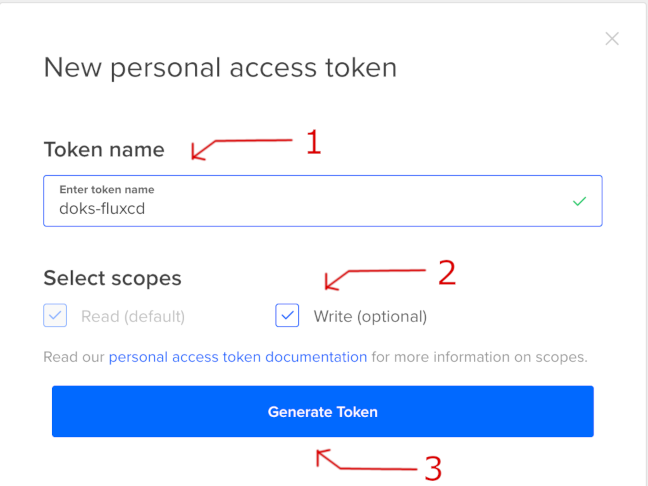
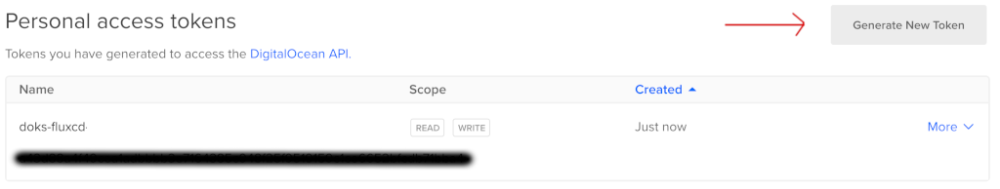
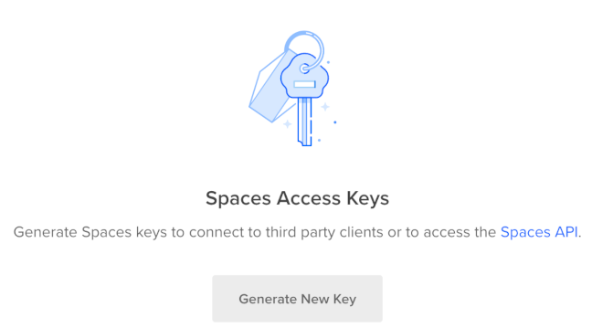
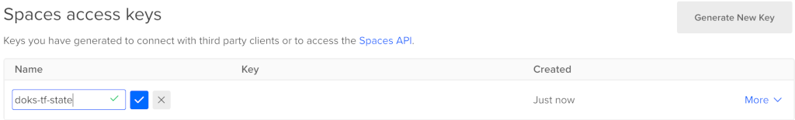
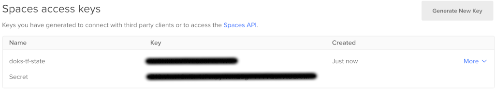
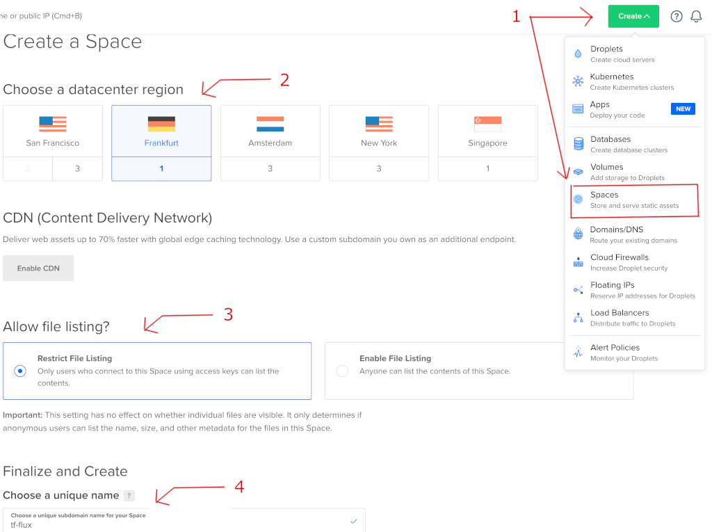
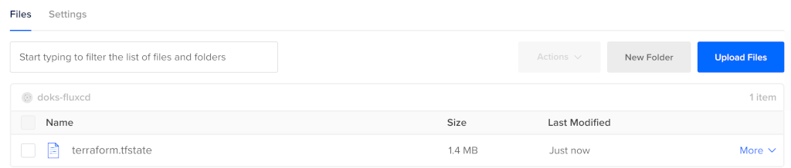

# Gitops stack using DOKS and Flux CD

This blueprint will guide you step by step on how to spin up a single DOKS (DigitalOcean Kubernetes) cluster and Flux CD for managing application deployments in a GitOps fashion. In the end we will also tell [Flux CD](https://fluxcd.io)  to perform a basic deployment of the now ubiquitous `busybox` Docker application.

[Terraform](https://www.terraform.io) was chosen to write `infrastructure as code` using declarative configuration files which allows for concise descriptions of resources using blocks, arguments, and expressions. In our guide it will be responsible with spinning up the DOKS (DigitalOcean Kubernetes) cluster as well as [Flux CD](https://fluxcd.io).

[Flux CD](https://fluxcd.io) is used for managing the `Continuous Delivery` of applications inside the DigitalOcean Kubernetes cluster as well as a `Gitops` enabler.


## Bootstrapping DOKS and Flux CD

This section contains information about how we can bootstrap **DOKS** and **Flux CD** via **Terraform** using **Github** as a SCM provider and source of truth.

### Requirements

1. A DigitalOcean [account](https://cloud.digitalocean.com) is required in order to create the access keys and provision the DOKS cluster.
2. Next a [Github](https://github.com/) account is needed.
3. A git client has to be installed as well depending on the distro.
  
    E.g.: on MacOS it can be installed via Homebrew:
    ```bash
    brew info git
    brew install git
    ```

4. [Terraform](https://www.terraform.io/downloads.html) must be installed next. 
    
    E.g.: on MacOS it can be installed via Homebrew:
    ```bash
    brew info terraform
    brew install terraform
    ```

### Installation steps

1. Start by creating a [Github personal access token](https://github.com/settings/tokens) that has the `repo` permissions set. Copy the token value and save it in a local environment variable as we will need it later on. While we're at this step we're going to fill in some other required details like the owner, the name and the path in the git repository where Flux CD manifests will be created (make sure to replace the `<>` placeholders accordingly):

    ```bash
    export TF_VAR_github_owner="<github_owner>"
    export TF_VAR_github_token="<github_personal_access_token>"
    export TF_VAR_github_repository_name="<git_repository_name>"
    export TF_VAR_github_repository_branch="<git_repository_branch>"
    export TF_VAR_github_repository_target_path="<flux_cd_sync_target_path>"
    ```
2. Let's go next with setting up the required stuff on the [DigitalOcean](https://cloud.digitalocean.com) side by creating the necessary tokens first. One is needed for creating/managing the DOKS cluster and another one for [DO Spaces](https://cloud.digitalocean.com/spaces) (similar to AWS S3). The latter is needed for storing the Terraform state file.

    From your DigitalOcean account go to the [API](https://cloud.digitalocean.com/account/api) section in order to generate the tokens. 
    
    Create a personal access token first by clicking the `Generate New Token` button:

    

    then make sure to give it a proper name and that the `Write` scope is checked:

    

    In the end we should have something like this:

    

    Copy the token value and save it in a local environment variable as we will need it later on (make sure to replace the `<>` placeholder):

    ```bash
    export TF_VAR_do_token="<your_do_personal_access_token>"
    ```
    Next we navigate to `Spaces access keys` and click the `Generate New Key` button:

    

    then give it a proper name and mark it as done:

    

    In the end we should have something like this:

    

    Copy the key and secret value and save each in a local environment variable for later use (make sure to replace the `<>` placeholder):

    ```bash
    export DO_SPACES_ACCESS_KEY="<your_do_spaces_access_key>"
    export DO_SPACES_SECRET_KEY="<your_do_spaces_secret_key>"
    ```
3. Going further we have to create a [DO Space](https://cloud.digitalocean.com/spaces) for storing the Terraform state file. Go ahead to your DigitalOcean account panel and click on the `Create` button (the green one) from the upper right corner. Select a region closer to you then make sure that `Restrict file listing` is checked and finally give it a proper name. The required steps are highlighted below:

    
4. Clone this repository on your local machine and navigate to the appropriate directory:
   
    ```bash
    git clone https://github.com/digitalocean/container-blueprints.git
    cd create-doks-with-terraform-flux
    ```
5. Terraform initialization must be perfomed next. A [DO Spaces](https://cloud.digitalocean.com/spaces) bucket for storing the Terraform state file is highly recommended because we do not have to worrry about exposing sensitive data as long as the space is private of course. Another advantage is that the state of our infrastructure is backed up so we can re-use it in order to do a refresh and change only the affected parts which is a great and powerful feature of Terraform in the end. Having a common shared space across more team members is desired as well in order to perform collaborative work via Terraform.
   
    The [backend.tf](backend.tf) file must be reviewed and modified accordingly first in order to provide the appropriate values for `endpoint`, `region`, `bucket` and `key` (explanations for each can be found inside).

    Let's initialize the backend now using the previously created `access` and `secret` keys for the [DO Spaces](https://cloud.digitalocean.com/spaces):
   
    ```bash
    terraform init  --backend-config="access_key=$DO_SPACES_ACCESS_KEY" --backend-config="secret_key=$DO_SPACES_SECRET_KEY"
    ```

    Sample output:
    ```
    Initializing the backend...

    Successfully configured the backend "s3"! Terraform will automatically
    use this backend unless the backend configuration changes.

    Initializing provider plugins...
    - Finding hashicorp/kubernetes versions matching "2.3.2"...
    - Finding gavinbunney/kubectl versions matching "1.11.2"...
    ...
    ```
6. Let's give our DOKS cluster a name as well:

    ```bash
    export TF_VAR_doks_cluster_name="doks-fluxcd-cluster"
    ```
7. Going furher let's create a `plan` in order to inspect the infrastructure changes:

    ```bash
    terraform plan
    ```
8. If everything seems alright then `apply` the changes with: 
   
    ```bash
    terraform apply
    ```

    Sample output:
    ```
    tls_private_key.main: Creating...
    kubernetes_namespace.flux_system: Creating...
    github_repository.main: Creating...
    tls_private_key.main: Creation complete after 2s [id=1d5ddec06b0f4daeea57d3a987029c1153ebcb21]
    kubernetes_namespace.flux_system: Creation complete after 2s [id=flux-system]
    kubectl_manifest.install["v1/serviceaccount/flux-system/source-controller"]: Creating...
    kubectl_manifest.sync["kustomize.toolkit.fluxcd.io/v1beta1/kustomization/flux-system/flux-system"]: Creating...
    kubectl_manifest.install["v1/serviceaccount/flux-system/helm-controller"]: Creating...
    kubectl_manifest.install["networking.k8s.io/v1/networkpolicy/flux-system/allow-egress"]: Creating...
    ...
    ```

# Next steps

## Seeing the results
If everything goes well the [DOKS cluster](https://cloud.digitalocean.com/kubernetes/clusters) should be up and running as well as [Flux CD](https://fluxcd.io):


The terraform state file should be saved in your [DO Spaces](https://cloud.digitalocean.com/spaces) bucket so please go ahead and check it. It should look similar as seen in the picture down below:



A new git repository should be created as well for you containing the Flux CD cluster resource files:


## Overriding default variables for Terraform

If some of the default values used by the Terraform module provided in this repository need to be modified then a `project.tfvars` file needs to be created (this **must not** be commited in git as it may contain sensitive data - the `.gitignore` is already set to ignore this kind of file).

There's a [project.tfvars.sample](project.tfvars.sample) file provided in this repo so we can just rename it:

```bash
cp project.tfvars.sample project.tfvars
```
And then fill in the right values for the project ([variables.tf](variables.tf) contains the description for each variable).

Now we're going to use this file to provide the required input variables and update the infrastructure as seen below:

```bash
terraform plan -var-file="project.tfvars"
terraform apply -var-file="project.tfvars"
```

## Required tools for inspecting the cluster and applications state
In order to inspect the Kubernetes cluster as well as the Flux CD state and getting information about various components we need to install a few tools like:

1. `doctl` for DigitalOcean interaction (most of the tasks that can be done via the DO account web interface can be accomplished using the CLI version as well) 
2. `kubectl` for Kubernetes interaction
3. `flux` for Flux CD interaction
   
Having the above at hand will also help us create and manage the required Flux CD resources for example later on.

### Doctl

Can be installed for your specific OS and architecture from [here](https://github.com/digitalocean/doctl/releases). On MacOS we can use Homebrew to install it very easily like this:

```bash
brew info doctl
brew install doctl
```

After installation we have to initialize it using the DigitalOcean personal token created at the beginning of this blueprint (when asked just paste it):

```bash
doctl auth init
```

Verify that the new auth context was added with:

```bash
doctl auth list
```

### Kubectl

Please follow the specific steps for your OS and architecture from the official [site](https://kubernetes.io/docs/tasks/tools). On MacOS we can use Homebrew to install it very easily like this:

```bash
brew info kubectl
brew install kubectl
```

Next we have to set kubectl context to point to our cluster created in this blueprint like this:

```bash
doctl k8s cluster kubeconfig save <doks_cluster_name>
```

Where `<doks_cluster_name>` must be replaced with the name given to the cluster in the `project.tfvars` file created in this blueprint (the variable is `doks_cluster_name`).

Next check that the context was set and it's pointing to your Kubernetes cluster by running:

```bash
kubectl config get-contexts
```

### Flux

This is the CLI tool used by Flux to provision it as well as interact with it. Can be installed from the [official](https://fluxcd.io/docs/installation) site following the steps specific for your OS.

After installation and if all the above steps for doctl and kubectl were completed successfully we can check flux status with:

```bash
flux check
```
Sample output:

```
► checking prerequisites
✔ kubectl 1.21.3 >=1.18.0-0
✔ Kubernetes 1.21.2 >=1.16.0-0
► checking controllers
✗ helm-controller: deployment not ready
► ghcr.io/fluxcd/helm-controller:v0.11.1
✔ kustomize-controller: deployment ready
► ghcr.io/fluxcd/kustomize-controller:v0.13.1
✔ notification-controller: deployment ready
► ghcr.io/fluxcd/notification-controller:v0.15.0
✔ source-controller: deployment ready
► ghcr.io/fluxcd/source-controller:v0.15.3
✔ all checks passed
```

Inspect all resources with:

```bash
flux get all
```

Sample output:

```
NAME                     	READY	MESSAGE                                                        	REVISION                                     	SUSPENDED 
gitrepository/flux-system	True 	Fetched revision: main/1d69c3c9591e18a68d5794c2d21d4b31c3398ac6	main/1d69c3c9591e18a68d5794c2d21d4b31c3398ac6	False    	

NAME                     	READY	MESSAGE                                                        	REVISION                                     	SUSPENDED 
kustomization/flux-system	True 	Applied revision: main/1d69c3c9591e18a68d5794c2d21d4b31c3398ac6	main/1d69c3c9591e18a68d5794c2d21d4b31c3398ac6	False  
```

In case we need to do some troubleshooting and also see what Flux CD is doing we can access the logs via:

```bash
flux logs
```

Sample output:

```
...
2021-07-20T12:31:36.696Z info GitRepository/flux-system.flux-system - Reconciliation finished in 1.193290329s, next run in 1m0s 
2021-07-20T12:32:37.873Z info GitRepository/flux-system.flux-system - Reconciliation finished in 1.176637507s, next run in 1m0s 
...
```

## Flux CD example configuration and busybox deployment

### Configuration steps

We're going to configure our [Flux CD](https://fluxcd.io) installation in order to tell it where it can find our Kubernetes manifests so that it can create the required resources. For this step we will use the Github repo that Terraform created for us which stored in the `TF_VAR_github_repository_name` environment variable that we created at the beginning of this tutorial:

```bash
echo $TF_VAR_github_repository_name
```
What [Flux CD](https://fluxcd.io) expects is a `Source` and a `Kustomize` resource to be created and available. It's shipped with support for these by default via the dedicated [Source](https://fluxcd.io/docs/components/source) and [Kustomize](https://fluxcd.io/docs/components/kustomize) controllers.

Please follow the steps below:

1. Let's clone our new git repository and navigate to it (yes, we're going to use the environment variables that were already created in this tutorial):

    ```bash
    git clone "https://github.com/${TF_VAR_github_owner}/${TF_VAR_github_repository_name}.git"
    cd "$TF_VAR_github_repository_name"
    ```
3. Before creating the resources let's store their name in dedicated environment variables in order to fetch them easily later on. Please replace the `<>` placeholders with something meaningful for your case:

    ```bash
    export FLUX_CD_SOURCE_NAME="<source_component_name>"
    export FLUX_CD_KUSTOMIZE_NAME="<kustomize_component_name>"
    ```
4. Create the git `Source` component and commit the changes:

    ```bash
    flux create source git "$FLUX_CD_SOURCE_NAME" \
        --url="https://github.com/${TF_VAR_github_owner}/${TF_VAR_github_repository_name}.git" \
        --branch="$TF_VAR_github_repository_branch" \
        --interval=30s \
        --export > "./${TF_VAR_github_repository_target_path}/${FLUX_CD_SOURCE_NAME}-source.yaml"

    git add -A && git commit -am "Adding the Flux CD Source component"
    ```
5. Next we create the path in the git repository where we store our applications deployment yaml files. As an example we will create a simple busybox deployment. Then we build the `Kustomize` resource and commit the changes:

    ```bash
    APPS_PATH="./apps/busybox"

    mkdir -p $APPS_PATH

    # busybox Namespace yaml file
    cat << EOF > "${APPS_PATH}/busybox-ns.yaml"
    apiVersion: v1
    kind: Namespace
    metadata:
        creationTimestamp: null
        name: busybox
    spec: {}
    status: {}
    EOF

    # busybox Pod yaml file
    cat << EOF > "${APPS_PATH}/busybox.yaml"
    ---
    apiVersion: v1
    kind: Pod
    metadata:
        name: busybox1
        namespace: busybox
    labels:
        app: busybox1
    spec:
        containers:
        - image: busybox
            command:
              - sleep
              - "3600"
              imagePullPolicy: IfNotPresent
            name: busybox
        restartPolicy: Always
    EOF

    # busybox Kustomization yaml file
    cat << EOF > "${APPS_PATH}/kustomization.yaml"
    apiVersion: kustomize.config.k8s.io/v1beta1
    kind: Kustomization

    commonLabels:
        app: busybox

    namespace: busybox

    resources:
       - busybox.yaml
       - busybox-ns.yaml
    EOF

    flux create kustomization "$FLUX_CD_KUSTOMIZE_NAME" \
        --source="$FLUX_CD_SOURCE_NAME" \
        --path="$APPS_PATH" \
        --prune=true \
        --validation=client \
        --interval=5m \
        --export > "./${TF_VAR_github_repository_target_path}/${FLUX_CD_KUSTOMIZE_NAME}-kustomization.yaml"

    git add -A && git commit -am "Adding the Flux CD Kustomize component"
    ```
## Inspecting the results

After a while the busybox namespace and associated pod should be created and running. Let's see what flux has to say about it first:

```bash
flux get kustomizations
```

The output should be something similar to (notice the `busybox` line):

```
NAME       	READY	MESSAGE                                                        	REVISION                                     	SUSPENDED 
busybox    	True 	Applied revision: main/fa69f917302bcfd35d2959ebc398b3aa13102480	main/fa69f917302bcfd35d2959ebc398b3aa13102480	False    	
flux-system	True 	Applied revision: main/fa69f917302bcfd35d2959ebc398b3aa13102480	main/fa69f917302bcfd35d2959ebc398b3aa13102480	False 
```

Now let's see what Kubernetes has to say. Examine the namespaces first:

```bash
kubectl get ns
```

The output should be something similar to (notice the `busybox` line):

```
NAME              STATUS   AGE
busybox           Active   30s
default           Active   26h
flux-system       Active   26h
kube-node-lease   Active   26h
kube-public       Active   26h
kube-system       Active   26h
```

Where is our Pod? Let's find out:

```bash
kubectl get pods -n busybox
```

The output should be something similar to (notice the `busybox1` line):

```
NAME       READY   STATUS    RESTARTS   AGE
busybox1   1/1     Running   0          42s
```

**Success!**

# Final notes

## Testing other Flux CD features

[Flux CD](https://fluxcd.io) supports other interesting controllers as well which can be configured and enabled like:
 - [Notification Controller](https://fluxcd.io/docs/components/notification) which is specialized in handling inbound and outbount events
 - [Helm Controller](https://fluxcd.io/docs/components/helm) for managing [Helm](https://helm.sh) chart releases
 - [Image Automation Controller](https://fluxcd.io/docs/components/image) which can update a Git repository when new container images are available

## Cleaning up (uninstalling) resources

If you want to clean up the allocated resources and destroy all your work then [Terraform](https://www.terraform.io) can handle that for you very easily. It's just a matter of invoking the following command from the directory where this repository was cloned on your local machine:

```bash
terraform destroy
```
Notes:
- **The above will destroy your target git repository as well so please follow the safer method described below**
- The `terraform destroy` operation has an issue and it will hang when it will try to clean up the Flux CD namespace - seems to be a bug somewhere at this time of writing. 

Another approach and a safer one will be to clean the resources in a step by step manner.

### Flux CD uninstall

```bash
flux uninstall
```
Note: The above will clean up all the resources created by [Flux CD](https://fluxcd.io) like: namespaces, pods, etc.

### DOKS cluster uninstall

```bash
terraform destroy --target=digitalocean_kubernetes_cluster.primary
```
