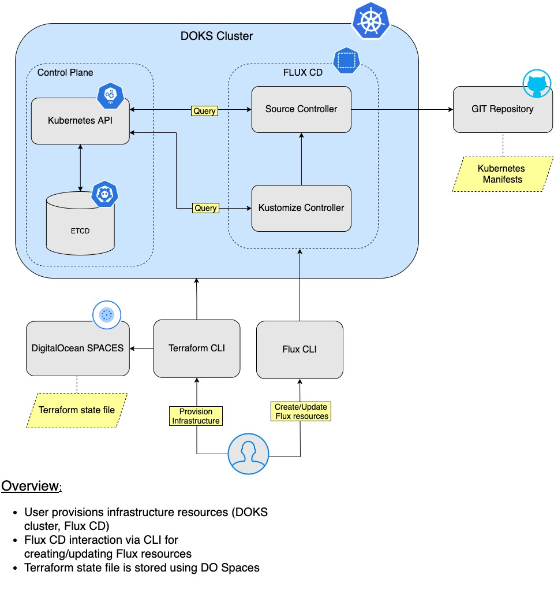

# Gitops stack using DigitalOcean Kubernetes and Flux CD

This blueprint will guide you on how to use [Flux](https://fluxcd.io) to manage application deployments on a `DigitalOcean Kubernetes` (DOKS) cluster in a `GitOps` fashion. In the end, you will also tell [Flux CD](https://fluxcd.io) to perform a basic deployment of the now ubiquitous `busybox` Docker application.

[Terraform](https://www.terraform.io) is one of the most popular tools to write `infrastructure as code` using declarative configuration files, which allows for concise descriptions of resources using blocks, arguments, and expressions. It will be responsible with spinning up the `DOKS` (DigitalOcean Kubernetes) cluster as well as `Flux`.

`Flux` is used for managing the `Continuous Delivery` of applications inside the `DigitalOcean Kubernetes` cluster and enable `GitOps`.


## Table of Contents
- [Bootstrapping DOKS and Flux CD](#bootstrapping-doks-and-flux-cd)
- [Inspecting Cluster State](#inspecting-cluster-state)    
- [Flux CD Example Configuration](#flux-cd-example-configuration)
- [Uninstalling Resources](#uninstalling-resources)
- [Final Notes](#final-notes)
- [Learn More](#learn-more)


## Bootstrapping DOKS and Flux CD

This section contains information about how you can bootstrap `DOKS` and `Flux` via `Terraform` using `GitHub` as a `SCM` provider and source of truth. The bootstrap process will create a `DOKS` cluster and provision `Flux`. A `Git` repository and branch is required beforehand to store `Flux CD` system `manifests`, as well as your `Kubernetes` custom application deployment `manifests` that will be managed automatically via `Flux`.

This is how the final setup looks like:



### Requirements

1. A `Git` repository and branch to store the `Flux CD` system manifests as well as for custom `applications`.
2. A [Github personal access token](https://github.com/settings/tokens) that has the `repo` permissions set. The `Terraform` module provided by this blueprint will automatically provision and store the `Flux CD` system manifests using a `Git` repository and `branch` of your choice.
3. A `DigitalOcean` access token for creating/managing the `DOKS` cluster. Please follow the official `DigitalOcean` tutorial on how to [create a personal access token](https://docs.digitalocean.com/reference/api/create-personal-access-token). Copy the `token` value and save it somewhere safe.
4. Access keys for [DigitalOcean Spaces](https://cloud.digitalocean.com/spaces) (S3-compatible object storage). Please follow the official `DigitalOcean` tutorial on how to [manage access keys](https://docs.digitalocean.com/products/spaces/how-to/manage-access/). We use `Spaces` for storing the `Terraform` state file. Copy the `key` and `secret` value and save each in a local `environment` variable for later use (make sure to replace the `<>` placeholders accordingly):

    ```shell
    export DO_SPACES_ACCESS_KEY="<YOUR_DO_SPACES_ACCESS_KEY>"
    export DO_SPACES_SECRET_KEY="<YOUR_DO_SPACES_SECRET_KEY>"
    ```
5. A [DO Space](https://cloud.digitalocean.com/spaces) for storing the `Terraform` state file. Please follow the official `DigitalOcean` tutorial on how to [create one](https://docs.digitalocean.com/products/spaces/how-to/create/). Make sure that it is set to `restrict file listing` for security reasons.
6. A [git client](https://git-scm.com/downloads). For example, use the following commands on `MacOS`:

    ```shell
    brew info git
    brew install git
    ```
7. Hashicorp [Terraform](https://www.terraform.io/downloads.html). For example, use the following commands to install on `MacOS`:
   
    ```shell
    brew info terraform
    brew install terraform
    ```

### DOKS and Flux CD provisioning

In this part `Terraform` will be used to provision the `DOKS` cluster, as well as to deploy `Flux CD`. It will use the `Git` repository and branch defined in the `.tfvars` file to sync the `Kubernetes` cluster manifests.

First, you're going to initialize the `Terraform` backend. A [DO Spaces](https://cloud.digitalocean.com/spaces) bucket for storing the `Terraform` state file is highly recommended because you do not have to worry about exposing sensitive data as long as the space is private of course. Another advantage is that the state of your infrastructure is backed up, so you can re-use it in order to do a refresh and change the affected parts only. Having a common shared space for team members is desired as well in order to perform collaborative work via `Terraform`.

Next, a `Terraform` plan will be created for infrastructure inspection and then applied in order to create all the required resources. After it finishes, you should have a fully functional `DOKS` cluster with `Flux CD` deployed and running.

This repository is a `Terraform` module basically, so please go ahead and inspect the options available inside the [variables.tf](variables.tf) file.

Steps to follow:

1. Clone this repository on your local machine and navigate to the appropriate directory:
   
    ```shell
    git clone https://github.com/digitalocean/container-blueprints.git

    cd container-blueprints/create-doks-with-terraform-flux
    ```
2. Rename the [backend.tf.sample](backend.tf.sample) file provided in this repository to `backend.tf`. Then, edit `backend.tf` and replace the `<>` placeholders accordingly (explanations for each can be found inside).
3. Initialize the `Terraform` backend. You're going to use the previously created `DO Spaces` access and secret keys:
   
    ```shell
    terraform init  --backend-config="access_key=$DO_SPACES_ACCESS_KEY" --backend-config="secret_key=$DO_SPACES_SECRET_KEY"
    ```

    The output looks similar to the following:
    ```
    Initializing the backend...

    Successfully configured the backend "s3"! Terraform will automatically
    use this backend unless the backend configuration changes.

    Initializing provider plugins...
    - Finding hashicorp/kubernetes versions matching "2.3.2"...
    - Finding gavinbunney/kubectl versions matching "1.11.2"...
    ...
    ```
4. Rename the [terraform.tfvars.sample](terraform.tfvars.sample):

    ```shell
    cp terraform.tfvars.sample terraform.tfvars
    ```
   
5. Edit the `terraform.tfvars` file and replace the `<>` placeholders accordingly, in order to provide the appropriate values (explanations for each can be found inside). 
6. Create a plan and inspect the infrastructure changes:

    ```shell
    terraform plan -out doks_fluxcd_cluster.out
    ```
7. If everything seems alright, then `apply` the changes: 
   
    ```shell
    terraform apply "doks_fluxcd_cluster.out"
    ```

    The output looks similar to the following:
    ```
    tls_private_key.main: Creating...
    kubernetes_namespace.flux_system: Creating...
    github_repository.main: Creating...
    tls_private_key.main: Creation complete after 2s [id=1d5ddec06b0f4daeea57d3a987029c1153ebcb21]
    kubernetes_namespace.flux_system: Creation complete after 2s [id=flux-system]
    kubectl_manifest.install["v1/serviceaccount/flux-system/source-controller"]: Creating...
    kubectl_manifest.sync["kustomize.toolkit.fluxcd.io/v1beta1/kustomization/flux-system/flux-system"]: Creating...
    kubectl_manifest.install["v1/serviceaccount/flux-system/helm-controller"]: Creating...
    kubectl_manifest.install["networking.k8s.io/v1/networkpolicy/flux-system/allow-egress"]: Creating...
    ...
    ```

**Seeing the results**

If everything went well, the `DOKS` cluster should be up and running, as well as `Flux CD`:


Check that the `Terraform` state file is saved in your [DO Spaces](https://cloud.digitalocean.com/spaces) bucket. It should look similar to:


The `Flux CD` system `manifests` should be present in your `Git` repository as well:


## Inspecting Cluster State

In order to inspect the `Kubernetes` cluster as well as the `Flux CD` state and get information about various components, you need to install a few tools like:

1. `doctl` for `DigitalOcean` interaction (most of the tasks that can be done via the `DigitalOcean` web panel can be accomplished using the `CLI` variant as well).
2. `kubectl` for `Kubernetes` interaction.
3. `flux` for `Flux CD` interaction.
   
Having the above at hand will also help you create and manage the required `Flux CD` resources for example later on.

### Doctl

Can be installed for your specific `OS` and architecture from [here](https://github.com/digitalocean/doctl/releases). On `MacOS` you can use `Homebrew` to install it very easily like this:

```shell
brew info doctl
brew install doctl
```

After installation, you have to initialize it using the `DigitalOcean` personal token created at the beginning of this blueprint. Paste the token when prompted:

```shell
doctl auth init
```

Verify that the new auth context was added with:

```shell
doctl auth list
```

### Kubectl

Please follow the specific steps for your `OS` and architecture from the official [site](https://kubernetes.io/docs/tasks/tools). On `MacOS` you can use `Homebrew` to install it very easily like this:

```shell
brew info kubectl
brew install kubectl
```

Next, you have to set the `kubectl` context to point to your cluster created in this blueprint (make sure to replace the `<>` placeholders accordingly). 

List the available `Kubernetes` clusters first:

```shell
doctl k8s cluster list
```

Point `kubectl` to your cluster:

```shell
doctl k8s cluster kubeconfig save <your_doks_cluster_name>
```

Please check that the context was set and that it's pointing to your `Kubernetes` cluster by running:

```shell
kubectl config get-contexts
```

### Flux

This is the `CLI` tool used by `Flux CD` to provision itself, as well as for main system interaction. Please install it from the [official](https://fluxcd.io/docs/installation) site, following the steps specific for your `OS`.

After installation, you can perform some sanity checks via:

```shell
flux check
```
The output looks similar to the following:

```
► checking prerequisites
✔ kubectl 1.21.3 >=1.18.0-0
✔ Kubernetes 1.21.2 >=1.16.0-0
► checking controllers
✗ helm-controller: deployment not ready
► ghcr.io/fluxcd/helm-controller:v0.11.1
✔ kustomize-controller: deployment ready
► ghcr.io/fluxcd/kustomize-controller:v0.13.1
✔ notification-controller: deployment ready
► ghcr.io/fluxcd/notification-controller:v0.15.0
✔ source-controller: deployment ready
► ghcr.io/fluxcd/source-controller:v0.15.3
✔ all checks passed
```

Inspect all `Flux CD` resources with:

```shell
flux get all
```

The output looks similar to the following:

```
NAME                     	READY	MESSAGE                                                        	REVISION                                     	SUSPENDED 
gitrepository/flux-system	True 	Fetched revision: main/1d69c3c9591e18a68d5794c2d21d4b31c3398ac6	main/1d69c3c9591e18a68d5794c2d21d4b31c3398ac6	False    	

NAME                     	READY	MESSAGE                                                        	REVISION                                     	SUSPENDED 
kustomization/flux-system	True 	Applied revision: main/1d69c3c9591e18a68d5794c2d21d4b31c3398ac6	main/1d69c3c9591e18a68d5794c2d21d4b31c3398ac6	False  
```

In case you need to perform some troubleshooting and also see what `Flux CD` is doing, you can access the logs via:

```shell
flux logs
```

The output looks similar to the following:

```
...
2021-07-20T12:31:36.696Z info GitRepository/flux-system.flux-system - Reconciliation finished in 1.193290329s, next run in 1m0s 
2021-07-20T12:32:37.873Z info GitRepository/flux-system.flux-system - Reconciliation finished in 1.176637507s, next run in 1m0s 
...
```

## Flux CD Example Configuration

### Configuration steps

In this part, you're going to configure `Flux CD` to tell it where it can find your custom application `Kubernetes` manifests, so that it can create the required resources.

In a minimal `Flux CD` setup, you will want to have a [Source](https://fluxcd.io/docs/components/source) and a [Kustomize](https://fluxcd.io/docs/components/kustomize) resource to be created and available. `Source` tells `Flux` where to sync files from, like a `Git` repository and `branch` for example. The `Kustomize` resource tells `Flux` where to find your application kustomizations.

`Terraform` already created the above resources for the `Flux CD` system, as seen below:

```shell
flux get all
```

The output looks similar to:

```
NAME                     	READY	MESSAGE                         REVISION        SUSPENDED 
gitrepository/flux-system	True 	Fetched revision: main/7cdc...	main/7cdc...	  False    	

NAME                     	READY	MESSAGE                         REVISION        SUSPENDED 
kustomization/flux-system	True 	Applied revision: main/7cdc...	main/7cdc...	  False
```

There are many options available depending on your setup and what the final goal is. You can create as many Flux CD `Git` Sources as you want, that point to different repositories and/or branches (like a separate `branch` per `environment`, for example). Same thing applies to `Kustomize` resources.

To keep things simple and to demonstrate the basic functionality, you're going to focus on a `single` cluster and environment. 

Please follow the steps below:

1. Clone the `Git` repository pointed by the `Flux` setup from this tutorial (the `<git_repository_name>` Terraform variable). This repository will be used for cluster reconciliation.
2. Change directory where the repository was cloned.
3. Create a directory path where to store the `busybox` example application manifests (please make sure to replace `<git_repository_sync_path>` with the corresponding `Terrafrom` variable value first):

    ```shell
    APPS_PATH="<git_repository_sync_path>/apps/busybox"

    mkdir -p $APPS_PATH
    ```
4. Next, create the following example manifests in the directory path pointed by the `APPS_PATH` variable defined above:
    * [busybox-ns](assets/manifests/busybox-ns.yaml) (creates the `busybox` app namespace)
    * [busybox](assets/manifests/busybox.yaml) (creates the `busybox` app itself)
    * [kustomization](assets/manifests/kustomization.yaml) (`kustomization` for the above)
5. The Git `Source` used by `Flux` for syncing manifests is already created by the `Terraform` code, so you can use just that (it's called `flux-system` by default). Inspect it via:

    ```shell
    flux export source git flux-system
    ```

    The output looks similar to (`metadata` parts are hidden for simplicity):

    ```
    ---
    apiVersion: source.toolkit.fluxcd.io/v1beta1
    kind: GitRepository
    metadata:
      ...
    spec:
      gitImplementation: go-git
      interval: 1m0s
      ref:
        branch: main
      secretRef:
        name: flux-system
      timeout: 20s
      url: ssh://git@github.com/test-github-user/test-git-repo.git
    ```

    The most relevant part to look at is the `spec`, which defines the `branch`, git repository `url` and `interval` used for syncing. All of this can be changed later on if desired, by chaning this manifest from the `Git` repository and committing the changes.
6. Define a `Kustomization` resource for `Flux CD` to sync the manifests created earlier (notice the `--path` argument):

    ```shell
    FLUX_CD_SYNC_PATH="<git_repository_sync_path>"

    flux create kustomization "busybox" \
       --source="flux-system" \
       --path="$APPS_PATH" \
       --prune=true \
       --validation=client \
       --interval=5m \
       --export > "${FLUX_CD_SYNC_PATH}/busybox-kustomization.yaml"
    ```

    The above command creates a manifest file in the path pointed by the `<git_repository_sync_path>` Terraform variable value.
7. Commit the files and push the changes to the branch pointed by the `<git_repository_branch>` Terrafrom variable value.

## Inspecting the results

After one minute or so (if using the default settings), the `busybox` namespace and associated pod should be created and running. If you don't want to wait you can always force reconciliation via:

```shell
flux reconcile source git flux-system

flux reconcile kustomization busybox
```

The output looks similar to:

```
$ flux reconcile source git flux-system

► annotating GitRepository flux-system in flux-system namespace
✔ GitRepository annotated
◎ waiting for GitRepository reconciliation
✔ GitRepository reconciliation completed
✔ fetched revision main/b908f9b47b3a568ae346a74c277b23a7b7ef9602

$ flux reconcile kustomization busybox

► annotating Kustomization busybox in flux-system namespace
✔ Kustomization annotated
◎ waiting for Kustomization reconciliation
✔ Kustomization reconciliation completed
✔ applied revision main/b908f9b47b3a568ae346a74c277b23a7b7ef9602
```

Let's see what `Flux` has to say about `Kustomizations`:

```shell
flux get kustomizations
```

The output looks similar to (notice the `busybox` line):

```
NAME       	READY	MESSAGE                                                        	REVISION                                     	SUSPENDED 
busybox    	True 	Applied revision: main/fa69f917302bcfd35d2959ebc398b3aa13102480	main/fa69f917302bcfd35d2959ebc398b3aa13102480	False    	
flux-system	True 	Applied revision: main/fa69f917302bcfd35d2959ebc398b3aa13102480	main/fa69f917302bcfd35d2959ebc398b3aa13102480	False 
```

Now let's see what `Kubernetes` has to say. Examine the namespaces first:

```shell
kubectl get ns
```

The output should be something similar to (notice the `busybox` line):

```
NAME              STATUS   AGE
busybox           Active   30s
default           Active   26h
flux-system       Active   26h
kube-node-lease   Active   26h
kube-public       Active   26h
kube-system       Active   26h
```

Where is your `busybox` Pod? Let's find out:

```shell
kubectl get pods -n busybox
```

The output should be something similar to (notice the `busybox1` line):

```
NAME       READY   STATUS    RESTARTS   AGE
busybox1   1/1     Running   0          42s
```

**Success!**

## Uninstalling Resources

If you want to clean up the allocated resources and destroy all your work, then [Terraform](https://www.terraform.io) can handle that for you very easily. Invoke the following command from the directory where this repository was cloned on your local machine:

```shell
terraform destroy
```

**Note:**

The `terraform destroy` operation has a limitation and it will hang when it will try to clean up the `Flux CD` namespace. The main problem is that the `Kubernetes` provider cannot delete namespaces that have `finalizers` set, which happens to be in the case of `flux-system`. At this time of writing, there's an open issue for the Terraform [kubernetes-provider](https://github.com/hashicorp/terraform-provider-kubernetes/issues/1040) if you want to know more about it. Another approach and a safer one is to clean the resources in a selective manner, as detailed next.

### Flux CD uninstall

```shell
flux uninstall
```

**Note:**

The above will clean up all the resources created by [Flux CD](https://fluxcd.io) like: namespaces, pods, etc.

### DOKS cluster uninstall

```shell
terraform destroy --target=digitalocean_kubernetes_cluster.primary
```

**Note:**

The above will destroy the whole `DOKS` cluster, meaning `Flux CD` and all the applications you deployed, so please be careful when choosing this option.


# Final Notes

## Code re-use via Terraform Modules

Because this repo contains a `Terraform` module, you can create a `variables` file for each `environment`. There's a [terraform.tfvars.sample](terraform.tfvars.sample) file provided, so you can re-use it based on the `environment` type like this:

```shell
cp terraform.tfvars.sample dev-cluster.tfvars
```

Then, fill in the right values for the project. Creating or updating the new environment infrastructure is as simple as:

```shell
terraform plan -var-file="dev-cluster.tfvars" -out dev_cluster.out
terraform apply -var-file="dev-cluster.tfvars" "dev_cluster.out"
```

Each `cluster` can have its `configuration` synced from a specific `branch` from the same git `repository`. This applies for `custom` applications as well.


## Learn More

`Flux` supports other interesting `controllers` as well, which can be configured and enabled like:
 - [Notification Controller](https://fluxcd.io/docs/components/notification) which is specialized in handling inbound and outbount events for `Slack`, etc.
 - [Helm Controller](https://fluxcd.io/docs/components/helm) for managing [Helm](https://helm.sh) chart releases
 - [Image Automation Controller](https://fluxcd.io/docs/components/image) which can update a `Git` repository when new container images are available

You can visit the official [guides](https://fluxcd.io/docs/guides) for more interesting stuff and ideas, like how to structure your `Git` repository, as well as application `manifests` for multi-cluster and multi-environment setups.