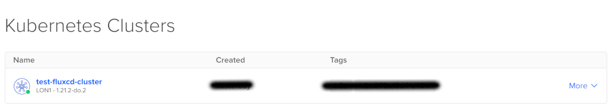
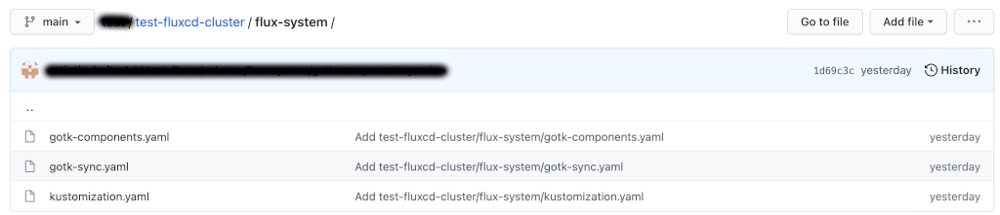

# How to Create a Gitops Stack Using DigitalOcean Kubernetes and Flux CD

## Introduction

This blueprint will guide you on how to use [Flux](https://fluxcd.io) to manage application deployments on a `DigitalOcean Kubernetes` (DOKS) cluster in a `GitOps` fashion. In the end, you will also tell [Flux CD](https://fluxcd.io) to perform a basic deployment of the now ubiquitous `busybox` Docker application.

[Terraform](https://www.terraform.io) is one of the most popular tools to write `infrastructure as code` using declarative configuration files, which allows for concise descriptions of resources using blocks, arguments, and expressions. It will be responsible with spinning up the `DOKS` (DigitalOcean Kubernetes) cluster as well as `Flux`.

`Flux` is used for managing the `Continuous Delivery` of applications inside the `DigitalOcean Kubernetes` cluster and enable `GitOps`. It has a bunch of [Controllers](https://fluxcd.io/docs/components) built-in that help you create the required `GitOps` resources.

Tutorial setup overview:


## Table of Contents

- [Introduction](#introduction)
- [Prerequisites](#prerequisites)
- [Step 1 - Bootstrapping DOKS and Flux CD](#step-1---bootstrapping-doks-and-flux-cd)
- [Step 2 - Inspecting Cluster State](#step-2---inspecting-cluster-state)
- [Step 3 - Flux CD Configuration Overview](#step-3---flux-cd-configuration-overview)
- [Step 4 - Creating BusyBox Example Application via Flux CD](#step-4---creating-busybox-example-application-via-flux-cd)
- [Step 5 [OPTIONAL] - Uninstalling Resources](#step-5-optional---uninstalling-resources)
- [Final Notes](#final-notes)
- [Learn More](#learn-more)

### Prerequisites

To complete this tutorial, you will need:

1. A [GitHub](https://github.com) repository and `branch`, needed for `Flux CD` to store cluster and sample application `manifests`.
2. A GitHub [personal access token](https://github.com/settings/tokens) that has the `repo` permissions set. The `Terraform` module provided in this blueprint needs it in order to create the `SSH` deploy key, as well as to commit the `Flux CD` cluster manifests in your `Git` repository.
3. A `DigitalOcean` access token for creating/managing the `DOKS` cluster. Please follow the official `DigitalOcean` tutorial on how to [create a personal access token](https://docs.digitalocean.com/reference/api/create-personal-access-token). Copy the `token` value and save it somewhere safe.
4. Access keys for [DigitalOcean Spaces](https://cloud.digitalocean.com/spaces) (S3-compatible object storage). Please follow the official `DigitalOcean` tutorial on how to [manage access keys](https://docs.digitalocean.com/products/spaces/how-to/manage-access/). We use `Spaces` for storing the `Terraform` state file. Copy the `key` and `secret` value and save each in a local `environment` variable for later use (make sure to replace the `<>` placeholders accordingly):

    ```shell
    export DO_SPACES_ACCESS_KEY="<YOUR_DO_SPACES_ACCESS_KEY>"
    export DO_SPACES_SECRET_KEY="<YOUR_DO_SPACES_SECRET_KEY>"
    ```

5. A [DO Space](https://cloud.digitalocean.com/spaces) for storing the `Terraform` state file. Please follow the official `DigitalOcean` tutorial on how to [create one](https://docs.digitalocean.com/products/spaces/how-to/create/). Make sure that it is set to `restrict file listing` for security reasons.
6. A [git client](https://git-scm.com/downloads). For example, use the following commands on `MacOS`:

    ```shell
    brew info git
    brew install git
    ```

7. HashiCorp [Terraform](https://www.terraform.io/downloads.html). For example, use the following commands to install on `MacOS`:

    ```shell
    brew info terraform
    brew install terraform
    ```

## Step 1 - Bootstrapping DOKS and Flux CD

In this step you will learn how to bootstrap `DOKS` and `Flux` via `Terraform` using `GitHub` as a `SCM` provider and source of truth. The bootstrap process will create a `DOKS` cluster and provisions `Flux`. A `Git` repository and branch is required beforehand to store `Flux CD` system `manifests`, as well as your `Kubernetes` custom application deployment `manifests` that will be managed automatically via `Flux`.

First, you're going to initialize the `Terraform` backend. A [DO Spaces](https://cloud.digitalocean.com/spaces) bucket for storing the `Terraform` state file is highly recommended because you do not have to worry about exposing `sensitive` data as long as the space is `private` of course. Another advantage is that the `state` of your `infrastructure` is backed up, so you can re-use it when the `workspace` is lost. Having a `shared` space for team members is desired as well, in order to perform `collaborative` work via `Terraform`.

Next, a `Terraform` plan will be created for infrastructure `inspection` and then `applied` in order to create all the required `resources`. After it finishes, you should have a fully functional `DOKS` cluster with `Flux CD` deployed and running.

This repository is a `Terraform` module basically, so please go ahead and inspect the `options` available inside the [variables.tf](variables.tf) file.

Steps to follow:

1. Clone this repository on your local machine and navigate to the appropriate directory:

    ```shell
    git clone https://github.com/digitalocean/container-blueprints.git

    cd container-blueprints/create-doks-with-terraform-flux
    ```

2. Rename the provided [backend.tf.sample](backend.tf.sample) file from this repository to `backend.tf`. Then, open it using a text editor of your choice, and replace the `<>` placeholders accordingly (explanations for each can be found inside).
3. Initialize the `Terraform` backend. You're going to use the previously created `DO Spaces` access and secret keys:

    ```shell
    terraform init  --backend-config="access_key=$DO_SPACES_ACCESS_KEY" --backend-config="secret_key=$DO_SPACES_SECRET_KEY"
    ```

    The output looks similar to the following:

    ```text
    Initializing the backend...

    Successfully configured the backend "s3"! Terraform will automatically
    use this backend unless the backend configuration changes.

    Initializing provider plugins...
    - Finding hashicorp/kubernetes versions matching "2.3.2"...
    - Finding gavinbunney/kubectl versions matching "1.11.2"...
    ...
    ```

4. Rename the [terraform.tfvars.sample](terraform.tfvars.sample):

    ```shell
    cp terraform.tfvars.sample terraform.tfvars
    ```

5. Edit the `terraform.tfvars` file and replace the `<>` placeholders accordingly, to provide appropriate values for each variable (explanations for each can be found inside).
6. Create a `plan` and inspect the `infrastructure` changes:

    ```shell
    terraform plan -out doks_fluxcd_cluster.out
    ```

7. If everything seems alright, `apply` the changes:

    ```shell
    terraform apply "doks_fluxcd_cluster.out"
    ```

    The output looks similar to the following:

    ```text
    tls_private_key.main: Creating...
    kubernetes_namespace.flux_system: Creating...
    github_repository.main: Creating...
    tls_private_key.main: Creation complete after 2s [id=1d5ddec06b0f4daeea57d3a987029c1153ebcb21]
    kubernetes_namespace.flux_system: Creation complete after 2s [id=flux-system]
    kubectl_manifest.install["v1/serviceaccount/flux-system/source-controller"]: Creating...
    kubectl_manifest.sync["kustomize.toolkit.fluxcd.io/v1beta1/kustomization/flux-system/flux-system"]: Creating...
    kubectl_manifest.install["v1/serviceaccount/flux-system/helm-controller"]: Creating...
    kubectl_manifest.install["networking.k8s.io/v1/networkpolicy/flux-system/allow-egress"]: Creating...
    ...
    ```

### Inspecting the results

If everything went well, the `DOKS` cluster should be up and running, as well as `Flux CD`:



Check that the `Terraform` state file is saved in your [DO Spaces](https://cloud.digitalocean.com/spaces) bucket. Bucket listing looks similar to:


The Flux CD `manifests` for your `DOKS` cluster should be present in your `Git` repository as well:



Next, you're going to inspect the `Kubernetes` cluster state, as well as the `Flux CD` deployment.

## Step 2 - Inspecting Cluster State

In order to inspect the `Kubernetes` cluster, as well as the `Flux CD` state and get information about various components, you need to install a few tools like:

1. `doctl` for `DigitalOcean` interaction (most of the tasks that can be done via the `DigitalOcean` web panel can be accomplished using the `CLI` variant as well).
2. `kubectl` for `Kubernetes` interaction.
3. `flux` for `Flux CD` interaction.

Having the above at hand, will also help you create and manage the required `Flux CD` resources for example later on.

### Doctl

Can be installed for your specific `OS` and architecture from [here](https://github.com/digitalocean/doctl/releases). On `MacOS` you can use `Homebrew` to install it very easily like this:

```shell
brew info doctl
brew install doctl
```

After installation, you have to initialize it using the `DigitalOcean` personal token created at the beginning of this blueprint. Paste the token when prompted:

```shell
doctl auth init
```

Verify that the new auth context was added with:

```shell
doctl auth list
```

### Kubectl

Please follow the specific steps for your `OS` and architecture from the official [site](https://kubernetes.io/docs/tasks/tools). On `MacOS` you can use `Homebrew` to install it very easily like this:

```shell
brew info kubectl
brew install kubectl
```

Next, you have to set the `kubectl` context to point to your cluster. List the available `Kubernetes` clusters first:

```shell
doctl k8s cluster list
```

Point `kubectl` to your cluster (make sure to replace the `<>` placeholders accordingly):

```shell
doctl k8s cluster kubeconfig save <your_doks_cluster_name>
```

Please check that the context was set, and that it's pointing to your `Kubernetes` cluster:

```shell
kubectl config get-contexts
```

List cluster nodes, and make sure that they're in a healthy state (`STATUS` column says `Ready`):

```shell
kubectl get nodes
```

The output looks similar to:

```text
NAME                            STATUS   ROLES    AGE    VERSION
dev-fluxcd-cluster-pool-8z9df   Ready    <none>   3d2h   v1.21.3
dev-fluxcd-cluster-pool-8z9dq   Ready    <none>   3d2h   v1.21.3
dev-fluxcd-cluster-pool-8z9dy   Ready    <none>   3d2h   v1.21.3
```

### Flux

This is the `CLI` tool used by `Flux CD` to provision itself in your `DOKS` cluster, as well as for main system interaction. Please install it from the [official](https://fluxcd.io/docs/installation) site, following the steps specific for your `OS`.

After installation, you can perform some `sanity checks` via:

```shell
flux check
```

The output looks similar to the following:

```text
► checking prerequisites
✔ kubectl 1.21.3 >=1.18.0-0
✔ Kubernetes 1.21.2 >=1.16.0-0
► checking controllers
✗ helm-controller: deployment not ready
► ghcr.io/fluxcd/helm-controller:v0.11.1
✔ kustomize-controller: deployment ready
► ghcr.io/fluxcd/kustomize-controller:v0.13.1
✔ notification-controller: deployment ready
► ghcr.io/fluxcd/notification-controller:v0.15.0
✔ source-controller: deployment ready
► ghcr.io/fluxcd/source-controller:v0.15.3
✔ all checks passed
```

Inspect all `Flux CD` resources with:

```shell
flux get all
```

The output looks similar to the following (long commit hashes were abbreviated in the output, for simplicity):

```text
NAME                      READY MESSAGE                        REVISION      SUSPENDED 
gitrepository/flux-system True  Fetched revision: main/1d69... main/1d69...  False     

NAME                      READY MESSAGE                        REVISION      SUSPENDED 
kustomization/flux-system True  Applied revision: main/1d69... main/1d69c... False  
```

In case you need to perform some troubleshooting and also see what `Flux CD` is doing, you can access the logs via:

```shell
flux logs
```

The output looks similar to the following:

```text
...
2021-07-20T12:31:36.696Z info GitRepository/flux-system.flux-system - Reconciliation finished in 1.193290329s, next run in 1m0s 
2021-07-20T12:32:37.873Z info GitRepository/flux-system.flux-system - Reconciliation finished in 1.176637507s, next run in 1m0s 
...
```

## Step 3 - Flux CD Configuration Overview

In this step, you're going to learn about the basic `components` that come with the default `Flux CD` installation.

`Flux CD` comes with a bunch of useful `CRD`'s that let you define the required components for a `GitOps` enabled environment. As with each `resource` available in a `Kubernetes` setup, an associated `Controller` must be present as well to handle the `CRD`'s and maintain their `state`, as defined in the `manifest` files by the `user`.

The available `Controllers` that come with `Flux CD` are as follows:

- [Source Controller](https://fluxcd.io/docs/components/source/) - responsible with handling the [Git Repository](https://fluxcd.io/docs/components/source/gitrepositories) CRD
- [Kustomize Controller](https://fluxcd.io/docs/components/kustomize) - responsible with handling the [Kustomization](https://fluxcd.io/docs/components/kustomize/kustomization) CRD

Next, you're going to discover each in turn, and which options are available.

### Default Configuration Overview

By default, `Flux CD` uses a [Git Repository](https://fluxcd.io/docs/components/source/gitrepositories) and a [Kustomization](https://fluxcd.io/docs/components/kustomize/kustomization) resource. `Git Repository` tells `Flux` where to sync files from, and points to a `Git` repository and `branch`. The `Kustomization` resource tells `Flux` where to find your application `kustomizations`.

`Terraform` provisions the above resources for your `DOKS` cluster, as seen below:

```shell
flux get all
```

The output looks similar to (long commit hashes were abbreviated in the output, for simplicity):

```text
NAME                      READY MESSAGE                         REVISION      SUSPENDED 
gitrepository/flux-system True  Fetched revision: main/7cdc...  main/7cdc...  False     

NAME                      READY MESSAGE                         REVISION      SUSPENDED 
kustomization/flux-system True  Applied revision: main/7cdc...  main/7cdc...  False
```

You can easily spot the `Git Repository` CRD - `gitrepository/flux-system` and the `Kustomization` via `kustomization/flux-system`.

Out of curiosity and to learn more, you can inspect each in turn to see the definition:

1. First, the `Git Repository` resource:

    ```shell
    flux export source git flux-system
    ```

    The output looks similar to (`metadata` section content is hidden for simplicity):

    ```text
    ---
    apiVersion: source.toolkit.fluxcd.io/v1beta1
    kind: GitRepository
    metadata:
      ...
    spec:
      gitImplementation: go-git
      interval: 1m0s
      ref:
        branch: main
      secretRef:
        name: flux-system
      timeout: 20s
      url: ssh://git@github.com/test-github-user/test-git-repo.git
    ```

    The most relevant section to look for is the `spec`, which defines:

    - `Git` repository `url` to sync manifests from - `ssh://git@github.com/test-github-user/test-git-repo.git`, in this example.
    - The Git `branch` to use - set to `main` in this example.
    - The `interval` to use for syncing - set to `1 minute` by default.
2. Next the `Kustomization` resource:

    ```shell
    flux export kustomization flux-system
    ```

    The output looks similar to (`metadata` section content is hidden for simplicity):

    ```text
    ---
    apiVersion: kustomize.toolkit.fluxcd.io/v1beta1
    kind: Kustomization
    metadata:
    ...
    spec:
      interval: 10m0s
      path: ./clusters/dev
      prune: true
      sourceRef:
        kind: GitRepository
        name: flux-system
      validation: client
    ```

    The most relevant section to look for is the `spec`, which defines:

    - The `interval` used for syncing - set to `10 minutes` by default.
    - The `path` from the `Git` repository where this `Kustomization` manifests are kept.
    - `sourceRef` - an important parameter that reveals relationships between resources ! It shows you that it is using another resource to fetch the manifests - a `GitRepository` in this case. The `name` field uniquely identifies the referenced resource - `flux-system`.

There are many options available depending on your setup and what the final goal is. You can create as many `Git Repository` resources as you want, that point to `different` repositories and/or branches (like a separate `branch` per `environment`, for example). More information and examples can be found on the official Flux CD [Repository Structure Guide](https://fluxcd.io/docs/guides/repository-structure) documentation page.

To help you start very quickly, as well as to demonstrate the basic functionality of `Flux`, the steps explained next focus on a `single` cluster, synced from one `Git` repository and `branch`.

## Step 4 - Creating BusyBox Example Application via Flux CD

In this step, you're going to configure `Flux` to create a simple `Busybox` application, using the `sample` manifests provided in this `Git` repository.

The `kustomization/flux-system` CRD inspected at [Step 3 - Flux CD Configuration Overview](#step-3---flux-cd-configuration-overview), expects `Kustomization` manifests to be present in the `Git` repository path pointed by the `<git_repository_sync_path>` Terraform variable.

Steps to follow:

1. Clone the `Git` repository defined in the `terraform.tfvars` file (please replace the `<>` placeholders accordingly). This is the main repository used for `DOKS` cluster reconciliation.

   ```shell
   git clone git@github.com:<github_user>/<git_repository_name>.git
   ```

2. Change directory where repository was cloned (please replace the `<>` placeholders accordingly, as defined in the `terraform.tfvars` file):

    ```shell
    cd <git_repository_name>
    ```

3. Optional, if not using the `main` branch (please replace the `<>` placeholders accordingly, as defined in the `terraform.tfvars` file):

    ```shell
    git checkout <git_repository_branch>
    ```

4. Next, create the `applications` directory, to store the `busybox` example manifests (please replace the `<>` placeholders accordingly, as defined in the `terraform.tfvars` file):

    ```shell
    APPS_PATH="<git_repository_sync_path>/apps/busybox"

    mkdir -p "$APPS_PATH"
    ```

5. Download the following manifests, using the directory path created in the previous step:
    - [busybox-ns](assets/manifests/busybox-ns.yaml) (creates the `busybox` app namespace)
    - [busybox](assets/manifests/busybox.yaml) (creates the `busybox` app itself)
    - [kustomization](assets/manifests/kustomization.yaml) (`kustomization` for the above)

    **Hint:**

    If you have `curl` installed, the following can be used to fetch the required files:

    ```shell
    curl https://raw.githubusercontent.com/digitalocean/container-blueprints/main/create-doks-with-terraform-flux/assets/manifests/busybox-ns.yaml > "${APPS_PATH}/busybox-ns.yaml"

    curl https://raw.githubusercontent.com/digitalocean/container-blueprints/main/create-doks-with-terraform-flux/assets/manifests/busybox.yaml > "${APPS_PATH}/busybox.yaml"

    curl https://raw.githubusercontent.com/digitalocean/container-blueprints/main/create-doks-with-terraform-flux/assets/manifests/kustomization.yaml > "${APPS_PATH}/kustomization.yaml"
    ```

6. Commit the files and push the changes:

    ```shell
    git add -A

    git commit -am "Busybox Kustomization manifests"

    git push origin
    ```

### Inspecting the Results

After one minute or so (if using the default settings), the `busybox` namespace and associated pod should be created and running. If you don't want to wait you can always force reconciliation via:

```shell
flux reconcile source git flux-system

flux reconcile kustomization flux-system
```

The output looks similar to:

```text
$ flux reconcile source git flux-system

► annotating GitRepository flux-system in flux-system namespace
✔ GitRepository annotated
◎ waiting for GitRepository reconciliation
✔ GitRepository reconciliation completed
✔ fetched revision main/b908f9b47b3a568ae346a74c277b23a7b7ef9602

$ flux reconcile kustomization busybox

► annotating Kustomization flux-system in flux-system namespace
✔ Kustomization annotated
◎ waiting for Kustomization reconciliation
✔ Kustomization reconciliation completed
✔ applied revision main/b908f9b47b3a568ae346a74c277b23a7b7ef9602
```

Let's see what `Flux` has to say about `Kustomizations`:

```shell
flux get kustomizations
```

The output looks similar to (notice the `busybox` line):

```text
NAME        READY MESSAGE                                                         REVISION                                      SUSPENDED     
flux-system True  Applied revision: main/fa69f917302bcfd35d2959ebc398b3aa13102480 main/fa69f917302bcfd35d2959ebc398b3aa13102480 False 
```

See what `Kubernetes` has to say. Examine the `namespaces` first:

```shell
kubectl get ns
```

The output should be something similar to (notice the `busybox` line):

```text
NAME              STATUS   AGE
busybox           Active   30s
default           Active   26h
flux-system       Active   26h
kube-node-lease   Active   26h
kube-public       Active   26h
kube-system       Active   26h
```

Where is your `busybox` Pod? Let's find out:

```shell
kubectl get pods -n busybox
```

The output should be something similar to (notice the `busybox1` line):

```text
NAME       READY   STATUS    RESTARTS   AGE
busybox1   1/1     Running   0          42s
```

## Step 5 [OPTIONAL] - Uninstalling Resources

If you want to `clean` up the allocated `resources`, then `Terraform` can do that for you as well. Invoke the following command from the directory where this repository was cloned on your local machine:

```shell
terraform destroy
```

**Note:**

The `terraform destroy` operation has a limitation and it will hang when it will try to clean up the `Flux CD` namespace. The main problem is that the `Kubernetes` provider cannot delete `namespaces` that have `finalizers` set, which happens to be in case of `flux-system`. At this time of writing, there's an open issue for the Terraform [kubernetes-provider](https://github.com/hashicorp/terraform-provider-kubernetes/issues/1040), if you want to know more about it. Another approach and a safer one is to clean the resources in a selective manner, as detailed next.

### Flux CD Uninstall

```shell
flux uninstall
```

**Note:**

The above will `clean` up all the `resources` created by [Flux CD](https://fluxcd.io) like: namespaces, pods, etc.

### DOKS Cluster Uninstall

```shell
terraform destroy --target=digitalocean_kubernetes_cluster.primary
```

**Note:**

The above will `destroy` the whole `DOKS` cluster, meaning `Flux CD` and all the `applications` you deployed, so please be careful when choosing this option.

## Final Notes

### Code re-use via Terraform Modules

`Terraform` is great in the sense that it allows you to `re-use` code via `modules`. The `DRY` principle is strongly encouraged when using `Terraform` as well.

This repository is a `Terraform` module, so you can reference and re-use it like this:

```text
module "doks_flux_cd" {
  source = "github.com/digitalocean/container-blueprints/create-doks-with-terraform-flux"

  # DOKS 
  do_api_token                 = "<YOUR_DO_API_TOKEN_HERE>"                 # DO API TOKEN
  doks_cluster_name            = "<YOUR_DOKS_CLUSTER_NAME_HERE>"            # Name of this `DOKS` cluster ?
  doks_cluster_region          = "<YOUR_DOKS_CLUSTER_REGION_HERE>"          # What region should this `DOKS` cluster be provisioned in?
  doks_cluster_version         = "<YOUR_DOKS_CLUSTER_VERSION_HERE>"         # What Kubernetes version should this `DOKS` cluster use ?
  doks_cluster_pool_size       = "<YOUR_DOKS_CLUSTER_POOL_SIZE_HERE>"       # What machine type to use for this `DOKS` cluster ?
  doks_cluster_pool_node_count = <YOUR_DOKS_CLUSTER_POOL_NODE_COUNT_HERE>   # How many worker nodes this `DOKS` cluster should have ?
  
  # GitHub
  github_user               = "<YOUR_GITHUB_USER_HERE>"               # Your `GitHub` username
  github_token              = "<YOUR_GITHUB_TOKEN_HERE>"              # Your `GitHub` personal access token
  git_repository_name       = "<YOUR_GIT_REPOSITORY_NAME_HERE>"       # Git repository where `Flux CD` manifests should be stored
  git_repository_branch     = "<YOUR_GIT_REPOSITORY_BRANCH_HERE>"     # Branch name to use for this `Git` repository (e.g.: `main`)
  git_repository_sync_path  = "<YOUR_GIT_REPOSITORY_SYNC_PATH_HERE>"  # Git repository path where the manifests to sync are committed (e.g.: `clusters/dev`)

}
```

You can `instantiate` it as many times as required and target different `cluster` configurations and `environments`. For more information, please visit the official [Terraform Modules](https://www.terraform.io/docs/language/modules/index.html) documentation page.

## Learn More

`Flux` supports other interesting `Controllers` as well, which can be configured and enabled, like:

- [Notification Controller](https://fluxcd.io/docs/components/notification) which is specialized in handling inbound and outbound events for `Slack`, etc.
- [Helm Controller](https://fluxcd.io/docs/components/helm) for managing [Helm](https://helm.sh) chart releases
- [Image Automation Controller](https://fluxcd.io/docs/components/image) which can update a `Git` repository when new container images are available

You can visit the official [Flux CD Guides](https://fluxcd.io/docs/guides) page for more interesting stuff and ideas, like how to structure your `Git` repositories, as well as application `manifests` for multi-cluster and multi-environment setups.
