# Setting up an Egress Gateway Using Netmaker

## Overview

What is an `Egress Gateway` and more important, why do you need one?

`Ingress` deals with `inbound` traffic, whereas `Egress` deals with `outbound` traffic. Going further, there are two key aspects to keep in mind:

1. Security implications.
2. Having a well defined model and set of measures for your infrastructure (either cloud based or on-premise), so that each entity from the system cannot compromise the others.

Suppose you have a private network and a bunch of machines or nodes inside the network. Do you really trust any machine in the network doing the right thing? In a sense you do, because you set up all those machines, thus knowing what applications are running on each. But even so, you may have many people working with you and accessing those machines, thus performing various operations. Of course, as a system administrator you would limit access and assign roles (RBAC), so that you have a finer control of who has access and to what resources.

What about network traffic ? In the same way, you should consider limiting or restricting both inbound and outbound traffic. Basically, nothing goes in or out without explicitly being allowed to, via explicit network policies in place. On the long term, imagine what would happen if any machine (or application running on it) is allowed to carry network traffic (in our out) without explicitly being allowed to do so. Soon, things can get out of control. By having a dedicated node (or gateway) in your network to control in or out traffic, things become much easier to manage and observe. Not only that, it also allows you to enforce more strict policies, and watch it more thoroughly by performing audits.

You already have `Firewalls` in place to allow or restrict traffic, which is an important security measure as well. `VPCs` isolate your resources (`Droplets`, `Load Balancers`, etc) between clusters in same or different regions. The `Egress` use case, is more related to how you control and route traffic between VPCs. An `Egress Gateway` is just a `NAT Gateway` in essence.

This guide is about setting up an `Egress Gateway` to control and route traffic between a `Kubernetes` cluster (e.g. `DOKS`) or a `Droplet`, from one `VPC` to another, in same or different regions. Another use case is to allow secure connections to an external service, like a managed database for example. The `Egress Gateway` is usually deployed to a dedicated machine with a `static public IP` (or `floating IP`, in case of `DigitalOcean`), and runs dedicated software. Such an example is [Netmaker](https://github.com/gravitl/netmaker), which you will discover in this tutorial.

## Table of Contents

- [Overview](#overview)
- [Prerequisites](#prerequisites)
- [Introducing Netmaker](#introducing-netmaker)
- [Installing the Netmaker Server](#installing-the-netmaker-server)
  - [DigitalOcean Marketplace Guide](#digitalocean-marketplace-guide)
  - [Finishing the Netmaker Server Setup](#finishing-the-netmaker-server-setup)
- [Exploring the Netmaker Server Dashboard](#exploring-the-netmaker-server-dashboard)
  - [Accessing the Netmaker Dashboard](#accessing-the-netmaker-dashboard)
  - [Exploring the Networks Section](#exploring-the-networks-section)
  - [Exploring the Access Keys Section](#exploring-the-access-keys-section)
  - [Exploring the Nodes Section](#exploring-the-nodes-section)

## Prerequisites

To complete this tutorial, you will need:

1. [Doctl](https://github.com/digitalocean/doctl/releases) CLI, for `DigitalOcean` API interaction.
2. [Kubectl](https://kubernetes.io/docs/tasks/tools) CLI, for `Kubernetes` interaction.
3. Basic knowledge on how to run and operate `DOKS` clusters. You can learn more [here](https://docs.digitalocean.com/products/kubernetes).
4. Basic knowledge on how to create and manage `Droplets`. You can learn more [here](https://docs.digitalocean.com/products/droplets).
5. Basic knowledge and experience with shell commands (e.g. `Bash`).

## Introducing Netmaker

[Netmaker](https://github.com/gravitl/netmaker) is a tool for creating and managing virtual overlay networks. You can create as many overlay networks as you want, and connect different machines from different data centers transparently. At its heart Netmaker is using [WireGuard(https://www.wireguard.com) to do the magic. Being an overlay network, it doesn't affect your existing network setup, it just sits on top of it offering a lot of flexibility and possibilities.

`Netmaker` allows you to define and create `private networks`, just as `VPCs` are. It's built with `security` in mind as well. The way it works is by creating `secure tunnels` across machines, a feature offered by `WireGuard`. Netmaker follows a client-server model, and consists of two parts:

1. The `admin server`, called `Netmaker`.
2. `Agents` (or `clients`) deployed on each machine (or node), called `Netclients`.

The Netmaker server doesn't deal with network traffic (although it can be told to, if needed). The main role of the server is to keep configuration state, and control or manage user defined networks. Each machine participating in the network, is called a `Node`. For the most part, Netmaker serves `configuration` data to `Nodes`, telling them how they should configure themselves. The `Netclient` is the `agent` that actually does that configuration.

Traffic goes between nodes, peer to peer. On the other hand, each node can relay messages as well and improve network resiliency. Netmaker allows you to define and create `mesh networks`, which is a really powerful feature. Mesh networks add resiliency because the network can heal itself. All nodes are interconnected and contribute to traffic. If one node dies, others will take its place, thus offering transparency.

`Netmaker` also allows you to define `Egress Gateways` in a very simple manner. You just select one node from your private network and an interface for outbound traffic, and then tell Netmaker to configure it as an Egress Gateway (all the hard work is handled by Netmaker).

Being based on `WireGuard` it has `VPN` support, so you can create various configurations, like:

1. Personal (Private Browsing).
2. Remote Access.
3. Site-to-Site.
4. Mesh (virtual LAN/WAN).

`WireGuard` is `fast` and industry proven, which is another real advantage. Below picture shows the Netmaker architecture and how it manages networks:

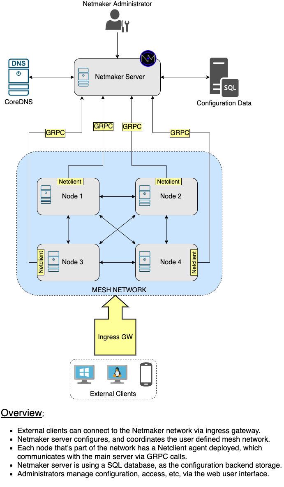

For more information and details about the inner workings and architecture, please visit the official Netmaker [design](https://netmaker.readthedocs.io/en/master/architecture.html) page related to this topic.

Next, you're going to learn how to install and configure the main `Netmaker` server, as well as `Netclients` on each node from your private network. For now Netmaker doesn't offer `High Availability` features, but it is planned in a future release.

## Installing the Netmaker Server

Netmaker server can be installed very quickly and painless via the [DigitalOcean Marketplace](https://marketplace.digitalocean.com/apps). Just choose the desired application that you want to install, and a wizard will pop-up, which will guide you through the process.

### DigitalOcean Marketplace Guide

Please follow below steps to install the Netmaker server via the DigitalOcean `Marketplace` platform:

1. First, navigate to the marketplace page, for the [Netmaker Application](https://marketplace.digitalocean.com/apps/netmaker), and click on the `Create Netmaker Droplet` blue button:

    
2. Next, you will be redirected to the Droplet creation page. Choose a plan that suffices your needs. A basic one of `$5 per month`, should be sufficient in most of the cases:

    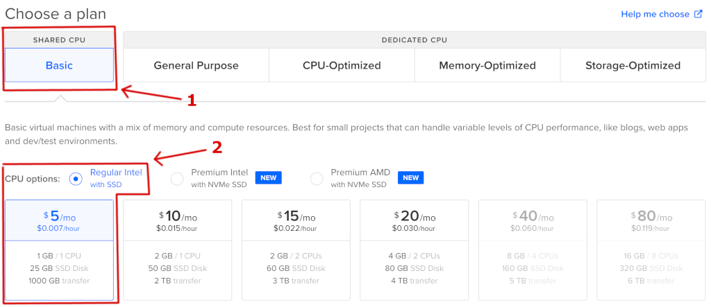
3. Then, choose a region that's closest to you (and corresponding VPC):

    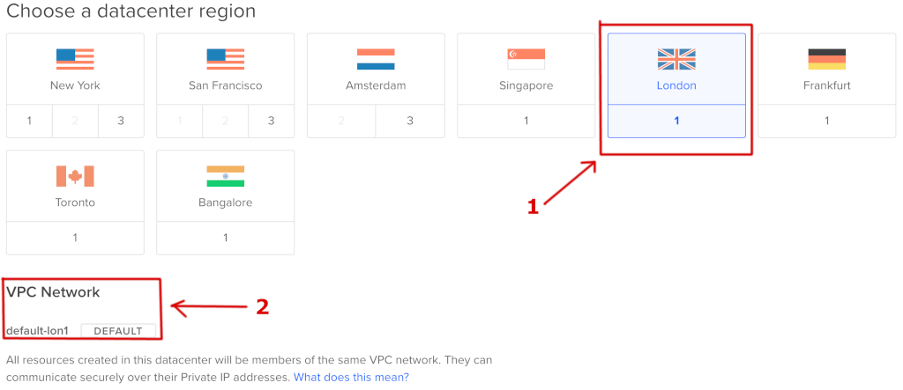
4. Now, add your `SSH` key for authentication:

    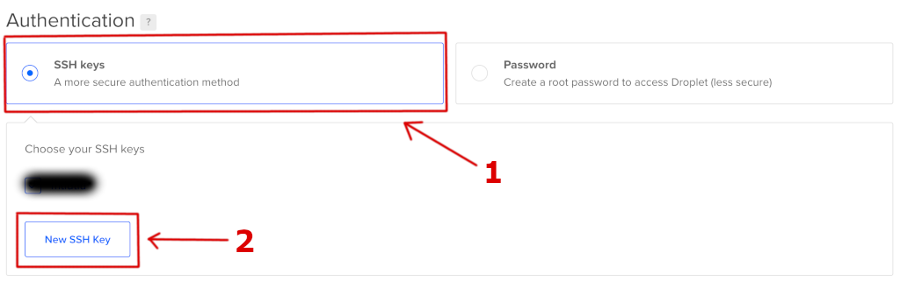
5. Finally, create the `Netmaker Droplet`. Optionally, you can change the `hostname`, and add custom `tags`. It's a good idea to have backups enabled as well:

    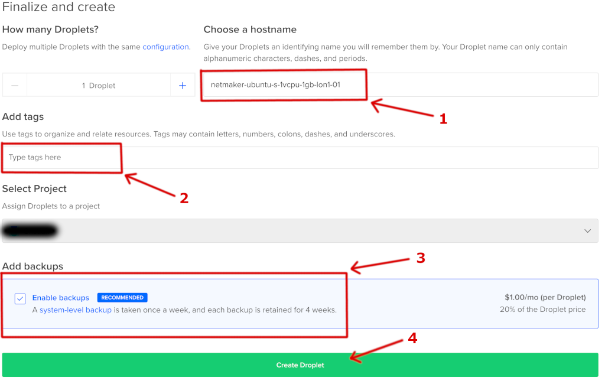

Now, please wait for the Netmaker Droplet to be created and provisioned. In the end, you should get something similar to:


Clicking the `Get Started` link should present you another window containing additional guides, as well as other interesting topics for Netmaker to study:


Next, you will be presented with the initial configuration steps for the Netmaker server and how to access the web management console.

### Finishing the Netmaker Server Setup

To use the Netmaker server, you need to finish a few more steps, by following a one-time interactive guide. The interactive guide will show up only once, after you log in for the first time into the Netmaker machine, via SSH. 

First, please `list` the available `Droplets`, using `doctl` (below command will show only the `machine name`, and the corresponding `public IP address`):

```shell
doctl compute droplet list --format Name,PublicIPv4
```

The output looks similar to (please note down the `Public IPv4` address for the Netmaker server from the list):

```text
Name                                   Public IPv4
basicnp-uan1e                          167.172.62.197
basicnp-uan1g                          167.172.53.77
netmaker-ubuntu-s-1vcpu-1gb-lon1-01    209.97.179.143
```

Next, please open a terminal and SSH into the Netmaker server (please replace the `<>` placeholders accordingly):

```bash
ssh -i <YOUR_SSH_PRIVATE_KEY_FILE_NAME_HERE> root@<YOUR_NETMAKER_SERVER_PUBLIC_IP_HERE>
```

**Note:**

The private SSH key file from the above command, is the one used when installing your Netmaker server. It is not necessarily required to specify the SSH key file, if it's the same as the one from your `~/.ssh` folder.

When asked, please accept the new SSH fingerprint, and follow the on-screen instructions. Please leave the default domain name, unless you have a specific one already set up, and you want to use it here as well. Next, what's important to remember is that you don't need a default network to be created just now (answer `n` to the question) - will be touched shortly. Going further, when asked for a VPN server, answer no (`n`) again, and don't override the master key (type `n` for this question as well).

The output looks similar to:

```text
- - - - - - - - - - - - - - - - - - - - - - - - - - - - - - - - -
- - - - - - - - - - - - - - - - - - - - - - - - - - - - - - - - -
- - - - - - - - - - - - - - - - - - - - - - - - - - - - - - - - -
    ______     ______     ______     __   __   __     ______   __                        
   /\  ___\   /\  == \   /\  __ \   /\ \ / /  /\ \   /\__  _\ /\ \                       
   \ \ \__ \  \ \  __<   \ \  __ \  \ \ \'/   \ \ \  \/_/\ \/ \ \ \____                  
    \ \_____\  \ \_\ \_\  \ \_\ \_\  \ \__|    \ \_\    \ \_\  \ \_____\                 
     \/_____/   \/_/ /_/   \/_/\/_/   \/_/      \/_/     \/_/   \/_____/                 
                                                                                         
 __   __     ______     ______   __    __     ______     __  __     ______     ______    
/\ "-.\ \   /\  ___\   /\__  _\ /\ "-./  \   /\  __ \   /\ \/ /    /\  ___\   /\  == \   
\ \ \-.  \  \ \  __\   \/_/\ \/ \ \ \-./\ \  \ \  __ \  \ \  _"-.  \ \  __\   \ \  __<   
 \ \_\\"\_\  \ \_____\    \ \_\  \ \_\ \ \_\  \ \_\ \_\  \ \_\ \_\  \ \_____\  \ \_\ \_\ 
  \/_/ \/_/   \/_____/     \/_/   \/_/  \/_/   \/_/\/_/   \/_/\/_/   \/_____/   \/_/ /_/ 
                                                                                                                                                                                                 
- - - - - - - - - - - - - - - - - - - - - - - - - - - - - - - - -
- - - - - - - - - - - - - - - - - - - - - - - - - - - - - - - - -
- - - - - - - - - - - - - - - - - - - - - - - - - - - - - - - - -
Default Base Domain: nm.209-97-179-143.nip.io
To Override, add a Wildcard (*.netmaker.example.com) DNS record pointing to 209.97.179.143
Or, add three DNS records pointing to 209.97.179.143 for the following (Replacing 'netmaker.example.com' with the domain of your choice):
   dashboard.netmaker.example.com
         api.netmaker.example.com
        grpc.netmaker.example.com
-----------------------------------------------------
Domain (Hit 'enter' to use nm.209-97-179-143.nip.io): 
Contact Email: test@gmail.com
Configure a default network automatically (y/n)? n
Configure a VPN gateway automatically (y/n)? n
Override master key (***************) (y/n)? n
-----------------------------------------------------------------
                SETUP ARGUMENTS
-----------------------------------------------------------------
        domain: nm.209-97-179-143.nip.io
         email: test@gmail.com
    coredns ip: 209.97.179.143
     public ip: 209.97.179.143
    master key: ***************
   setup mesh?: false
    setup vpn?: false
Does everything look right (y/n)? y
```

Now, the Netmaker automation script will take care of provisioning the required server components via `docker-compose`:

```text
Beginning installation in 5 seconds...
Setting Caddyfile...
Setting docker-compose...
Starting containers...
Creating network "root_default" with the default driver
Creating volume "root_caddy_data" with default driver
Creating volume "root_caddy_conf" with default driver
Creating volume "root_sqldata" with default driver
Creating volume "root_dnsconfig" with default driver
...
Creating netmaker ... done
Creating caddy    ... done
Creating coredns     ... done
Creating netmaker-ui ... done
Netmaker setup is now complete. You are ready to begin using Netmaker.
Visit dashboard.nm.209-97-179-143.nip.io to log in
```

At the end, you will be presented with the Netmaker server dashboard link. You can also check the core components and their status, via `docker-compose`:

```shell
docker-compose ps
```

The output looks similar to (notice all components being in the `Up` state: `CoreDNS`, Netmaker `Server`, Netmaker `UI`, etc):

```text
   Name                  Command               State   Ports                                                                                 
------------------------------------------------------------------------------------------------------------
caddy         caddy run --config /etc/ca ...   Up                     
coredns       /coredns -conf /root/dnsco ...   Up      209.97.179.143:53->53/tcp, 209.97.179.143:53->53/udp                                                                                                                   
netmaker      ./netmaker                       Up      0.0.0.0:50051->50051/tcp ...                                  
netmaker-ui   /docker-entrypoint.sh            Up      0.0.0.0:8082->80/tcp,:::8082->80/tcp
```

Next, a quick walkthrough for the Netmaker administration web console is presented, to get you familiarized with the user interface, as well as some basic tasks, like: creating a private network, managing access keys and nodes inspection.

## Exploring the Netmaker Server Dashboard

In general, Netmaker is managed via a simple web interface that let's you perform administrative tasks like:

- Managing networks, Egress Gateways, Nodes, etc.
- Managing access keys for devices or nodes that need access to Netmaker resources.
- Managing external clients, like: phones, tablets or laptops accessing Netmaker resources.
- Internal DNS configuration and management.
- Users and roles for accessing the web dashboard.

### Accessing the Netmaker Dashboard

To access the Netmaker server web interface or dashboard, you can use the following URL (make sure to replace the `<>` placeholders accordingly):

```text
https://dashboard.nm.<YOUR_NETMAKER_DROPLET_DASHED_PUBLIC_IP_HERE>.nip.io
```

Notes:

- `YOUR_NETMAKER_DROPLET_DASHED_PUBLIC_IP_HERE` represents your Netmaker Droplet public IP having all dots replaced with the dash symbol: `-`. For example, if your droplet public IP is `209.97.179.143`, then the dashed version becomes: `209-97-179-143`.
- Based on the above example, the dashboard URL becomes: `https://dashboard.nm.209-97-179-143.nip.io`.
- Another way of finding the Netmaker dashboard URL is by SSH-ing as root to the Droplet, and then inspecting the `Caddyfile` from the home folder:

    ```shell
    cat Caddyfile
    ```

    The output looks similar to (notice the `# Dashboard` section):

    ```json
    {
        # LetsEncrypt account
        email test@gmail.com
    }

    # Dashboard
    https://dashboard.nm.209-97-179-143.nip.io {
        reverse_proxy http://127.0.0.1:8082
    }

    # API
    https://api.nm.209-97-179-143.nip.io {
        reverse_proxy http://127.0.0.1:8081
    }

    # gRPC
    https://grpc.nm.209-97-179-143.nip.io {
        reverse_proxy h2c://127.0.0.1:50051
    }
    ```

When you log in for the first time, a pop-up window will appear asking you to set the administrator user credentials. Please go ahead and set those now:

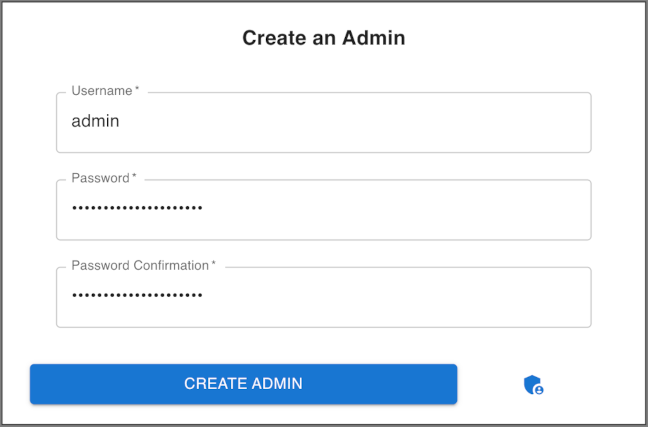

Then, you will be asked to log in using the credentials set previously:

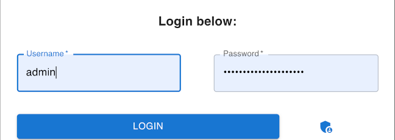

After successfully logging in, you will be presented with the main dashboard interface:


Next, you will discover each important section from the main dashboard that are relevant for this tutorial, like:

- `Networks`: Lets you define and manage private networks.
- `Access Keys`: Lets you manage access keys for various devices or nodes accessing private resources.
- `Nodes`: Lets you inspect and manage nodes that are part of your private network.

### Exploring the Networks Section

The `Networks` feature that Netmaker provides, lets you define and manage private networks for seamlessly connecting various systems, like: Kubernetes clusters (e.g. `DOKS`), managed databases, virtual machines (e.g. Droplets) across different regions (or data centers), even across different cloud providers.

From the Netmaker main dashboard page, you can access the `Networks` section by clicking the corresponding tile, as shown below:

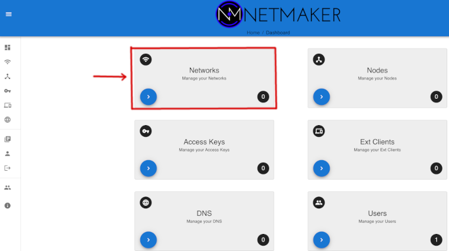

Next, you can define a new private network by clicking the `Create Network` blue button from the right side:

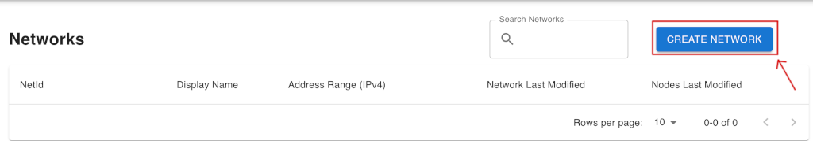

Now, give it a name and give it an address range, making sure that it **doesn't overlap with existing `CIDRs`** for other resources in your DO account (like other DOKS clusters, for example). There's an autofill feature available as well, but please bear in mind the previous note. Then, click on the `Create` button from the bottom:

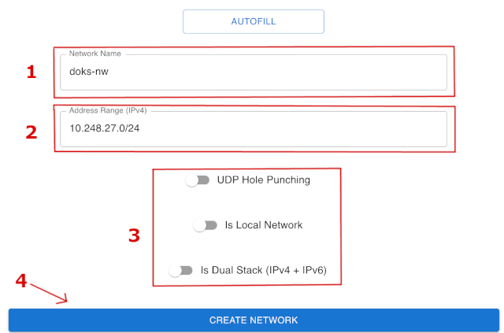

After completing the step, the new network should be present in the listing:


Going further, you can click on it and fine tune if necessary. Usually the default values are just fine, but there might be some special cases when you need to touch the defaults:

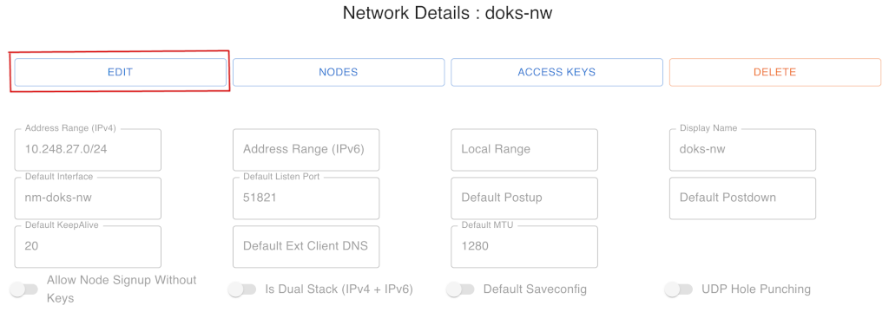

### Exploring the Access Keys Section

The `Access Keys` feature that Netmaker provides, lets you define a set of keys which will then be used to allow access for other devices or nodes that needs to be part of your private network, and exchange data in a secure manner.

From the Netmaker main dashboard page, you can navigate to the `Access Keys` section by clicking the corresponding tile, as shown below:


Next, you need to select a network to create access keys for, by expanding the drop down list:

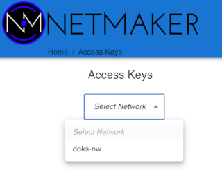

In the next page, make sure that your desired network is selected, then click on the `Create Access Key` blue button down below:

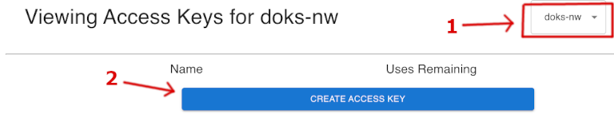

Next, give it a proper name and number of uses, then press `Create` button:

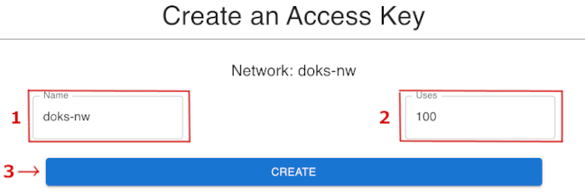

Finally, you will be presented with a pop-up window giving you the access key and token for your clients (or nodes), as well as some instructions for various OS-es:


The above information can be accessed anytime, by navigating to the access keys page and clicking on the corresponding key in the list.

### Exploring the Nodes Section

The `Nodes` tile that Netmaker provides, lets you inspect the nodes that are part of each private network. You can also set other node(s) features, like `Egress` or `Ingress Gateway` functionality for example.

From the Netmaker main dashboard page, you can navigate to the `Nodes` section by clicking the corresponding tile, as shown below:

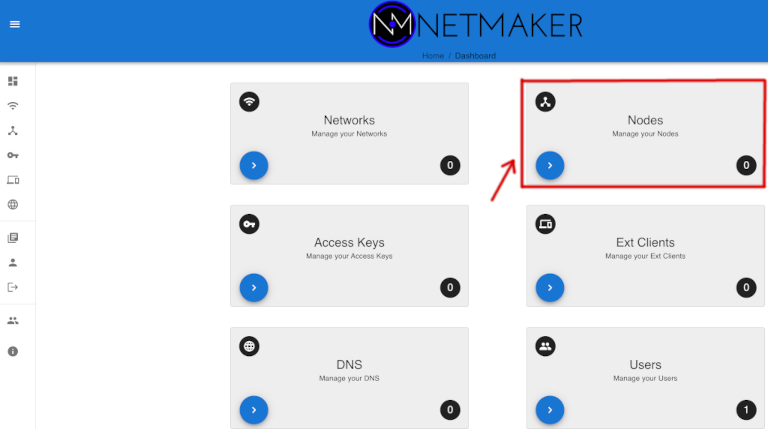

Next, you will be presented with a list of nodes, their name and corresponding network. Other details are shown, like `Egress` or `Ingress` functionality, as well as each node `IP` address, and if it's `Healthy` or not:


Finally, if desired you can set advanced settings for each node, as shown below:


**Important note:**

**Please bear in mind that if changing one value in the node settings, you should do this for every node that's part of the respective network. Changes do not propagate automatically to other nodes !!!**

TBD.