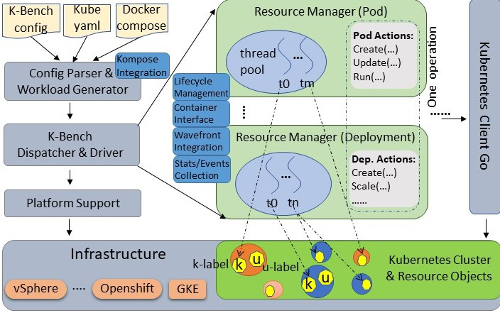
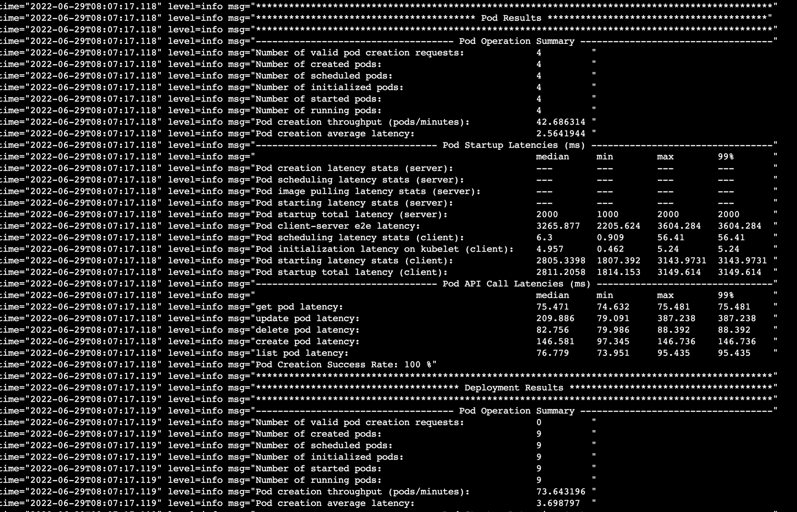
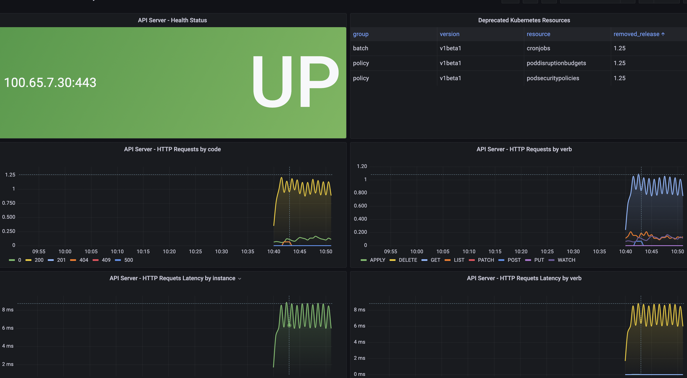
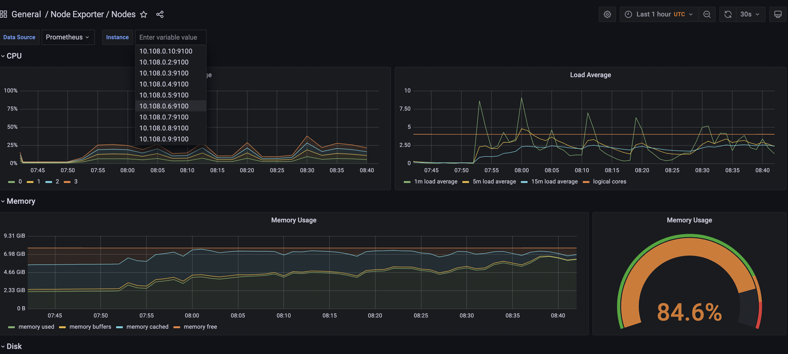
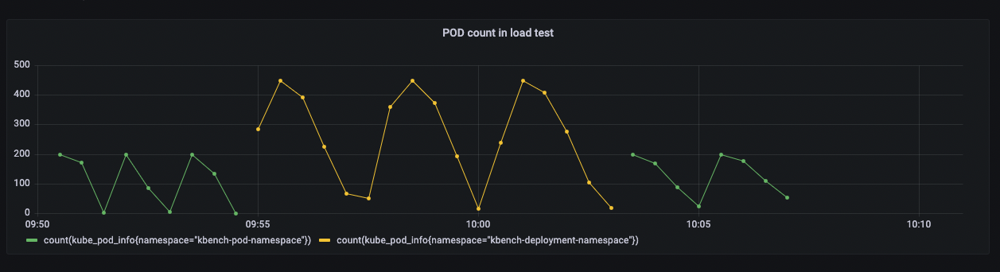

## Overview

Load Testing is a non-functional software testing process in which the performance of a system is tested under a specific expected load. It determines how the system behaves while being put under load. The goal of Load Testing is to improve performance bottlenecks and to ensure stability and smooth functioning of the system. Load testing gives confidence in the system & its reliability and performance.

[K-bench](https://github.com/vmware-tanzu/k-bench) is a framework to benchmark the control and data plane aspects of a Kubernetes infrastructure. K-Bench provides a configurable way to prescriptively create and manipulate Kubernetes resources at scale and eventually provide the relevant control plane and dataplane performance metrics for the target infrastructure.
K-bench allows users to control the client side concurrency, the operations, and how these different types of operations are executed in sequence or in parallel. In particular, user can define, through a config file, a workflow of operations for supported resources.
After a successful run, the benchmark reports metrics (e.g., number of requests, API invoke latency, throughput, etc.) for the executed operations on various resource types.

In this tutorial, you will configure K-bench. This tool needs to be installed on a droplet, prefferably with access to the target cluster for testing.
You will be configuring (if not already present) a prometheus stack for your cluster to observe the results of a test run.

## K-bench Architecture Diagram



## Table of Contents

- [Overview](#overview)
- [K-bench Architecture Diagram](#kbench-architecture-diagram)
- [Prerequisites](#prerequisites)
- [Creating a DO droplet for K-bench](#creating-a-DO-droplet-for-K-bench)
- [K-bench Benchmark Results Sample](#k-bench-benchmark-results-sample)
- [Grafana metric visualization](#grafana-metric-visualization)
- [Grafana API Server Dashboard sample](#grafana-api-server-dashboard-sample)
- [Grafana Node Dashboard sample](#grafana-node-dashboard-sample)
- [Grafana Pod Count sample](#grafana-pod-count-sample)

## Prerequisites

To complete this tutorial, you will need:

1. DOKS cluster, refer to: [Kubernetes-Starter-Kit-Developers](https://github.com/digitalocean/Kubernetes-Starter-Kit-Developers/tree/main/01-setup-DOKS) if one needs to be created
2. Prometheus stack installed on the cluster, refer to: [Kubernetes-Starter-Kit-Developers](https://github.com/digitalocean/Kubernetes-Starter-Kit-Developers/tree/main/04-setup-prometheus-stack) if it's not installed
3. A droplet which will server as the K-bench `master`

## Creating a DO droplet for K-bench

In this section you will create a droplet which will server as your K-bench master. On this droplet you will clone the K-bench repo, perform the installation, run tests and/or add any new tests which will fit your use case. The reason for using a droplet is that it is best to have a decoupled resource apart from the cluster which we can use for just one specific reason and that is doing load tests and visualising the results of benchmarks.

Please follow below steps to create a droplet, install and configure K-bench:

1. Navigate to your [DO cloud account](https://cloud.digitalocean.com/).
2. From the Dashboard, click on the `Create` button and select the `Droplets` option.
3. Choose the Ubuntu distribution, the basic plan, Regular with SSD CPU options, a region and as `Authenticaion` choose the SSH keys option. If no SSH keys are present [this article](https://docs.digitalocean.com/products/droplets/how-to/add-ssh-keys/) explains how to create one and add them to the DO account.
4. From the droplet dashboard click on the `Console` button. After this you will be presented with a screen informing you to `Update Droplet Console`, follow those steps to gain SSH access to the droplet.
5. Once the SSH access is available, click on the `Console` button again. You will be logged in as root into the droplet.
6. Clone the [K-bench](https://github.com/vmware-tanzu/k-bench) repository via HTTPS using this command:

    ```console
    git clone https://github.com/vmware-tanzu/k-bench.git
    ```

7. Navigate to the cloned repository directory.

    ```console
    cd k-bench/
    ```

8. Run the install script to install `GO` and any other dependencies `K-Bench` has.

    ```console
    ./install.sh
    ```

9. From the DOKS cluster dashboard, click on the `Download Config File` and copy the contents of the config file. `K-bench` needs that information to connect to the cluster.
10. Create a kube folder where the kube config will be added, paste the contents copied from Step 9 and save the file.

    ```console
    mkdir ~/.kube
    vim ~/.kube/config
    ```

11. As a validation step, run the test start command which will create a benchmark for the `default` test.

    ```console
    ./run.sh
    ```

12. If the test was successful, the tool will output that it started and it is writing the logs to a folder prefixed with `results_run_<date>`
13. Open the benchmark log and observe the results.

    ```console
    cat results_run_29-Jun-2022-08-06-42-am/default/kbench.log
    ```

**Notes:**

The tests are added under the `config` folder of `k-bench`. To change an existing test it’s `config.json` file needs to be updated.
The test is ran via the `-t` flag supplied by k-bench. For example running the `cp_heavy_12client` is done via: `./run.sh -t cp_heavy_12client`

## K-bench Benchmark Results Sample



## Grafana Metric Visualization

`K-bench` tests are very easily observable using Grafana. You can create different dashboards to provide observability and understanding of Prometheus metrics. In this section you will explore some useful metrics for Kubernetes as well as some Dashboards which can offer insight as to what is happening with the DOKS cluster under load.

**Notes:**

This section can only be completed if the prometheus stack was created earlier in Step 2 of the [Prerequisites](#prerequisites) section or is already installed on the cluster.

Please follow below steps:

1. Connect to Grafana (using default credentials: `admin/prom-operator`) by port forwarding to local machine.

    ```console
    kubectl --namespace monitoring port-forward svc/kube-prom-stack-grafana 3000:80
    ```

2. Navigate to `http://localhost:3000/` and login to Grafana.
3. Import the `Kubernetes System Api Server` by navigating to `http://localhost:3000/dashboard/import`, add the `15761` ID in the box under `Import via grafana.com` and add Load
4. From the upper mentioned dashboard you will be able to see the API latency, HTTP requests by code, HTTPS requests by verb etc. You can use this dashboard to monitor the API under load.
5. From the Grafana main page, click on the `Dashboards` menu and click on the Node Exporter Nodes to open a `Node` resource oriented dashboard. You can use this dashboard to monitor the resources available in your nodes during a test.
6. You can also use various metrics to count the number of pods that have been created during a test. For example from the `Explore` page enter the following in the metrics browser: `count(kube_pod_info{namespace="kbench-pod-namespace"})`. This will show a graph with the number of pods at any given time.

## Grafana API Server Dashboard Sample



## Grafana Node Dashboard sample



## Grafana Pod Count sample


