# Setting up Virtual Networks Using Netmaker

## Overview

[Netmaker](https://github.com/gravitl/netmaker) is a tool for creating and managing virtual overlay networks. You can create as many overlay networks as you want, and connect different machines from different data centers transparently. At its heart Netmaker is using [WireGuard](https://www.wireguard.com) to do the magic. Being an overlay network, it doesn't affect your existing network setup, it just sits on top of it offering a lot of flexibility and possibilities.

`Netmaker` allows you to define and create `private networks`, just as `VPCs` are. It's built with `security` in mind as well. The way it works is by creating `secure tunnels` across machines, a feature offered by `WireGuard`. Netmaker follows a `client-server` model, and consists of two parts:

1. The `admin server`, called `Netmaker`.
2. `Agents` (or `clients`) deployed on each machine (or node), called `Netclients`.

The Netmaker server doesn't deal with network traffic (although it can be told to, if needed). The main role of the server is to keep configuration state, and control or manage user defined networks. Each machine participating in the network, is called a `Node`. For the most part, Netmaker serves `configuration` data to `Nodes`, telling them how they should configure themselves. `Netclient` is the `agent` that performs the actual configuration.

Traffic goes between nodes, peer to peer. On the other hand, each node can relay messages as well and improve network resiliency. Netmaker allows you to define and create `mesh networks`, which is a really powerful feature. Mesh networks add resiliency because the network can heal itself. All nodes are interconnected and contribute to traffic. If one node dies, others will take its place, thus offering transparency.

`Netmaker` also allows you to define `Egress Gateways` in a very simple manner. You just select one node from your private network and an interface for outbound traffic, and then tell Netmaker to configure it as an egress gateway (all the hard work is handled by Netmaker). Same applies for setting up an `Ingress Gateway` - all at the click of a button.

Being based on `WireGuard` it offers `VPN` support, so you can create various configurations, like:

1. Personal (Private Browsing).
2. Remote Access.
3. Site-to-Site.
4. Mesh (virtual LAN/WAN).

`WireGuard` is `fast` and industry proven, which is another real advantage. Below picture shows the Netmaker architecture and how it manages networks:


For more information and details about the inner workings and architecture, please visit the official Netmaker [design](https://netmaker.readthedocs.io/en/master/architecture.html) page related to this topic.

This blueprint touches the following topics:

- Setting up an `Egress Gateway` to allow external resources to see traffic coming from a single IP.
- Connecting in a secure manner multiple resources (Droplets, DOKS clusters) across different regions.
- Setting up an `Ingress Gateway` to allow external clients to access your private resources (e.g. to SSH into your DOKS cluster nodes, or other Droplets).

Next, you're going to learn how to install and configure the main `Netmaker` server, as well as `Netclients` on each node forming your private network. For now Netmaker doesn't offer `High Availability` features, but it's planned for a future release.

## Table of Contents

- [Overview](#overview)
- [Prerequisites](#prerequisites)
- [Installing the Netmaker Server](#installing-the-netmaker-server)
  - [DigitalOcean Marketplace Guide](#digitalocean-marketplace-guide)
  - [Finishing the Netmaker Server Setup](#finishing-the-netmaker-server-setup)
- [Exploring the Netmaker Server Dashboard](#exploring-the-netmaker-server-dashboard)
  - [Accessing the Netmaker Dashboard](#accessing-the-netmaker-dashboard)
  - [Exploring the Networks Section](#exploring-the-networks-section)
  - [Exploring the Access Keys Section](#exploring-the-access-keys-section)
  - [Exploring the Nodes Section](#exploring-the-nodes-section)
- [Creating an Egress Gateway for DOKS](#creating-an-egress-gateway-for-doks)
  - [Configuring Netmaker Server](#configuring-netmaker-server)
  - [Installing Netclient on DOKS Worker Nodes](#installing-netclient-on-doks-worker-nodes)
  - [Testing the DOKS Cluster Egress Setup](#testing-the-doks-cluster-egress-setup)
  - [Checking WireGuard Configuration](#checking-wireguard-configuration)
- [Connecting DOKS Clusters and Droplets Across Different Regions](#connecting-doks-clusters-and-droplets-across-different-regions)
  - [Configuring a Private Network for the Multiregional Setup](#configuring-a-private-network-for-the-multiregional-setup)
  - [Deploying Netclients on DOKS Worker Nodes and MySQL Droplet](#deploying-netclients-on-doks-worker-nodes-and-mysql-droplet)
  - [Testing the Multiregional Setup](#testing-the-multiregional-setup)
- [Connecting External Clients via Ingress Gateway](#connecting-external-clients-via-ingress-gateway)
- [Summary](#summary)

## Prerequisites

To complete this tutorial, you will need:

1. [Doctl](https://github.com/digitalocean/doctl/releases) CLI, for `DigitalOcean` API interaction.
2. [Kubectl](https://kubernetes.io/docs/tasks/tools) CLI, for `Kubernetes` interaction.
3. Basic knowledge on how to run and operate `DOKS` clusters. You can learn more [here](https://docs.digitalocean.com/products/kubernetes).
4. Basic knowledge on how to create and manage `Droplets`. You can learn more [here](https://docs.digitalocean.com/products/droplets).
5. Basic knowledge and experience with shell commands (e.g. `Bash`).

## Installing the Netmaker Server

Netmaker server can be installed very quickly and painless via the [DigitalOcean Marketplace](https://marketplace.digitalocean.com/apps). Just choose the desired application that you want to install, and a wizard will pop-up, which will guide you through the process.

### DigitalOcean Marketplace Guide

Please follow below steps to install the Netmaker server via the DigitalOcean `Marketplace` platform:

1. First, navigate to the marketplace page, for the [Netmaker Application](https://marketplace.digitalocean.com/apps/netmaker), and click on the `Create Netmaker Droplet` blue button:

    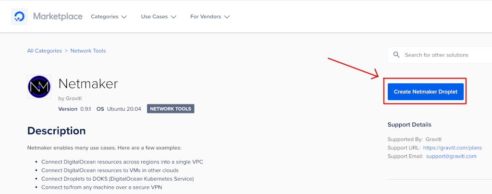
2. Next, you will be redirected to the Droplet creation page. A basic plan of `$5 per month` should be sufficient in most cases.
3. Then, choose a region closest to you.
4. Now, add your `SSH` key to access the Netmaker Droplet console later on.
5. Finally, create the `Netmaker Droplet`. Optionally, you can change the `hostname` and add custom `tags`. It's a good idea to have backups enabled as well.

Please wait for the Netmaker Droplet to be created and provisioned. In the end, you should get something similar to:

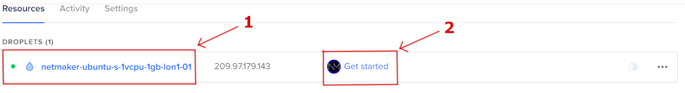

Clicking the `Get Started` link should present you another window containing additional guides, as well as other interesting topics for Netmaker to study:

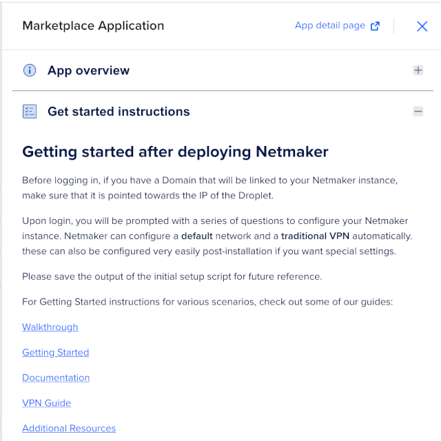

Next, you will be guided through the initial configuration steps for the Netmaker server, as well as how to access the web management console.

### Finishing the Netmaker Server Setup

To complete the Netmaker server installation, a few more steps are required. First, please `list` the available `Droplets`, using `doctl` (below command will show only the `machine name`, and the corresponding `public IP address`):

```shell
doctl compute droplet list --format Name,PublicIPv4
```

The output looks similar to (please note down the `Public IPv4` address for the Netmaker server from the list):

```text
Name                                   Public IPv4
basicnp-uan1e                          167.172.62.197
basicnp-uan1g                          167.172.53.77
netmaker-ubuntu-s-1vcpu-1gb-lon1-01    209.97.179.143
```

Next, please open a terminal and SSH into the Netmaker server (please replace the `<>` placeholders accordingly):

```bash
ssh -i <YOUR_SSH_PRIVATE_KEY_FILE_NAME_HERE> root@<YOUR_NETMAKER_SERVER_PUBLIC_IP_HERE>
```

**Note:**

The private SSH key file from the above command, is the one used when installing your Netmaker server. It is not necessarily required to specify the SSH key file, if it's the same as the one from your `~/.ssh` folder.

After logging on the Netmaker machine, you will be presented with a one-time interactive guide. When asked, leave the default domain name unless you have a specific one already set up. Next, when asked about creating a default network, type `n` - you will learn shortly how to create one. Going further, type `n` when asked about adding a VPN server. Finally, don't override the master key (type `n` for this question as well).

The output looks similar to:

```text
- - - - - - - - - - - - - - - - - - - - - - - - - - - - - - - - -
- - - - - - - - - - - - - - - - - - - - - - - - - - - - - - - - -
- - - - - - - - - - - - - - - - - - - - - - - - - - - - - - - - -
    ______     ______     ______     __   __   __     ______   __                        
   /\  ___\   /\  == \   /\  __ \   /\ \ / /  /\ \   /\__  _\ /\ \                       
   \ \ \__ \  \ \  __<   \ \  __ \  \ \ \'/   \ \ \  \/_/\ \/ \ \ \____                  
    \ \_____\  \ \_\ \_\  \ \_\ \_\  \ \__|    \ \_\    \ \_\  \ \_____\                 
     \/_____/   \/_/ /_/   \/_/\/_/   \/_/      \/_/     \/_/   \/_____/                 
                                                                                         
 __   __     ______     ______   __    __     ______     __  __     ______     ______    
/\ "-.\ \   /\  ___\   /\__  _\ /\ "-./  \   /\  __ \   /\ \/ /    /\  ___\   /\  == \   
\ \ \-.  \  \ \  __\   \/_/\ \/ \ \ \-./\ \  \ \  __ \  \ \  _"-.  \ \  __\   \ \  __<   
 \ \_\\"\_\  \ \_____\    \ \_\  \ \_\ \ \_\  \ \_\ \_\  \ \_\ \_\  \ \_____\  \ \_\ \_\ 
  \/_/ \/_/   \/_____/     \/_/   \/_/  \/_/   \/_/\/_/   \/_/\/_/   \/_____/   \/_/ /_/ 
                                                                                                                                                                                                 
- - - - - - - - - - - - - - - - - - - - - - - - - - - - - - - - -
- - - - - - - - - - - - - - - - - - - - - - - - - - - - - - - - -
- - - - - - - - - - - - - - - - - - - - - - - - - - - - - - - - -
Default Base Domain: nm.209-97-179-143.nip.io
To Override, add a Wildcard (*.netmaker.example.com) DNS record pointing to 209.97.179.143
Or, add three DNS records pointing to 209.97.179.143 for the following (Replacing 'netmaker.example.com' with the domain of your choice):
   dashboard.netmaker.example.com
         api.netmaker.example.com
        grpc.netmaker.example.com
-----------------------------------------------------
Domain (Hit 'enter' to use nm.209-97-179-143.nip.io): 
Contact Email: test@gmail.com
Configure a default network automatically (y/n)? n
Configure a VPN gateway automatically (y/n)? n
Override master key (***************) (y/n)? n
-----------------------------------------------------------------
                SETUP ARGUMENTS
-----------------------------------------------------------------
        domain: nm.209-97-179-143.nip.io
         email: test@gmail.com
    coredns ip: 209.97.179.143
     public ip: 209.97.179.143
    master key: ***************
   setup mesh?: false
    setup vpn?: false
Does everything look right (y/n)? y
```

Now, the Netmaker automation script will take care of provisioning the required server components via `docker-compose`:

```text
Beginning installation in 5 seconds...
Setting Caddyfile...
Setting docker-compose...
Starting containers...
Creating network "root_default" with the default driver
Creating volume "root_caddy_data" with default driver
Creating volume "root_caddy_conf" with default driver
Creating volume "root_sqldata" with default driver
Creating volume "root_dnsconfig" with default driver
...
Creating netmaker ... done
Creating caddy    ... done
Creating coredns     ... done
Creating netmaker-ui ... done
Netmaker setup is now complete. You are ready to begin using Netmaker.
Visit dashboard.nm.209-97-179-143.nip.io to log in
```

At the end, a link is provided pointing to the Netmaker server dashboard. The server itself is deployed as a set of docker containers, managed via `docker-compose`. You can check server components status, via `docker-compose`:

```shell
docker-compose ps
```

The output looks similar to (notice all components being in the `Up` state: `CoreDNS`, Netmaker `Server`, Netmaker `UI`, etc):

```text
   Name                  Command               State   Ports                                                                                 
------------------------------------------------------------------------------------------------------------
caddy         caddy run --config /etc/ca ...   Up                     
coredns       /coredns -conf /root/dnsco ...   Up      209.97.179.143:53->53/tcp, 209.97.179.143:53->53/udp                                                                                                                   
netmaker      ./netmaker                       Up      0.0.0.0:50051->50051/tcp ...                                  
netmaker-ui   /docker-entrypoint.sh            Up      0.0.0.0:8082->80/tcp,:::8082->80/tcp
```

Next, a quick walkthrough for the Netmaker administration web console is presented, to get you familiarized with the user interface, as well as some basic tasks, like: creating a private network, managing access keys and nodes inspection.

## Exploring the Netmaker Server Dashboard

In general, Netmaker is managed via a simple web interface allowing you to perform administrative tasks like:

- Managing networks, Egress Gateways, Nodes, etc.
- Managing access keys for devices or nodes that need access to Netmaker resources.
- Managing external clients, like: phones, tablets or laptops accessing Netmaker resources.
- Internal DNS configuration and management.
- Users and roles for accessing the web dashboard.

### Accessing the Netmaker Dashboard

To access the Netmaker server web interface or dashboard, you can use the following URL (make sure to replace the `<>` placeholders accordingly):

```text
https://dashboard.nm.<YOUR_NETMAKER_DROPLET_DASHED_NOTATION_PUBLIC_IP_HERE>.nip.io
```

Notes:

- `YOUR_NETMAKER_DROPLET_DASHED_NOTATION_PUBLIC_IP` represents your Netmaker Droplet public IP having all dots replaced with the dash symbol: `-`. For example, if your droplet public IP is `209.97.179.143`, then the dashed version becomes: `209-97-179-143`.
- Based on the above example, the dashboard URL becomes: `https://dashboard.nm.209-97-179-143.nip.io`.
- Another way of finding the Netmaker dashboard URL is by SSH-ing as root to the Droplet, and then inspecting the `Caddyfile` from the home folder:

    ```shell
    cat Caddyfile
    ```

    The output looks similar to (notice the `# Dashboard` section):

    ```text
    {
    # LetsEncrypt account
    email fake@email.com
    }

    # Dashboard
    https://dashboard.nm.209-97-179-143.nip.io {
        reverse_proxy http://127.0.0.1:8082
    }

    # API
    https://api.nm.209-97-179-143.nip.io {
        reverse_proxy http://127.0.0.1:8081
    }

    # gRPC
    https://grpc.nm.209-97-179-143.nip.io {
        reverse_proxy h2c://127.0.0.1:50051
    }
    ```

When you log in for the first time, a pop-up window will appear asking you to set the administrator user credentials. Please go ahead and set those now. Then, please go ahead and log in using the credentials set previously.

After successfully logging in, you will be presented with the main dashboard interface:

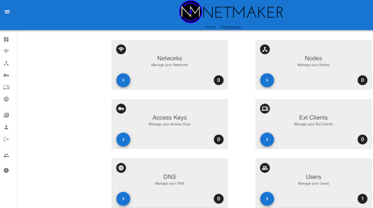

Next, you will discover each important section from the main dashboard that is relevant for this tutorial, like:

- `Networks`: Lets you define and manage private networks.
- `Access Keys`: Lets you manage access keys for various devices or nodes accessing private resources.
- `Nodes`: Lets you inspect and manage nodes that are part of your private network.

### Exploring the Networks Section

The `Networks` feature that Netmaker provides lets you define and manage private networks for seamlessly connecting various systems, like: Kubernetes clusters (e.g. `DOKS`), managed databases, virtual machines (e.g. Droplets) across different regions (or data centers), even across different cloud providers.

From the Netmaker main dashboard page you can access the `Networks` section by clicking the corresponding tile, as shown below:


Here, you can define and manage private networks, as well as change advanced settings for each network. For more information and the available options, please consult the [Netmaker Networks](https://netmaker.readthedocs.io/en/master/ui-reference.html#networks) page from the official documentation.

### Exploring the Access Keys Section

The `Access Keys` feature that Netmaker provides, lets you define a set of keys which will then be used to allow access for other devices or nodes that needs to be part of your private network, and exchange data in a secure manner.

From the Netmaker main dashboard page you can navigate to the `Access Keys` section by clicking the corresponding tile, as shown below:

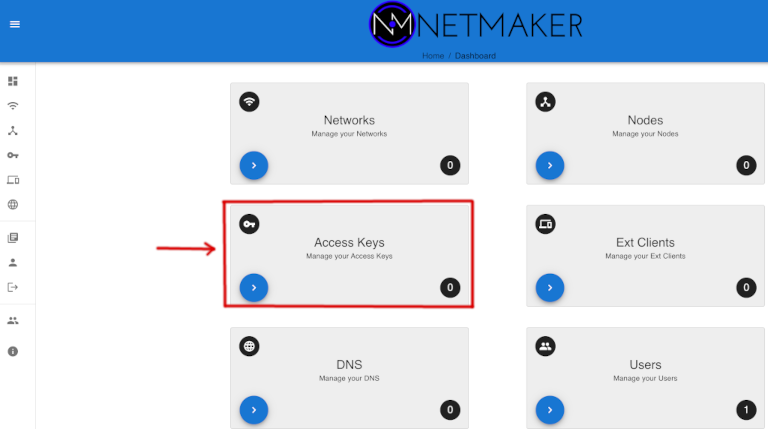

This section allows you to create and manage the access keys, as well as giving you instructions on how to deploy `Netclients` for various operating systems. You cannot change the access keys or any information from this section once generated, but you can always get back here and fetch the access keys value, when needed.

For more information about access keys and the available options, please consult the [Netmaker Access Keys](https://netmaker.readthedocs.io/en/master/getting-started.html#create-a-key) page from the official documentation.

### Exploring the Nodes Section

The `Nodes` tile that Netmaker provides, lets you inspect the nodes that are part of each private network. You can also set other node(s) features, like `Egress` or `Ingress` gateway functionality for example.

From the Netmaker main dashboard page, you can navigate to the `Nodes` section by clicking the corresponding tile, as shown below:


Here, for every node that you have you will get details like:

- `Node name` (1).
- `Private IP` address of the node (2).
- `Network` name that this node is part of (3).
- `Egress` functionality of the node (4).
- `Ingress` functionality of the node (5).
- `Health` status of the node (6).

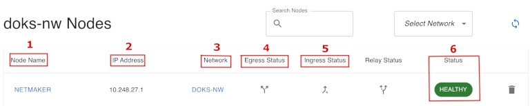

Finally, if desired you can change the advanced settings for each node by clicking on its name. For more information about nodes page and available options, please consult the [Netmaker Nodes](https://netmaker.readthedocs.io/en/master/ui-reference.html#nodes) page from the official documentation.

## Creating an Egress Gateway for DOKS

What is an `Egress Gateway` and more important, why do you need one?

`Ingress` deals with `inbound` traffic, whereas `Egress` deals with `outbound` traffic. Going further, there are two key aspects to keep in mind:

1. Security implications.
2. Having a well defined model and set of measures for your infrastructure (either cloud based or on-premise), so that each entity from the system cannot compromise the others.

Suppose you have a private network and a bunch of machines or nodes inside the network. Do you really trust any machine in the network doing the right thing? In a sense you do, because you set up all those machines, thus knowing what applications are running on each. But even so, you may have many people working with you and accessing those machines, thus performing various operations. Of course, as a system administrator you would limit access and assign roles (RBAC), so that you have a finer control of who has access and to what resources.

What about network traffic ? In the same way, you should consider limiting or restricting both inbound and outbound traffic. Basically, nothing goes in or out without explicitly being allowed to, via explicit network policies in place. On the long term, imagine what would happen if any machine (or application running on it) is allowed to carry network traffic (in our out) without explicitly being allowed to do so. Soon, things can get out of control. By having a dedicated node (or gateway) in your network to control in or out traffic, things become much easier to manage and observe. Not only that, it also allows you to enforce more strict policies, and watch it more thoroughly by performing audits.

You already have `Firewalls` in place to allow or restrict traffic, which is an important security measure as well. `VPCs` isolate your resources (`Droplets`, `Load Balancers`, etc) between clusters in same or different regions. The `Egress` use case, is more related to how you control and route traffic between VPCs. An `Egress Gateway` is just a `NAT Gateway` in essence.

Moving further with a practical example, suppose that you need to use an external service like a legacy database, for example. The database is usually located in another datacenter from another provider. Then, for security reasons, you set up a firewall for the database so that no one is able to access it, only a specific IP or set of IPs.

You can egress from DOKS cluster nodes, but it's not practical because nodes are volatile, hence their IPs. It means that on the other end (meaning the database service), you need to change firewall rules again and again to allow the new IPs. This is the most frequent example where an Egress Gateway becomes useful, and where Netmaker plays an important role.

What you usually do is, have a dedicated machine (or Droplet) where Netmaker runs and has a fixed (or static) IP assigned. Then, you deploy `Netclients` to your DOKS cluster as a `DaemonSet`, so that the cluster nodes become part of your private network that you set up via Netmaker. Going, further the Netmaker server becomes the Egress Gateway, thus allowing outbound traffic to the external service (the database in this example). Finally, the external service (database) firewall is configured to allow inbound traffic from the Netmaker Egress Gateway IP.

Below is a diagram, showing the main setup for egressing DOKS cluster traffic to an external database:

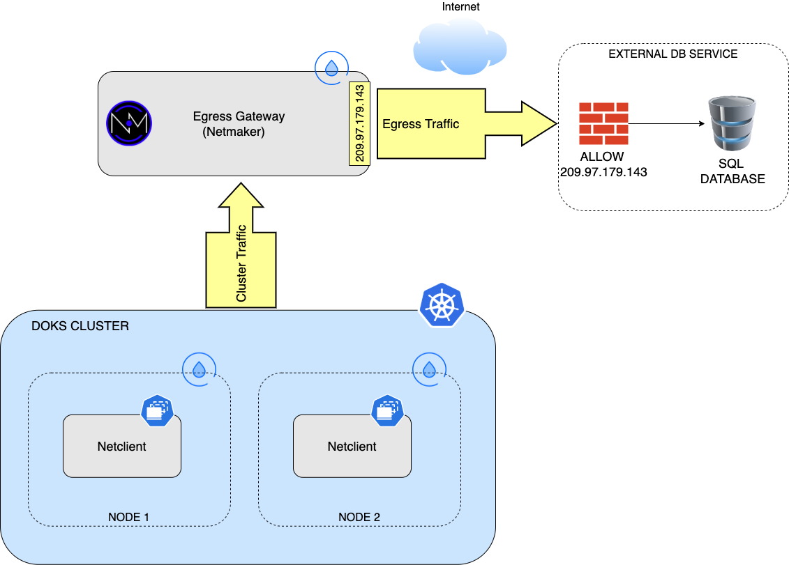

**Important things to remember:**

- By default the Netmaker server (or the Egress Gateway in this case) will route traffic via its public interface. This is a valid use case in general because usually the Netmaker server should not be tied to a specific VPC or any network of any cloud provider. Remember that Netmaker main purpose is to create overlay networks - this is very important to remember and understand. As an example, the Netmaker server can be installed and run from your home network if desired, it just needs to be accessible via its public IP address. Then, it's just a matter of creating `tunnels` from your home private network to your friend private network, or to whatever private datacenter you want to have access to in a secure manner.
- From a security point of view everything is encrypted, nothing goes out in the wild using clear text. More than that, `WireGuard` (the power horse running behind Netmaker) will not allow traffic from other nodes that are not part of the private network that you configured using Netmaker. Packets coming from unknown IPs are dropped. The downside is that in order for this to work, the nodes must have static IPs so that WireGuard can build the internal list of allowable (or known) IPs.

Going further, there are two steps involved:

- Configuring the `Netmaker server` to act as an `Egress Gateway`.
- Configuring `DOKS`, or installing the `Netclients` on each node of the cluster.

### Configuring Netmaker Server

In this section you will define a private network, which your DOKS cluster will be part of in the end. Then, you need to configure the Netmaker server to act as an `Egress Gateway`. By default, the Netmaker server itself will be part of your private network as well, thus enabling you to send outbound traffic or egress through it.

Why enable egress gateway functionality on the Netmaker server itself and not for any of the DOKS worker nodes ? Well, DOKS cluster nodes are volatile (can be recycled at any point in time), thus a new public IP gets assigned to each - not good. A dedicated machine which never goes down, and has a static public IP assigned is more appropriate, hence the Netmaker server is a good candidate.

Please follow below steps to complete this section:

1. Log in to Netmaker server, as explained in the [Accessing the Netmaker Dashboard](#accessing-the-netmaker-dashboard) section of this guide.
2. Once logged in, click the `Networks` tile from the main dashboard:

    
3. Then, click on the `Create Network` blue button on the right corner and fill in your own network details. You may choose any IP class and range you wish as long as it doesn't overlap with the one from your DOKS cluster, or any other Droplets from your VPC (make sure to disable `UPD Hole Punching`, as it's not needed in this example). Then, click on the `Create Network` button:

    
4. Next, navigate to the `Nodes` section by clicking on the corresponding tile from the main dashboard. You should see a single node available - the Netmaker server itself. Click on the `Egress` button to enable egress functionality for the server, as shown below:

    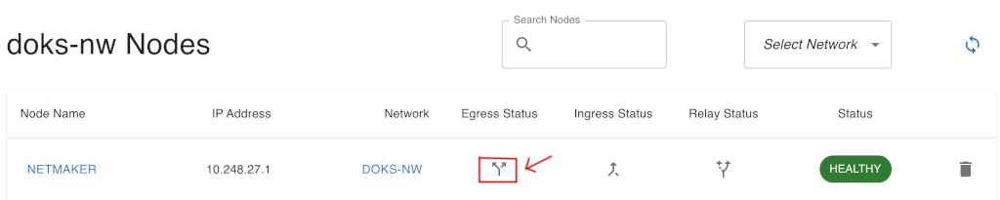

5. Please paste the following entries in the `Egress Gateway Ranges` text area of the dialog box:

    ```csv
    0.0.0.0/5,8.0.0.0/7,11.0.0.0/8,12.0.0.0/6,16.0.0.0/4,32.0.0.0/3,64.0.0.0/2,128.0.0.0/3,160.0.0.0/5,168.0.0.0/6,172.0.0.0/12,172.32.0.0/11,172.64.0.0/10,172.128.0.0/9,173.0.0.0/8,174.0.0.0/7,176.0.0.0/4,192.0.0.0/9,192.128.0.0/11,192.160.0.0/13,192.169.0.0/16,192.170.0.0/15,192.172.0.0/14,192.176.0.0/12,192.192.0.0/10,193.0.0.0/8,194.0.0.0/7,196.0.0.0/6,200.0.0.0/5,208.0.0.0/4
    ```

    Then, in the interface box, type `eth0` and click on the `Create` button. Below picture shows the details:

    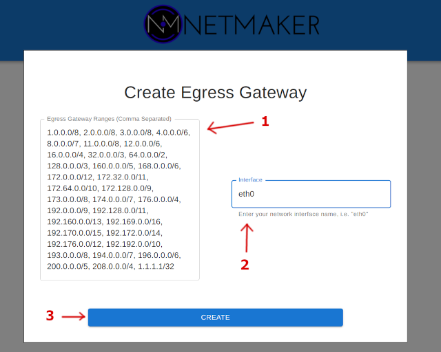

    **Note:**

    The above list of IP ranges allows you to egress to any resource on the public internet. In general, it's best practice to limit the range and allow nodes to egress only to specific ranges (like an external database for example).
6. Now, you need to create an access key. Please navigate to the menu on the left, and click the `Access Keys` button. In the next dialog, give the access key a name and a number of uses (`100` is a good start). Then, click on the `Create` button:

    
7. A new window window will pop-up, giving you the access keys, as well as instructions on how to install the clients on various platforms. For now, just copy the `Access Token` value (second text box), and save it for later use:

    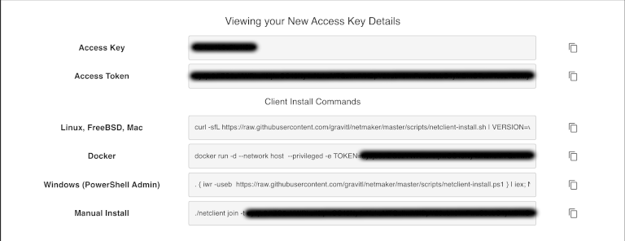

At this point the Netmaker server side configuration is done. Next, you need to install `Netclients` on your `DOKS` cluster. Then, each `Netclient` will connect to the main Netmaker server via the access token created earlier, and become part of the private network defined in the previous steps.

### Installing Netclient on DOKS Worker Nodes

One powerful feature that Netmaker has to offer, is the ability to perform WireGuard specific configurations remotely. It means that you don't have to go to each node from your private network setup, then log in to that node (via SSH for example) and change configuration, then log in to another node and perform another configuration, and so on.

All happens in a centralized manner from the main Netmaker server, via the main dashboard. For all of this to work, Netmaker talks with some sort of client application called `Netclient`. A `netclient` owns the responsibility of reconfiguring WireGuard for you on each node where it runs, the way you tell it to via the Netmaker server user interface.

In case of DOKS, `Netclient` (and `WireGuard` implicitly) is deployed as a `DaemonSet`, hence it runs on every node. This way all cluster nodes can connect and be part of your private network.

You need to deploy `netclients` only once per DOKS cluster (or Droplets). Then, you can perform any configuration you wish and let Netmaker take care of reconfiguring the nodes for you according to the desired setup. Please do remember that for each network that your nodes need to be part of, a separate access token needs to be created. It means that, if you need to `move` your `nodes` and be part of another network, `netclient` needs to be `reconfigured` to use a `different access token`. In case of `Kubernetes`, the `Netclient DaemonSet` needs to be reconfigured and change the value for the `TOKEN` environment variable.

**Notes:**

- Currently, `Netclient` is not available as a `userspace` application for `DOKS`, hence the `WireGuard Controller` is needed until [Gravitl](https://gravitl.com) finds a better solution to solve some incompatibilities related to the Debian Linux OS used for the DOKS nodes.
- The access token is a one-time token used by `Netclient` initially. Afterwards, it creates its own password internally to authenticate with the main Netmaker server.

The next part of this section assumes that you already have a `DOKS` cluster up and running, and that `kubectl` is already configured to offer access to the cluster.

Steps to deploy `Netclients` to your `DOKS` cluster nodes:

1. Fetch the `Netclient` template for `DOKS` from the `Gravitl` Netmaker GitHub repository:

    ```shell
    curl https://raw.githubusercontent.com/gravitl/netmaker/master/kube/netclient-template-doks.yaml > netclient-template-doks.yaml
    ```

2. Next, please open and inspect the manifest file using a text editor of your choice (preferably with `YAML` lint support). For example, you can use [VS Code](https://code.visualstudio.com/download):

    ```shell
    code netclient-template-doks.yaml
    ```

3. Search for the `TOKEN` environment variable from the manifest `spec.containers` field. Sample snippet provided below:

    ```yaml
    ...
    spec:
      hostNetwork: true
      containers:
      - name: netclient-1
        image: gravitl/netclient:0.9.2-doks
        env:
        ...
        - name: TOKEN
          value: "<token>"
    ```

4. Now, replace the `<>` placeholders from the `TOKEN` environment variable value with the access token generated at `Step 6.` from [Configuring Netmaker Server](#configuring-netmaker-server).
5. Save the manifest file, and run `kubectl apply` (first a dedicated `namespace` is created as well):

    ```shell
    kubectl create ns netmaker

    kubectl apply -f netclient-template-doks.yaml -n netmaker
    ```

**Important note:**

`Netclient` and `WireGuard` DaemonSets run in privileged mode on your DOKS cluster, so please make sure that the namespace where everything gets deployed is protected from unauthorized access (via RBAC).

After completing all the above steps, a new `DaemonSet` is created in your DOKS cluster running required `Netclients` (and `WireGuard`) on each node. After a few moments everything should be up and running. Please note that the `Netclient` containers can restart a few times until the `WireGuard Controller` is ready - this is normal.

**Hint:**

You may wonder how nodes know to contact the main Netmaker server (like public IP address for example). This information is stored in the access token that is generated for your private network setup.

Now, please go ahead and inspect the new Kubernetes resources created in the `netmaker` namespace, as well as their state:

```shell
kubectl get all -n netmaker
```

The output looks similar to (`netclient` and the `wireguard-controller` pods should be up and running):

```text
NAME                             READY   STATUS    RESTARTS   AGE
pod/netclient-1-6w74k            1/1     Running   0          114s
pod/netclient-1-pdm8p            1/1     Running   0          114s
pod/wireguard-controller-49mrj   1/1     Running   0          114s
pod/wireguard-controller-hr89h   1/1     Running   0          114s

NAME                                  DESIRED   CURRENT   READY   UP-TO-DATE   AVAILABLE   NODE SELECTOR   AGE
daemonset.apps/netclient-1            2         2         2       2            2           <none>          114s
daemonset.apps/wireguard-controller   2         2         2       2            2           <none>          114s
```

Next, check that `Netclient` pods run on each node from your cluster:

```shell
kubectl get pods -n netmaker -o wide
```

The output looks similar to (notice that each is running on a separate node, as seen in the `NODE` column):

```text
NAME                         READY   STATUS    RESTARTS   AGE   IP           NODE            NOMINATED NODE   READINESS GATES
netclient-1-6w74k            1/1     Running   0          26m   10.106.0.4   basicnp-uan1g   <none>           <none>
netclient-1-pdm8p            1/1     Running   0          26m   10.106.0.2   basicnp-uan1e   <none>           <none>
wireguard-controller-49mrj   1/1     Running   0          26m   10.106.0.2   basicnp-uan1e   <none>           <none>
wireguard-controller-hr89h   1/1     Running   0          26m   10.106.0.4   basicnp-uan1g   <none>           <none>
```

If the output looks similar to the one from above, you configured `Netclients` successfully. For troubleshooting possible issues, you can always inspect each pod logs, or take a look at the events to find useful information.

Finally, open the Netmaker server dashboard and navigate to the `Nodes` page. You should see your DOKS cluster nodes joined your private network, and the `Healthy` status:

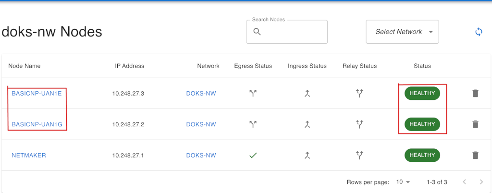

Looking at the above, you can also notice that the main Netmaker server is part of your private network, and that it's acting as an Egress Gateway (denoted by the green pass mark in the egress column).

**Notes:**

- It may happen for some  `Netclients` to not succeed in joining your private network. What you can do in this case is click the `Sync` button on the top right corner:


- If the sync operation still doesn't solve this issue, you can ultimately kill the respective pods. The `netclient` DaemonSet will spawn fresh ones, and the join process should start again.

Next, you will test the egress setup by deploying the `curl-test` pod in your cluster. Then, you will make a request from the `curl-test` pod to [ifconfig.me](https://ifconfig.me), to see if it's the `Egress Gateway IP` that your DOKS cluster is using to connect to the outside world.

### Testing the DOKS Cluster Egress Setup

To test your egress setup, you need to check if all the `requests` originating from your `DOKS` cluster travel via a single node - the `Egress Gateway`. The simplest way to test, is by making a `curl` request to [ifconfig.me/ip](https://ifconfig.me/ip), and see if the response contains your `Egress Gateway public IP` address.

First, you need to create the `curl-test` pod in your `DOKS` cluster (the `default` namespace is used):

```shell
kubectl apply -f https://raw.githubusercontent.com/digitalocean/container-blueprints/main/netmaker-egress-gateway/assets/manifests/curl-test.yaml
```

Verify that the pod is up and running (in the `default` namespace):

```shell
kubectl get pods
```

The output looks similar to (`curl-test` pod `Status` should be `Running`):

```text
NAME       READY   STATUS    RESTARTS   AGE
curl-test   1/1     Running   0          7s
```

Then, perform a `HTTP` request to [ifconfig.me](https://ifconfig.me), from the `curl-test` pod:

```shell
kubectl exec -it curl-test -- curl https://ifconfig.me
```

The output looks similar to:

```text
209.97.179.143
```

The resulting IP address that gets printed should be the `public IP` address that was assigned to your Netmaker droplet. If so, then you configured the `Egress Gateway` successfully.

### Checking WireGuard Configuration

WireGuard sits at the heart of Netmaker, and it is the power horse that makes everything kicking and alive.

One of the Netmaker main goals is to simplify operations, meaning it handles WireGuard configuration automatically for you. As an exercise, and to discover more about WireGuard, you can take a look at how Netmaker configured everything for you under the hood. WireGuard has a little utility called `wg`, which you can use to query configuration information. You're not limited only to that, and you can even set or change the actual configuration if desired. On the other hand, this breaks the purpose and simplicity of Netmaker, as it already takes care of hiding the complexity of configuring WireGuard for you.

Checking WireGuard configuration can be accomplished by invoking the `wg` utility from the CLI. Please follow below steps:

1. First, list the available `Netclient` pods from the `netmaker` namespace used in this tutorial:

    ```shell
    kubectl get pods -n netmaker
    ```

    The output looks similar to:

    ```text
    NAME                         READY   STATUS    RESTARTS   AGE
    netclient-1-ch2jp            1/1     Running   0          23m
    netclient-1-h2xjr            1/1     Running   0          23m
    wireguard-controller-9st95   1/1     Running   0          33m
    wireguard-controller-zwwz6   1/1     Running   0          33m
    ```

2. Now, you can invoke the `wg show` command from one of the `Netclient` pods:

    ```shell
    kubectl exec -it pod/netclient-1-ch2jp -n netmaker -- wg show
    ```

    The output looks similar to:

    ```text
    interface: nm-do-net
    public key: Mtx0OmJpshOC+cirh+/zHIjt4U4q4XudbLYesJtgQSw=
    private key: (hidden)
    listening port: 51821

    peer: CA4reOG2iC3v2Knik14u4wLKmEk85RmMmnWSgZemmzc=
    endpoint: 209.97.179.143:51821
    allowed ips: 10.101.56.1/32
    latest handshake: 1 minute ago
    transfer: 1.20 KiB received, 4.74 KiB sent
    persistent keepalive: every 20 seconds

    peer: B9kL17HCVXm3U0TykqaoZqTeaJ8jA5DAp65J7ZDmlVA=
    endpoint: 10.114.0.3:51821
    allowed ips: 10.101.56.2/32
    latest handshake: 1 minute, 58 seconds ago
    transfer: 1.16 KiB received, 4.62 KiB sent
    persistent keepalive: every 20 seconds
    ```

3. Next, go ahead and do the same thing for the other pod:

    ```shell
    kubectl exec -it pod/netclient-1-h2xjr -n netmaker -- wg show
    ```

    The output looks similar to:

    ```text
    interface: nm-do-net
    public key: B9kL17HCVXm3U0TykqaoZqTeaJ8jA5DAp65J7ZDmlVA=
    private key: (hidden)
    listening port: 51821

    peer: Mtx0OmJpshOC+cirh+/zHIjt4U4q4XudbLYesJtgQSw=
    endpoint: 10.114.0.4:51821
    allowed ips: 10.101.56.3/32
    latest handshake: 19 seconds ago
    transfer: 6.00 KiB received, 1.61 KiB sent
    persistent keepalive: every 20 seconds

    peer: CA4reOG2iC3v2Knik14u4wLKmEk85RmMmnWSgZemmzc=
    endpoint: 209.97.179.143:51821
    allowed ips: 10.101.56.1/32
    latest handshake: 58 seconds ago
    transfer: 1.92 KiB received, 7.65 KiB sent
    persistent keepalive: every 20 seconds
    ```

`Netclient` (and `WireGuard` implicitly) is deployed as a `DaemonSet`. It means that, it runs on every node of your cluster, thus allowing it to connect to your private network (based on an access token).

Going further, if you look carefully at the above `wg show` command outputs, you can see that each pod (or each worker node basically) is establishing a peer connection with other nodes from your Netmaker private network. What this means is that a `mesh network` is formed. Remember the little discussion about mesh networks and the Netmaker architecture diagram at the beginning of this tutorial ?

Go ahead and take a look at the private IP address for each worker node:

```shell
kubectl get nodes -o wide
```

The output looks similar to (notice the `INTERNAL-IP` column values):

```text
NAME            STATUS   ROLES    AGE   VERSION   INTERNAL-IP ...
basicnp-u2orj   Ready    <none>   29h   v1.21.5   10.114.0.3  ...
basicnp-u2orr   Ready    <none>   29h   v1.21.5   10.114.0.4  ...
```

As you can see in the above output, each node is peering with the other nodes from your DOKS cluster via the private (internal) network. A peer connection is also established with the Netmaker server over its public IP address. You may wonder why DOKS internal nodes peer with the Netmaker server via the public interface. Well, this is by design - remember that the Netmaker server is supposed to be publicly accessible so that you can connect any resources from any network no matter where is located, as long as it has access to the internet. You need not to worry about your traffic being publicly exposed because everything goes encrypted via WireGuard.

You can check what other options are available for the `wg` command by inspecting the `help` page:

```shell
wg --help
```

The output looks similar to:

```text
Usage: wg <cmd> [<args>]

Available subcommands:
  show: Shows the current configuration and device information
  showconf: Shows the current configuration of a given WireGuard interface, for use with `setconf'
  set: Change the current configuration, add peers, remove peers, or change peers
  setconf: Applies a configuration file to a WireGuard interface
  addconf: Appends a configuration file to a WireGuard interface
  syncconf: Synchronizes a configuration file to a WireGuard interface
  genkey: Generates a new private key and writes it to stdout
  genpsk: Generates a new preshared key and writes it to stdout
  pubkey: Reads a private key from stdin and writes a public key to stdout
You may pass `--help' to any of these subcommands to view usage.
```

## Connecting DOKS Clusters and Droplets Across Different Regions

This is another practical example, in which you want to connect several DOKS clusters spanning multiple regions (or even other data centers outside of DigitalOcean). You're not limited to DOKS clusters only. Other Droplets or virtual machines hosting various applications can be brought together under the same roof via Netmaker. Transparency is the key here, thus all your resources will appear as being part of a single network.

Going further, suppose that you have a `Droplet` hosting a `MySQL` database in the `LON1` region, and a `DOKS` cluster located in the `NYC1` region. Below diagram depicts the setup:

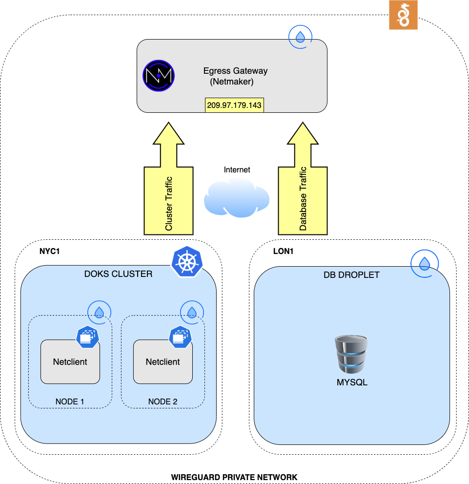

Defining a private network and installing `netclients` on `DOKS` is very similar to [Creating an Egress Gateway for DOKS](#creating-an-egress-gateway-for-doks), without the Egress Gateway functionality.

Next, all required steps will be presented to achieve the desired functionality.

### Configuring a Private Network for the Multiregional Setup

First, click on the `Networks` tile from the main dashboard:


Then, click on the `Create Network` blue button on the right corner and fill in your own network details. Remember to choose an IP range that doesn't overlap with the range of your DOKS cluster, or any other Droplets from your VPC (make sure to disable `UPD Hole Punching`, as it's not needed in this example). Then, click on the `Create Network` button:


Now, you need to create an access key. Please navigate to the menu on the left, and click the `Access Keys` button. In the next dialog, give the access key a name and a number of uses (`100` is a good start). Then, click on the `Create` button:


A new window window will pop-up, giving you the access keys, as well as instructions on how to install the clients on various platforms. For now, just copy the `Access Token` value (second text box), and save it for later use:


At this point the Netmaker server side configuration is done. Next, you need to install `Netclients` on your `DOKS` cluster, as well as the MySQL database droplet.

### Deploying Netclients on DOKS Worker Nodes and MySQL Droplet

For deploying `Netclient` on the `DOKS` cluster worker nodes, please follow the same steps as in the [Installing Netclient on DOKS Worker Nodes](#installing-netclient-on-doks-worker-nodes) section of the `Egress Gateway` setup. Please remember to use the access token generated for the private network created in this section, though.

Next, you need to deploy `Netclient` on the `MySQL` database droplet. First, please log in to the machine via SSH (please replace the `<>` placeholders accordingly):

```shell
ssh <YOUR_LOGIN_USERNAME>@<YOUR_MYSQL_DROPLET_PUBLIC_IP>
```

Now, please run the official `Netclient` install script (make sure to replace the `KEY` variable value first using the access token of your network - the `<>` placeholders):

```shell
curl -sfL https://raw.githubusercontent.com/gravitl/netmaker/master/scripts/netclient-install.sh | VERSION="v0.9.4" KEY="<YOUR_ACCESS_KEY_HERE>" sh -
```

The output looks similar to:

```text
checking dependencies...
wireguard
     wireguard is installed
wireguard-tools
     wireguard-tools is installed
OS Version = Linux
Netclient Version = v0.9.4
Binary = netclient
Downloading netclient v0.9.4
...
2022/02/07 14:53:49 [netclient] joining network at grpc.nm.209-97-179-143.nip.io:443
2022/02/07 14:53:49 [netclient] node created on remote server...updating configs
2022/02/07 14:53:50 [netclient] retrieving peers
2022/02/07 14:53:50 [netclient] starting wireguard
2022/02/07 14:53:50 [netclient] writing wg conf file to: /etc/netclient/config/nm-network.conf
2022/02/07 14:53:51 [netclient] joined securoserv
```

If the last line from the script contains the `joined <YOUR_NETMAKER_NETWORK_NAME>` message, then `Netclient` is installed and configured correctly.

### Testing the Multiregional Setup

## Connecting External Clients via Ingress Gateway

## Troubleshooting and Tips

## Summary

In this tutorial you learned how to use Netmaker to define and manage private networks from a central point. You also learned how to create and use an Egress Gateway for your DOKS cluster. This way, external services like databases for example, can see a single source IP in the packets coming from your DOKS cluster, thus making firewall rules management easier on the other end.

Other interesting and useful topics to read about what Netmaker can do for you:

- The official [documentation](https://netmaker.readthedocs.io/en/master/index.html) page for Netmaker.
- [Multi-Cluster Networking with Kubernetes](https://itnext.io/multi-cluster-kubernetes-networking-with-netmaker-bfa4e22eb2fb).
- [Creating VPNs using Netmaker and Wireguard](https://dev.to/afeiszli/how-to-create-four-types-of-vpns-quickly-with-wireguardr-and-netmaker-1ibe).
